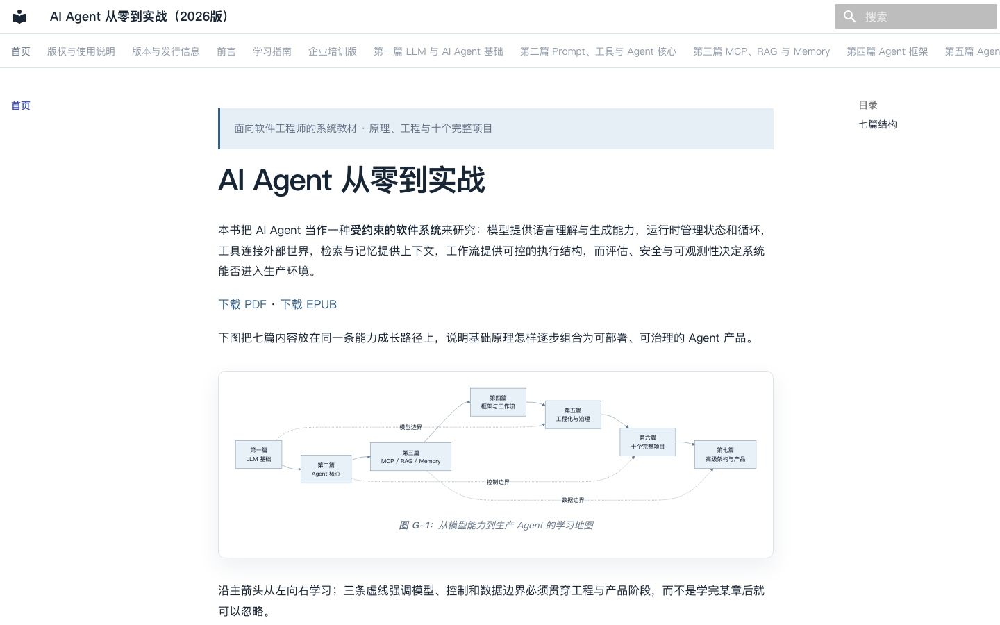

# AI Agent 从零到实战：原理、工程与项目（2026版）

[](COMPATIBILITY.md)
[](LICENSE)
[](LICENSE-CODE)
[](docs/QUALITY_ROADMAP.md)

这是一套面向软件工程师的中文技术教材工程。它不把 Agent 等同于某个框架，也不把能调用一次模型的脚本包装成生产系统；全书从 LLM 的生成机制出发，依次讨论结构化输出、工具调用、MCP、RAG、Memory、工作流、多 Agent，以及测试、部署、可观测性和安全治理。

> 当前公开版本为 **v2026.8.0 / 多格式出版预览版**。第 1—38 章、11 个独立示例、十个项目与 HTML/PDF/EPUB 出版管线均已完成本轮复审；项目 4、8、10 达到离线 `production_reference`。P9 仓库内验收已经取得当前源码、Python 3.12、十项目容器和 253 项测试证据，但独立外审、真实试学/试讲、实体设备/印刷与最终 Release 尚未完成。外部参与者可直接使用 [`external-validation/`](external-validation/) 执行包；完整状态见 [`FINAL_ACCEPTANCE.md`](FINAL_ACCEPTANCE.md) 与 [`docs/QUALITY_ROADMAP.md`](docs/QUALITY_ROADMAP.md)。



## 15 分钟 Quick Start

下面的路径不需要 API Key，也不会访问模型供应商。它先运行一个完整 Tool Loop，再构建本地可阅读网站。

```bash
git clone https://github.com/wujinjun/ai-agent-book.git
cd ai-agent-book
python3.12 -m venv .venv
source .venv/bin/activate
python -m pip install -e '.[dev,docs]'

python -m examples.tool_runtime.main
python -m pytest tests/test_tool_runtime.py -q
python scripts/build_html.py
python -m http.server 8000 --directory output/html
```

终端应先输出 `最终回答：20 + 22 = 42`，测试应通过。随后打开 `http://127.0.0.1:8000` 即可阅读教材；按 `Ctrl+C` 停止服务。遇到 Python、操作系统或依赖问题时，先查看 [`COMPATIBILITY.md`](COMPATIBILITY.md)；完整开发安装再参考下文。

## 下载已发布版本

- [完整出版包（HTML、PDF、EPUB）](https://github.com/wujinjun/ai-agent-book/releases/download/v2026.8.0/ai-agent-book-output-v2026.8.0.zip)
- [PDF（400 页 A4 版）](https://github.com/wujinjun/ai-agent-book/releases/download/v2026.8.0/ai-agent-book-2026-v2026.8.0.pdf)
- [EPUB3](https://github.com/wujinjun/ai-agent-book/releases/download/v2026.8.0/ai-agent-book-2026-v2026.8.0.epub)
- [SHA256 校验值](https://github.com/wujinjun/ai-agent-book/releases/download/v2026.8.0/SHA256SUMS-v2026.8.0.txt)

发行说明与全部附件见 [GitHub Release v2026.8.0](https://github.com/wujinjun/ai-agent-book/releases/tag/v2026.8.0)。

当前公开站点尚未承诺稳定 URL；可直接下载完整出版包中的 `html/`，或按 Quick Start 本地打开。仓库中的当前候选版为 454 页，并使用固定版本的 OFL 中文与代码字体；只有完成 P9 并发布新 Release 后才会替代上述 400 页公开版。

## 适合与不适合的读者

本书适合有后端、嵌入式、架构或 CI/CD 经验，能阅读 Python，但尚未系统学习 LLM 与 Agent 的工程师。它也适合需要评估 Agent 技术选型的架构师和技术负责人。

如果你只想复制几段 Prompt、寻找“万能框架”，或期待不理解数据与权限边界就直接上线自治 Agent，本书并不合适。读者应愿意运行代码、阅读日志、设计失败路径并完成练习。

## 学习目标

完成课程后，读者应能解释模型、产品、框架与工程系统的区别；独立实现工具调用循环和 RAG 链路；根据确定性、状态持久化与协作需求选择原生 API、OpenAI Agents SDK、PydanticAI 或 LangGraph；并为 Agent 建立测试、评估、部署、监控、权限和成本控制。

## 技术栈

教材默认 Python 3.12，使用 Pydantic、httpx、FastAPI、PostgreSQL、Redis、pgvector、Docker、pytest、Ruff、mypy 与 MkDocs Material。出版工具使用 Mermaid CLI 11.4.2、Pandoc 3.x 与 Chrome Headless。框架章节覆盖原生 API、OpenAI Agents SDK、PydanticAI、LangGraph、LangChain、LlamaIndex、CrewAI、AutoGen 与 Semantic Kernel，但不会将其中任何一个描述为唯一答案。

## 完整目录

1. 第一篇：LLM 与 AI Agent 基础（第 1—5 章）
2. 第二篇：Prompt、工具与 Agent 核心机制（第 6—10 章）
3. 第三篇：MCP、RAG 与 Memory（第 11—16 章）
4. 第四篇：Agent 框架（第 17—22 章）
5. 第五篇：Agent 工程化（第 23—31 章）
6. 第六篇：十个完整项目实战
7. 第七篇：高级主题与技术选型（第 32—38 章）

逐章主题见[教材首页](docs/index.md)。

全书维护 113 条论文、标准、官方文档和官方仓库资料，38 章均有可追溯的“本章引用”区块。参考资料由结构化元数据生成，版本敏感页面记录核对日期。

## 推荐学习路线

- 想快速做出可靠原型：先学第 1、2、4、6—9、17、23—24、29—30 章，再完成项目 1—2。
- 想建设企业知识库：在上述基础上学习第 5、13—16、25、28—31 章，再完成项目 4。
- 想设计复杂工作流：继续学习第 10、20、22、27、32、36—38 章，再完成项目 8—10。

完整的 8 周、12 周和 24 周安排见[学习指南](docs/learning-guide.md)。

讲师可从[企业培训入口](docs/training/index.md)获取讲师手册、12 个离线核心实验、题库、综合考试、评分标准、企业案例、工作坊与配套幻灯片。核心实验不要求付费账号或真实 API Key。

## 8 周与 12 周计划概览

8 周路线以每周 8—10 小时完成两个可展示项目为目标；12 周路线增加 MCP、RAG、LangGraph、评估与部署，最终完成一个带引用、权限与追踪的工程项目。每周检查标准和产出在学习指南中列出。

## 十个项目展示

| 项目 | 主要能力 | 当前成熟度 | 入口 |
|---:|---|---|---|
| 1 | 流式对话、历史、Token、错误处理 | `service_template` | [最小 AI Assistant](projects/01-minimal-assistant/README.md) |
| 2 | 多工具、参数校验、重试、人工审批 | `service_template` | [天气 Tool Agent](projects/02-weather-tool-agent/README.md) |
| 3 | MCP Client/Server、文件/系统/数据库工具 | `service_template` | [MCP 本地 Agent](projects/03-mcp-local-agent/README.md) |
| 4 | 多格式摄取、pgvector、版本化发布、RAG 评估 | `production_reference`（离线） | [企业知识库](projects/04-knowledge-agent/README.md) |
| 5 | Diff、静态规则、LLM Review、风险与报告 | `service_template` | [代码 Review Agent](projects/05-code-review-agent/README.md) |
| 6 | 邮件、日历、办公发布、审批与审计 | `service_template` | [自动办公 Agent](projects/06-office-agent/README.md) |
| 7 | 行情、新闻、指标、事实/推断与引用 | `service_template` | [股票研究 Agent](projects/07-stock-research-agent/README.md) |
| 8 | LangGraph、Checkpoint、重试、Reviewer、HITL | `production_reference`（离线） | [研究工作流](projects/08-research-workflow/README.md) |
| 9 | 产品/规划/编码/测试/评审共享状态 | `service_template` | [Multi-Agent 开发团队](projects/09-multi-agent-dev-team/README.md) |
| 10 | 多租户、RBAC、队列、MCP/RAG、Trace/Eval、DLQ | `production_reference`（离线） | [企业级 Agent 平台](projects/10-enterprise-platform/README.md) |

这里的 `production_reference` 表示可离线验证的生产参考实现，不表示已经在真实供应商、流量、灾备或企业身份系统中完成外部认证。具体缺口在 [`PROJECT_STATUS.md`](PROJECT_STATUS.md) 中逐项说明。

## 安装环境

```bash
cd ai-agent-book
python3.12 -m venv .venv
source .venv/bin/activate
python -m pip install -e '.[dev,docs]'
cp .env.example .env
```

核心测试使用本地 Mock，不需要 API Key。只有明确标记的在线示例才读取供应商密钥。

## 运行代码与测试

```bash
python -m pytest
python -m examples.tool_runtime.main
ruff check .
mypy src
```

每个独立示例包含自己的 README、环境示例与测试入口。预期输出不是固定文案时，README 会说明应观察的状态和字段。

## 启动文档网站

```bash
npm ci
python scripts/build_index.py
python scripts/build_diagrams.py --mmdc node_modules/.bin/mmdc
python scripts/build_html.py
python -m http.server 8000 --directory output/html
```

浏览器访问 `http://127.0.0.1:8000`。新版 HTML 是三栏开发者文档布局；Mermaid 在构建时预渲染为 SVG 与 2x PNG，因此离线阅读不依赖 Mermaid JavaScript 或外部 CDN。开发时仍可使用 `mkdocs serve` 快速预览原稿，但正式产物必须运行上述脚本。

## 生成 PDF 与 EPUB

先安装 Node.js 22、Pandoc 3.x 和 Google Chrome/Chromium。macOS 可运行：

```bash
brew install pandoc
npm ci
```

然后生成图形与出版产物：

```bash
python scripts/build_diagrams.py --mmdc node_modules/.bin/mmdc
python scripts/build_index.py
./scripts/build-pdf.sh
./scripts/build-epub.sh
PYTHONPATH=src python scripts/audit_publication.py all output
```

产物写入：

- `output/html/`：可离线部署的 MkDocs HTML；
- `output/intermediate/print.html`：Pandoc 生成的独立打印 HTML；
- `output/pdf/ai-agent-book-2026.pdf`：Pandoc 打印 HTML 经 Chrome 输出的 A4 PDF；
- `output/epub/ai-agent-book-2026.epub`：带 SVG 首选图和 PNG 回退的 EPUB3。

如果图形未变化，构建器会按内容哈希复用缓存。缺少 Mermaid CLI、Pandoc、Chrome 或字体时，脚本会明确退出，不会退回旧 ReportLab 文本版或把 Mermaid 源码放进 EPUB。

## 贡献与版本说明

贡献规则见 [`CONTRIBUTING.md`](CONTRIBUTING.md)，兼容策略见 [`COMPATIBILITY.md`](COMPATIBILITY.md)，安全报告见 [`SECURITY.md`](SECURITY.md)，行为准则见 [`CODE_OF_CONDUCT.md`](CODE_OF_CONDUCT.md)。版本变化见 [`CHANGELOG.md`](CHANGELOG.md)，版本敏感接口见 [`notes/version-check.md`](notes/version-check.md)。教材内容采用 CC BY-NC-SA 4.0，软件代码采用 MIT License；付费出版或课程需要单独书面许可，详见 [`LICENSE`](LICENSE) 与 [`COMMERCIAL_LICENSE.md`](COMMERCIAL_LICENSE.md)。2026 版表示教材维护目标年份，不表示所有外部 API 在全年保持不变；每个敏感章节必须记录独立核对日期。

## 质量门禁

仓库在 Python 3.12 下执行 Ruff、mypy、根级与十项目测试、MkDocs 严格构建、图示台账、内部链接、EPUB XHTML/片段、PDF 图片、引用、密钥和仓库卫生检查。通过自动门禁只证明可重复构建与已覆盖契约，不替代真实 Provider 联调、实体设备、出版社终审或安全审计。
