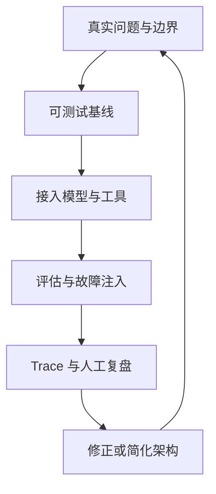

# 后记：把 Agent 当作长期演进的软件系统

读完本书，最重要的成果不应是一组框架名称，而应是一套能够反复使用的工程判断：先确认问题是否真的需要模型，再决定是否需要检索、工具、工作流或多个 Agent；先定义状态、权限和完成条件，再选择 Runtime 与框架；先建立离线基线和失败样例，再讨论模型升级带来的增益。

Agent 工程最容易令人误判的地方，是演示效果与生产可靠性之间存在很长的距离。一次成功的工具调用不能证明重试安全，一段流畅的回答不能证明事实可靠，多个角色互相讨论也不能证明任务质量提高。真正可交付的系统需要把概率生成放进确定性边界：输入有来源，状态有所有者，工具有权限，副作用有幂等与审批，结果有验证，失败有恢复路径，运行有成本和审计证据。

## 建议保留的学习闭环

完成全书后，可以继续使用下面的循环深化能力：

1. 从一个真实但边界清晰的问题出发，写出用户、输入、输出、失败成本和“不做什么”。
2. 先实现不依赖真实模型的 Fake 基线，证明状态转换、工具边界和测试契约成立。
3. 接入模型或框架，只替换必要的决策点，并保留领域接口与回退路径。
4. 用 Golden Dataset、故障注入和人工抽检比较版本，不用单个精彩样例替代评估。
5. 根据 Trace 复盘检索、模型、工具、权限和恢复链路，把新失败加入回归集。
6. 当复杂度不再产生可测收益时，主动删除角色、节点、记忆或框架封装。

这张图把学习与产品迭代放在同一闭环中。每轮不是追求更多 Agent 能力，而是获得更强的证据：系统在哪些任务上有效，在哪些条件下失败，失败能否被发现、限制并恢复。

## 关于版本与长期维护

模型、SDK、MCP 规范和 Agent 框架仍会快速变化。本书对版本敏感章节记录了核对日期，并把稳定原理与当前接口分开叙述。继续学习时，应优先查看官方规范、发行说明和安装版本源码；当接口与书中不同，不要机械寻找同名函数，而要先确认原有概念由哪个新抽象承担。

长期维护这类教材也应遵循软件工程纪律：正文、图稿和代码使用同一术语与版本来源；自动构建负责发现链接、资源和格式错误；人工审阅负责判断论证、节奏、图文关系和教学效果。自动检查不能代替阅读，模型生成也不能代替责任主体对事实、许可与安全边界的确认。

如果读者最终能够为一个 Agent 项目写出清晰的架构决策记录、威胁模型、评估方案、恢复设计和成本预算，并能够解释为什么没有采用更复杂的方案，那么本书的目标就已经达成。框架会变化，这套判断仍然适用。
