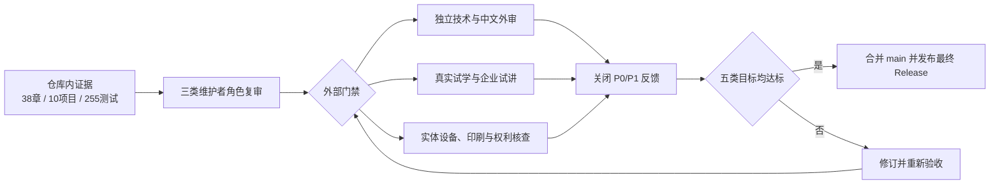

# P9 最终验收状态

最后核对日期：2026-08-08。P9 的仓库内验收已经通过，但综合最终验收仍在进行。十项目当前源码、Python 3.12、容器、测试、HTML、PDF、EPUB、链接、安全与三类维护者角色复审已有证据；独立外审、真实试学/试讲、实体设备/印刷和最终正式发布仍是不可跳过的外部门禁。

图中的仓库内证据不能替代外部门禁。自动测试可以证明构建和契约，却无法证明目标读者能够独立学习、讲师能够按材料授课，或实体阅读器与印刷成品没有版式问题。

| 用途 | 目标 | 当前内部证据分 | 仍需完成 |
|---|---:|---:|---|
| 个人系统学习 | 95%+ | 90% | 三名以上目标读者试学 |
| 企业内部培训 | 90%+ | 85% | 真实班级试讲与前后测 |
| GitHub 开源展示 | 95%+ | 90% | 最新候选进入 main 与最终 Release |
| 正式商业出版 | 90%+ | 82% | 独立编辑、设备、印刷和法律核查 |
| 十个生产项目模板 | 80%+ | 80% | 仓库内达标，继续补真实供应商证据 |

完整阶段定义见[质量路线图](QUALITY_ROADMAP.md)。外部参与者使用仓库根目录的 `external-validation/` 执行包提交七份匿名证据；验证器会拒绝未达阈值、仍有 P0/P1、审阅者不独立或候选 commit 不一致的记录。分数是带证据边界的内部估计，不是商业宣传或外部认证。
