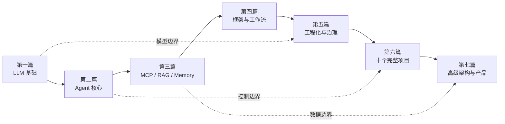

# AI Agent 从零到实战

本书把 AI Agent 当作一种**受约束的软件系统**来研究：模型提供语言理解与生成能力，运行时管理状态和循环，工具连接外部世界，检索与记忆提供上下文，工作流提供可控的执行结构，而评估、安全与可观测性决定系统能否进入生产环境。

下图把七篇内容放在同一条能力成长路径上，说明基础原理怎样逐步组合为可部署、可治理的 Agent 产品。

沿主箭头从左向右学习；三条虚线强调模型、控制和数据边界必须贯穿工程与产品阶段，而不是学完某章后就可以忽略。

## 七篇结构

| 篇 | 章节 | 主要问题 |
|---|---:|---|
| LLM 与基础 | 1—5 | 模型怎样表示、接收并生成信息？ |
| Agent 核心 | 6—10 | 如何把不确定的模型输出接入确定的软件边界？ |
| MCP、RAG 与 Memory | 11—16 | 如何连接工具、知识和跨会话状态？ |
| Agent 框架 | 17—22 | 不同框架分别替你管理了哪些复杂性？ |
| 工程化 | 23—31 | 怎样测试、部署、观测、保护和优化 Agent？ |
| 项目实战 | 10 个项目 | 怎样把纵向能力组合成可展示的系统？ |
| 高级主题 | 32—38 | 怎样设计多 Agent、Coding Agent 和企业平台？ |

!!! note "阅读约定"
    “模型能力”指模型在给定输入下的推断与生成；“产品能力”包含界面、搜索、文件与账户等服务；“框架能力”是状态、工具和编排抽象；“工程能力”包括数据、权限、测试、部署和运营。四者不可互相替代。

从[第一章](part-01-foundations/ch01-what-is-llm.md)开始，或根据[学习指南](learning-guide.md)选择路线。
