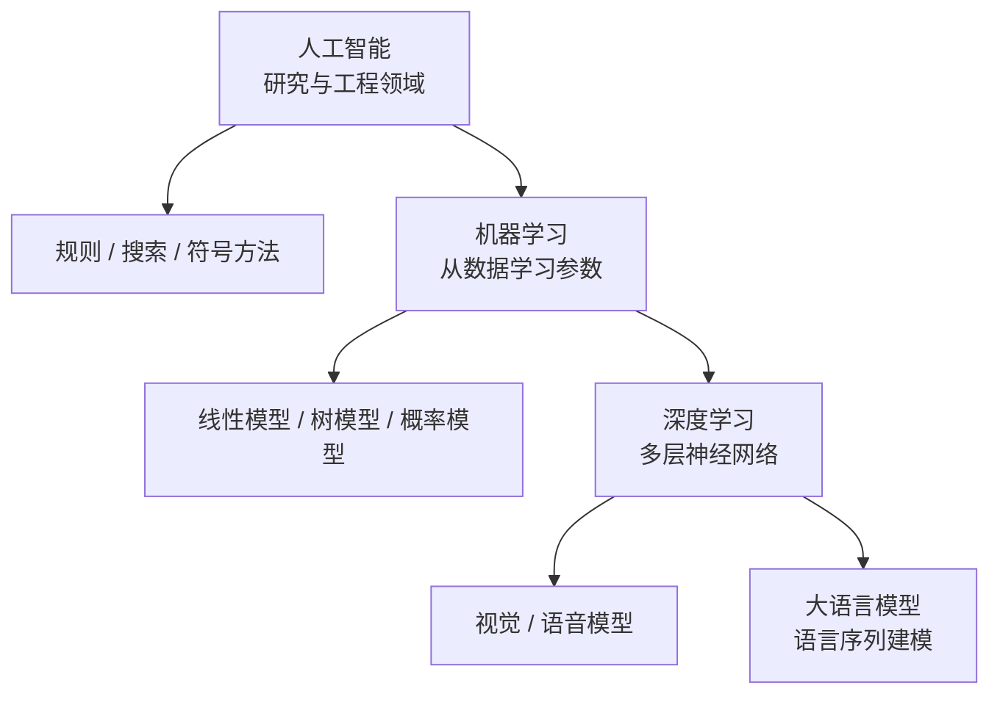
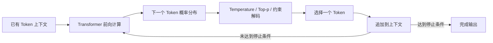
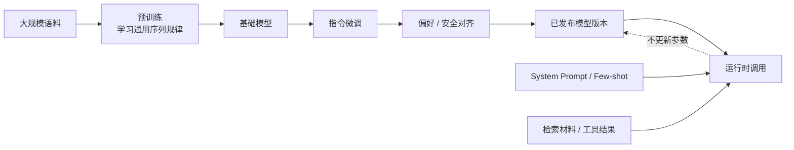
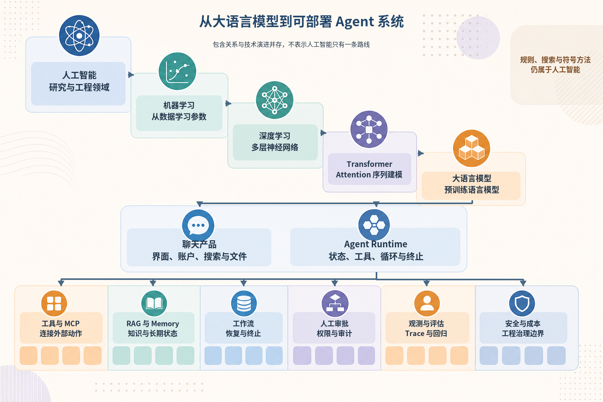
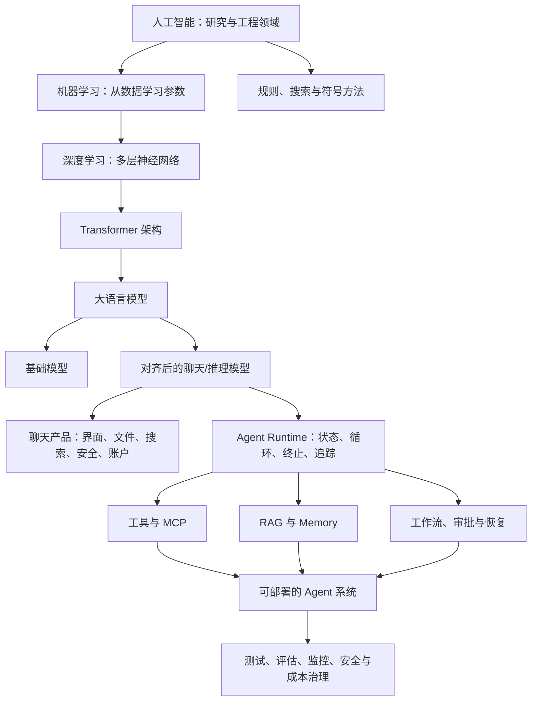

# 第1章 第1节：什么是大语言模型？

最后核对日期：2026-07-10（本节以稳定原理为主，不给出可能快速变化的商业模型参数）。

## 本节学习目标

完成本节后，你应当能够：解释人工智能、机器学习与深度学习的包含关系；说明传统程序和机器学习系统在“规则从哪里来”这一点上的差异；描述 Transformer 在序列建模历史中的位置；给出大语言模型的工程定义；解释“下一个 Token 预测”训练目标为何可以产生远超自动补全的行为；区分预训练、微调与对齐；以及区分 LLM、ChatGPT 一类产品和 AI Agent 系统。

本节不要求线性代数或概率论推导。我们的目标是建立一个足够严谨的工程心智模型，使后续学习 Prompt、Tool Calling、RAG、MCP 和工作流时，不会把不同层次的能力混为一谈。

前置知识：能够阅读常规软件架构图，了解函数、API 与基本概率概念即可。

## 1. AI、机器学习与深度学习的关系

“人工智能”不是某一种算法的名称，而是一个宽泛的研究与工程领域：人们尝试让机器完成通常需要感知、推理、规划、学习、语言或行动能力的任务。早期专家系统、国际象棋搜索、路径规划、计算机视觉、语音识别和今天的大语言模型，都可以放在人工智能这把大伞之下。它们的实现方法并不相同，也不都依赖学习。

机器学习是实现人工智能的一组重要方法。它不要求开发者把所有决策规则逐条写入程序，而是让算法从数据中调整参数，形成输入到输出的映射。垃圾邮件分类器可以从带标签的邮件中学习；推荐系统可以从点击、停留和购买行为中学习；异常检测系统可以从正常运行数据中学习分布。机器学习仍然需要工程师定义目标、收集数据、选择表示、设计评估并控制部署风险。“从数据中学习”并不等于系统会自动知道什么目标是正确的。

深度学习是机器学习的一类方法，核心是由多层可训练计算单元组成的神经网络。“深”主要指计算层次较多，而不是模型具有哲学意义上的深刻理解。深度神经网络能够从大量数据中共同学习多层表示：视觉网络可能从局部边缘逐步形成纹理和对象相关表示；语言模型则从字符、子词、语法关系、语义关系到任务模式形成分布式表示。现代 LLM 通常属于深度学习，但深度学习远不止 LLM，机器学习也远不止深度学习。

因此，这三个概念可以理解为逐层收窄的集合：深度学习是机器学习的一部分，机器学习是人工智能的重要实现路线之一。集合关系只是分类，不表示越内层就适合解决所有问题。一个有明确规则、低延迟、强审计要求的控制功能，可能用普通程序或状态机更可靠；只有在数据中存在难以手写的复杂模式时，学习方法才显示出优势。

下图用集合与分支同时表示概念边界：机器学习属于 AI 的实现路线，深度学习属于机器学习，LLM 又只是深度学习中的一个模型族。



从上向下阅读表示范围逐步收窄，不表示价值逐步升高。工程选型仍要比较规则可表达性、数据质量、延迟、审计和失败成本。

## 2. 从传统程序到机器学习

传统程序通常由开发者提供规则，程序把输入按照规则变换为输出。例如，车辆诊断软件可以规定：当某故障位为 1 且持续时间超过阈值时记录 DTC。需求、条件和动作能够被明确表达，程序行为可以通过分支覆盖和边界值测试验证。

机器学习系统把部分规则的形成过程交给训练。开发者提供训练数据、模型结构、损失函数与优化过程，训练得到参数；推理时，程序使用参数把新输入映射为预测。例如，我们很难手写“所有可能的垃圾邮件长什么样”，但可以收集大量邮件及标签，让分类器学习统计规律。

二者并不是互斥关系。真实系统往往由确定性软件包围概率模型：传统代码负责身份认证、Schema 校验、超时、数据库事务和权限；模型负责理解非结构化文本、生成候选内容或判断难以枚举的模式。Agent 工程的关键恰恰是设计这条边界。让模型直接承担数据库一致性或权限判断，会把概率输出误用为确定性控制；让手写规则理解任意自然语言，又会使规则数量迅速失控。

机器学习还改变了缺陷来源。传统程序的错误常来自规则遗漏、实现错误或状态处理不当；学习系统还会受到训练数据偏差、分布变化、目标函数错配和评估覆盖不足的影响。同一段推理代码没有变化，输入分布改变也可能使质量下降。因此，模型系统需要数据版本、离线评估、线上观测与回归集，而不能只依赖单元测试。

## 3. 神经网络和深度学习

神经网络可以看作一个包含大量可调参数的复合函数。每一层接收数值表示，执行线性变换和非线性变换，再把结果传给下一层。训练的基本过程是：模型对样本做出预测；损失函数量化预测与目标之间的差异；反向传播计算各参数对损失的影响；优化器沿着降低损失的方向更新参数。大量样本经过多轮更新后，网络获得对训练分布有用的内部表示。

这里的“表示”很重要。早期机器学习往往依赖人工特征，例如词频、长度、特定关键词或图像边缘。深度学习能够把特征学习与任务学习结合起来，不必由人穷举所有高层模式。语言中的一个概念不会只存放在某个单独参数里，而通常分布在许多激活和参数关系中；同一个参数也可能参与多种行为。这使模型具有强大的组合与泛化能力，同时也使解释、局部修改和错误定位更加困难。

神经网络并不是把训练文本原样保存为一张可查询的数据库。参数会压缩数据中的统计规律，也可能记住某些罕见或重复内容。它既不像关系数据库那样提供精确记录与事务语义，也不像搜索引擎那样天然返回来源。把模型用于事实查询时，必须考虑知识时效、置信表达和证据追踪；这正是后续 RAG 与工具调用要解决的问题。

## 4. Transformer 的历史位置

自然语言是序列。早期统计语言模型使用有限长度的词序列估计下一个词，但难以处理稀疏数据和长距离关系。循环神经网络（RNN）让隐藏状态沿序列传递，LSTM、GRU 等结构缓解了长期依赖与梯度问题，却仍然存在按时间步串行计算的瓶颈：处理后面的词通常依赖前面步骤已经完成，这限制了训练并行度。

2017 年论文 *Attention Is All You Need* 提出的 Transformer 使用 Attention 作为核心信息交互机制。一个位置可以根据内容为其他位置分配不同权重，从而组合与当前任务相关的信息。训练时，同一层中许多位置可以并行计算，这使模型更适合在大规模硬件和数据上扩展。位置编码则补充序列顺序，因为纯 Attention 本身不会自然区分词序。

Transformer 并不是凭空创造的：Attention 思想此前已经用于神经机器翻译；分布式表示、语言建模、残差连接、归一化和大规模优化也都有长期积累。它的重要性在于把这些思想组合成一种高度可扩展的通用序列架构。随后出现了以编码器为主的模型、编码器—解码器模型和以 GPT 系列为代表的 Decoder-only 模型。今天许多 LLM 使用 Decoder-only Transformer，根据已有上下文逐步生成后续 Token。

Transformer 的成功也不意味着它没有局限。标准 Self-Attention 的计算和内存开销会随序列长度快速增长；上下文窗口有限；模型的参数知识难以及时更新；生成过程缺少数据库式的事实保证。工程系统需要通过缓存、检索、外部工具、模型路由和上下文管理弥补这些限制。

## 5. LLM 的定义

大语言模型（Large Language Model，LLM）可以定义为：在大规模语言及相关数据上训练、具有大量可学习参数、能够根据上下文对 Token 序列进行概率建模，并可适配多种语言任务的神经网络模型。“大”没有永恒的参数门槛，它同时涉及参数规模、训练数据、计算资源和能力范围；随着技术演进，过去被称为大型的模型可能不再属于当代最大规模。

这个定义有四个工程重点。第一，模型处理的是 Token 序列，而不是直接处理人类概念；Tokenizer 会把文本转换为离散编号。第二，模型输出的是条件概率分布，不是从事实表中取出的唯一答案。第三，模型的行为取决于训练数据、训练目标、后训练过程、系统指令、上下文和解码参数。第四，模型是一项基础能力，不等于聊天产品或完整 Agent。

“基础模型”“聊天模型”和“推理模型”也应区分。基础模型主要通过预训练获得通用序列建模能力，未必能稳定遵循对话指令。聊天模型经过指令数据和偏好对齐，更适合多轮交互。所谓推理模型通常还接受了针对复杂问题求解的训练或推理时计算策略，但具体产品如何实现、是否展示中间过程、如何计费都可能变化，必须以官方资料为准。它们仍然不是天然可靠的数据库或执行引擎。

## 6. 下一个 Token 预测

许多生成式 LLM 的核心预训练目标，是根据前面的 Token 预测下一个 Token。若序列为“北京是中国的”，训练目标要求模型给“首都”等合理后续较高概率。训练文本中的每个位置都能形成监督信号，因此模型可以从海量未人工标注文本中学习。训练时通常比较模型给出的概率分布与真实后续 Token，损失促使正确 Token 的概率提高。

生成阶段，模型接收当前上下文并计算下一个 Token 的分布。解码器按照贪心、Temperature、Top-p 等策略选择一个 Token，把它追加到上下文，再预测下一个。这个自回归过程持续到结束标记、停止序列、长度限制或系统终止。所谓“流式输出”只是宿主应用在生成过程中不断把新 Token 传给界面，并没有改变基本生成机制。

概率预测意味着两个重要事实。一方面，相同输入不保证得到逐字相同输出，尤其在采样开启时；测试不能只断言整段字符串完全一致。另一方面，概率最高不等于事实正确。模型学习的是训练分布中“什么文本在此处可能出现”，而不是对现实世界执行了实时查询。一个语法流畅、论证完整的答案仍可能引用不存在的论文或使用过期接口。

但是，把 LLM 描述成手机输入法的放大版也不充分。训练目标形式简单，不代表完成目标所需的内部计算简单。要在长篇代码之后预测正确的下一行，模型可能需要跟踪变量、函数约束和局部意图；要续写一段论证，模型需要利用语法、语义、世界知识和篇章结构。我们可以从行为实验、探针和内部表征研究中观察到模型形成了多层结构，但不能据此轻率断言这些结构与人类认知完全相同。



图示强调生成是循环过程：模型每轮只产生一个后续位置的分布，但新的 Token 会改变下一轮上下文。宿主应用可以在循环外增加结构化校验、工具执行和停止预算，这些属于系统能力而非预训练目标本身。

## 7. 为什么预测机制能表现出复杂能力

自然语言不是随机字符的集合。文本是人类对世界、任务和思维过程的一种记录：教程包含因果关系，代码包含可执行约束，论文包含论证结构，对话包含意图与社会规范。为了在极其多样的上下文中降低预测误差，模型必须压缩并利用这些规律。规模、数据多样性和训练计算增加后，一些能力会连续改善，另一些能力只有在任务达到可用阈值时才明显表现出来。

上下文学习是典型例子。给模型若干输入—输出示例后，它可能在不更新参数的情况下从上下文归纳任务形式。这不等于模型在运行传统训练算法，也不保证任何任务都能学会；但它表明序列预测可以实现“根据当前上下文临时改变行为”的计算。类似地，模型可以把问题分解、生成程序、调用工具参数或按 Schema 输出，是因为这些行为可以表示为条件序列生成，并在训练或后训练中获得强化。

复杂能力还来自系统组合。一个聊天产品可能自动搜索网页、执行代码、读取文件、保存记忆或调用专门模型。用户看到的“模型会做某事”，实际上可能是模型与产品工具共同完成。工程评估必须拆开观察：模型是否正确识别意图？工具是否返回正确数据？运行时是否选择了正确步骤？界面是否隐藏了失败？若不拆分，就无法定位质量问题。

对复杂能力的严谨态度应避免两个极端。一个极端是看到训练目标简单，就断言系统不可能形成任何抽象表示；另一个极端是看到输出像人，就把意识、意图、可靠性和道德主体性一并赋予模型。工程上更有用的做法是定义任务、控制输入、记录工具与模型轨迹、重复评估，并根据可观察证据设定权限。

## 8. “LLM 只是随机鹦鹉”这一说法的局限

“随机鹦鹉”这一表达来自对大规模语言模型风险的批判语境，它提醒人们：流畅文本可能来自统计模式，训练数据可能包含偏见和有害内容，规模扩张会带来资源与治理问题，读者也容易把语言形式误认为真实意图。这些警告至今具有价值，尤其适用于防止拟人化和无证据的可信度推断。

但若把它当作完整技术定义，会遮蔽至少三个事实。首先，模型不是从训练语料中随机剪贴句子；它根据参数化分布进行条件生成，能够组合训练中未原样出现的结构。其次，为了在广泛语境中预测文本，模型会学习可用于语法、语义、代码和部分推理任务的内部表示。第三，加入检索、代码执行和工具反馈后，系统行为不能只由“复述训练数据”解释。

反过来，这些事实也不能证明模型拥有与人类相同的理解。对“理解”的定义存在哲学和认知科学争议：若以任务行为和可迁移表示衡量，模型展现出某些功能性理解；若要求具身经验、主观意识、稳定世界模型或社会责任主体，现有证据并不足以简单等同。教材采用工程立场：不试图用一个口号裁决意识问题，而是判断模型在给定任务、数据和约束下能否可靠工作，以及失败是否可检测、可恢复、可追责。

因此，在架构评审中，“它只是随机鹦鹉”和“它真正理解了”都不是可执行的验收结论。更好的问题是：在哪个数据集上成功率是多少？对输入改写是否稳定？事实是否有来源？工具参数错误率是多少？分布变化后质量如何？哪些操作必须人工批准？这些问题能转化为测试和控制措施。

## 9. 预训练、微调和对齐

预训练让模型从大规模数据中学习通用语言规律。对 Decoder-only 模型而言，常见目标是预测下一个 Token。预训练完成的基础模型可能会续写用户文本，却不一定把用户的话当作应执行的指令，也未必用适合对话的方式拒绝危险请求。

监督微调通常使用高质量的指令—回答样本，使模型学习任务格式、对话习惯与目标领域行为。微调不是向模型可靠写入一张事实表；它更适合改变行为分布、风格或特定模式。若业务知识频繁变化且必须引用来源，RAG 或工具查询通常比反复微调更合适。若任务需要稳定的领域格式或小模型专项能力，微调可能有价值。

对齐是更广的概念，目标是使模型行为更符合人类意图、偏好和安全约束。实现可以包含人类反馈、AI 反馈、偏好优化、安全训练和系统级防护。对齐不是一次完成的绝对属性：不同用户的偏好会冲突，帮助性与安全性之间存在权衡，攻击者会主动寻找边界。模型层面的拒绝训练也不能代替应用权限控制；即使模型承诺“不删除数据”，真正的删除工具仍必须执行最小权限和人工审批。

还要区分参数训练与上下文配置。System Prompt、Few-shot 示例和检索材料在单次调用中影响行为，但通常不更新模型参数。企业常先用上下文工程解决快速变化的要求，再在数据充分、评估稳定且成本收益明确时考虑微调。

下图把模型生命周期分成预训练、后训练和应用运行三个阶段，避免把 Prompt 配置误称为模型微调。



实线表示参数训练或运行依赖，虚线强调普通请求不会把新知识永久写回模型。频繁变化且需要引用的事实应走检索或工具，而不是假设一次对话完成了训练。

## 10. ChatGPT 与 LLM 的区别

LLM 是模型；ChatGPT、Claude 等是面向用户的产品。产品可能包含一个或多个模型、系统指令、对话历史管理、内容安全、文件解析、搜索、代码执行、图像能力、记忆、账号与计费。产品可以在用户不感知的情况下选择模型、压缩上下文或调用工具。因此，不能依据某个产品界面的表现断言底层模型 API 必然具有相同功能。

这种区别直接影响开发。通过 API 调用模型时，开发者通常需要自己实现认证、会话持久化、工具执行、超时、重试、审计与 UI。某产品能读取 PDF，不代表模型原生理解任意 PDF 文件格式；常见实现是产品先解析或渲染文件，再把文本或图像送给模型。某产品知道今天的新闻，也可能是搜索工具提供了最新资料，而不是模型参数在当天自动更新。

选型文档应明确写出所依赖的是“模型 API 能力”“供应商平台能力”还是“现成产品能力”。这可以降低迁移误判，也能避免把产品更新误认为模型科学突破。

## 11. AI Agent 与 LLM 的区别

LLM 根据输入产生输出；Agent 则是围绕目标运行的系统。一个最小 Agent 通常包含模型、指令、状态、工具集合和控制循环。模型可能决定下一步是回答、调用天气工具还是请求人工确认；宿主程序负责验证参数、实际执行工具、记录结果、再次调用模型，并在达到目标、出现错误或超过预算时终止。

模型并不“真正执行函数”。当 API 返回工具调用时，它生成的是结构化意图，例如工具名和参数。运行时必须检查工具是否存在、调用者是否有权限、参数是否符合 Schema、操作是否幂等、是否需要审批，并设置超时。工具结果随后作为新的观察进入上下文。若把这层责任交给模型的自然语言自律，系统就没有可信的安全边界。

Agent 也不一定高度自治。许多生产系统更适合受控工作流：模型只在分类、抽取或候选生成处提供概率判断，关键路径由显式状态机决定。只有当任务路径难以预先枚举、动作可逆、失败成本可控且评估充分时，才值得扩大模型的决策空间。“自主程度”应是架构参数，而不是营销标签。

一个没有 LLM 的规则工作流也可能被称为软件代理；一个只有聊天接口、不能行动也没有状态循环的 LLM 应用通常不必称为 Agent。本书采用更严格的工程定义，避免概念无限扩张。

## 12. 完整技术关系图

前面的概念最终需要落到产品与系统边界。下面的信息图先给出整体阅读路径：上层区分人工智能、机器学习、深度学习、Transformer 与大语言模型，中层区分模型进入聊天产品和 Agent Runtime 的两种系统形态，下层则展开 Agent 获得行动、外部知识、持久状态和生产治理能力所需的工程组件。



*图 1-A：从大语言模型到可部署 Agent 系统。颜色用于帮助分区，箭头和卡片层级才是主要语义；即使转为灰度，读者仍可按从上到下的路径阅读。*

图中没有把人工智能简化为机器学习的同义词：右上角的规则、搜索与符号方法仍属于人工智能。机器学习、深度学习、Transformer 和 LLM 表示一条重要技术演进主线，而不是人工智能的唯一路线。聊天产品与 Agent Runtime 都可以使用模型，但前者主要提供交互产品能力，后者还必须负责状态、工具调用、终止、恢复与治理。

为了保留可追踪的精确关系，下面继续给出同一主题的工程关系图。信息图帮助读者建立全局心智模型，Mermaid 图则明确基础模型、对齐模型、工具、RAG、Memory 与可部署系统之间的具体依赖。



图中纵向链路表示概念的来源与组合，而不是产品优劣顺序。LLM 继承了深度学习和 Transformer 的能力与限制；聊天模型在基础模型之上增加后训练；聊天产品和 Agent Runtime 都可以使用模型，但目的不同。可部署 Agent 还需要工具、数据、流程与运营治理。任何一个方框都不能代表整个系统。

## 13. 一个最小边界示例

下面的示例不调用在线模型，而是展示模型输出进入工程边界时必须发生的事情。`proposed_call` 可以理解为模型生成的工具意图；真正执行前，程序必须验证工具名、参数与权限。

```python
from typing import Literal

from pydantic import BaseModel, Field


class WeatherArgs(BaseModel):
    city: str = Field(min_length=1, max_length=80)
    unit: Literal["celsius", "fahrenheit"] = "celsius"


class ToolCall(BaseModel):
    name: Literal["get_weather"]
    arguments: WeatherArgs


proposed_call = {
    "name": "get_weather",
    "arguments": {"city": "上海", "unit": "celsius"},
}
validated = ToolCall.model_validate(proposed_call)
print(validated.arguments.city)
```

这个例子刻意没有执行网络请求。Schema 校验能防止格式错误，却不能证明城市存在、调用者有权访问某数据源或结果真实。下一层仍需超时、权限、错误处理和结果验证。后续 Tool Calling 章节会把它扩展为完整循环。

## 14. 常见误区

**误区一：LLM 就是装了很多网页的数据库。** 参数会学习并压缩统计规律，可能记忆内容，但不提供数据库式精确查询、更新、删除和来源保证。最新事实应通过受控检索或工具获得。

**误区二：预测下一个 Token 意味着没有任何理解。** 训练目标描述了优化信号，不足以完整描述模型为完成预测形成的内部计算。是否称为“理解”要给出判据；工程上应测试可迁移行为，而不是用口号替代证据。

**误区三：输出流畅就代表事实正确。** 语言连贯性与事实真实性是不同指标。需要引用、工具结果、外部校验和拒答策略。

**误区四：上下文窗口就是长期记忆。** 上下文是单次调用可见的信息，受长度和成本限制；跨会话记忆需要外部存储、写入策略、检索与隐私治理。

**误区五：聊天产品能做的事，API 模型都原生会做。** 搜索、文件、执行环境与账号服务通常属于产品层。开发者应确认 API 的实际输入输出与工具边界。

**误区六：接上工具就是 Agent，Agent 越自治越先进。** 一次函数调用不一定需要 Agent 循环；高自治会增加成本、延迟和不可预测性。确定性工作流往往更适合高风险业务。

**误区七：对齐后模型就可以承担权限控制。** 模型拒绝是纵深防御的一层，不是安全边界。权限必须由模型无法绕过的代码和基础设施执行。

## 15. 调试与工程实践

面对“模型为什么答错”时，先记录实际发送给模型的完整上下文、模型与版本、采样参数、输出、工具轨迹、延迟和 Token 用量，再分类问题。上下文是否被截断？系统指令是否冲突？事实是否超出参数知识？工具是否返回错误？Schema 是否把错误结果当成功？只有完成分层，才知道应修改 Prompt、检索、工具还是运行时。

生产设计应为模型设置最小权限，把高风险动作放在人工确认之后；给循环设置步数、时间与成本预算；对外部调用设置超时和有限重试；保存可脱敏的 Trace；用黄金数据集验证版本升级。不要把 Temperature 调低当作事实校验，也不要把“多问一次模型”当作可靠的错误恢复。

## 16. 本节总结

人工智能是领域，机器学习是从数据学习参数的方法，深度学习是以多层神经网络为核心的一类机器学习。Transformer 通过 Attention 和并行训练能力推动了大规模语言建模。LLM 使用 Token 序列和概率分布工作，常见预训练目标是预测下一个 Token；目标形式虽简单，完成大规模、多语境预测所需的内部表示与计算可以非常复杂。

预训练获得通用能力，微调塑造任务行为，对齐尝试使输出更符合人类意图和安全要求，但三者都不能代替应用层权限与事实验证。ChatGPT 等是包含模型和多种服务的产品，Agent 则是在模型之外加入状态、工具、控制循环和治理的软件系统。后续章节的核心任务，是学习如何把概率模型放进确定、可测和可恢复的工程边界。

## 17. 练习题

1. 用一个你熟悉的嵌入式或后端功能，分别说明哪些部分适合规则程序，哪些部分可能适合机器学习。给出失败成本。
2. 为什么“训练目标是下一个 Token 预测”和“模型只能做局部文本补全”不是同一个命题？请给出一个代码任务示例。
3. 选择一个聊天产品功能，画出模型能力、产品能力、工具能力和工程能力的边界。
4. 设计一个允许模型查询车辆故障码、但禁止模型清除故障码的权限方案。说明为什么只写 System Prompt 不够。
5. 针对“LLM 是否理解语言”，分别写出行为主义判据和具身认知判据，并说明工程团队为何仍需任务评估。
6. 将本节最小示例扩展为工具注册表：未知工具应被拒绝，参数错误应返回结构化错误，但不得真正访问网络。

## 面试问题与延伸阅读

面试问题：训练目标为何不能直接等同于系统全部能力？基础模型、聊天产品与 Agent Runtime 的职责分别是什么？为什么对齐不能代替权限控制？

延伸阅读与参考资料如下。

## 参考资料

1. Vaswani, A. et al. *Attention Is All You Need*. NeurIPS, 2017.
2. Brown, T. et al. *Language Models are Few-Shot Learners*. NeurIPS, 2020.
3. Ouyang, L. et al. *Training Language Models to Follow Instructions with Human Feedback*. 2022.
4. Bender, E. M. et al. *On the Dangers of Stochastic Parrots: Can Language Models Be Too Big?* FAccT, 2021.
5. Bommasani, R. et al. *On the Opportunities and Risks of Foundation Models*. 2021.
6. Jurafsky, D. & Martin, J. H. *Speech and Language Processing*（在线草稿，阅读时核对版本）。

本节对应代码目录：`examples/tool_runtime/`（在第 8 章扩展为完整 Tool Loop）。

## 本章引用
<!-- chapter-citations:start -->
以下资料用于支撑本章的核心原理、工程边界与版本敏感说明：

- [vaswani2017：Attention Is All You Need](../references.md#ref-vaswani2017)
- [brown2020：Language Models are Few-Shot Learners](../references.md#ref-brown2020)
- [ouyang2022：Training Language Models to Follow Instructions with Human Feedback](../references.md#ref-ouyang2022)
- [bender2021：On the Dangers of Stochastic Parrots](../references.md#ref-bender2021)
- [bommasani2021：On the Opportunities and Risks of Foundation Models](../references.md#ref-bommasani2021)
<!-- chapter-citations:end -->
