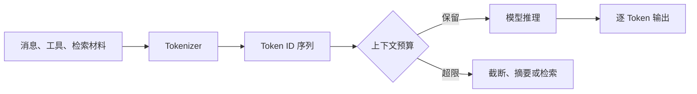
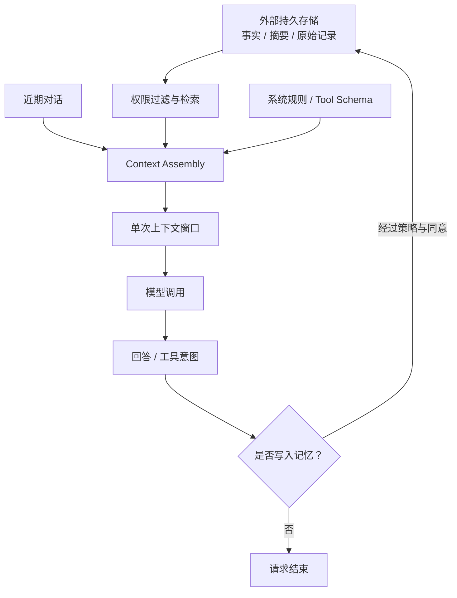
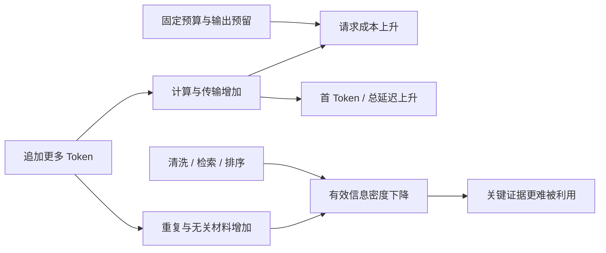
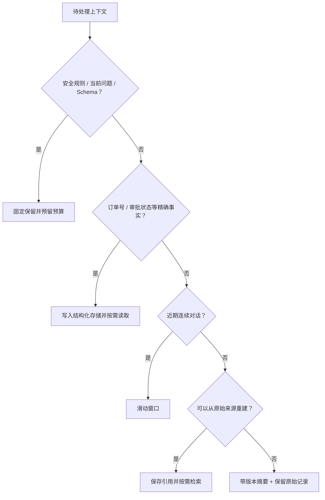

# 第2章：Token、Tokenizer 与上下文窗口

最后核对日期：2026-07-10。本章涉及具体模型窗口与价格时不提供静态数字，使用时应查官方文档。

## 章节导读与学习目标

模型看到的不是“字”或“单词”，而是 Token ID 序列。理解 Tokenizer 与上下文窗口，才能解释成本、延迟、截断和“模型忘了前文”等常见现象。学完后，你应能估算输入输出量，设计截断策略，并说明上下文为何不是长期记忆。

前置知识：第 1 章的自回归生成概念；Python 字符串与列表。

## 核心概念与原理

Tokenizer 将文本切分为词、子词、字符或字节相关单元，再映射为整数。不同模型使用不同词表和规则，因此同一段中文、英文、代码或 Emoji 的 Token 数可能不同。Token 不是稳定的自然语言单位，也不能用“汉字数”等比例精确换算；生产计费和截断必须调用目标模型对应的 Tokenizer 或供应商统计结果。

常见 Tokenizer 使用 BPE、WordPiece、Unigram 或其变体。它们依据训练语料和词表把字节或字符序列组合成可复用单元，而不是先理解句子再按人类词义切分。高频片段可能只占一个 Token，罕见姓名、长数字、混合编码和 Emoji 则可能拆成许多 Token。词表较大通常能缩短常见序列，却会增加模型输入输出层的规模；词表较小更灵活，但推理序列可能更长。Tokenizer 因此是数据分布、模型大小和运行成本之间的工程折中。

输入 Token 不只有聊天框里的文字，还包括系统指令、历史消息、角色标记、工具 JSON Schema、工具结果与检索材料。输出 Token 是模型自回归生成的序列。某些平台还区分缓存输入或其他计量项，其字段属于版本敏感能力，必须以当前官方说明为准。

一次请求的上下文通常由系统指令、历史消息、工具定义、工具结果、检索材料和当前问题共同占用。输出也占模型可处理的总预算。窗口变大可以容纳更多材料，却不保证模型同等有效地利用每个位置；噪声、冲突和关键证据埋藏会降低质量。



图中的预算控制必须由应用显式完成。简单删除最早消息可能丢掉系统约束；只保留摘要可能损失数字和引用。常用做法是固定保留系统指令与当前问题，对近期对话使用滑动窗口，对较早内容生成带版本的摘要，并从外部记忆按需检索。摘要是有损压缩，原始记录仍应在合规范围内保存。

上下文窗口与长期记忆经常被混为一谈。下图按生命周期区分单次调用工作区、会话状态、结构化事实和检索式记忆。



模型只看到组装后的窗口；是否写入、保存多久、谁能再次读取都由外部运行时决定。把整个聊天历史持续追加既不是可靠记忆，也会放大成本和注入风险。

### 成本、延迟与信息密度

更多 Token 通常意味着更多计算、传输和内存占用。长输入会增加预处理与首 Token 延迟，长输出会增加总响应时间。预算器应读取服务返回的实际 Usage，并监控“每个成功任务的 Token”；单次请求便宜但循环反复失败的 Agent，整体成本仍可能很高。

窗口更大不等于信息利用率更高。把整份手册直接塞进上下文，会把关键证据与目录、重复页眉和无关章节混在一起。更可靠的做法是清洗材料、按问题检索、按相关性和来源排序，并为安全规则与当前任务保留固定预算。

下图展示 Token 数量与三类工程指标的共同变化。它不是精确函数，而是提醒团队不能只看上下文上限而忽略首 Token 延迟、总成本和有效信息比例。



成本和延迟通常随 Token 增加，而质量并不单调上升。工程优化应先删除重复与低价值上下文，再考虑更大窗口或更昂贵模型。

### 截断、摘要与 Context Engineering

截断策略要区分不可丢失与可重建信息。系统安全规则、当前问题、工具权限和输出 Schema 不应被静默删除；寒暄、重复结果和可再次查询的数据可以压缩。滑动窗口适合局部连续任务，但会遗忘早期承诺；摘要保留主题，却可能改写数字和否定条件；检索式记忆可按需取回历史，却存在漏召回。关键订单号、审批状态等事实应进入结构化存储，而不是只存在生成摘要中。

Context Engineering 不只是改写 Prompt，而是决定模型在某次决策前实际看到什么：内容选择、角色、顺序、来源标记、冲突处理、压缩和预算都属于它。外部网页必须标记为不可信数据；当来源互相冲突时，系统应显式报告冲突或按确定规则选择，不能静默拼接后让模型猜测。

不同压缩策略会丢失不同信息。下图给出一个可执行的选择顺序：先保护不可丢失内容，再根据可重建性和连续性选择窗口、摘要或检索。



树中的优先级避免安全规则和精确业务事实被摘要改写。摘要与检索都需要原始来源和版本，不能把生成文本当作唯一证据。

## 最小实验

在没有目标 Tokenizer 时，只能做字符级演示，不能把结果称为模型 Token 数：

```python
from collections import Counter

text = "Agent 不等于 LLM。"
print(len(text), Counter(text))
```

正式实验应选择一个明确模型，分别统计同义中英文、JSON、代码和 Emoji，记录输入 Token、输出 Token、首 Token 延迟和总延迟，再观察它们与内容长度的关系。

## 完整工程示例：上下文预算器

预算器应接收目标 Tokenizer 的计数函数，从而把供应商适配与保留策略分离：

```python
from collections.abc import Callable
from dataclasses import dataclass


@dataclass(frozen=True)
class Message:
    role: str
    content: str
    pinned: bool = False


def select_messages(
    messages: list[Message], count_tokens: Callable[[str], int], budget: int
) -> list[Message]:
    if budget <= 0:
        raise ValueError("budget 必须为正数")
    selected = [message for message in messages if message.pinned]
    used = sum(count_tokens(message.content) for message in selected)
    if used > budget:
        raise ValueError("固定消息已经超过上下文预算")
    for message in reversed([item for item in messages if not item.pinned]):
        cost = count_tokens(message.content)
        if used + cost <= budget:
            selected.append(message)
            used += cost
    return sorted(selected, key=messages.index)
```

这个实现只选择完整消息，不会把一条消息从中间截断。真实系统还应为工具 Schema 和最大输出预留空间；固定内容超限时应停止请求并报警。测试至少覆盖预算恰好用满、固定消息超限、单条消息过长和不同语言计数差异。

## 工程实践、误区与安全

上下文工程不是无限追加材料，而是选择、排序、压缩并标注来源。把不可信网页放入上下文还会引入间接 Prompt Injection；检索内容必须与系统指令隔离，并声明其只是数据。日志记录 Token 用量时要脱敏，不能为了成本分析保存完整个人对话。

常见误区包括：把窗口当数据库容量、认为窗口未满就不会遗忘、用字符数精确估价、摘要后删除唯一原始证据。调试时应打印每类上下文的 Token 占比，构造接近窗口上限的测试，并验证关键约束在压缩前后仍存在。

当模型“忘记”时，先确认最终请求是否真的包含相关内容、角色与顺序是否正确、是否被中间件摘要、工具结果是否挤占预算，以及证据是否被噪声淹没。Trace 可以记录每段上下文的来源、Token 数和截断原因，但敏感正文应脱敏或只记录引用 ID。

## 总结、练习与延伸

Token 是模型计算单位，上下文是单次调用的工作区，不是持久记忆。窗口管理同时影响质量、成本、延迟和安全。

课后练习：为 50 轮客服对话设计“固定指令 + 近期窗口 + 事实摘要 + 外部检索”策略；实现预算器单元测试；比较同义中英文、JSON 与代码的 Token 数，并解释客户订单号为什么不能只存在生成摘要中。

面试问题：上下文窗口翻倍为什么不一定使长文问答质量翻倍？滑动窗口和检索式记忆分别会丢失什么？

延伸阅读：目标模型官方 Tokenizer 文档；Sennrich et al., *Neural Machine Translation of Rare Words with Subword Units*；Liu et al., *Lost in the Middle*。本章代码目录状态：正文内预算器代码可以直接运行，独立 Token Counter 工程列入质量路线图 P2，在交付前不标记为独立示例已完成。
