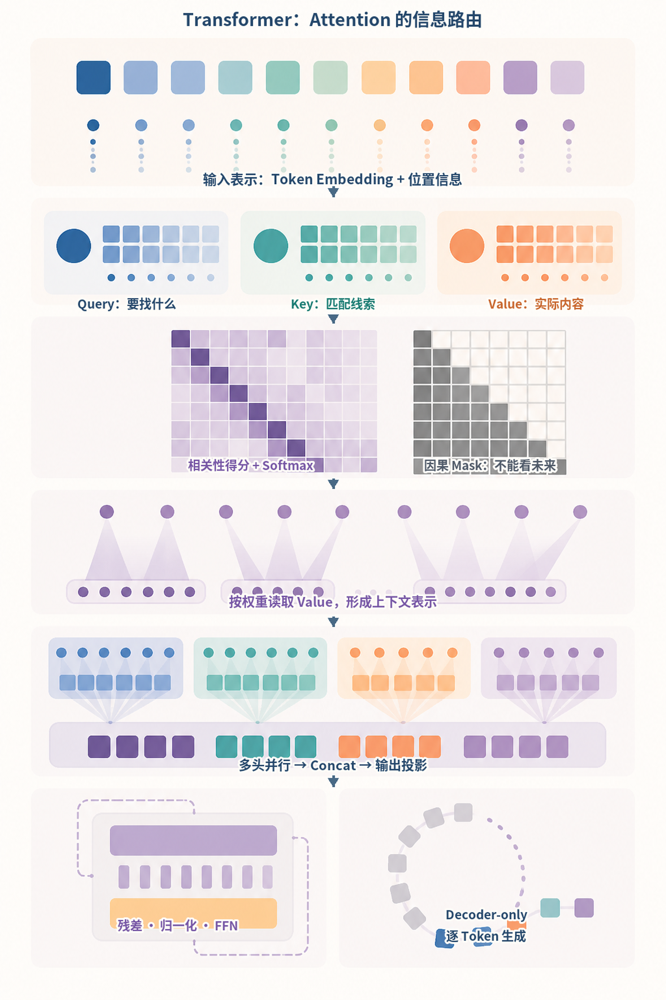
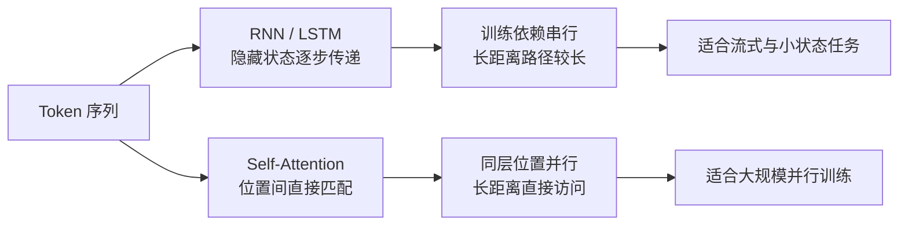
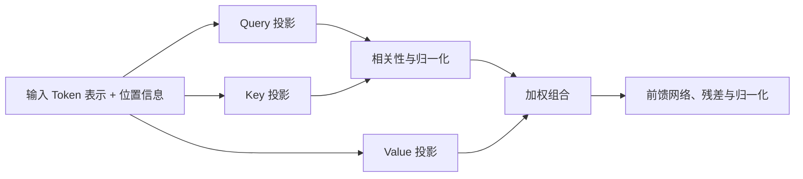
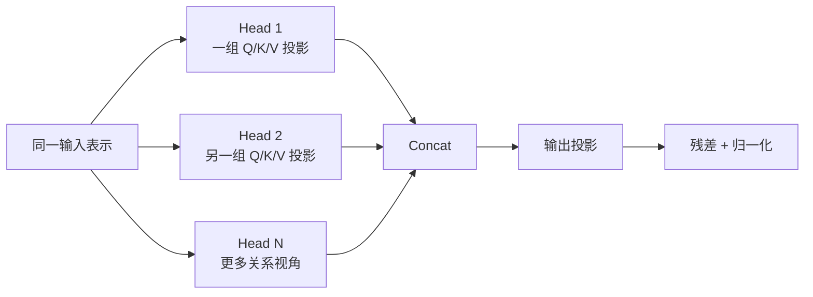
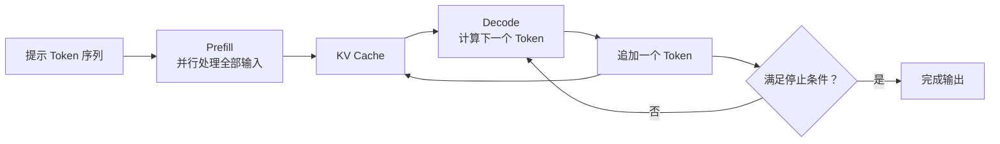
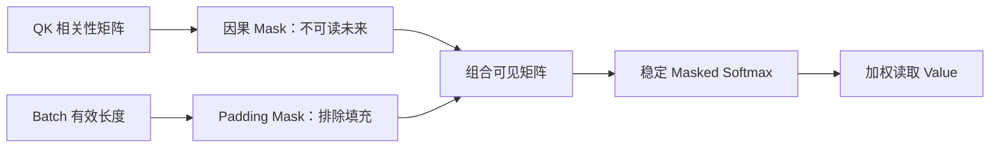

# 第3章：Transformer 与 Attention

最后核对日期：2026-07-10。

## 章节导读与学习目标

本章用工程视角解释 Transformer 的数据流，而不展开完整公式。读完后，你应能说明 RNN 的串行限制、Self-Attention 中 Query/Key/Value 的职责、Multi-Head Attention 的动机、位置编码的必要性，以及 Decoder-only 模型为何适合自回归生成。

前置知识为向量、Softmax 的直觉和第2章 Token 概念；本章核心示例只使用 Python 标准库。

下面的信息图把本章最容易混淆的概念放进一条完整路径：输入表示先投影为 Query、Key 与 Value，相关性分数在因果 Mask 约束下归一化，再按权重读取 Value；多头结果合并后进入残差、归一化与前馈层。图的最后同时标出 Decoder-only 的逐 Token 生成，以免把单层 Attention 和完整生成循环混为一谈。



*图 3-A：Transformer 与 Attention 的信息路由。纵向箭头表达主要计算顺序；每个彩色区域是机制分区，不代表真实张量尺寸，也不表示不同注意力头被预先指定了固定语义。*

阅读图 3-A 时，应把“相关性高”理解为当前层对 Value 的读取权重，而不是最终答案的因果解释。因果 Mask 只限制位置可见性，不负责事实校验、安全策略或权限控制；这些边界必须由模型外部系统提供。

## 从序列递归到 Attention

RNN 把前一步隐藏状态传给后一步，天然表达顺序，但训练难以沿序列充分并行，长距离信息还需要经过许多状态转移。Attention 允许当前位置直接参考其他位置。可以把 Query 理解为“当前位置要找什么”，Key 是“每个位置提供什么匹配线索”，Value 是“匹配后实际取回什么内容”。Query 与 Key 形成相关性权重，权重再对 Value 加权汇总。

下图比较序列信息从递归传递到直接内容寻址的变化，重点是训练依赖路径和长距离访问方式，而不是简单宣称新架构在所有任务上都更好。



上支路的每一步依赖前一步隐藏状态，下支路在同一层同时计算多个位置。Transformer 仍需位置表示、掩码和较高的长序列内存，因此不是无条件替代所有递归结构。

Multi-Head Attention 使用多组投影，让模型可以同时学习不同关系，例如局部搭配、指代、结构边界或代码依赖。这里的“头”不是预先指定语法功能，每个头的行为由训练形成，也不保证始终具有可直接命名的解释。

相关性通常由 Query 与 Key 的点积得到，再按维度缩放并经过 Softmax 归一化。缩放能避免维度增大后分数绝对值过大、Softmax 过度饱和。权重随后用于组合 Value。注意力权重只说明这一层如何读取 Value，不等于某个词对最终结论的因果贡献，因为信息还会经过投影、残差连接、归一化、前馈网络和后续层。



图表示一层的抽象数据流。模型会堆叠许多层，使每个位置逐步获得更丰富的上下文表示。位置编码或旋转位置等机制向模型提供顺序信息；没有它们，交换 Token 位置可能无法被纯 Attention 正确区分。

单个注意力头只有一组投影。下图说明 Multi-Head Attention 怎样并行形成多组读取结果，再拼接回统一表示；“局部关系”等标签只是直觉示例，并非预先指定的固定职责。



从左向右阅读时，多个头互不共享投影参数，但共同参与最终表示。不能因为某次可视化呈现某种模式，就把某个头永久命名为语法头或事实头。

## 编码器、解码器与掩码

编码器可以双向读取整个输入，适合表示与分类；原始 Transformer 解码器在生成时使用因果掩码，使某位置只能看到它之前的 Token，避免训练时偷看答案。Decoder-only LLM 把提示和已生成内容放进同一序列，通过因果掩码逐 Token 续写。模型服务常用 KV Cache 保存已计算的 Key/Value，减少生成每个新 Token 时的重复计算。

下图把 Decoder-only 的一次请求拆成 Prefill 和反复 Decode 两段，帮助定位长输入与长输出分别消耗在哪里。



Prefill 主要受输入长度影响，Decode 具有逐 Token 串行依赖。KV Cache 减少重复计算，却随上下文、并发和层数占用显存，不能消除长输出延迟。

Transformer 容易在加速硬件上并行训练，是规模化的重要原因，但并非没有代价。标准 Attention 对长序列的计算与内存开销较高；固定窗口限制可见历史；内部表示难以调试；概率生成也不提供事实保证。长上下文优化、稀疏 Attention 与外部检索是不同缓解路线，不能混为一种技术。

### Position Encoding 与长度

纯 Attention 不带天然顺序感，因此需要位置相关信号。原始 Transformer 使用正弦和余弦位置编码，后续模型还使用可学习位置、相对位置偏置或旋转位置编码等方案。应用开发者通常不直接选择这些实现，但必须理解：扩展窗口并不只是修改一个配置数字，模型还要在训练或适配中学会利用相应位置范围。

### Decoder-only 的适用边界

Decoder-only 架构能把文档、代码、对话与工具轨迹统一为“给定前文生成后文”，适合大规模自回归预训练。这不表示编码器已经过时。Embedding、分类和重排可能更适合编码器，翻译等任务也可使用编码器-解码器。架构选择取决于任务与部署约束，不是参数规模排名。

## 最小代码与调试

下面只演示“按匹配分数加权 Value”的思想，不是完整 Attention：

```python
import math

scores = [1.2, 0.3, -0.4]
values = [10.0, 20.0, 50.0]
weights = [math.exp(x) for x in scores]
weights = [x / sum(weights) for x in weights]
context = sum(w * v for w, v in zip(weights, values, strict=True))
print(round(context, 2))
```

调试时不要把可视化注意力权重直接当作因果解释。权重能帮助观察模式，但模型行为还经过 Value、残差连接、后续层和非线性变换。工程上更可靠的是对输入做受控扰动、运行消融实验并测量任务指标。

## 完整实验：单头缩放点积 Attention

下面用标准库展示一个 Query 对多个 Key/Value 的计算。它没有训练、批次、多头和掩码，但保留了主要数据流：

```python
from math import exp, sqrt


def dot(left: list[float], right: list[float]) -> float:
    if len(left) != len(right):
        raise ValueError("向量维度必须一致")
    return sum(x * y for x, y in zip(left, right, strict=True))


def attend(
    query: list[float], keys: list[list[float]], values: list[list[float]]
) -> list[float]:
    if not keys or len(keys) != len(values):
        raise ValueError("Key 与 Value 必须非空且数量一致")
    scores = [dot(query, key) / sqrt(len(query)) for key in keys]
    denominator = sum(exp(score) for score in scores)
    weights = [exp(score) / denominator for score in scores]
    return [
        sum(weight * value[i] for weight, value in zip(weights, values, strict=True))
        for i in range(len(values[0]))
    ]
```

加入因果掩码时，要在 Softmax 之前把不可见位置的分数设为极小值，而不是在加权后删除 Value。练习中应补充空 Query、Value 维度不一致和数值稳定性测试。

## 工程调试、性能与安全

模型服务常把一次生成分为 Prefill 和 Decode：前者处理全部输入，后者逐 Token 生成。长输入主要增加 Prefill 成本；长输出带来更多串行 Decode 步骤。KV Cache 避免重复计算既有 Token 的 Key/Value，却会消耗显存并随并发和长度增长。量化、批处理、Paged Attention 与推测解码优化的是不同瓶颈。

调试张量形状时，应显式标注 batch、sequence、head、head dimension；验证因果掩码时，可在后文放置明显答案，确认前面位置无法读取。Attention 本身不会区分可信指令和恶意文档，不可信内容与高权限工具仍需要外部隔离、最小权限和审批。

### Mask 不只是填一个极小值

Decoder-only 训练使用因果 Mask，Padding Batch 还可能需要 Padding Mask。两者组合错误会让模型读取
未来 Token，或把 Padding 当真实内容。工程实现必须明确 Mask 形状能否广播到
`[batch, heads, query_length, key_length]`，以及布尔值中 `True` 代表“允许”还是“屏蔽”；不同库约定
可能相反。

Softmax 前把不可见位置设为负无穷是概念表达。低精度计算中应使用框架提供的 Masked Attention，
避免自行选择一个“足够小”的常数引发溢出或全 Mask 行得到 NaN。每个 Query 若没有任何合法 Key，
必须有明确定义而不能默默归一化。



这张图说明 Mask 是 Attention 计算契约的一部分，而不是生成结束后的过滤。测试可构造两个不同后缀，
断言前缀位置输出完全一致，从而发现未来信息泄漏。

### 复杂度与真实瓶颈

标准全注意力的分数矩阵随序列长度平方增长，但模型总成本还包括 Q/K/V 投影、FFN、激活和内存搬运。
不能仅用 `O(n²)` 判断某次请求为何慢。短序列可能由矩阵乘与框架开销主导，长序列才明显受 Attention
矩阵和显存约束；硬件、精度、Batch 和 Kernel 都会改变交叉点。

FlashAttention 类算法通过分块和减少高带宽内存读写得到精确 Attention 结果，主要改善 I/O 与内存，
不是把模型改成另一套语义。稀疏、滑窗或线性 Attention 则改变可见模式或近似方式，需要重新评估任务
质量。应用开发者应查看目标模型/服务的承诺，而不是根据营销名称推断实现。

### KV Cache、并发与延迟

自回归 Decode 的每一层保存既有 Token 的 Key/Value，使新 Token 无需重算全部历史表示。Cache 大小
大致随层数、KV Head 数、Head Dimension、序列长度、Batch 和数据类型增长。Multi-Query/Grouped-
Query Attention 可减少 KV Head，但具体结构由模型决定。

KV Cache 优化的是重复计算，不消除逐 Token 串行依赖，也不保证长上下文中的信息利用质量。高并发
时显存常由 Cache 而非权重主导，因此服务会采用连续批处理、Paged Cache、前缀缓存或抢占。前缀缓存
只有在 Token 序列、模型版本和相关配置一致时才能安全复用；含租户敏感内容的缓存还需隔离和生命周期
策略。

| 阶段 | 主要输入 | 常见瓶颈 | 关键指标 |
|---|---|---|---|
| Prefill | 全部 Prompt Token | 计算与长序列 Attention | Time to First Token、输入吞吐 |
| Decode | 每轮一个新 Token + KV Cache | 内存带宽、串行步数 | Tokens/s、Inter-token Latency |
| 并发调度 | 多请求与不同长度 | Cache 容量、Batch 空洞 | P95/P99、公平性、抢占率 |

### Attention 可视化的解释边界

一张 Attention Heatmap 能说明某层某头读取 Value 的权重，但不能单独证明模型“因为这个词”得出结论。
残差流可能绕过该头，多个层会重新混合信息，Value 向量本身也包含上下文。更可靠的行为分析结合输入
扰动、消融、对照集和最终指标；即便如此，也应谨慎区分相关、机制线索和因果结论。

[`examples/attention_demo/`](https://github.com/wujinjun/ai-agent-book/tree/main/examples/attention_demo)
用 NumPy 实现稳定 Softmax、因果 Mask 和多头形状，并导出 SVG/PNG Heatmap。它是机制实验，不是训练
模型，也不能从玩具权重推断真实 LLM 内部语义。

### 练习参考答案与面试要点

1. **因果 Mask。** 在 Softmax 前屏蔽 `key_position > query_position`；改变未来 Token 后，所有前缀
   Query 的输出应不变。还需测试 Padding、全 Mask 与形状广播。
2. **扩大上下文或 RAG。** 上下文适合任务所需且可承受的原始材料；RAG 适合外部、更新频繁且需引用
   的知识。二者可组合，都不保证模型一定采用正确证据。
3. **KV Cache。** 它复用历史 K/V、降低 Decode 重算；不能并行生成未来 Token、消除显存增长或提供
   长期记忆。
4. **Encoder/Decoder。** Encoder 可双向表示，常用于 Embedding/分类；Decoder-only 适合自回归生成；
   具体任务还需比较质量、吞吐和部署约束。

## 误区、安全、总结与练习

常见误区：Attention 等于人类注意；某个头必然对应某条语法规则；Transformer 可以无限处理上下文；模型能注意到文本就会遵守文本。特别是最后一点，不可信内容可能被模型错误当作指令，因此权限边界必须在模型之外。

总结：Transformer 用 Attention 建立位置间的内容相关连接，以并行训练和可扩展性推动了 LLM；工程上
还必须理解 Mask、KV Cache、Prefill/Decode、显存与解释边界，不能把一张权重图当成完整模型原因。

延伸阅读：Vaswani et al., *Attention Is All You Need*；Dao et al., *FlashAttention*。本章代码目录为 [`examples/attention_demo/`](https://github.com/wujinjun/ai-agent-book/tree/main/examples/attention_demo)，已用 Python 3.12 与 NumPy 2.5.1 验证张量形状、稳定 Softmax、因果 Mask、多头变形，并生成 SVG/PNG 热力图。图中的权重只用于机制教学，不构成因果解释。

## 本章引用
<!-- chapter-citations:start -->
以下资料用于支撑本章的核心原理、工程边界与版本敏感说明：

- [vaswani2017：Attention Is All You Need](../references.md#ref-vaswani2017)
- [devlin2018：BERT: Pre-training of Deep Bidirectional Transformers for Language Understanding](../references.md#ref-devlin2018)
- [kaplan2020：Scaling Laws for Neural Language Models](../references.md#ref-kaplan2020)
<!-- chapter-citations:end -->
