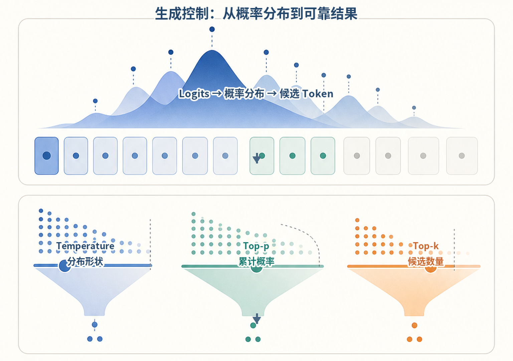
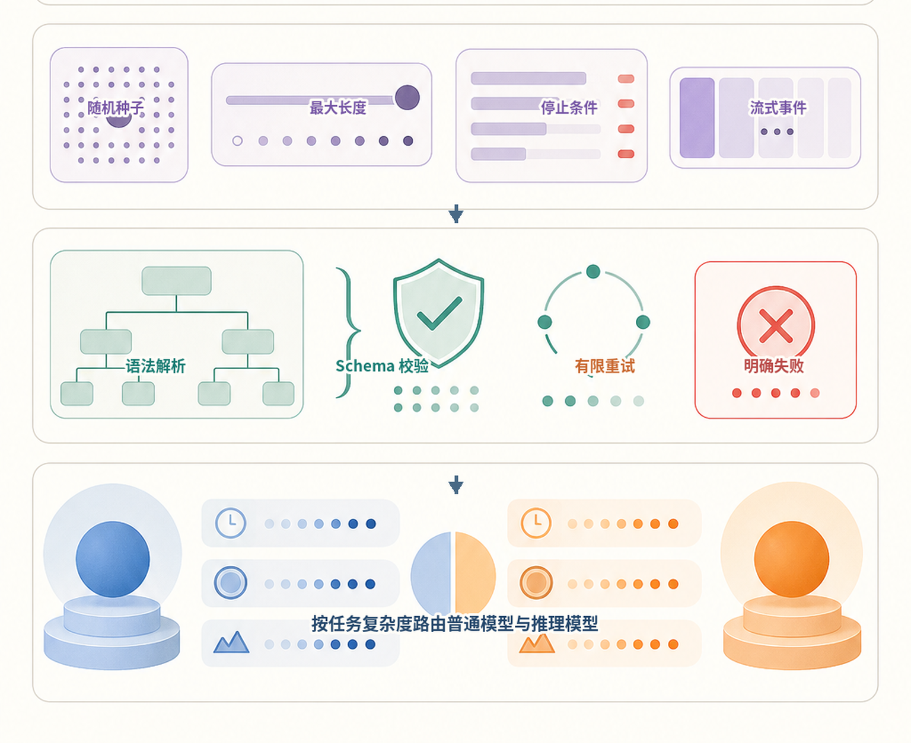
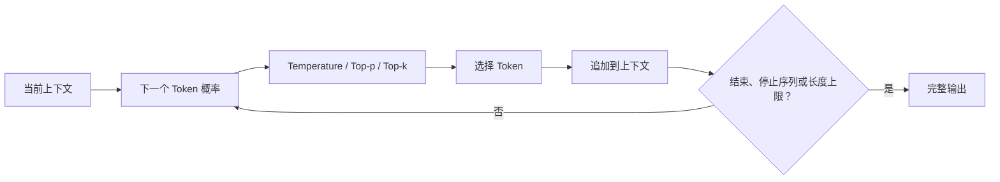
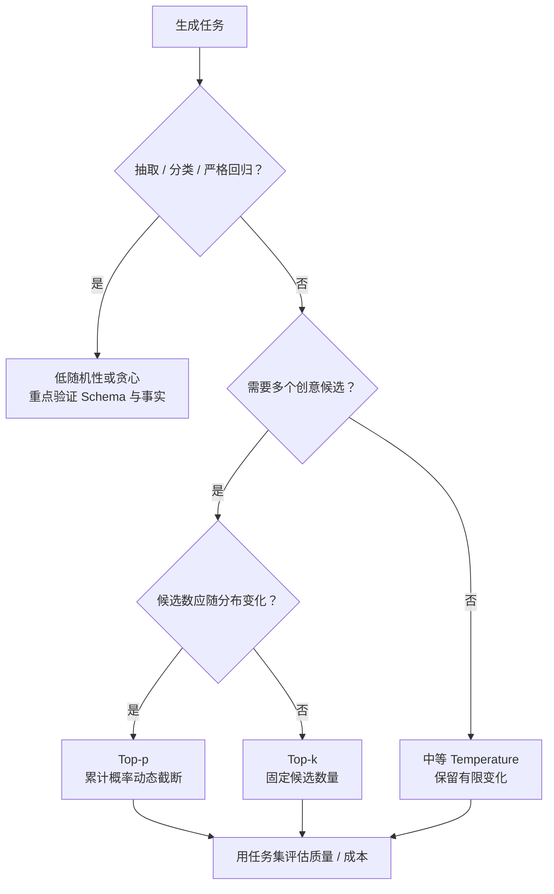
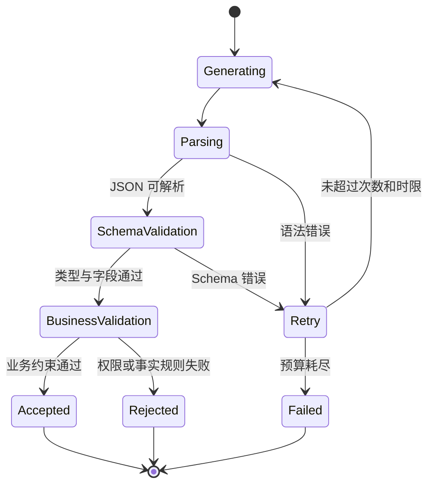
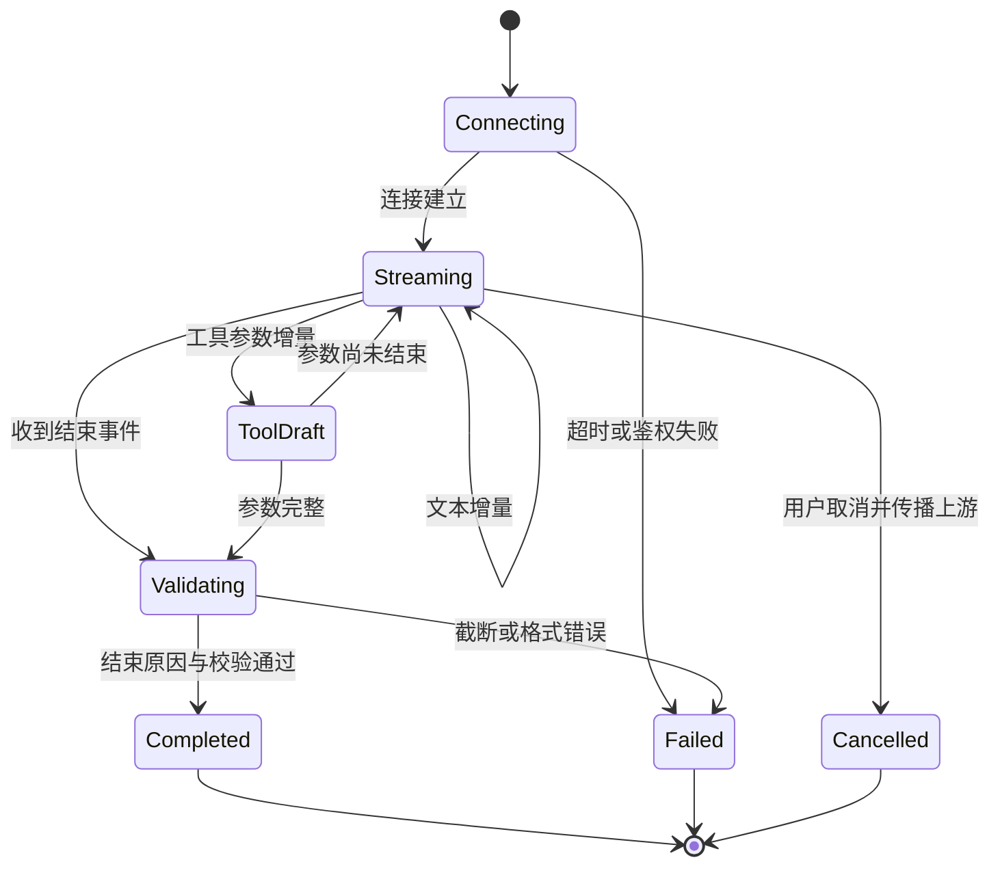
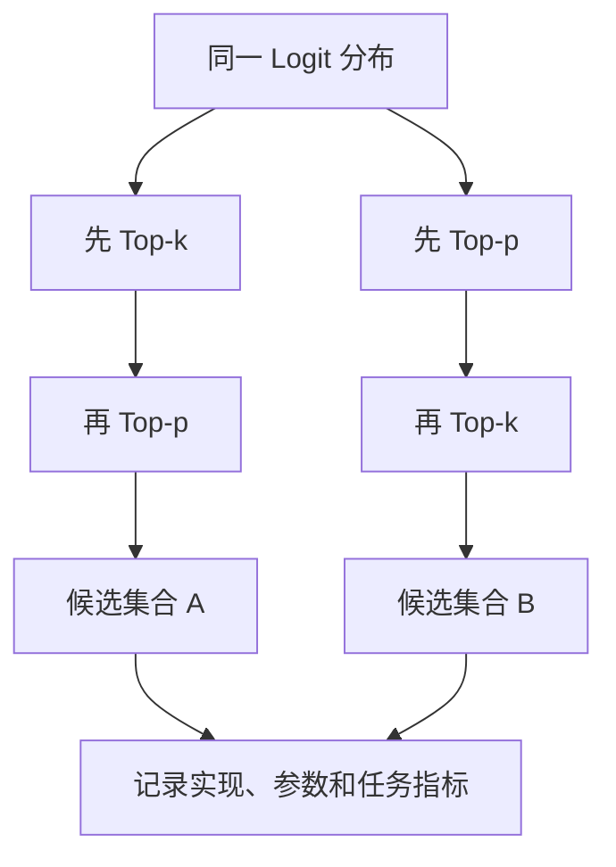

# 第4章：LLM 生成机制

最后核对日期：2026-07-10。

## 章节导读与学习目标

模型每一步给出下一个 Token 的概率分布，解码策略决定如何从分布中选择输出。本章目标是理解 Temperature、Top-p、Top-k、停止条件、流式与结构化输出，并能为不同任务选择可测试的参数。

前置知识为第2—3章；核心示例使用固定 logits，避免把供应商特定接口混入稳定原理。

关于截断采样与文本退化的讨论主要依据 [Holtzman 等人的研究](../references.md#ref-holtzman2020)。供应商对 `temperature`、`top_p`、随机种子和结构化输出的支持会变化，本章只讲稳定机制，具体参数仍须按目标 API 的当前兼容性说明核对。

下图把模型内部的概率选择与应用外部的可靠性控制分开：采样参数改变候选 Token 的选择分布，长度、停止和流式配置约束一次生成过程；JSON 或 Pydantic 对象只有通过完整校验后，才能成为下游可消费的数据。



*图 4-A：概率分布与采样参数。Temperature 改变分布形状，Top-p 与 Top-k 缩小候选集合；三者不负责事实校验。*



*图 4-B：运行边界与结构化结果。解码参数、协议终态和业务校验属于不同控制层，不能用“低 Temperature”替代输出验证。*

图 4-B 的结构化输出门禁位于生成之后。即使模型返回了外观正确的 JSON，运行时仍要完成语法、Schema 和业务规则校验，并把重试限制在可修复错误与明确预算之内。

## 概率分布与采样

Temperature 调整分布的尖锐程度：较低值通常使高概率候选更占优势，较高值扩大多样性，但它不是“事实准确度”旋钮。Top-k 只保留概率最高的 k 个候选；Top-p 保留累计概率达到阈值的最小候选集合。供应商可能只支持部分参数，且实现细节会变化，具体接口必须查当前文档。

贪心或低随机性有利于抽取、分类和回归测试，较高多样性适合创意候选生成。即使参数固定，服务端模型更新、并行计算和实现差异也可能影响逐字复现，因此生产测试更适合验证 Schema、事实字段和任务指标，而不是总要求全文相同。

Top-k 使用固定候选数量，无法适应分布形状：模型非常确定时仍保留 k 个，不确定时又可能过早丢弃长尾候选。Top-p 根据累计概率动态调整集合大小，更适合开放生成。二者可以组合，但参数越多越难解释。部分 API 提供随机种子；种子只能提高同一实现中的复现概率，不能保证模型升级后逐字一致。



最大输出长度是资源和安全边界；Stop Sequence 可在协议边界停止生成，但若自然文本意外包含停止串也会提前终止。流式输出降低用户感知延迟，却使内容审核、JSON 解析和错误回滚更复杂。界面应区分“正在生成”“已完成”和“失败”，不能把半截结果当成最终事实保存。

不同任务需要不同的候选过滤策略。下图把确定性抽取、开放生成和分布形状纳入选择顺序，避免同时堆叠多个参数后无法解释结果。



树给出实验起点而非供应商无关的最佳参数。实际 API 可能限制参数组合，最终选择必须记录模型版本、任务集和指标。

## 结构化输出与推理模型

要求模型“只输出 JSON”仍可能得到 Markdown 围栏、缺失字段或类型错误。可靠做法是使用供应商支持的 JSON Schema/结构化输出能力，并在应用侧用 Pydantic 再验证。校验失败应有限重试，并保留原始错误供诊断；不能无限让模型自我修复。

下图展示结构化输出从生成到业务采用之间的验证状态。只有解析、Schema 和业务规则全部通过，结果才可进入工具或数据库。



语法和 Schema 错误可以把明确错误反馈给模型重试；权限拒绝不应通过改写参数反复尝试。状态机把“可修复格式错误”和“不可绕过业务拒绝”分开。

推理模型常针对复杂求解进行了额外训练或推理时计算配置。它们可能更慢、更贵，也可能有不同参数限制。不要依赖不可见或未承诺稳定的内部推理文本；应用应要求简洁、可审计的依据、工具结果或引用。

### 停止、长度与流式状态

模型结束标记、Stop Sequence 和最大输出长度对应不同终止路径。客户端必须读取结束原因：达到长度上限的 JSON 很可能被截断，工具参数即使前半段可解析也不能执行。停止串应选择不容易出现在业务正文中的协议边界，并防止用户输入被拼接成伪造边界。

流式接口可能交付文本增量、工具参数增量、Usage 与结束事件。应用需要维护“连接、生成、候选工具、完成、取消、失败”状态，而不是把所有片段直接追加到数据库。用户关闭页面后是否取消上游请求、部分内容是否保存，都必须有明确产品语义。结构化内容通常只能在结束后做整体验证，流式阶段应标记为草稿。

下图把流式响应的 UI 与持久化状态分开，说明增量到达不代表结果已经完成或可以执行。



界面可以即时展示 Streaming 内容，但持久层应标记为草稿。工具参数必须等到完整且校验通过后才能执行，取消还要传递到上游以避免后台继续计费。

## 完整工程实验：离线采样器

下面的代码用于观察 Temperature，不代表供应商实现：

```python
from math import exp
from random import Random


def sample(logits: dict[str, float], temperature: float, seed: int) -> str:
    if not logits:
        raise ValueError("logits 不能为空")
    if temperature <= 0:
        return max(logits, key=logits.get)
    scaled = {token: value / temperature for token, value in logits.items()}
    maximum = max(scaled.values())
    weights = {token: exp(value - maximum) for token, value in scaled.items()}
    point = Random(seed).random()
    cumulative = 0.0
    for token, weight in weights.items():
        cumulative += weight / sum(weights.values())
        if point <= cumulative:
            return token
    raise RuntimeError("浮点累计误差导致采样失败")
```

固定 logits，改变 Temperature 与 seed，统计各 Token 的频率；再用 Pydantic 校验一组 JSON 输出，分别记录多样性和格式有效率。采样实验不能证明事实正确，Schema 实验也不能证明字段来源可靠。

## 参数实验、误区与安全

实验应固定输入集，对多组参数重复运行，记录任务成功率、格式有效率、事实错误率、输出长度、首 Token 延迟和成本。只看一条“效果不错”的样例无法支持参数决策。

常见误区：Temperature 为 0 就绝不变化；降低 Temperature 能消除幻觉；流式输出更省 Token；结构化输出保证字段事实正确。Schema 只保证形状，事实仍需检索或业务校验。安全上应限制输出长度、过滤不可信内容、在执行动作前验证结构和权限。

调试时保存模型标识、参数、输入摘要、结束原因和 Usage。空输出先查内容安全与停止原因；重复文本检查输出上限和提示重复；JSON 截断检查长度与流状态；事实错误回到证据链，而不是继续调随机参数。

### 从 Logit 到概率的数值稳定

模型先产生未归一化 Logit。Softmax 把它们转为和为 1 的分布，但直接计算 `exp(logit)` 可能溢出；
工程实现通常先减去最大 Logit。减去同一个常数不会改变概率比值：

```python
from math import exp, isfinite


def stable_softmax(logits: list[float]) -> list[float]:
    if not logits or not all(isfinite(value) for value in logits):
        raise ValueError("logits must be finite and non-empty")
    maximum = max(logits)
    weights = [exp(value - maximum) for value in logits]
    total = sum(weights)
    return [weight / total for weight in weights]
```

Temperature 大于零时通常通过 `logit / temperature` 缩放。Temperature 趋近零会让最大项占优，但 API
对 `0` 的定义可能是贪心、特殊分支或不允许；不能把教材公式直接外推为所有供应商接口语义。若多个
Token Logit 完全相同，即使贪心也需要 Tie-break 规则，分布式实现或版本变化仍可能产生差异。

### Top-k 与 Top-p 的顺序属于实现语义

当两个过滤器同时启用时，先 Top-k 再 Top-p 与先 Top-p 再 Top-k 可能留下不同候选。教材的
Sampling Lab 明确规定“Temperature → Top-k → Softmax → Top-p”，只为让实验可复现，不声称所有
平台采用此顺序。比较两家服务时若只看参数名称相同，很容易把实现差异误判为模型能力差异。

Top-p 的最小集合通常先按概率降序，再保留累计概率达到阈值的候选；至少保留一个 Token。边界上的
等概率项、浮点舍入和是否包含越过阈值的 Token 都可能因实现不同而变化。工程测试应验证供应商承诺
的行为或任务结果，不能对未公开内部排序做脆弱断言。



图中的差异说明参数只是解码策略的一部分。供应商未承诺 Logprob 或过滤细节时，应把系统当黑盒，
通过固定任务集比较最终质量、长度、延迟和成本。

### 可重复性的分层定义

“相同输入得到相同输出”至少有三种强度：

| 层次 | 可控制条件 | 合理断言 |
|---|---|---|
| 本地算法单测 | 固定代码、词表、随机源与 Python 版本 | Token 序列完全一致 |
| 固定供应商快照 | 固定模型快照、参数、Seed 和区域 | 通常高度相似；以供应商承诺为准 |
| 可变托管别名 | 后端、量化、路由或安全系统可能更新 | Schema、事实和任务指标稳定 |

生产回归优先验证业务不变量：结构可解析、引用支持事实、禁止动作未发生、结束原因合法。全文 Golden
仍可用于确定性 Fixture，但不宜作为所有在线模型升级的唯一门禁。Seed 是实验元数据，不是分布式系统
的一致性协议。

### Finish Reason 是结果契约的一部分

应用需要区分自然结束、Stop、长度截断、内容策略、工具调用、取消和上游错误。具体枚举由 Provider
Adapter 映射成领域状态。达到最大长度时，即使字符串恰好能解析 JSON，也应谨慎对待：末尾字段、
引用或免责声明可能缺失。工具调用只有在参数完整、Schema 和授权全部通过后才能执行。

Stop Sequence 匹配还可能跨 Token 边界，因此不能用“最后一个 Token 等于停止串”模拟所有真实行为。
用户可控文本若能注入协议停止串，应使用结构化通道、转义或不可由用户伪造的帧边界。流式消费者
必须等终态事件后提交候选，连接 EOF 只说明传输结束，不说明模型正常完成。

### Sampling Lab 的证据边界

[`examples/sampling_lab/`](https://github.com/wujinjun/ai-agent-book/tree/main/examples/sampling_lab)
对四项玩具词表运行 500 个固定 Seed，生成 CSV 与 Markdown 频率报告，并测试非法 Temperature、Top-p、
Top-k、非有限 Logit、Stop Token 和长度上限。它证明解码控制逻辑和报告可重复，不证明哪组参数会让
真实语言任务更正确。

将真实 Provider 接入时，应保留同一任务 Dataset，但不得在平台不返回 Logprob 时伪造概率分布。
在线实验还要记录 Model Snapshot、区域、Finish Reason、Usage 和日期；安全过滤或服务端路由可能使
同一 Seed 不再逐 Token 一致。

## 本章总结

生成是反复计算概率分布、选择 Token 和检查终止条件的过程。Temperature、Top-p 与 Top-k 改变候选分布，不直接校验事实；最大长度、Stop、流式事件和结构化输出又属于不同的运行控制层。可靠工程需要记录模型与参数版本、过滤顺序、结束原因和 Usage，并把候选结果放在结构、事实、权限与业务门禁之后。下一章将介绍 Embedding，把“生成序列”扩展为“表示和检索外部语义对象”。

## 课后练习

### 设计题

1. 为发票抽取任务选择生成参数和结果门禁，输出参数表及字段准确率、Schema 有效率和拒答率指标。
2. 为营销文案候选设计兼顾多样性与品牌约束的生成实验，说明为什么提高 Temperature 不能替代评价 Rubric。

### 编码题

3. 为代码生成增加结束原因检查。输入包括正常结束、长度截断和策略拒绝；输出为可提交或不可提交的类型化状态；检查标准是截断结果永远不会进入应用 Patch 步骤。

### 概念题

4. 比较 Temperature 与 Top-p 对候选分布的影响，并解释结构化输出、长度限制和事实校验为何属于不同控制层。

### 故障实验

让流式连接在 JSON 最后一个字段前断开，记录传输 EOF 与模型正常完成的差异，验证消费者只有收到合法终态后才提交结果。

## 参考答案位置

本章参考答案已移至[书末参考答案](../exercise-answers.md)，便于先独立完成练习再核对。

## 面试问题

1. Temperature 与 Top-p 分别怎样改变候选分布？
2. 为什么结构化输出通过 Schema 校验后仍可能包含错误事实？
3. 流式连接断开与模型正常停止应如何区分？

## 延伸阅读与代码目录

延伸阅读包括 Holtzman 等人的 *The Curious Case of Neural Text Degeneration*，以及目标供应商当前的解码、流式和结构化输出官方文档。本章代码目录为 [`examples/sampling_lab/`](https://github.com/wujinjun/ai-agent-book/tree/main/examples/sampling_lab)，其中的固定 Logit Provider 和频率报告只验证采样控制，不冒充真实 LLM 质量评测。

## 本章引用
<!-- chapter-citations:start -->
以下资料用于支撑本章的核心原理、工程边界与版本敏感说明：

- [holtzman2020：The Curious Case of Neural Text Degeneration](../references.md#ref-holtzman2020)
- [brown2020：Language Models are Few-Shot Learners](../references.md#ref-brown2020)
- [openai-compat：API Backward Compatibility](../references.md#ref-openai-compat)
<!-- chapter-citations:end -->
