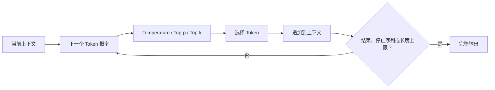
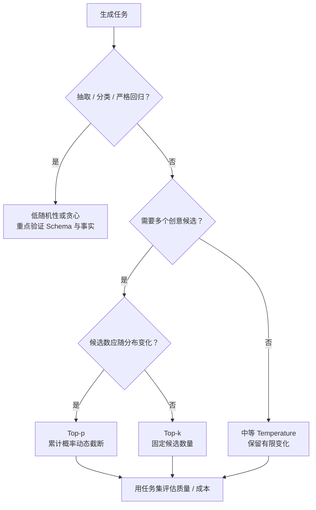
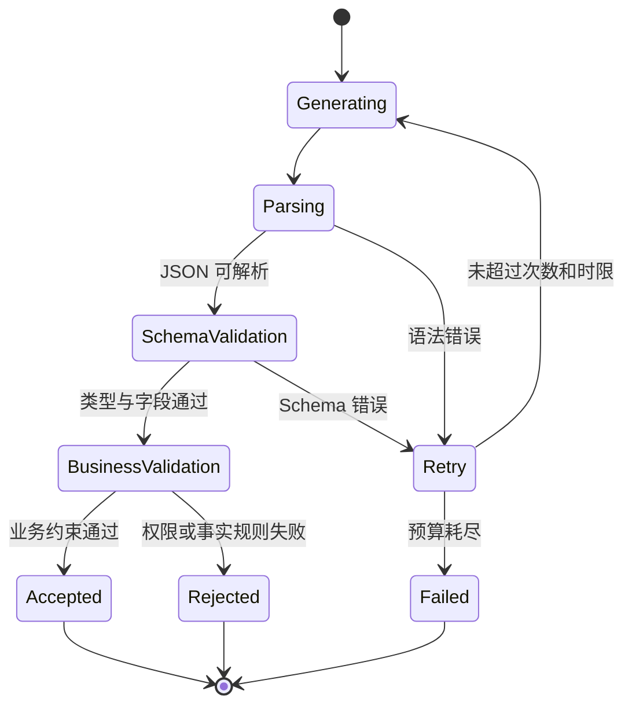
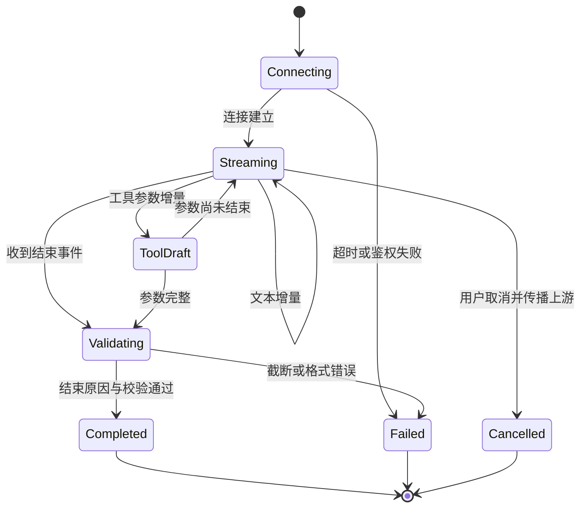

# 第4章：LLM 生成机制

最后核对日期：2026-07-10。

## 章节导读与学习目标

模型每一步给出下一个 Token 的概率分布，解码策略决定如何从分布中选择输出。本章目标是理解 Temperature、Top-p、Top-k、停止条件、流式与结构化输出，并能为不同任务选择可测试的参数。

前置知识为第2—3章；核心示例使用固定 logits，避免把供应商特定接口混入稳定原理。

## 概率分布与采样

Temperature 调整分布的尖锐程度：较低值通常使高概率候选更占优势，较高值扩大多样性，但它不是“事实准确度”旋钮。Top-k 只保留概率最高的 k 个候选；Top-p 保留累计概率达到阈值的最小候选集合。供应商可能只支持部分参数，且实现细节会变化，具体接口必须查当前文档。

贪心或低随机性有利于抽取、分类和回归测试，较高多样性适合创意候选生成。即使参数固定，服务端模型更新、并行计算和实现差异也可能影响逐字复现，因此生产测试更适合验证 Schema、事实字段和任务指标，而不是总要求全文相同。

Top-k 使用固定候选数量，无法适应分布形状：模型非常确定时仍保留 k 个，不确定时又可能过早丢弃长尾候选。Top-p 根据累计概率动态调整集合大小，更适合开放生成。二者可以组合，但参数越多越难解释。部分 API 提供随机种子；种子只能提高同一实现中的复现概率，不能保证模型升级后逐字一致。



最大输出长度是资源和安全边界；Stop Sequence 可在协议边界停止生成，但若自然文本意外包含停止串也会提前终止。流式输出降低用户感知延迟，却使内容审核、JSON 解析和错误回滚更复杂。界面应区分“正在生成”“已完成”和“失败”，不能把半截结果当成最终事实保存。

不同任务需要不同的候选过滤策略。下图把确定性抽取、开放生成和分布形状纳入选择顺序，避免同时堆叠多个参数后无法解释结果。



树给出实验起点而非供应商无关的最佳参数。实际 API 可能限制参数组合，最终选择必须记录模型版本、任务集和指标。

## 结构化输出与推理模型

要求模型“只输出 JSON”仍可能得到 Markdown 围栏、缺失字段或类型错误。可靠做法是使用供应商支持的 JSON Schema/结构化输出能力，并在应用侧用 Pydantic 再验证。校验失败应有限重试，并保留原始错误供诊断；不能无限让模型自我修复。

下图展示结构化输出从生成到业务采用之间的验证状态。只有解析、Schema 和业务规则全部通过，结果才可进入工具或数据库。



语法和 Schema 错误可以把明确错误反馈给模型重试；权限拒绝不应通过改写参数反复尝试。状态机把“可修复格式错误”和“不可绕过业务拒绝”分开。

推理模型常针对复杂求解进行了额外训练或推理时计算配置。它们可能更慢、更贵，也可能有不同参数限制。不要依赖不可见或未承诺稳定的内部推理文本；应用应要求简洁、可审计的依据、工具结果或引用。

### 停止、长度与流式状态

模型结束标记、Stop Sequence 和最大输出长度对应不同终止路径。客户端必须读取结束原因：达到长度上限的 JSON 很可能被截断，工具参数即使前半段可解析也不能执行。停止串应选择不容易出现在业务正文中的协议边界，并防止用户输入被拼接成伪造边界。

流式接口可能交付文本增量、工具参数增量、Usage 与结束事件。应用需要维护“连接、生成、候选工具、完成、取消、失败”状态，而不是把所有片段直接追加到数据库。用户关闭页面后是否取消上游请求、部分内容是否保存，都必须有明确产品语义。结构化内容通常只能在结束后做整体验证，流式阶段应标记为草稿。

下图把流式响应的 UI 与持久化状态分开，说明增量到达不代表结果已经完成或可以执行。



界面可以即时展示 Streaming 内容，但持久层应标记为草稿。工具参数必须等到完整且校验通过后才能执行，取消还要传递到上游以避免后台继续计费。

## 完整工程实验：离线采样器

下面的代码用于观察 Temperature，不代表供应商实现：

```python
from math import exp
from random import Random


def sample(logits: dict[str, float], temperature: float, seed: int) -> str:
    if not logits:
        raise ValueError("logits 不能为空")
    if temperature <= 0:
        return max(logits, key=logits.get)
    scaled = {token: value / temperature for token, value in logits.items()}
    maximum = max(scaled.values())
    weights = {token: exp(value - maximum) for token, value in scaled.items()}
    point = Random(seed).random()
    cumulative = 0.0
    for token, weight in weights.items():
        cumulative += weight / sum(weights.values())
        if point <= cumulative:
            return token
    raise RuntimeError("浮点累计误差导致采样失败")
```

固定 logits，改变 Temperature 与 seed，统计各 Token 的频率；再用 Pydantic 校验一组 JSON 输出，分别记录多样性和格式有效率。采样实验不能证明事实正确，Schema 实验也不能证明字段来源可靠。

## 参数实验、误区与安全

实验应固定输入集，对多组参数重复运行，记录任务成功率、格式有效率、事实错误率、输出长度、首 Token 延迟和成本。只看一条“效果不错”的样例无法支持参数决策。

常见误区：Temperature 为 0 就绝不变化；降低 Temperature 能消除幻觉；流式输出更省 Token；结构化输出保证字段事实正确。Schema 只保证形状，事实仍需检索或业务校验。安全上应限制输出长度、过滤不可信内容、在执行动作前验证结构和权限。

调试时保存模型标识、参数、输入摘要、结束原因和 Usage。空输出先查内容安全与停止原因；重复文本检查输出上限和提示重复；JSON 截断检查长度与流状态；事实错误回到证据链，而不是继续调随机参数。

总结：生成是反复计算分布、选择 Token 和检查终止的过程。练习：为代码生成、营销创意和发票抽取分别设计参数与指标；扩展采样器加入 Top-p；解释流式 JSON 为什么难以完整校验。面试问题：Temperature 与 Top-p 分别改变什么？为什么长度结束必须视为潜在失败？结构化输出保证了什么、没有保证什么？

延伸阅读：Holtzman et al., *The Curious Case of Neural Text Degeneration*；目标供应商当前的解码、流式与结构化输出官方文档。本章代码目录为 [`examples/sampling_lab/`](https://github.com/wujinjun/ai-agent-book/tree/main/examples/sampling_lab)，包含固定 Logit Provider、Temperature/top-k/top-p、带种子采样、停止条件测试，以及可重复生成的 CSV/Markdown 经验频率报告；它不冒充真实 LLM 评测。

## 本章引用
<!-- chapter-citations:start -->
以下资料用于支撑本章的核心原理、工程边界与版本敏感说明：

- [holtzman2020：The Curious Case of Neural Text Degeneration](../references.md#ref-holtzman2020)
- [brown2020：Language Models are Few-Shot Learners](../references.md#ref-brown2020)
- [openai-compat：API Backward Compatibility](../references.md#ref-openai-compat)
<!-- chapter-citations:end -->
