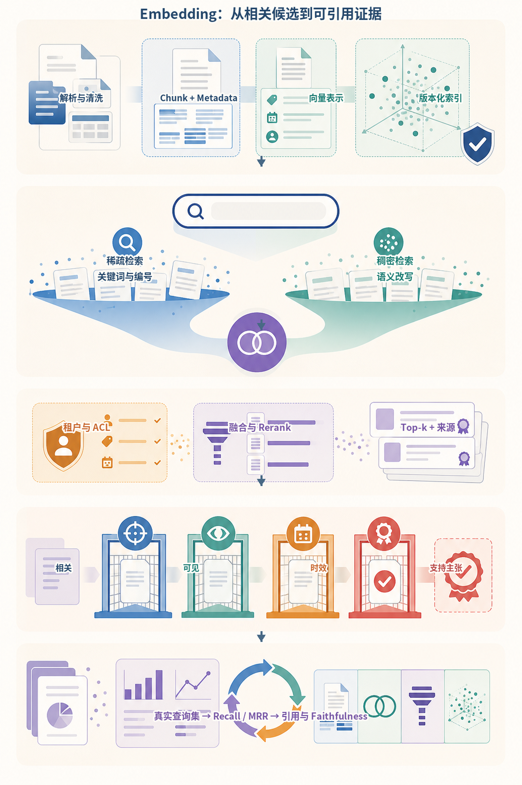
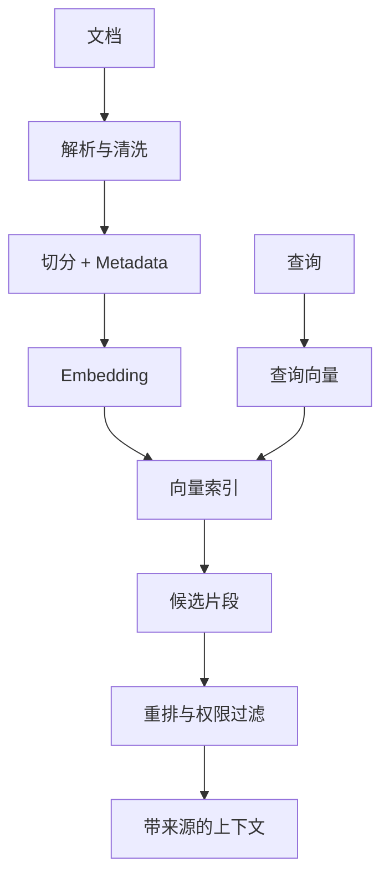
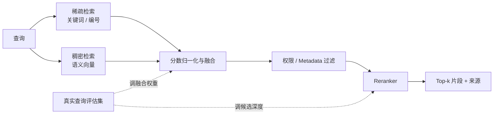
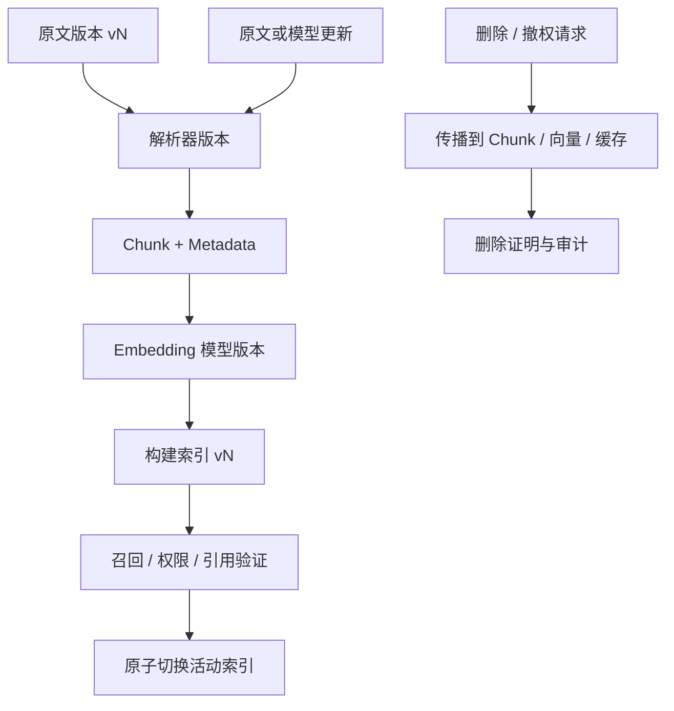
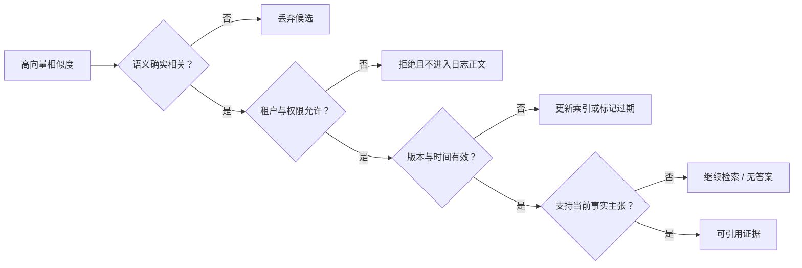
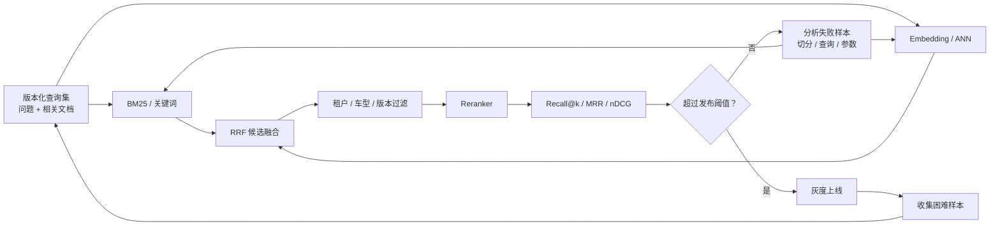
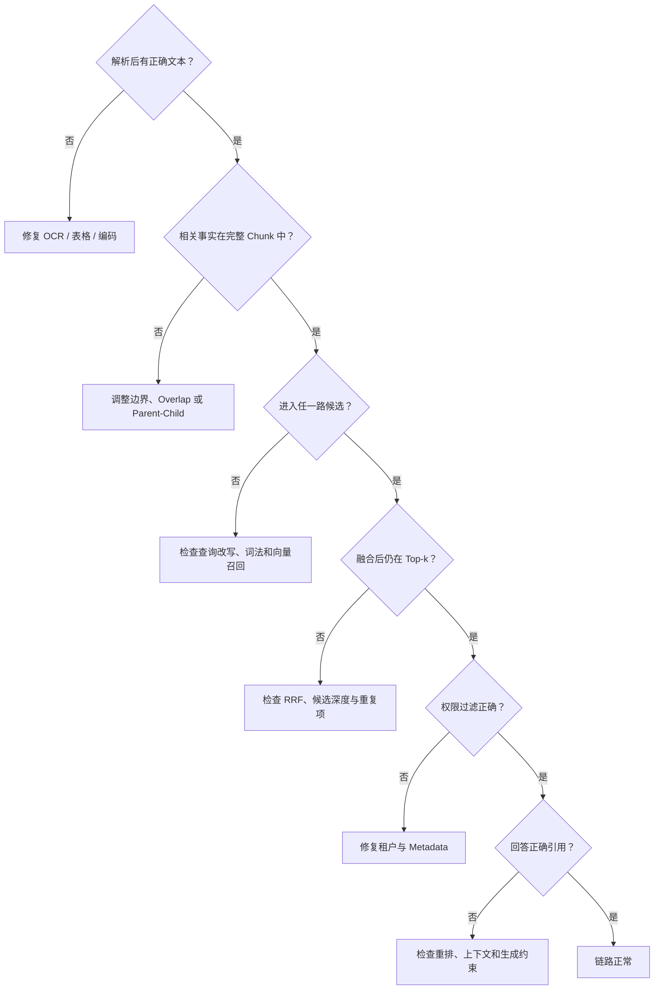

# 第5章：Embedding 与语义表示

最后核对日期：2026-07-10。

## 章节导读与学习目标

Embedding 把文本等对象映射为向量，使系统可以计算相关性并做语义检索。学完后，你应能解释余弦相似度、切分、稀疏/稠密/混合检索的差异，并理解“向量相近”不等于“事实相同”。

前置知识为向量与第2章 Token 概念；核心内容聚焦表示、检索和评估边界。

语义向量、稀疏检索和近似近邻分别有不同理论与工程来源：可对照 [Sentence-BERT](../references.md#ref-reimers2019)、[BM25 综述](../references.md#ref-robertson2009)和 [HNSW](../references.md#ref-malkov2018)。将它们组合成 Hybrid Search 是系统设计，不意味着三者共享同一种相关性假设。

主图把“向量相近”到“可引用证据”之间经常被省略的控制点全部展开。稀疏与稠密检索只负责产生和排序候选；租户权限、版本时效和当前主张的支持关系是相互独立的证据门槛。



*图 5-A：Embedding、混合检索与证据验证。颜色区分阶段，不能把相似度分数直接解释为事实置信度。*

图 5-A 底部的评估回路要求使用真实查询和标注证据。Recall、MRR、引用正确性与 Faithfulness 分别测量不同环节，任何单一指标都不足以证明整个 RAG 回答可靠。

## 表示、距离与检索

Embedding 模型把输入映射到固定维度的数值空间。训练目标使语义或任务上相关的对象在某种度量下更接近。余弦相似度比较向量夹角，弱化长度影响；点积和欧氏距离也常用，但索引与模型必须匹配，不能随意更换度量。

语义搜索流程包括：加载并清洗文档，切分 Chunk，生成向量并写入索引；查询时生成查询向量，检索候选，按需重排，再把文本与来源交给生成模型。切分太小会丢失上下文，太大会混入无关内容并增加成本。标题、章节、时间、权限与租户等 Metadata 常与向量同样重要。



稀疏检索（如 BM25）擅长精确词、编号和罕见术语；稠密检索擅长语义改写；Hybrid Search 组合两者，再用重排模型提高前列质量。混合并非自动更优，融合权重必须在真实查询集上评估。

下图把三类检索信号放入同一候选融合流程，说明混合检索不是把两个分数直接相加就结束。



稀疏支路保留精确标识，稠密支路吸收语义改写；融合与重排参数必须由评估集校准，权限过滤不能交给生成模型补救。

### 切分与模型选择

Chunk 是检索和引用的基本单位。固定字符切分简单，却可能从表格、标题或函数中间断开；递归切分按段落和句子逐级处理；语义切分依据内容变化决定边界；Parent-Child 方案用小块检索、返回包含上下文的大块。Overlap 可缓解边界丢失，却会增加重复召回和索引体积。

Metadata 至少应包含稳定文档 ID、版本、页码或章节、更新时间、权限标签和切分器版本。没有版本字段时，新旧 Chunk 可能出现在同一回答中。Embedding 模型还要考虑语言、领域、许可、维度、部署位置和隐私。更换模型通常要重建索引；即使向量维度相同，不同模型的空间也不可直接混用。

索引不是一次生成后永久不变的文件。下图展示原文、Chunk、Embedding 模型和索引版本共同演进时的更新与删除路径。



每个查询都应能追溯到原文、切分器、Embedding 和索引版本。更换模型后即使维度相同也必须重建，删除则要覆盖缓存和派生向量而不仅是原文件。

## 本地余弦示例

```python
from math import sqrt


def cosine(a: list[float], b: list[float]) -> float:
    dot = sum(x * y for x, y in zip(a, b, strict=True))
    norm_a = sqrt(sum(x * x for x in a))
    norm_b = sqrt(sum(y * y for y in b))
    if norm_a == 0 or norm_b == 0:
        raise ValueError("零向量没有可用的余弦方向")
    return dot / (norm_a * norm_b)
```

完整本地语义搜索还需要明确 Embedding 模型和模型文件；为避免伪造向量，本阶段不提供随机向量冒充语义模型。后续示例会提供可下载模型与 Mock 两条路径。

## 完整检索接口与权限边界

离线测试可以注入人工向量，但必须明确它只是测试替身：

```python
from dataclasses import dataclass


@dataclass(frozen=True)
class Document:
    document_id: str
    text: str
    vector: tuple[float, ...]
    allowed_tenants: frozenset[str]


def search(
    query: tuple[float, ...], documents: list[Document], tenant: str, limit: int
) -> list[Document]:
    if limit <= 0:
        raise ValueError("limit 必须为正数")
    visible = [doc for doc in documents if tenant in doc.allowed_tenants]
    return sorted(
        visible,
        key=lambda doc: cosine(list(query), list(doc.vector)),
        reverse=True,
    )[:limit]
```

权限过滤要进入数据库查询，在候选产生前生效，避免不可见文档进入应用日志。结果必须携带原文位置和版本，生成阶段才能形成可追踪引用。生产接口还要验证向量维度、处理零向量并记录索引版本。

## 检索评估与调试

评估集应包含真实问题、相关文档 ID 和可接受答案。检索层测 Recall@k、MRR 或 nDCG，生成层再测正确性、引用精确性与 Faithfulness。若正确文档没进入候选，应检查解析、切分、查询和索引；进入候选但排名低，检查融合与重排；证据正确但回答错误，才主要调生成阶段。

失败 Trace 应记录脱敏查询、过滤条件、候选 ID、各阶段分数和索引版本。仅保存最终 Prompt 无法区分“没有检索到”和“检索到了但模型没有采用”。

相似度只度量表示空间中的接近程度。下图把相关性、事实支持、权限和时效拆开，防止把一个高分直接当作可回答证据。



相关、可见、及时和支持主张是四个独立条件。Embedding 只帮助第一步排序，其余必须由元数据、权限系统和引用验证承担。

## 最小实验

一个有价值的最小实验不应使用随机向量证明“语义检索有效”。随机数只能验证排序代码，无法代表语言语义。本节采用确定的候选排名，比较稀疏检索、稠密检索和 Reciprocal Rank Fusion（RRF）如何组合结果。RRF 不要求两路分数处于同一量纲，而是根据文档在各列表中的名次累加倒数分数：

```python
from collections import defaultdict


def reciprocal_rank_fusion(
    rankings: list[list[str]], *, constant: int = 60
) -> list[str]:
    if constant < 0:
        raise ValueError("constant 不能为负数")
    scores: dict[str, float] = defaultdict(float)
    for ranking in rankings:
        for rank, document_id in enumerate(ranking, start=1):
            scores[document_id] += 1.0 / (constant + rank)
    return sorted(scores, key=lambda item: (-scores[item], item))


sparse = ["manual-ecu-17", "manual-ecu-3", "faq-reset"]
dense = ["faq-reset", "manual-ecu-17", "guide-diagnostics"]
print(reciprocal_rank_fusion([sparse, dense])[:3])
```

这里的 `constant` 用于减弱排名顶部之间的巨大差异，不是通用最优参数。RRF 的优势是稳定、易解释，并避免直接相加 BM25 分数与余弦分数；局限是它丢弃了原始分数差距。若两个候选在名次上接近但置信程度差异很大，经过校准的加权融合或学习排序可能更合适。

检索质量必须用标注查询评价。Recall@k 表示相关文档中有多少进入前 k 名；MRR（Mean Reciprocal Rank）关注第一个相关结果的位置。下面给出一个不依赖第三方库的实现：

```python
from collections.abc import Iterable


def recall_at_k(
    ranked_ids: list[str], relevant_ids: set[str], *, k: int
) -> float:
    if k <= 0:
        raise ValueError("k 必须为正数")
    if not relevant_ids:
        raise ValueError("评价样本必须至少有一个相关文档")
    hits = relevant_ids.intersection(ranked_ids[:k])
    return len(hits) / len(relevant_ids)


def mean_reciprocal_rank(
    cases: Iterable[tuple[list[str], set[str]]],
) -> float:
    values: list[float] = []
    for ranked_ids, relevant_ids in cases:
        if not relevant_ids:
            raise ValueError("评价样本必须至少有一个相关文档")
        reciprocal = next(
            (
                1.0 / rank
                for rank, document_id in enumerate(ranked_ids, start=1)
                if document_id in relevant_ids
            ),
            0.0,
        )
        values.append(reciprocal)
    if not values:
        raise ValueError("评价集不能为空")
    return sum(values) / len(values)
```

例如，相关集合为两个文档，而前 3 名只命中一个时，Recall@3 为 0.5；若第一个相关文档排在第 2 位，该查询的 reciprocal rank 为 0.5。MRR 很适合“用户通常只需要第一个正确入口”的导航任务，却不会奖励第二个及后续相关结果。需要覆盖多个证据的 RAG 问题还应观察 Recall@k、nDCG 和最终引用覆盖率。

## 工程案例

假设团队为车载故障码手册构建检索服务。用户可能输入精确故障码 `P0301`，也可能询问“第一缸一直失火该怎么查”。前者适合稀疏检索，后者更依赖稠密表示。单独使用任一路径都会留下明显盲区，因此系统先分别召回候选，再进行 RRF、权限过滤和重排。



工程接口应保留每个阶段的排名，不能只返回最终文本。下面的数据结构让调用方能够解释某个文档来自哪一路、为何进入最终候选，并为离线评估提供统一输入：

```python
from dataclasses import dataclass


@dataclass(frozen=True)
class RetrievalTrace:
    query_id: str
    sparse_ids: tuple[str, ...]
    dense_ids: tuple[str, ...]
    fused_ids: tuple[str, ...]
    visible_ids: tuple[str, ...]
    index_version: str


def fuse_visible_candidates(
    *,
    query_id: str,
    sparse_ids: list[str],
    dense_ids: list[str],
    allowed_ids: set[str],
    index_version: str,
    limit: int,
) -> RetrievalTrace:
    if limit <= 0:
        raise ValueError("limit 必须为正数")
    fused = reciprocal_rank_fusion([sparse_ids, dense_ids])
    visible = [document_id for document_id in fused if document_id in allowed_ids]
    return RetrievalTrace(
        query_id=query_id,
        sparse_ids=tuple(sparse_ids),
        dense_ids=tuple(dense_ids),
        fused_ids=tuple(fused),
        visible_ids=tuple(visible[:limit]),
        index_version=index_version,
    )
```

示例把权限过滤放在融合之后是为了展示两路候选，但生产数据库应尽可能把租户、车型和文档状态过滤下推到候选生成阶段，防止无权文档进入应用进程。无论过滤位于哪个物理层，外部可见的 Trace 都不能泄漏不可见文档 ID、标题或分数。

完整对照实验应让三种方案运行同一份查询集，并固定候选深度、索引版本和标注版本。报告至少包含下表，而不是挑选几个成功截图：

| 方案 | Recall@5 | MRR | P95 延迟 | 单查询成本 | 典型优势 | 典型失败 |
|---|---:|---:|---:|---:|---|---|
| 稀疏检索 | 实测 | 实测 | 实测 | 实测 | 编号、专有名词、原文词组 | 同义改写 |
| 稠密检索 | 实测 | 实测 | 实测 | 实测 | 自然语言改写、概念相似 | 精确编号、近义但事实不同 |
| Hybrid + RRF | 实测 | 实测 | 实测 | 实测 | 同时覆盖两类查询 | 候选增加导致延迟和噪声 |
| Hybrid + Reranker | 实测 | 实测 | 实测 | 实测 | 改善前列排序 | 模型成本与领域漂移 |

表中不能预填虚构数字。应由 `query_set_version`、代码提交、模型版本和索引快照共同生成可复现报告。若混合方案只提高极少 Recall，却显著增加 P95 延迟，就不一定值得上线；也可以仅对稀疏和稠密结果分歧较大的查询启用 Reranker。

### 切分实验如何进入评价闭环

切分器改变的不只是 Chunk 长度，还改变标注单位。若旧标注指向页级文档，新索引使用段落 Chunk，应维护 Chunk 到父文档的映射，否则 Recall 变化可能只是 ID 粒度变化。对故障手册，标题、故障码、适用车型和维修步骤最好作为一个结构化单元处理；表格不能简单按换行切散。Parent-Child 策略可用小块命中具体步骤，再返回包含前置条件的大块给生成模型。

更换 Embedding 模型时应建立影子索引，离线回放查询集并对比旧索引。通过后再灰度切换读取流量，保留回滚窗口。不要在同一索引中混写新旧向量；即使维度一致，它们也不处于同一个可比较空间。

## 失败分析与调试

检索失败要先确定发生在哪一层：



若故障码查询失败，应先看稀疏支路是否保留标点和大小写，而不是立即换 Embedding 模型。若语义问题召回了概念相近但车型错误的内容，应检查 Metadata 过滤和标注，不应把“向量距离近”解释为事实正确。若正确文档排在第 20 名而最终只取 5 条，可以增加初检深度或改进融合；若候选根本不存在，则重排器无能为力。

线上发现零结果时还要区分“真正无文档”和“过滤后无权限”。对外响应可以同样拒答，内部指标必须分开，否则团队可能通过放宽权限来错误修复召回。索引更新期间出现新旧版本混合时，应记录查询命中的索引版本，并确保删除与撤权优先于普通增量更新。

安全测试至少覆盖跨租户文档、已撤权文档、恶意 Metadata、可识别个人信息、删除传播和检索内容中的间接指令。向量不可直接还原原文并不等于没有隐私风险；成员推断、相似查询和关联 Metadata 仍可能泄漏敏感信息。

## 选型、误区与安全

模型选择要用领域查询评估召回率、nDCG/MRR、延迟、成本、多语言能力和输入上限。维度更高通常增加存储与计算，但不保证业务效果。Embedding 可能泄露敏感语义，向量库仍需加密、访问控制、删除和租户隔离；检索结果还必须在返回前执行权限过滤，不能只依赖生成模型拒答。

常见误区：相似度 0.9 代表 90% 事实正确；向量数据库自动解决 RAG；把整份 PDF 作为一个 Chunk；只评估最终回答不评估召回；删除原文却保留可关联个人的向量。

## 本章总结

Embedding 提供相关性表示，不提供真值、权限或引用。检索质量需要用真实查询集评估，权限过滤必须在候选进入生成上下文之前执行；更换 Embedding 模型通常需要版本化重建索引，而不是在同一向量空间中混写。下一篇将开始构建 Agent 控制面，先从可版本化的 Prompt 与 Context 契约入手。

## 课后练习

### 设计题

1. 为故障码手册设计父子 Chunk 与 Metadata。输出字段表和两个示例 Chunk；检查标准是故障码、车型、步骤、表头、版本和权限均可追溯。

### 编码题

2. 为向量接口增加维度、零向量、非有限数值和模型版本校验。输入为一组合法/非法向量 Fixture；输出为类型化错误；检查标准是非法输入不会写入索引。

### 故障实验

3. 构造“故障码精确匹配”“同义描述”“只有症状没有故障码”三类查询，比较稀疏、稠密与混合检索排名，并记录至少一个失败案例。

### 概念题

4. 为什么 Reranker 通常位于初检之后？初检漏掉相关文档时，Reranker 能否恢复？
5. 权限过滤应在哪一层执行？设计一个能发现跨租户缓存或重排泄漏的测试。

## 参考答案位置

本章参考答案已移至[书末参考答案](../exercise-answers.md)，便于先独立完成练习再核对。

## 面试问题

1. 为什么 Reranker 通常位于初检之后？
2. 为什么更换 Embedding 模型通常需要重建索引？
3. 权限过滤应该在检索链的哪一层执行？

## 延伸阅读与代码目录

延伸阅读包括 Reimers 与 Gurevych 的 *Sentence-BERT*、Karpukhin 等人的 *Dense Passage Retrieval*，以及目标向量数据库和 Embedding 模型官方文档。本章代码目录为 [`examples/local_semantic_search/`](https://github.com/wujinjun/ai-agent-book/tree/main/examples/local_semantic_search)，提供版本化文档、租户候选过滤、稀疏检索、确定性 Hash 向量、RRF 与固定中英文查询集的 Recall@k/MRR 测试。Hash 向量只验证离线控制流，不替代真实 Embedding 模型评估。

## 本章引用
<!-- chapter-citations:start -->
以下资料用于支撑本章的核心原理、工程边界与版本敏感说明：

- [mikolov2013：Efficient Estimation of Word Representations in Vector Space](../references.md#ref-mikolov2013)
- [reimers2019：Sentence-BERT: Sentence Embeddings using Siamese BERT-Networks](../references.md#ref-reimers2019)
- [johnson2017：Billion-scale Similarity Search with GPUs](../references.md#ref-johnson2017)
- [malkov2018：Efficient and Robust Approximate Nearest Neighbor Search Using HNSW](../references.md#ref-malkov2018)
- [robertson2009：The Probabilistic Relevance Framework: BM25 and Beyond](../references.md#ref-robertson2009)
<!-- chapter-citations:end -->
