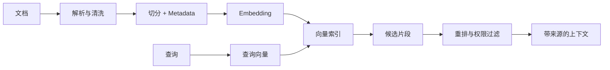
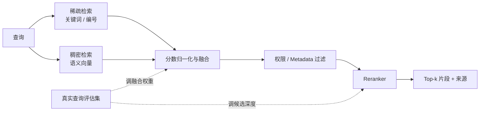
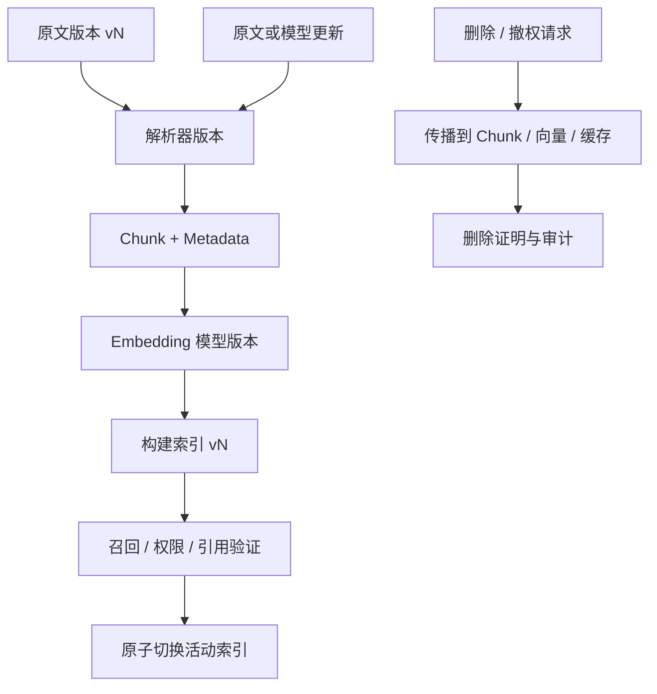
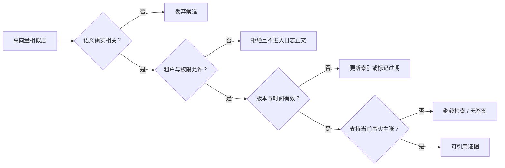

# 第5章：Embedding 与语义表示

最后核对日期：2026-07-10。

## 章节导读与学习目标

Embedding 把文本等对象映射为向量，使系统可以计算相关性并做语义检索。学完后，你应能解释余弦相似度、切分、稀疏/稠密/混合检索的差异，并理解“向量相近”不等于“事实相同”。

前置知识为向量与第2章 Token 概念；核心内容聚焦表示、检索和评估边界。

## 表示、距离与检索

Embedding 模型把输入映射到固定维度的数值空间。训练目标使语义或任务上相关的对象在某种度量下更接近。余弦相似度比较向量夹角，弱化长度影响；点积和欧氏距离也常用，但索引与模型必须匹配，不能随意更换度量。

语义搜索流程包括：加载并清洗文档，切分 Chunk，生成向量并写入索引；查询时生成查询向量，检索候选，按需重排，再把文本与来源交给生成模型。切分太小会丢失上下文，太大会混入无关内容并增加成本。标题、章节、时间、权限与租户等 Metadata 常与向量同样重要。



稀疏检索（如 BM25）擅长精确词、编号和罕见术语；稠密检索擅长语义改写；Hybrid Search 组合两者，再用重排模型提高前列质量。混合并非自动更优，融合权重必须在真实查询集上评估。

下图把三类检索信号放入同一候选融合流程，说明混合检索不是把两个分数直接相加就结束。



稀疏支路保留精确标识，稠密支路吸收语义改写；融合与重排参数必须由评估集校准，权限过滤不能交给生成模型补救。

### 切分与模型选择

Chunk 是检索和引用的基本单位。固定字符切分简单，却可能从表格、标题或函数中间断开；递归切分按段落和句子逐级处理；语义切分依据内容变化决定边界；Parent-Child 方案用小块检索、返回包含上下文的大块。Overlap 可缓解边界丢失，却会增加重复召回和索引体积。

Metadata 至少应包含稳定文档 ID、版本、页码或章节、更新时间、权限标签和切分器版本。没有版本字段时，新旧 Chunk 可能出现在同一回答中。Embedding 模型还要考虑语言、领域、许可、维度、部署位置和隐私。更换模型通常要重建索引；即使向量维度相同，不同模型的空间也不可直接混用。

索引不是一次生成后永久不变的文件。下图展示原文、Chunk、Embedding 模型和索引版本共同演进时的更新与删除路径。



每个查询都应能追溯到原文、切分器、Embedding 和索引版本。更换模型后即使维度相同也必须重建，删除则要覆盖缓存和派生向量而不仅是原文件。

## 本地余弦示例

```python
from math import sqrt


def cosine(a: list[float], b: list[float]) -> float:
    dot = sum(x * y for x, y in zip(a, b, strict=True))
    norm_a = sqrt(sum(x * x for x in a))
    norm_b = sqrt(sum(y * y for y in b))
    if norm_a == 0 or norm_b == 0:
        raise ValueError("零向量没有可用的余弦方向")
    return dot / (norm_a * norm_b)
```

完整本地语义搜索还需要明确 Embedding 模型和模型文件；为避免伪造向量，本阶段不提供随机向量冒充语义模型。后续示例会提供可下载模型与 Mock 两条路径。

## 完整检索接口与权限边界

离线测试可以注入人工向量，但必须明确它只是测试替身：

```python
from dataclasses import dataclass


@dataclass(frozen=True)
class Document:
    document_id: str
    text: str
    vector: tuple[float, ...]
    allowed_tenants: frozenset[str]


def search(
    query: tuple[float, ...], documents: list[Document], tenant: str, limit: int
) -> list[Document]:
    if limit <= 0:
        raise ValueError("limit 必须为正数")
    visible = [doc for doc in documents if tenant in doc.allowed_tenants]
    return sorted(
        visible,
        key=lambda doc: cosine(list(query), list(doc.vector)),
        reverse=True,
    )[:limit]
```

权限过滤要进入数据库查询，在候选产生前生效，避免不可见文档进入应用日志。结果必须携带原文位置和版本，生成阶段才能形成可追踪引用。生产接口还要验证向量维度、处理零向量并记录索引版本。

## 检索评估与调试

评估集应包含真实问题、相关文档 ID 和可接受答案。检索层测 Recall@k、MRR 或 nDCG，生成层再测正确性、引用精确性与 Faithfulness。若正确文档没进入候选，应检查解析、切分、查询和索引；进入候选但排名低，检查融合与重排；证据正确但回答错误，才主要调生成阶段。

失败 Trace 应记录脱敏查询、过滤条件、候选 ID、各阶段分数和索引版本。仅保存最终 Prompt 无法区分“没有检索到”和“检索到了但模型没有采用”。

相似度只度量表示空间中的接近程度。下图把相关性、事实支持、权限和时效拆开，防止把一个高分直接当作可回答证据。



相关、可见、及时和支持主张是四个独立条件。Embedding 只帮助第一步排序，其余必须由元数据、权限系统和引用验证承担。

## 选型、误区与安全

模型选择要用领域查询评估召回率、nDCG/MRR、延迟、成本、多语言能力和输入上限。维度更高通常增加存储与计算，但不保证业务效果。Embedding 可能泄露敏感语义，向量库仍需加密、访问控制、删除和租户隔离；检索结果还必须在返回前执行权限过滤，不能只依赖生成模型拒答。

常见误区：相似度 0.9 代表 90% 事实正确；向量数据库自动解决 RAG；把整份 PDF 作为一个 Chunk；只评估最终回答不评估召回；删除原文却保留可关联个人的向量。

总结：Embedding 提供相关性表示，不提供真值、权限或引用。练习：为故障码手册设计 Chunk 与 Metadata；为测试接口增加维度校验；构造三个“关键词精确但语义不同”的查询，比较稀疏和稠密检索。面试问题：为什么 Reranker 常放在初检之后？为什么更换 Embedding 模型通常要重建索引？权限过滤应在哪一层执行？

延伸阅读：Reimers & Gurevych, *Sentence-BERT*；Karpukhin et al., *Dense Passage Retrieval*；目标向量数据库和 Embedding 模型官方文档。对应代码目录计划为 `examples/local_semantic_search/`。
