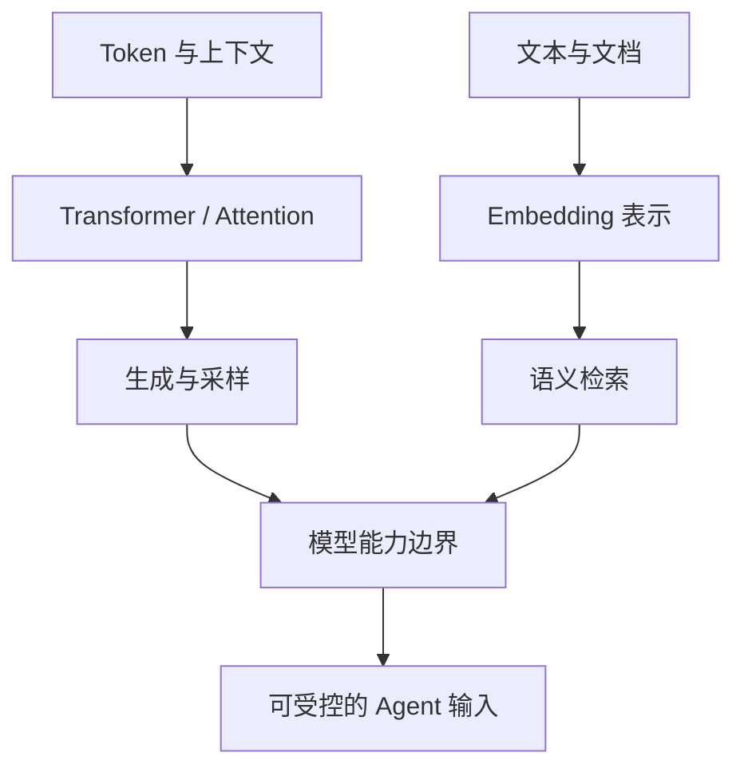

# 第一篇：LLM 与 AI Agent 基础

Agent 工程的起点不是框架，而是理解模型接口提供了什么、没有提供什么。本篇不要求机器学习研究背景，但默认读者能够阅读 Python 代码和常规 API。内容依次讨论 LLM 的训练与生成、Token 和上下文、Transformer、采样机制与 Embedding。读完后，读者应能把“模型回答”“检索结果”“工具动作”和“系统状态”区分开来，并带着这些边界进入第二篇的控制机制。

下图展示五章之间的知识依赖：Token 是输入输出单位，Transformer 处理序列，生成机制选择后续 Token，Embedding 则提供另一条语义表示路径。

图中上支路解释文本生成，下支路解释语义检索；两者最终只提供能力和上下文，状态、工具执行与权限仍由 Agent 运行时负责。

本篇示例优先使用可离线运行的小实验。涉及具体商业模型的窗口、价格和接口时，以章节核对日期与官方资料为准。完成本篇后，读者的直接产出应包括 Token 成本实验、Attention 小实验、采样对照和本地语义搜索；第二篇会把这些模型能力放入 Prompt、Schema 和 Tool Runtime 的确定性边界。
