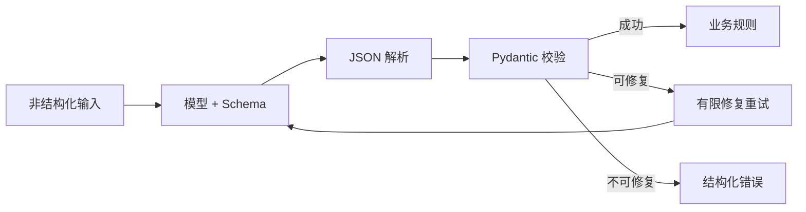
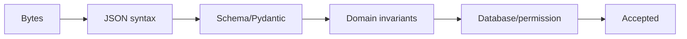
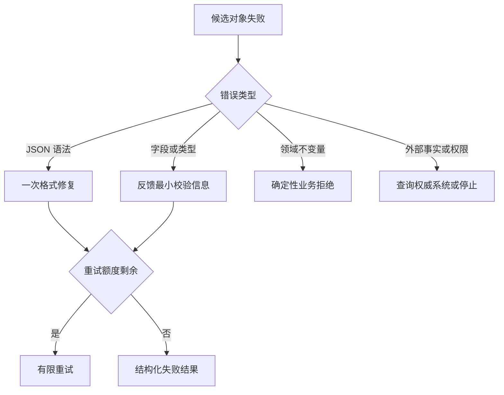
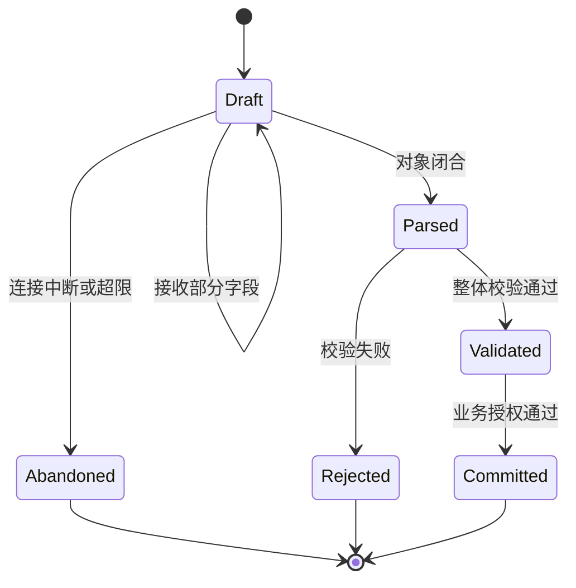

# 第7章：Structured Output

最后核对日期：2026-07-10。

## 章节导读、学习目标与前置知识

自然语言适合人读，不适合作为稳定程序协议。本章学习 JSON Schema、Pydantic 校验、有限重试、部分解析与错误语义。前置知识为 Python 类型注解和第 4、6 章。

## 核心概念与原理

“输出 JSON”只是提示，JSON Schema 才定义字段、类型、枚举和必填约束；Pydantic 在应用侧把外部数据转换为经过验证的对象。结构正确不代表事实正确，字段仍需查库、检索或人工确认。



这条链路把概率生成限制在候选对象阶段：解析器处理语法，Pydantic 处理类型，业务层处理领域约束，只有可修复错误才回到模型。

## 最小示例与完整工程示例

```python
from datetime import date
from pydantic import BaseModel, Field

class Invoice(BaseModel):
    supplier: str = Field(min_length=1)
    amount: float = Field(gt=0)
    currency: str = Field(pattern=r"^[A-Z]{3}$")
    invoice_date: date
```

工程抽取器应保存原文哈希、Schema 版本、模型版本、原始输出、验证错误与最终结果。重试只针对语法或可解释的字段错误，并设置次数上限；金额与币种等业务约束由确定性代码验证。部分解析仅用于界面预览，不能写入正式账务。

## 常见误区、调试方法与工程实践

误区：可解析 JSON 等于合法对象；自动补默认值总是安全；失败就无限重试。调试应区分语法错误、Schema 错误、业务错误和证据缺失，统计各字段失败率。Schema 演进需兼容策略，消费者不得假设新增字段永远存在。

## 安全注意事项

限制字符串长度和集合大小，防止超大输出；拒绝未知字段或明确处理；反序列化后仍需鉴权；不要执行模型生成的代码、路径或 SQL。

## 总结、练习、面试与延伸阅读

### 从语法正确到业务可用

结构化输出至少有四层验证。第一层是字节与 JSON 语法；第二层是 JSON Schema 的字段和类型；第三层是领域约束，例如结束时间不得早于开始时间；第四层是外部事实，例如供应商编号必须存在且属于当前租户。模型原生结构化输出通常加强前两层，Pydantic 可以覆盖第二和部分第三层，第四层仍需要数据库或业务服务。



这一分层决定错误处理。JSON 少一个括号可以尝试一次格式修复；金额为负应把明确的验证错误反馈给模型；客户不存在不能通过“请重新猜一个 ID”修复，而应返回业务拒绝。将所有失败统一成一次模型重试，会增加成本并隐藏真正的数据问题。

不同失败必须进入不同分支，下面的决策图用于确定是否重试，而不是把所有异常重新交给模型。



只有模型有可能根据明确反馈修复的错误才值得重试；权限不足、资源不存在和业务拒绝不是生成问题。



草稿只能用于界面预览，不能触发工具或写入正式数据。只有对象闭合、整体校验与业务授权全部通过后，状态才能进入提交阶段。

### 有限重试与错误契约

调用方需要收到稳定错误，而不是 Pydantic 的整段内部异常。可以把错误映射为 `path`、`code`、`message` 和 `retryable`。重试时只提供必要字段和约束，避免把包含敏感值的完整异常重新送入模型。最大重试次数通常很小，并计入 Agent 总轮数。

```python
from typing import Any
from pydantic import BaseModel, ValidationError


class ExtractionError(BaseModel):
    path: str
    code: str
    message: str
    retryable: bool


def validation_errors(error: ValidationError) -> list[ExtractionError]:
    return [
        ExtractionError(
            path=".".join(str(part) for part in item["loc"]),
            code=item["type"],
            message=item["msg"],
            retryable=item["type"] not in {"extra_forbidden"},
        )
        for item in error.errors(include_input=False)
    ]
```

### 部分解析、流式输出与 Schema 演进

流式界面可能希望尽早显示字段，但未完成对象不能进入正式业务流程。UI 可以维护 `draft` 状态，只有收到完成事件并通过整体校验后才切换为 `validated`。如果连接中断，草稿必须清楚标识不完整；尤其不能执行尚未闭合的工具参数。

Schema 演进要考虑生产者和消费者不同步。新增可选字段通常比重命名字段安全；枚举增加新值也可能破坏把枚举当封闭集合的旧消费者。输出记录应携带 `schema_version`，迁移器负责从旧版本升级，领域代码只处理当前版本。

### 完整信息抽取器的数据流

工程抽取器读取原始文档并生成不可变输入 ID，预处理器保存页码或段落位置，模型返回候选对象，验证器产生字段错误，事实校验器查询权威数据，最后才写入结果表。每个字段可保存证据位置和置信来源。重新处理同一文档时使用输入哈希和 Schema 版本形成幂等键。

测试应覆盖正确对象、非法 JSON、缺字段、超长字段、错误枚举、跨字段冲突、外部 ID 不存在和重试用尽。Mock 模型要返回预设原始字符串，以验证解析器真实处理失败，而不是直接返回已经构造好的 Pydantic 对象。

Structured Output 把概率文本接到类型边界，但不提供真实性。练习：实现发票抽取模型、三类失败测试与有限重试；面试问题：JSON mode 与 JSON Schema 有什么差异？何时允许部分解析？延伸阅读：JSON Schema 规范与 Pydantic 当前文档。

本章代码目录为 [`examples/structured_extractor/`](https://github.com/wujinjun/ai-agent-book/tree/main/examples/structured_extractor)，使用 Pydantic 2.11.7 提供严格 Schema、Provider 端口、确定性 Fake、最多三次的有限修复、敏感输入门禁和不泄漏内部 ValidationError 的稳定公共错误。

## 本章引用
<!-- chapter-citations:start -->
以下资料用于支撑本章的核心原理、工程边界与版本敏感说明：

- [jsonschema2020：JSON Schema Draft 2020-12](../references.md#ref-jsonschema2020)
- [rfc8259：The JavaScript Object Notation Data Interchange Format](../references.md#ref-rfc8259)
- [pydantic-models：Pydantic Models](../references.md#ref-pydantic-models)
<!-- chapter-citations:end -->
