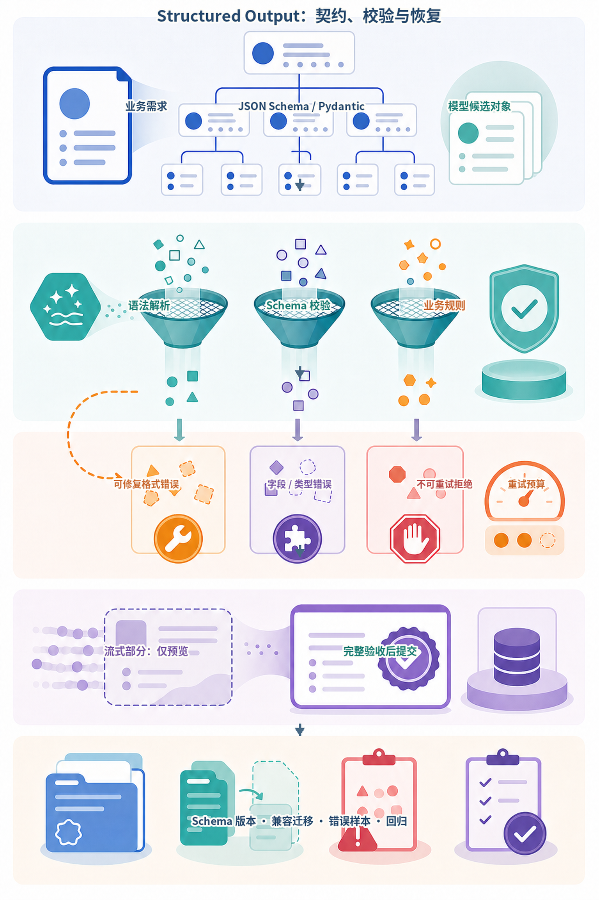
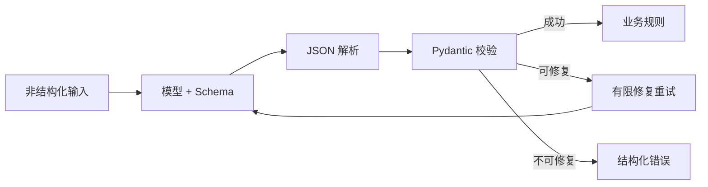
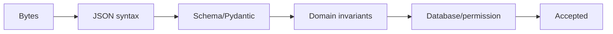
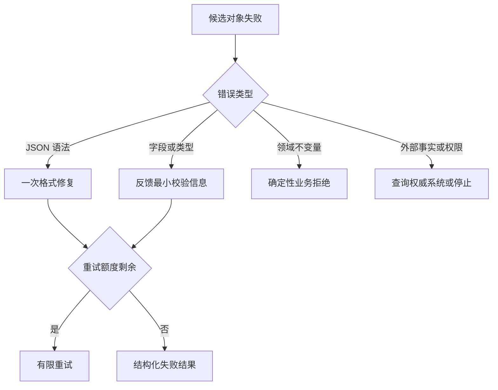
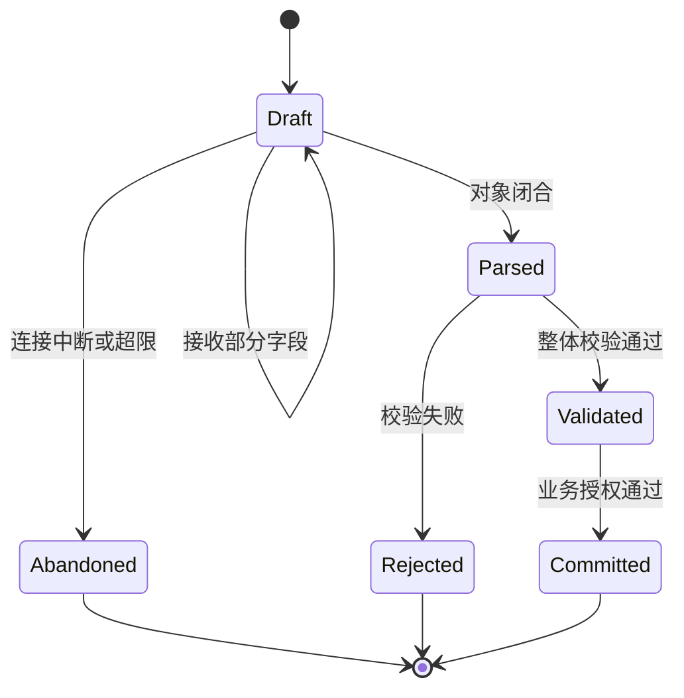

# 第7章：Structured Output

最后核对日期：2026-07-10。

## 章节导读、学习目标与前置知识

自然语言适合人读，不适合作为稳定程序协议。本章学习 JSON Schema、Pydantic 校验、有限重试、部分解析与错误语义。前置知识为 Python 类型注解和第 4、6 章。

结构化输出的价值不只是“让模型返回 JSON”，而是建立从业务契约到可靠消费的验证流水线。主图依次展示 Schema 建模、三层校验、错误分类、有限重试、流式预览与最终提交。



*图 7-A：Structured Output 的契约、校验与恢复流水线。部分流式对象只能用于界面预览，不能在未完成验证时触发业务副作用。*

图 7-A 底部强调 Schema 也需要版本治理。字段新增、语义变化和下游兼容性必须通过迁移与回归测试验证，不能把所有解析失败都交给模型无限重试。

## 核心概念与原理

“输出 JSON”只是提示，JSON Schema 才定义字段、类型、枚举和必填约束；Pydantic 在应用侧把外部数据转换为经过验证的对象。结构正确不代表事实正确，字段仍需查库、检索或人工确认。



这条链路把概率生成限制在候选对象阶段：解析器处理语法，Pydantic 处理类型，业务层处理领域约束，只有可修复错误才回到模型。

## 最小示例与完整工程示例

```python
from datetime import date
from pydantic import BaseModel, Field

class Invoice(BaseModel):
    supplier: str = Field(min_length=1)
    amount: float = Field(gt=0)
    currency: str = Field(pattern=r"^[A-Z]{3}$")
    invoice_date: date
```

工程抽取器应保存原文哈希、Schema 版本、模型版本、原始输出、验证错误与最终结果。重试只针对语法或可解释的字段错误，并设置次数上限；金额与币种等业务约束由确定性代码验证。部分解析仅用于界面预览，不能写入正式账务。

### 从字段模型到可提交事务

生产实现不能把 `model_validate()` 成功直接等同于业务提交。更稳妥的做法是把一次抽取拆成三个对象：`Candidate` 保存模型候选，`Validated` 表示结构与领域不变量已通过，`Committed` 才表示主体权限、外部事实和幂等写入全部成功。三个阶段即使拥有相同字段，也应具有不同类型或状态，防止未验收对象绕过流程。

以事故抽取为例，`severity="high"` 属于 Schema 允许值，但模型可能误判事故等级；`affected_service="payment"` 也可能是一个合法字符串，却未必存在于当前租户的服务目录。Pydantic 能拒绝未知枚举、空字符串和多余字段，却无法从类型本身推导事实。工程代码应在结构校验之后查询权威目录，并把“资源不存在”映射为不可由模型猜测修复的业务错误。

```python
from dataclasses import dataclass


@dataclass(frozen=True, slots=True)
class AcceptedIncident:
    incident: Incident
    tenant_id: str
    source_hash: str
    schema_version: str


def accept_incident(
    incident: Incident,
    *,
    tenant_id: str,
    known_services: set[str],
    source_hash: str,
) -> AcceptedIncident:
    if incident.affected_service not in known_services:
        raise LookupError("unknown_service")
    return AcceptedIncident(
        incident=incident,
        tenant_id=tenant_id,
        source_hash=source_hash,
        schema_version="incident.v1",
    )
```

这里故意没有在服务不存在时要求模型“再猜一个”。权威目录缺少记录可能意味着输入错误、数据未同步或调用者无权查看，继续生成只会把业务拒绝伪装成格式修复。

### 与离线示例逐步对照

[`examples/structured_extractor/`](https://github.com/wujinjun/ai-agent-book/tree/main/examples/structured_extractor) 把 Provider 定义成只返回候选字典的端口。`Incident` 使用 `strict=True` 和 `extra="forbid"`：数字不会被悄悄转成严重等级，多余字段也不会被默默丢弃。`Extractor` 先执行教学级敏感模式门禁，然后在 `max_repairs + 1` 次总尝试内调用 Provider；每次只把稳定错误类别传回，而不泄漏原始输入和值。

这种实现有意暴露两个边界。第一，当前 Fixture Provider 直接返回字典，尚未演示供应商字符串到 JSON 的解析层；在线 Adapter 应独立处理空响应、截断、非法 UTF-8、JSON 语法错误和 HTTP 超时。第二，示例只校验结构，没有查询服务目录，因此输出仍是“结构上可用的候选事故”，不是经过企业事实核验的正式记录。教材用这两个缺口提醒读者：端口测试通过不等于整条生产链路完成。

### 错误分类与可观测字段

错误应按处理责任分类，而不是都叫 `validation_failed`。

| 分类 | 示例 | 是否交给模型重试 | 负责层 | 建议观测字段 |
|---|---|---:|---|---|
| 传输错误 | 超时、限流、连接断开 | 否，由客户端有限退避 | Provider Adapter | provider、status、attempt |
| 语法错误 | JSON 未闭合、非法转义 | 可尝试一次确定性修复或模型修复 | Parser | finish_reason、byte_length |
| Schema 错误 | 缺字段、类型或枚举错误 | 可在小预算内重试 | Validator | schema_version、path、code |
| 领域冲突 | 结束早于开始、金额为负 | 通常拒绝；必要时要求用户补充 | Domain | invariant、source_id |
| 外部事实 | ID 不存在、版本过期 | 不允许模型猜测 | Repository/Service | tenant、resource_version |
| 授权拒绝 | 主体无权访问对象 | 绝不重试绕过 | Policy | principal、object、decision |

Trace 默认记录错误代码、字段路径、Schema 与模型版本，不记录完整原文或敏感字段值。若需要保存原始候选用于受控诊断，应加密、限制保留时间、按租户授权并产生访问审计。

### Schema 演进的兼容矩阵

Schema 版本不是装饰字段。生产者升级前要判断旧消费者是否仍能处理新对象：新增可选字段通常向后兼容；新增必填字段会破坏旧数据重放；字段重命名同时破坏读写双方；枚举新增值对“穷尽匹配”的消费者也可能不兼容。推荐采用并行读、单版本写的迁移过程：先让消费者同时读取 v1/v2，再切换生产者写 v2，完成历史迁移与观测后才停止 v1。

```text
读取 v1 + v2 → 写入 v1 → 写入 v2 → 回填历史 → 停止 v1
       兼容观察期      切换点        可回滚窗口
```

幂等键至少包含输入哈希、Schema 版本和抽取策略版本。同一文档用新 Schema 重跑应生成新结果版本，而不是错误命中旧缓存；同一版本的网络重试则应复用同一幂等键，避免重复提交。

## 常见误区、调试方法与工程实践

误区：可解析 JSON 等于合法对象；自动补默认值总是安全；失败就无限重试。调试应区分语法错误、Schema 错误、业务错误和证据缺失，统计各字段失败率。Schema 演进需兼容策略，消费者不得假设新增字段永远存在。

## 安全注意事项

限制字符串长度和集合大小，防止超大输出；拒绝未知字段或明确处理；反序列化后仍需鉴权；不要执行模型生成的代码、路径或 SQL。

## 总结、练习、面试与延伸阅读

### 从语法正确到业务可用

结构化输出至少有四层验证。第一层是字节与 JSON 语法；第二层是 JSON Schema 的字段和类型；第三层是领域约束，例如结束时间不得早于开始时间；第四层是外部事实，例如供应商编号必须存在且属于当前租户。模型原生结构化输出通常加强前两层，Pydantic 可以覆盖第二和部分第三层，第四层仍需要数据库或业务服务。



这一分层决定错误处理。JSON 少一个括号可以尝试一次格式修复；金额为负应把明确的验证错误反馈给模型；客户不存在不能通过“请重新猜一个 ID”修复，而应返回业务拒绝。将所有失败统一成一次模型重试，会增加成本并隐藏真正的数据问题。

不同失败必须进入不同分支，下面的决策图用于确定是否重试，而不是把所有异常重新交给模型。



只有模型有可能根据明确反馈修复的错误才值得重试；权限不足、资源不存在和业务拒绝不是生成问题。



草稿只能用于界面预览，不能触发工具或写入正式数据。只有对象闭合、整体校验与业务授权全部通过后，状态才能进入提交阶段。

### 有限重试与错误契约

调用方需要收到稳定错误，而不是 Pydantic 的整段内部异常。可以把错误映射为 `path`、`code`、`message` 和 `retryable`。重试时只提供必要字段和约束，避免把包含敏感值的完整异常重新送入模型。最大重试次数通常很小，并计入 Agent 总轮数。

```python
from typing import Any
from pydantic import BaseModel, ValidationError


class ExtractionError(BaseModel):
    path: str
    code: str
    message: str
    retryable: bool


def validation_errors(error: ValidationError) -> list[ExtractionError]:
    return [
        ExtractionError(
            path=".".join(str(part) for part in item["loc"]),
            code=item["type"],
            message=item["msg"],
            retryable=item["type"] not in {"extra_forbidden"},
        )
        for item in error.errors(include_input=False)
    ]
```

### 部分解析、流式输出与 Schema 演进

流式界面可能希望尽早显示字段，但未完成对象不能进入正式业务流程。UI 可以维护 `draft` 状态，只有收到完成事件并通过整体校验后才切换为 `validated`。如果连接中断，草稿必须清楚标识不完整；尤其不能执行尚未闭合的工具参数。

Schema 演进要考虑生产者和消费者不同步。新增可选字段通常比重命名字段安全；枚举增加新值也可能破坏把枚举当封闭集合的旧消费者。输出记录应携带 `schema_version`，迁移器负责从旧版本升级，领域代码只处理当前版本。

### 完整信息抽取器的数据流

工程抽取器读取原始文档并生成不可变输入 ID，预处理器保存页码或段落位置，模型返回候选对象，验证器产生字段错误，事实校验器查询权威数据，最后才写入结果表。每个字段可保存证据位置和置信来源。重新处理同一文档时使用输入哈希和 Schema 版本形成幂等键。

测试应覆盖正确对象、非法 JSON、缺字段、超长字段、错误枚举、跨字段冲突、外部 ID 不存在和重试用尽。Mock 模型要返回预设原始字符串，以验证解析器真实处理失败，而不是直接返回已经构造好的 Pydantic 对象。

Structured Output 把概率文本接到类型边界，但不提供真实性。练习：实现发票抽取模型、三类失败测试与有限重试；面试问题：JSON mode 与 JSON Schema 有什么差异？何时允许部分解析？延伸阅读：JSON Schema 规范与 Pydantic 当前文档。

### 练习参考答案

1. **发票抽取模型。** 使用 `ConfigDict(strict=True, extra="forbid")`；金额用十进制定点类型而非二进制浮点；币种使用受控枚举；发票日期与到期日由模型字段表达，`due_date >= invoice_date` 由领域校验器表达。供应商 ID 必须查询当前租户的供应商目录。
2. **三类失败测试。** 语法层输入缺少闭合括号，断言 Parser 返回可修复错误；Schema 层输入缺字段或错误枚举，断言最多调用 Provider 两次；业务层使用不存在的供应商 ID，断言不再次调用模型并返回稳定的 `unknown_supplier`。
3. **部分解析。** UI 可显示带 `draft` 标记的字段，但不得写入账务、调用支付 Tool 或生成审批令牌。连接完成后必须重新解析完整对象并执行整体校验，不能把多个字段级“局部通过”拼成正式对象。
4. **面试题：JSON mode 与 JSON Schema。** JSON mode 主要提高语法上可解析 JSON 的概率；Schema 还约束字段、类型、枚举和必填项。两者都不能证明事实正确、调用者有权访问，或外部资源仍处于同一版本。

本章代码目录为 [`examples/structured_extractor/`](https://github.com/wujinjun/ai-agent-book/tree/main/examples/structured_extractor)，使用 Pydantic 2.11.7 提供严格 Schema、Provider 端口、确定性 Fake、最多三次的有限修复、敏感输入门禁和不泄漏内部 ValidationError 的稳定公共错误。

## 本章引用
<!-- chapter-citations:start -->
以下资料用于支撑本章的核心原理、工程边界与版本敏感说明：

- [jsonschema2020：JSON Schema Draft 2020-12](../references.md#ref-jsonschema2020)
- [rfc8259：The JavaScript Object Notation Data Interchange Format](../references.md#ref-rfc8259)
- [pydantic-models：Pydantic Models](../references.md#ref-pydantic-models)
<!-- chapter-citations:end -->
