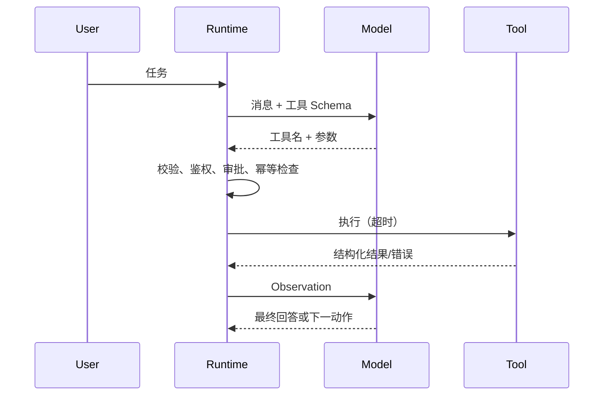
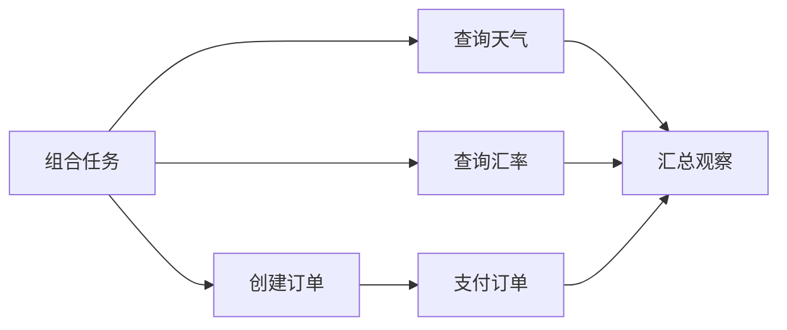
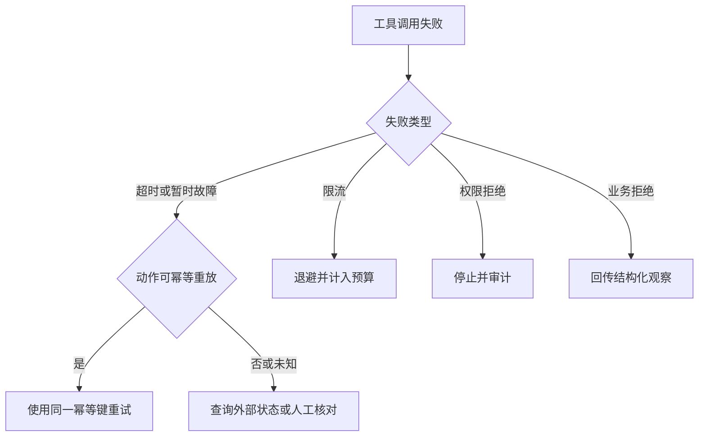
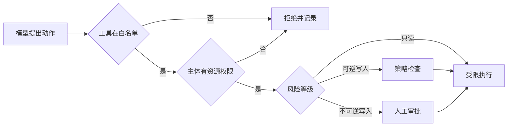
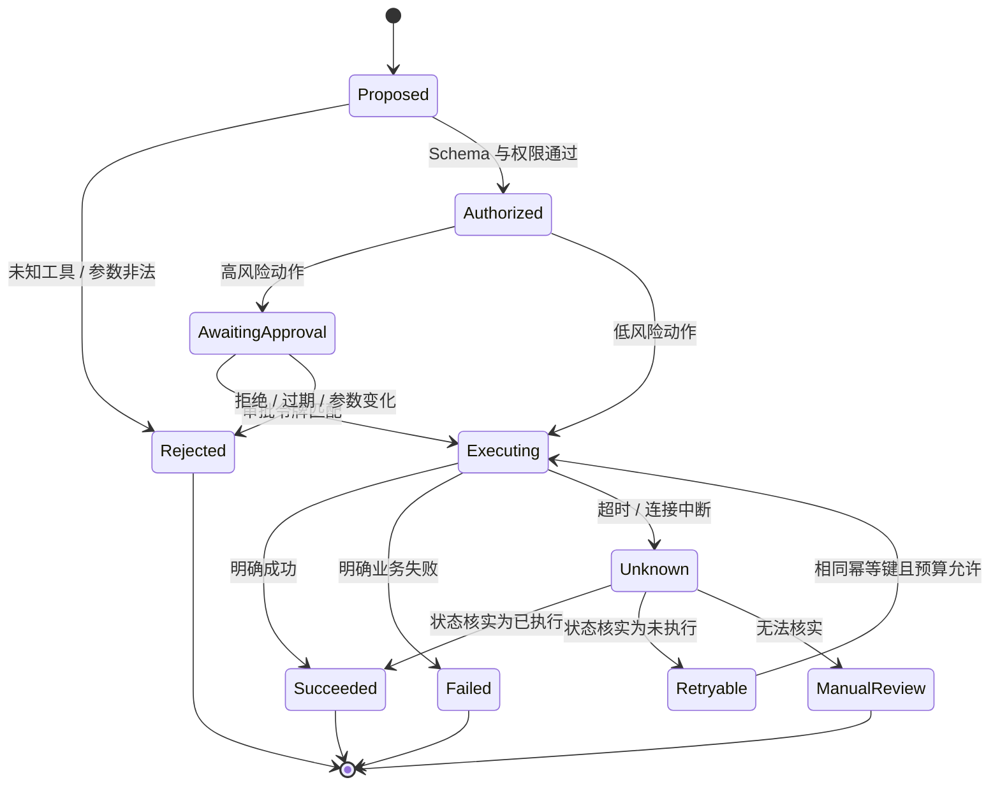
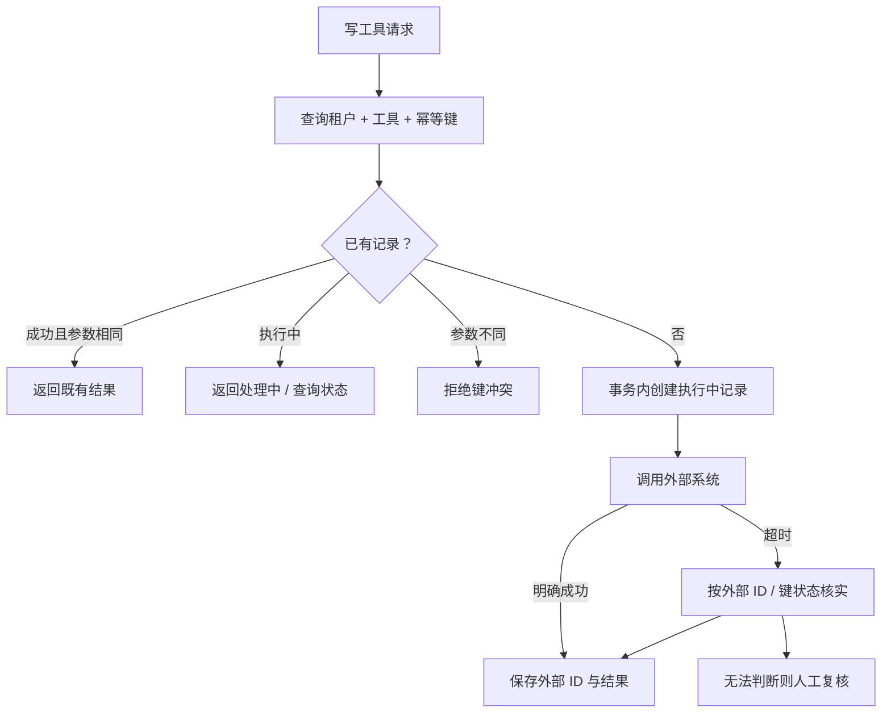

# 第8章：Function Calling 与 Tool Calling

最后核对日期：2026-07-10。

## 章节导读、学习目标与前置知识

Tool Calling 让模型生成结构化动作意图，真正的函数由宿主程序执行。本章覆盖 Schema、循环、多工具、并行、超时、幂等、权限和人工确认。前置知识为第 6—7 章与 async/await。

## 核心概念、原理与流程图

一次工具调用横跨模型提议和宿主程序执行两个世界。下图突出运行时在两者之间承担的校验、授权、超时和观察回传职责。



模型不执行函数。运行时必须拒绝未知工具、校验参数、限制步数和预算。并行只适合互不依赖且无共享副作用的调用；写操作通常需要幂等键和明确顺序。重试边界位于可判定的暂时故障，权限错误和业务拒绝不应重试。

工具循环之后还需要三个确定性控制面：依赖分析、故障分类和权限审批。下面的图把这些控制点独立出来。



并发依据是数据依赖和副作用，而不是模型是否一次返回多个调用。共享写入、顺序依赖和非幂等动作必须串行。



超时不等于动作没有发生。写工具只有在幂等键或状态核对机制存在时才可自动重试，否则可能产生重复副作用。



工具选择只是动作建议，不构成授权。鉴权必须绑定调用主体和具体资源，高风险写入还需展示参数摘要供人工确认。

## 最小实验

本书的 `src/ai_agent_book/tool_runtime.py` 已实现注册表、Pydantic 参数校验、异步超时、观察回传和最大步数。工程版还应加入调用 ID、结构化日志、指标、取消、租户权限、审批状态和结果大小限制。高风险工具分为只读、可逆写入、不可逆写入三级，后两级要求显式策略。

这个最小示例只保留一次加法调用，目的是把模型决策与工具执行的边界显示清楚；它不是生产级权限系统。

下面的离线实验使用一个假的决策函数证明 Tool Loop 的关键性质：模型只提出动作，宿主程序执行；Observation 必须回传后，模型才能形成最终答案。

```python
import asyncio
from typing import Any

from pydantic import BaseModel, Field

from ai_agent_book.tool_runtime import (
    AgentStep,
    ToolDefinition,
    ToolRegistry,
    run_tool_loop,
)


class AddArgs(BaseModel):
    left: int = Field(ge=0)
    right: int = Field(ge=0)


async def add(args: AddArgs) -> dict[str, int]:
    return {"value": args.left + args.right}


async def main() -> None:
    registry = ToolRegistry()
    registry.register(
        ToolDefinition(name="add", args_model=AddArgs, handler=add)
    )

    async def decide(history: list[dict[str, Any]]) -> AgentStep:
        if not history:
            return AgentStep.tool_call("add", {"left": 20, "right": 22})
        value = history[-1]["result"]["value"]
        return AgentStep.final(f"工具返回 {value}")

    print(await run_tool_loop(decide, registry, max_steps=3))


asyncio.run(main())
```

预期输出为 `工具返回 42`。把 `add` 改成未注册的名称会得到“未知工具”错误；让处理函数休眠超过 `timeout_seconds` 会得到可分类的超时；让决策函数始终调用工具则在最大步数耗尽后终止。这三个失败注入比只展示一次成功调用更能说明运行时边界。

## 工程案例

以“给指定客户发送退款确认邮件”为例。它看似只是一个邮件工具，实际包含读取订单、核对退款状态、生成预览、获得人工审批和发送邮件等多个步骤。发送动作不可仅因客户端超时而自动重试，否则用户可能收到重复邮件。



这张图中的 `Unknown` 是生产系统必须承认的状态。网络超时只说明调用方没有在期限内收到确认，不说明外部系统没有产生副作用。运行时应调用供应商的状态查询接口，或通过 outbox、幂等键和回执表核实；若无法判断，则进入人工复核，不得把状态伪装成“失败”。

审批也必须绑定具体动作。以下代码用参数哈希说明绑定关系；真实系统还应使用服务端签名、审批人身份和不可篡改审计记录。

```python
import hashlib
import json
from dataclasses import dataclass
from datetime import UTC, datetime
from typing import Any


def action_digest(tool_name: str, arguments: dict[str, Any]) -> str:
    canonical = json.dumps(
        {"tool": tool_name, "arguments": arguments},
        ensure_ascii=False,
        sort_keys=True,
        separators=(",", ":"),
    )
    return hashlib.sha256(canonical.encode("utf-8")).hexdigest()


@dataclass(frozen=True)
class Approval:
    subject: str
    action_hash: str
    expires_at: datetime


def verify_approval(
    approval: Approval,
    *,
    subject: str,
    tool_name: str,
    arguments: dict[str, Any],
    now: datetime,
) -> None:
    if approval.subject != subject:
        raise PermissionError("审批主体不匹配")
    if now >= approval.expires_at:
        raise PermissionError("审批已经过期")
    if approval.action_hash != action_digest(tool_name, arguments):
        raise PermissionError("工具参数变化，必须重新审批")
```

Python 3.12 中可使用 `datetime.now(UTC)` 生成带时区时间。审批 UI 应展示收件人、模板、订单号、数据来源和不可逆影响；用户批准“发送给 A”后，模型把收件人改为 B，参数哈希就会变化，旧令牌必须失效。

### 幂等记录与重试归属

幂等键由业务动作的发起方生成，并在所有重试中保持不变。存储记录至少包含租户、工具名、幂等键、参数哈希、状态、外部操作 ID、结果摘要和更新时间。同一个键配上不同参数必须拒绝，而不是返回旧结果。并发收到相同键时，需要唯一约束或事务锁保证只有一个执行者穿过门禁。



HTTP 客户端可以重试连接建立失败或明确的 429/503，但工具运行时必须拥有最终重试预算，避免 SDK、网关和任务队列各自重试三次形成放大效应。非幂等写入在状态未知时不能自动重放。读取工具也应设置最大返回大小，防止一个正常调用把整个数据库结果塞回上下文。

### 多工具调用的调度规则

模型一次提出多个工具，并不自动意味着可以并行。注册表应给每个工具声明只读性、资源键、并行安全和副作用类别。若两个动作写同一个 `order_id`，调度器应串行；若后一个动作参数引用前一个结果，则必须建立依赖边。无法证明独立时采用串行是合理默认值。

对于并行只读查询，使用 `asyncio.TaskGroup` 时仍需决定单个失败是否取消其他任务、如何保留部分结果以及总截止时间。不要无限等待最慢工具；运行时可返回成功观察与失败观察的结构化集合，让模型在规则允许时回答部分结果。错误正文需脱敏，内部堆栈不应进入模型上下文。

## 失败分析与调试

Tool Calling 的 Trace 要把“提议”“批准”和“实际副作用”分开。若只记录模型输出，无法证明邮件是否真的发送；若只记录 HTTP 200，也无法证明模型最终是否使用了正确结果。

| 故障 | 自动重试？ | 回传给模型 | 运行时动作 |
|---|---|---|---|
| 未知工具 | 否 | 稳定错误码与可用工具提示 | 计入无效步骤，重复则终止 |
| 参数校验失败 | 最多允许模型修正一次 | 字段级安全错误 | 保留原提议与修正关联 |
| 权限或审批拒绝 | 否 | “动作未获授权” | 审计主体、资源和策略版本 |
| 业务规则拒绝 | 否 | 可公开的业务原因 | 不改变参数重复调用 |
| 429/503 | 有界退避 | 通常只回传最终状态 | 消耗统一重试预算 |
| 只读调用超时 | 视幂等性有界重试 | 超时观察 | 传播取消并记录耗时 |
| 写调用超时 | 先状态核实 | “状态核实中/未知” | 禁止盲目重放 |
| 结果过大 | 否 | 截断摘要与结果引用 | 原结果放受控存储 |

调试顺序应是：确认模型收到的工具 Schema；查看模型原始工具提议；检查 Pydantic 校验；检查主体、资源和策略决定；核对审批令牌与参数哈希；查看实际外部请求 ID；最后确认 Observation 是否按正确调用 ID 回传。多个并行调用尤其要通过 `call_id` 对齐，不能按完成顺序猜测对应关系。

最大步数只是最后一道保险。更精细的停止条件还包括相同工具与参数重复、连续无进展、总 Token 或金额预算耗尽、用户取消、截止时间到达和高风险策略拒绝。终止时返回明确状态与已完成副作用，不要生成一个看似完整但掩盖部分失败的自然语言答案。

安全测试应包含路径穿越、SSRF、任意 SQL、Shell 注入、跨租户资源 ID、审批重放、日志泄密和工具结果中的间接 Prompt Injection。工具输出是外部数据，不应因为来自“工具”就提升为系统指令。

## 常见误区、调试与工程实践

误区：工具描述越多越好；模型选择了工具就代表有权执行；所有错误都回传给模型。调试要查看“模型提议—校验结果—工具请求—工具响应—最终采用”完整 Trace。工具描述应明确适用与不适用场景，避免多个工具语义重叠。

## 安全注意事项

工具凭证只存在执行环境；文件、SQL、Shell 和网络目标使用 allowlist；敏感写操作人工确认；结果脱敏；审计日志记录主体、动作、参数摘要和结果。

## 总结、练习、面试与延伸阅读

### 工具定义与选择设计

工具名、描述和参数 Schema 共同构成模型可见的 API。描述应写清“何时使用”“何时不要使用”和结果语义。两个工具若都叫“查询客户信息”，但一个读取 CRM、一个读取账务系统，模型很难稳定选择；应按业务事实源命名，并由 Router 在进入模型前缩小候选工具集合。一次暴露几百个工具不仅占用上下文，也会增加误选面。

参数 Schema 应尽量使用枚举、范围和结构化对象，不让模型拼接 SQL、Shell 或任意 URL。时间字段指定时区与格式，金额指定币种，资源字段使用稳定 ID 而不是自由文本名称。Schema 校验通过只表示结构合法，运行时仍要验证资源存在与调用者权限。

### 并行、依赖与幂等

天气与汇率两个只读查询可以并行，因为它们互不依赖；“创建订单”和“支付订单”必须串行，因为后者依赖订单 ID。多个调用会写入同一文档时，即使参数独立也可能发生版本冲突。并行计划必须由运行时根据工具元数据校验，不能仅凭模型同时返回多个调用就直接并发。

写工具接收调用方生成的幂等键。运行时先查询该键是否已有成功结果；超时后重试也使用同一个键。幂等不等于所有动作可重放：发送两封相同邮件仍可能产生两次外部效果，因此邮件提供方或本地 outbox 必须共同支持去重。

```python
from dataclasses import dataclass
from typing import Literal


@dataclass(frozen=True)
class ToolPolicy:
    risk: Literal["read", "reversible_write", "irreversible_write"]
    parallel_safe: bool
    requires_approval: bool
    timeout_seconds: float
```

### 错误分类与重试边界

工具错误可分为参数错误、认证/授权错误、业务拒绝、上游限流、暂时网络故障、超时和未知内部错误。参数错误可以反馈模型一次；授权错误立即终止并审计；业务拒绝作为事实反馈模型，但不重试相同动作；限流和网络故障在预算内退避重试；未知错误返回通用信息，内部细节只进受保护日志。

超时尤其容易误判。客户端超时并不证明服务器没有完成写操作。写工具必须查询操作状态或使用幂等键，而不是立刻重新发起。取消也需要传播到工具；无法取消的操作应在 UI 中显示“状态未知，正在核实”，不能显示失败后允许用户重复提交。

### 人工确认的正确位置

确认页面展示具体动作、目标、不可逆影响和数据来源，例如“将向 35 位收件人发送标题为……的邮件”，而不是笼统询问“是否继续”。批准令牌绑定工具名、参数哈希、主体和过期时间；模型修改参数后原批准失效。审批人不能通过自然语言消息伪造令牌。

测试除成功路径外，还要覆盖未知工具、额外字段、权限不足、审批过期、超时后状态核实、重试上限、重复幂等键和大结果截断。Trace 要能回答模型提议了什么、Policy 为什么允许、工具实际执行了什么和结果如何被使用。

Tool Calling 的可靠性来自模型外的执行边界。练习：为现有运行时增加幂等写工具和审批测试；面试问题：并行工具调用何时不安全？为什么把异常全文交给模型可能泄密？延伸阅读：目标供应商当前 Tool Calling 官方文档。

本章对应代码目录：`examples/tool_runtime/`。

运行任何真实工具前，都应先用离线 Fake 和失败注入证明上述边界能够生效。

## 练习参考答案

1. 为现有运行时增加幂等写工具时，先建立唯一键 `(tenant_id, tool_name, idempotency_key)`，再保存参数哈希与状态。测试两次相同请求只执行一次、相同键不同参数被拒绝、并发竞争只有一个执行者、超时后先核实状态，以及失败记录是否允许在明确未执行时重试。
2. 天气和汇率可并行，因为它们通常只读且互不依赖；创建订单与支付订单必须串行。两个看似只读的调用若共享严格限额或锁，也可能不适合无限并行，因此并发安全应来自工具元数据与容量策略，而不是名称。
3. 把异常全文交给模型可能泄漏 API Key、数据库地址、内部路径、SQL 和用户数据。外部 Observation 应使用稳定错误码与经过筛选的说明，完整堆栈只进入受权限保护且脱敏的日志。
4. 人工审批必须绑定主体、工具、规范化参数哈希、策略版本和过期时间。审批后任何参数变化都要重新确认；自然语言中的“我批准”不能替代服务端签名令牌。
5. 对 Tool Loop 的验收至少覆盖成功、未知工具、参数非法、超时、审批拒绝、审批过期、重复幂等键、状态未知、连续无进展和最大步数。测试应使用 Fake 外部系统，并断言真实处理函数的调用次数，而不只断言最终文本。

## 本章引用
<!-- chapter-citations:start -->
以下资料用于支撑本章的核心原理、工程边界与版本敏感说明：

- [yao2022：ReAct: Synergizing Reasoning and Acting in Language Models](../references.md#ref-yao2022)
- [schick2023：Toolformer: Language Models Can Teach Themselves to Use Tools](../references.md#ref-schick2023)
- [patil2023gorilla：Gorilla: Large Language Model Connected with Massive APIs](../references.md#ref-patil2023gorilla)
- [qin2023toolllm：ToolLLM: Facilitating Large Language Models to Master 16000+ APIs](../references.md#ref-qin2023toolllm)
- [jsonschema2020：JSON Schema Draft 2020-12](../references.md#ref-jsonschema2020)
<!-- chapter-citations:end -->
