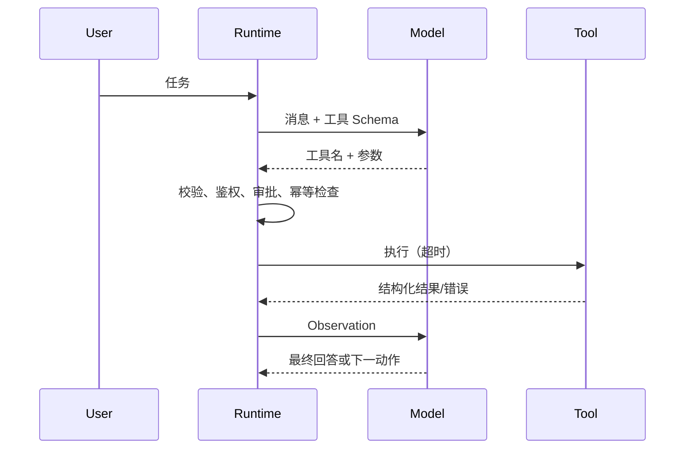

# 第8章：Function Calling 与 Tool Calling

最后核对日期：2026-07-10。

## 章节导读、学习目标与前置知识

Tool Calling 让模型生成结构化动作意图，真正的函数由宿主程序执行。本章覆盖 Schema、循环、多工具、并行、超时、幂等、权限和人工确认。前置知识为第 6—7 章与 async/await。

## 核心概念、原理与流程图



模型不执行函数。运行时必须拒绝未知工具、校验参数、限制步数和预算。并行只适合互不依赖且无共享副作用的调用；写操作通常需要幂等键和明确顺序。重试边界位于可判定的暂时故障，权限错误和业务拒绝不应重试。

## 最小示例与完整工程示例

本书的 `src/ai_agent_book/tool_runtime.py` 已实现注册表、Pydantic 参数校验、异步超时、观察回传和最大步数。工程版还应加入调用 ID、结构化日志、指标、取消、租户权限、审批状态和结果大小限制。高风险工具分为只读、可逆写入、不可逆写入三级，后两级要求显式策略。

## 常见误区、调试与工程实践

误区：工具描述越多越好；模型选择了工具就代表有权执行；所有错误都回传给模型。调试要查看“模型提议—校验结果—工具请求—工具响应—最终采用”完整 Trace。工具描述应明确适用与不适用场景，避免多个工具语义重叠。

## 安全注意事项

工具凭证只存在执行环境；文件、SQL、Shell 和网络目标使用 allowlist；敏感写操作人工确认；结果脱敏；审计日志记录主体、动作、参数摘要和结果。

## 总结、练习、面试与延伸阅读

### 工具定义与选择设计

工具名、描述和参数 Schema 共同构成模型可见的 API。描述应写清“何时使用”“何时不要使用”和结果语义。两个工具若都叫“查询客户信息”，但一个读取 CRM、一个读取账务系统，模型很难稳定选择；应按业务事实源命名，并由 Router 在进入模型前缩小候选工具集合。一次暴露几百个工具不仅占用上下文，也会增加误选面。

参数 Schema 应尽量使用枚举、范围和结构化对象，不让模型拼接 SQL、Shell 或任意 URL。时间字段指定时区与格式，金额指定币种，资源字段使用稳定 ID 而不是自由文本名称。Schema 校验通过只表示结构合法，运行时仍要验证资源存在与调用者权限。

### 并行、依赖与幂等

天气与汇率两个只读查询可以并行，因为它们互不依赖；“创建订单”和“支付订单”必须串行，因为后者依赖订单 ID。多个调用会写入同一文档时，即使参数独立也可能发生版本冲突。并行计划必须由运行时根据工具元数据校验，不能仅凭模型同时返回多个调用就直接并发。

写工具接收调用方生成的幂等键。运行时先查询该键是否已有成功结果；超时后重试也使用同一个键。幂等不等于所有动作可重放：发送两封相同邮件仍可能产生两次外部效果，因此邮件提供方或本地 outbox 必须共同支持去重。

```python
from dataclasses import dataclass
from typing import Literal


@dataclass(frozen=True)
class ToolPolicy:
    risk: Literal["read", "reversible_write", "irreversible_write"]
    parallel_safe: bool
    requires_approval: bool
    timeout_seconds: float
```

### 错误分类与重试边界

工具错误可分为参数错误、认证/授权错误、业务拒绝、上游限流、暂时网络故障、超时和未知内部错误。参数错误可以反馈模型一次；授权错误立即终止并审计；业务拒绝作为事实反馈模型，但不重试相同动作；限流和网络故障在预算内退避重试；未知错误返回通用信息，内部细节只进受保护日志。

超时尤其容易误判。客户端超时并不证明服务器没有完成写操作。写工具必须查询操作状态或使用幂等键，而不是立刻重新发起。取消也需要传播到工具；无法取消的操作应在 UI 中显示“状态未知，正在核实”，不能显示失败后允许用户重复提交。

### 人工确认的正确位置

确认页面展示具体动作、目标、不可逆影响和数据来源，例如“将向 35 位收件人发送标题为……的邮件”，而不是笼统询问“是否继续”。批准令牌绑定工具名、参数哈希、主体和过期时间；模型修改参数后原批准失效。审批人不能通过自然语言消息伪造令牌。

测试除成功路径外，还要覆盖未知工具、额外字段、权限不足、审批过期、超时后状态核实、重试上限、重复幂等键和大结果截断。Trace 要能回答模型提议了什么、Policy 为什么允许、工具实际执行了什么和结果如何被使用。

Tool Calling 的可靠性来自模型外的执行边界。练习：为现有运行时增加幂等写工具和审批测试；面试问题：并行工具调用何时不安全？为什么把异常全文交给模型可能泄密？延伸阅读：目标供应商当前 Tool Calling 官方文档。

本章对应代码目录：`examples/tool_runtime/`。

运行任何真实工具前，都应先用离线 Fake 和失败注入证明上述边界能够生效。
