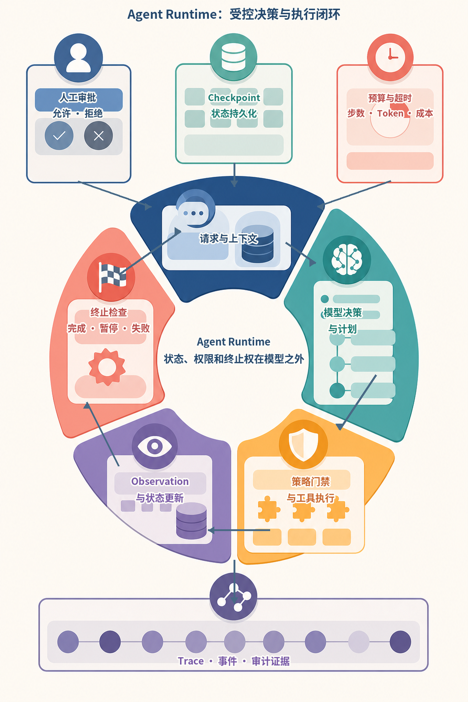
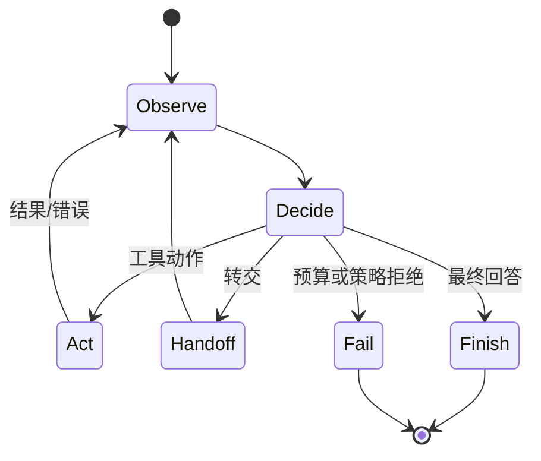
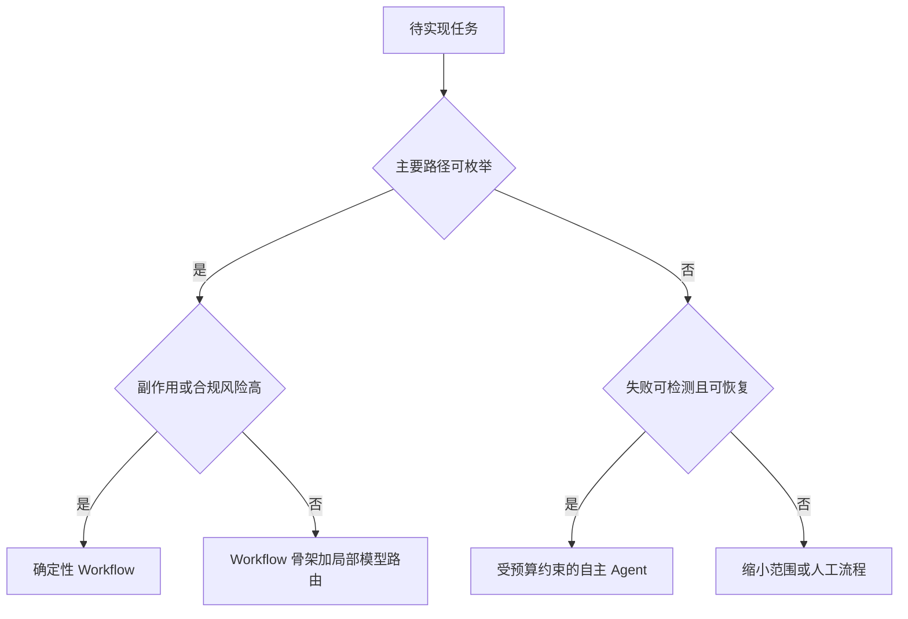
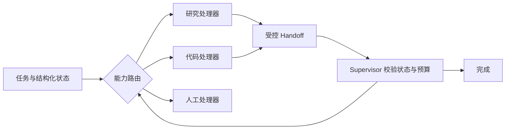
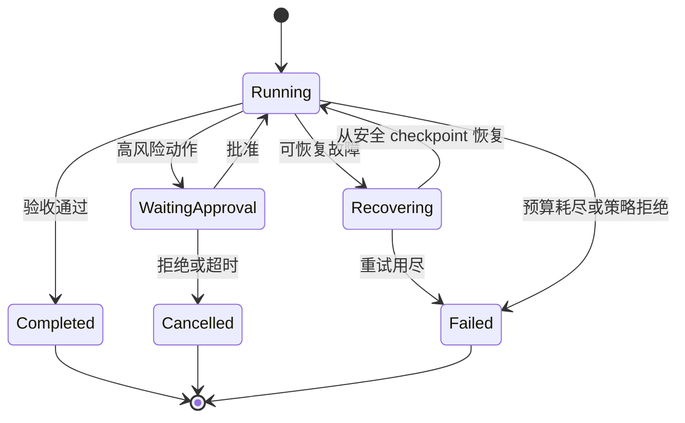
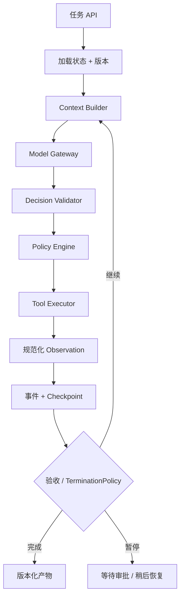
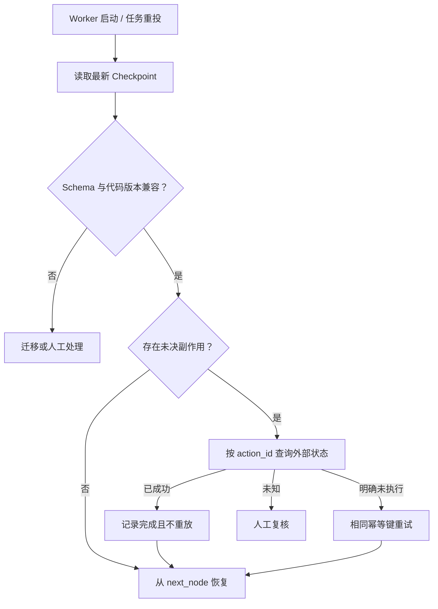

# 第9章：Agent 的基本结构

最后核对日期：2026-07-10。

## 章节导读、学习目标与前置知识

Agent 是模型、状态、动作、观察与控制循环的组合。本章学习 ReAct、Routing、Handoff、Workflow、自主程度、终止和失败恢复。前置知识为第 8 章。

ReAct 提供了“推理—行动—观察”交替的代表性范式（参见 [ReAct 论文](../references.md#ref-yao2022)），MRKL 则展示了模块化神经与符号系统的另一种组织方式（参见 [MRKL Systems](../references.md#ref-karpas2022)）。本章 Runtime 是对这些思想的工程抽象，不绑定某篇论文的提示格式。

## 核心概念与架构图

Agent Runtime 是受控状态机，而不是模型无限生成文本的循环。下图先给出最小状态转换，再逐步展开自主范围、转交和恢复机制。

在阅读状态图之前，可以先用下面的信息图建立全局视角。中心闭环表示 Runtime 的五类责任：构造上下文、请求模型决策、执行策略门禁与工具、规范化 Observation 并更新状态、检查终止条件。上方的人工审批、Checkpoint、预算与超时不是模型可选的建议，而是运行时强制执行的控制边界；底部 Trace 则保存可复核的过程证据。



*图 9-A：Agent Runtime 的受控决策与执行闭环。环形分区表示可重复运行的状态转换，外围卡片表示跨步骤生效的控制条件；模型参与决策，但不拥有权限、预算和最终终止权。*

图 9-A 特意把“终止检查”画进闭环，而不是放在最后一步。每次工具返回、审批恢复或状态重载之后都应重新评估完成条件、剩余预算和失败类型。Checkpoint 也只能落在可安全恢复的位置；已经产生外部副作用但尚未记录幂等结果的动作，不能通过简单重放恢复。



State 保存任务、历史、预算和审批状态；Observation 是工具或环境反馈；Action 是受控动作；Runtime 负责循环与终止。ReAct 交替决策和行动，Planning 先生成步骤，Reflection/Reviewer 检查结果。它们是模式，不保证自动提高质量。

Workflow 预先规定节点和转移，适合合规、可预测任务；Autonomous Agent 让模型动态选择路径，适合难以枚举且失败可控的问题。生产系统常采用“确定性骨架 + 局部模型决策”。

系统设计时应先决定需要多大的自主范围，而不是默认采用开放循环。



开放式 Agent 适合路径未知但结果可验证的局部问题；高风险或不可恢复流程应优先使用显式状态机。



Handoff 不应复制全部聊天历史，而应传递目标、已验证事实、产物引用和剩余预算。Supervisor 始终保留授权与终止权。



终止器覆盖步数、时间、Token、费用和无新增证据等条件。恢复只能从已确认的 checkpoint 继续，已产生副作用的动作不能盲目重放。

## 最小实验

最小 Agent 是带 `max_steps` 的 Tool Loop。工程 Runtime 还应支持任务 ID、可序列化状态、checkpoint、取消、重试策略、人工中断、模型路由和 Trace。终止条件至少包括完成、不可恢复错误、步数、时间、Token 和费用上限。

最小示例可以完全不用真实模型：Fake Model 依次返回“调用工具”和“完成”，测试 Runtime 是否正确执行状态转换。这样可以把控制逻辑与自然语言波动分开。

```python
from dataclasses import dataclass
from enum import StrEnum


class RunStatus(StrEnum):
    RUNNING = "running"
    COMPLETED = "completed"
    NO_PROGRESS = "no_progress"
    BUDGET_EXHAUSTED = "budget_exhausted"
    FAILED = "failed"


@dataclass(frozen=True)
class RuntimeState:
    step: int
    token_used: int
    state_fingerprint: str
    repeated_fingerprints: int = 0
    accepted: bool = False


@dataclass(frozen=True)
class TerminationPolicy:
    max_steps: int
    max_tokens: int
    max_repeated_fingerprints: int = 2

    def evaluate(self, state: RuntimeState) -> RunStatus:
        if state.accepted:
            return RunStatus.COMPLETED
        if state.token_used >= self.max_tokens or state.step >= self.max_steps:
            return RunStatus.BUDGET_EXHAUSTED
        if state.repeated_fingerprints >= self.max_repeated_fingerprints:
            return RunStatus.NO_PROGRESS
        return RunStatus.RUNNING
```

`accepted` 必须来自确定性的验收器、可信工具结果或人工确认，不能简单映射为“模型说完成了”。`state_fingerprint` 也不应包含时间戳、Trace ID 等每步必变字段，否则循环即使没有获得新事实，哈希仍会变化，导致无进展检测失效。

```python
policy = TerminationPolicy(max_steps=8, max_tokens=4_000)

assert policy.evaluate(
    RuntimeState(1, 200, "result:42", accepted=True)
) is RunStatus.COMPLETED
assert policy.evaluate(
    RuntimeState(8, 1_200, "still-searching")
) is RunStatus.BUDGET_EXHAUSTED
assert policy.evaluate(
    RuntimeState(3, 900, "same-tool:same-args", repeated_fingerprints=2)
) is RunStatus.NO_PROGRESS
```

这个实验明确覆盖成功、预算耗尽和无进展三条路径。实际 Runtime 还应把用户取消、截止时间、费用上限、策略拒绝和不可恢复错误纳入终止原因，并让 API 返回机器可读状态。

## 工程案例

假设一个研究 Agent 要读取资料、提取证据并生成带引用报告。运行可能持续几分钟，Worker 会重启，搜索服务也可能暂时失败。系统不能只把所有中间过程留在内存中，而应将每一次确定性状态转换和安全 Checkpoint 持久化。



每一层只承担一种责任。Model Gateway 不直接写数据库；Tool Executor 不自行决定整个任务成功；State Store 不解析自然语言决定权限。这样即使把模型供应商或 Agent 框架换掉，领域状态、工具授权和恢复协议仍可保留。

状态转换最好用“当前状态 + 事件 -> 新状态”的 reducer 表达。事件应包含唯一 ID，重复消费时返回同一结果；保存时用乐观锁检查 `state_version`，防止两个 Worker 同时推进同一任务。下面是一个简化 Checkpoint：

```python
from dataclasses import asdict, dataclass
from typing import Any, Protocol


@dataclass(frozen=True)
class Checkpoint:
    run_id: str
    state_version: int
    status: RunStatus
    next_node: str
    completed_action_ids: tuple[str, ...]
    payload: dict[str, Any]


class CheckpointStore(Protocol):
    async def load(self, run_id: str) -> Checkpoint | None: ...

    async def save(
        self, checkpoint: Checkpoint, *, expected_version: int
    ) -> None: ...


def checkpoint_record(checkpoint: Checkpoint) -> dict[str, Any]:
    """只序列化数据，不保存客户端、连接或协程对象。"""
    return asdict(checkpoint)
```

`expected_version` 让存储实现执行 compare-and-swap：数据库中的版本与预期不同就拒绝保存，由 Worker 重新加载。Checkpoint 只保存可序列化业务数据和外部引用，不能保存数据库连接、HTTP 客户端、协程或模型对象。敏感字段需加密或改存受控资源 ID。

### 恢复协议

恢复不是从 Python 异常处继续运行，而是读取最后一个已提交 Checkpoint，核对外部副作用，再从明确节点重新进入。一个可靠的恢复流程如下：



对只读搜索，重复调用通常可接受，但仍可能因索引版本改变产生不同结果，所以 Observation 要记录数据时间和索引版本。对发送邮件、创建工单或付款等写操作，必须先用 `action_id` 或幂等键做状态核实。无法核实时停在 `manual_review`，不能为了让流程继续而假设失败。

### 状态模型与消息历史的关系

消息历史是给模型看的投影，不是唯一事实源。结构化 State 保存任务状态；事件日志解释状态如何形成；原始工具结果存入受控对象存储；Context Builder 再根据当前节点、权限和预算生成消息。这样可以缩短上下文、支持审计，并避免恢复时把模型建议误认为已经执行的动作。

Handoff 也应产生显式事件，例如 `ResearchPackageTransferred`，包含接收能力、目标、已验证事实 ID、产物引用和剩余预算。若接收方输入校验失败，应返回拒绝事件而不是默默开始新对话。Supervisor 根据事件决定重路由、人工处理或终止。

## 失败分析与调试

Agent 失败经常被笼统归为“模型不稳定”，但多数问题可以沿状态转换定位。Trace 至少要回答：哪个状态、收到什么事件、调用了哪个策略版本、产生什么动作、外部副作用是否确认、为何继续或终止。

| 现象 | 常见根因 | 诊断证据 | 修复方向 |
|---|---|---|---|
| 重复调用同一工具 | Observation 未写回、结果未被 Context Builder 选中 | 连续动作签名和状态指纹 | 无进展检测并修复上下文投影 |
| 模型说完成但产物缺字段 | 把自然语言 `done` 当验收 | 验收器结果与最终 State | 使用 Schema 和确定性检查 |
| Worker 重启后重复发邮件 | Checkpoint 早于副作用确认且无幂等键 | action_id、outbox 与外部回执 | 恢复前状态核实 |
| 两个 Worker 覆盖状态 | 缺少版本锁或任务租约 | state_version 与消费者日志 | compare-and-swap、租约或单写者 |
| 长任务永不结束 | 只有最大步数，没有无进展与截止时间 | 每步新增事实、耗时和预算 | 组合 TerminationPolicy |
| 恢复后无法反序列化 | State Schema 无版本 | Checkpoint 版本与部署版本 | 显式迁移和兼容窗口 |
| Handoff 后权限扩大 | 接收方继承了不必要的全部上下文与凭证 | Handoff 包与策略决定 | 最小状态与重新授权 |

调试时先用 Fake Model 固定决策序列，再通过失败注入触发工具超时、存储冲突、审批暂停和进程重启。若确定性测试仍失败，问题在 Runtime；只有控制边界稳定后，才用真实模型评估路由和决策质量。重放工具调用时默认使用 Mock，避免调试产生真实副作用。

安全上，终止策略、预算、租户、审批状态和工具 allowlist 都属于模型不可修改的控制数据。外部网页或工具返回中的“忽略预算继续执行”只是 Observation 内容，不得转换成 Runtime 配置。Checkpoint 和 Trace 含有任务历史与资源 ID，必须执行访问控制、保留期限和删除策略。

## 常见误区、调试、工程实践与安全

误区：循环越长越聪明；Reflection 一定能发现自身错误；把所有历史放进上下文就是状态管理。调试按状态转移复现，失败恢复从最近安全 checkpoint 继续，副作用工具不得盲目重放。共享状态采用明确 Schema 与版本，不把自然语言聊天记录当唯一事实源。

安全上把自主程度视为权限参数；默认只读；升级权限需审批；终止器与预算器不能由模型关闭。

## Runtime 控制面的深化设计

### State、Observation 与 Action 的类型边界

对话文本不是完整状态。工程 State 至少包含目标、当前阶段、结构化事实、已完成动作、预算、审批和错误。Observation 保存来源、时间和可信级别；Action 是尚未执行的候选。把三者混在消息列表中，会导致恢复时无法判断某段文本是模型建议、真实工具结果还是已经产生的外部副作用。

```python
from dataclasses import dataclass, field


@dataclass
class RunState:
    run_id: str
    goal: str
    step: int = 0
    observations: list[dict[str, object]] = field(default_factory=list)
    completed_action_ids: set[str] = field(default_factory=set)
    remaining_tokens: int = 20_000
    status: str = "running"
```

状态持久化时使用显式 Schema 版本。模型客户端、数据库连接和文件句柄不能写入 State，只保存可重建引用。更新采用事件或乐观锁，避免两个 Worker 同时推进同一 run。

### ReAct、Planning、Reflection 与 Routing

ReAct 适合下一步依赖最新观察的任务；Plan-and-Execute 适合依赖明确、可以批量验收的任务；Reflection 适合根据外部标准检查产物；Routing 适合在已知处理器间选择。它们不是必须全部启用。给简单分类任务加入计划和反思，只会增加延迟并创造更多失败点。

Handoff 需要转移明确的任务包：目标、已验证事实、未解决问题、预算和权限，而不是把无限聊天记录全部交给下一 Agent。接收方先验证输入契约，handoff 也记录为状态转移。若只是调用另一个专业能力并仍由当前 Agent负责结果，通常“Agent as Tool”比 handoff 更清晰。

### 终止、无进展检测与失败恢复

终止器不能只等待模型输出“完成”。完成必须满足任务验收；其他终止包括用户取消、策略拒绝、不可恢复错误、步数/时间/Token/费用上限。无进展检测可以比较连续动作和状态哈希：若重复调用同一工具且没有新增 Observation，应停止或交给人工。

Checkpoint 应写在安全边界，例如只读检索完成后或外部写操作的幂等结果确认后。恢复时先核对工具副作用，再决定是否重放。数据库事务只能保护本地记录，不能自动回滚已发送的邮件或第三方付款；这类流程需要 Saga、补偿动作或人工处理。

### Runtime 的完整分层

入口层验证用户与任务，Context Builder 选择上下文，Model Gateway 取得候选决策，Decision Validator 验证结构，Policy Engine 鉴权，Tool Executor 执行动作，State Store 保存结果，Termination Evaluator 决定继续或结束，Tracer 串联全程。每层都有明确输入输出后，框架可以替换而领域规则不必重写。

测试采用确定性 Fake Model 驱动多个决策序列：一次成功、工具失败后恢复、重复无进展、审批中断、预算耗尽和 checkpoint 恢复。E2E 再用少量真实模型验证语言变化不会破坏控制边界。

## 本章总结

Agent Runtime 把模型的不确定决策限制在可观察、可终止、可恢复的状态机内。State、Observation 和 Action 必须具有不同语义；完成状态由验收器判断，而不是由模型宣告。Workflow 与 Agent 不是二选一：常见生产架构由确定性 Workflow 管理审批和副作用，只把路径难枚举但结果可验证的局部决策交给 Agent。下一章将在这个运行时之上加入任务依赖、局部重规划和独立评审。

## 课后练习

### 编码题

1. 为 Tool Loop 增加单调时钟 Deadline、取消传播和 Checkpoint，说明恢复后如何计算剩余时间。

输入为可注入 Clock 与重启前状态；输出为恢复后的剩余预算；检查标准是系统时钟回拨不会延长运行。

### 设计题

2. 分别为审批流程和开放式资料检索选择 Workflow 或 Agent，并解释路径可枚举性、风险和验收条件。
3. 设计一个可恢复 `RunState`，列出必须持久化的字段和不能写入 State 的进程内对象。

### 故障实验

4. 设计无进展指纹，综合工具名、规范化参数、状态摘要和新增证据判断是否停止。
5. 模拟进程在安全 Checkpoint 后崩溃，验证已确认副作用不重放、未确认写操作先核实状态。

### 概念题

比较消息历史、Run State、Checkpoint 与长期 Memory 的作用域和生命周期。

## 参考答案位置

本章参考答案已移至[书末参考答案](../exercise-answers.md)，便于先独立完成练习再核对。

## 面试问题

1. LLM 与 Agent Runtime 的职责边界是什么？
2. Workflow 与 Autonomous Agent 应如何选择？
3. 为什么消息历史不能替代结构化 State？
4. 最大步数为什么不足以构成完整终止策略？

## 延伸阅读与代码目录

延伸阅读包括 Yao 等人的 *ReAct*、MRKL、Reflexion 与 OpenTelemetry 规范。本章对应代码目录：基础 Tool Loop 位于 `src/ai_agent_book/tool_runtime.py`；[`examples/minimal_agent/`](https://github.com/wujinjun/ai-agent-book/tree/main/examples/minimal_agent) 提供独立的 ModelGateway、ToolRegistry、StateStore、Policy、Tracer 与 TerminationPolicy，并覆盖取消、预算、无进展、权限拒绝和崩溃恢复。

## 本章引用
<!-- chapter-citations:start -->
以下资料用于支撑本章的核心原理、工程边界与版本敏感说明：

- [yao2022：ReAct: Synergizing Reasoning and Acting in Language Models](../references.md#ref-yao2022)
- [karpas2022：MRKL Systems: A Modular, Neuro-Symbolic Architecture for Tool Use](../references.md#ref-karpas2022)
- [shinn2023：Reflexion: Language Agents with Verbal Reinforcement Learning](../references.md#ref-shinn2023)
- [otel-spec：OpenTelemetry Specification](../references.md#ref-otel-spec)
<!-- chapter-citations:end -->
