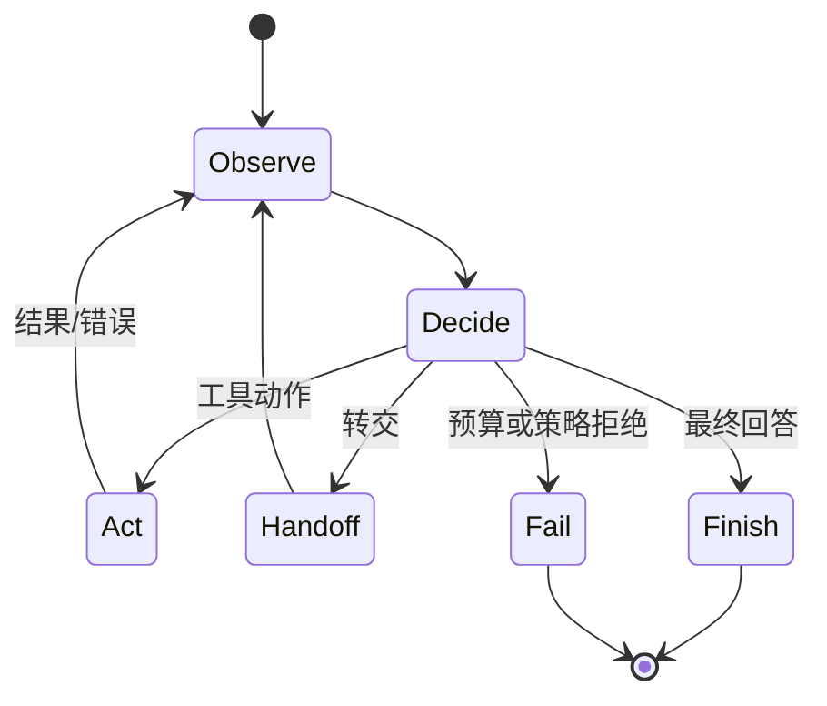
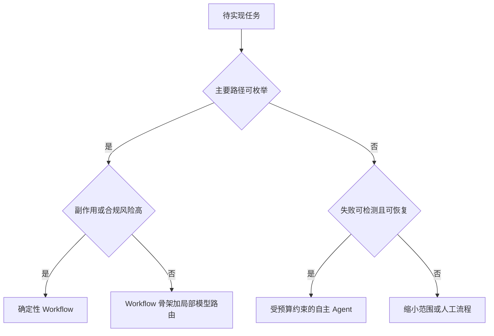
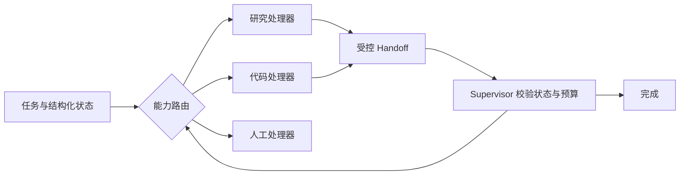
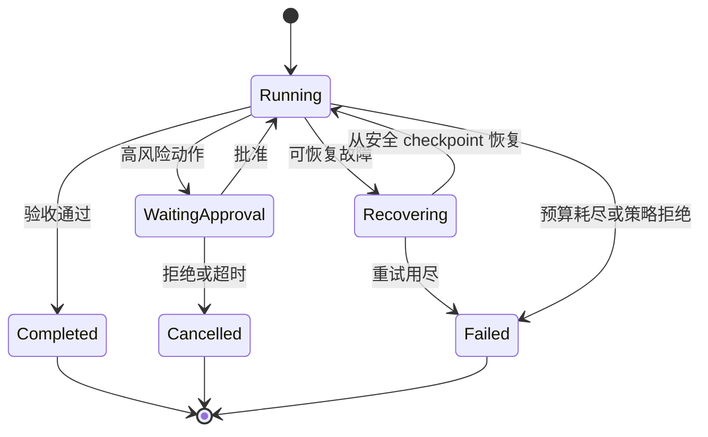

# 第9章：Agent 的基本结构

最后核对日期：2026-07-10。

## 章节导读、学习目标与前置知识

Agent 是模型、状态、动作、观察与控制循环的组合。本章学习 ReAct、Routing、Handoff、Workflow、自主程度、终止和失败恢复。前置知识为第 8 章。

## 核心概念与架构图

Agent Runtime 是受控状态机，而不是模型无限生成文本的循环。下图先给出最小状态转换，再逐步展开自主范围、转交和恢复机制。



State 保存任务、历史、预算和审批状态；Observation 是工具或环境反馈；Action 是受控动作；Runtime 负责循环与终止。ReAct 交替决策和行动，Planning 先生成步骤，Reflection/Reviewer 检查结果。它们是模式，不保证自动提高质量。

Workflow 预先规定节点和转移，适合合规、可预测任务；Autonomous Agent 让模型动态选择路径，适合难以枚举且失败可控的问题。生产系统常采用“确定性骨架 + 局部模型决策”。

系统设计时应先决定需要多大的自主范围，而不是默认采用开放循环。



开放式 Agent 适合路径未知但结果可验证的局部问题；高风险或不可恢复流程应优先使用显式状态机。



Handoff 不应复制全部聊天历史，而应传递目标、已验证事实、产物引用和剩余预算。Supervisor 始终保留授权与终止权。



终止器覆盖步数、时间、Token、费用和无新增证据等条件。恢复只能从已确认的 checkpoint 继续，已产生副作用的动作不能盲目重放。

## 最小示例与完整工程示例

最小 Agent 是带 `max_steps` 的 Tool Loop。工程 Runtime 还应支持任务 ID、可序列化状态、checkpoint、取消、重试策略、人工中断、模型路由和 Trace。终止条件至少包括完成、不可恢复错误、步数、时间、Token 和费用上限。

## 常见误区、调试、工程实践与安全

误区：循环越长越聪明；Reflection 一定能发现自身错误；把所有历史放进上下文就是状态管理。调试按状态转移复现，失败恢复从最近安全 checkpoint 继续，副作用工具不得盲目重放。共享状态采用明确 Schema 与版本，不把自然语言聊天记录当唯一事实源。

安全上把自主程度视为权限参数；默认只读；升级权限需审批；终止器与预算器不能由模型关闭。

## 总结、练习、面试与延伸阅读

### State、Observation 与 Action 的类型边界

对话文本不是完整状态。工程 State 至少包含目标、当前阶段、结构化事实、已完成动作、预算、审批和错误。Observation 保存来源、时间和可信级别；Action 是尚未执行的候选。把三者混在消息列表中，会导致恢复时无法判断某段文本是模型建议、真实工具结果还是已经产生的外部副作用。

```python
from dataclasses import dataclass, field


@dataclass
class RunState:
    run_id: str
    goal: str
    step: int = 0
    observations: list[dict[str, object]] = field(default_factory=list)
    completed_action_ids: set[str] = field(default_factory=set)
    remaining_tokens: int = 20_000
    status: str = "running"
```

状态持久化时使用显式 Schema 版本。模型客户端、数据库连接和文件句柄不能写入 State，只保存可重建引用。更新采用事件或乐观锁，避免两个 Worker 同时推进同一 run。

### ReAct、Planning、Reflection 与 Routing

ReAct 适合下一步依赖最新观察的任务；Plan-and-Execute 适合依赖明确、可以批量验收的任务；Reflection 适合根据外部标准检查产物；Routing 适合在已知处理器间选择。它们不是必须全部启用。给简单分类任务加入计划和反思，只会增加延迟并创造更多失败点。

Handoff 需要转移明确的任务包：目标、已验证事实、未解决问题、预算和权限，而不是把无限聊天记录全部交给下一 Agent。接收方先验证输入契约，handoff 也记录为状态转移。若只是调用另一个专业能力并仍由当前 Agent负责结果，通常“Agent as Tool”比 handoff 更清晰。

### 终止、无进展检测与失败恢复

终止器不能只等待模型输出“完成”。完成必须满足任务验收；其他终止包括用户取消、策略拒绝、不可恢复错误、步数/时间/Token/费用上限。无进展检测可以比较连续动作和状态哈希：若重复调用同一工具且没有新增 Observation，应停止或交给人工。

Checkpoint 应写在安全边界，例如只读检索完成后或外部写操作的幂等结果确认后。恢复时先核对工具副作用，再决定是否重放。数据库事务只能保护本地记录，不能自动回滚已发送的邮件或第三方付款；这类流程需要 Saga、补偿动作或人工处理。

### Runtime 的完整分层

入口层验证用户与任务，Context Builder 选择上下文，Model Gateway 取得候选决策，Decision Validator 验证结构，Policy Engine 鉴权，Tool Executor 执行动作，State Store 保存结果，Termination Evaluator 决定继续或结束，Tracer 串联全程。每层都有明确输入输出后，框架可以替换而领域规则不必重写。

测试采用确定性 Fake Model 驱动多个决策序列：一次成功、工具失败后恢复、重复无进展、审批中断、预算耗尽和 checkpoint 恢复。E2E 再用少量真实模型验证语言变化不会破坏控制边界。

Agent Runtime 把不确定决策限制在可观察状态机内。练习：为 Tool Loop 加时间预算、取消和 checkpoint；面试问题：Workflow 与 Agent 如何选择？什么状态必须持久化？延伸阅读：Yao et al., *ReAct*。

本章对应代码目录：当前运行时实现位于 `src/ai_agent_book/tool_runtime.py`；带 Checkpoint、取消和恢复的独立最小 Agent 工程列入质量路线图 P2。
