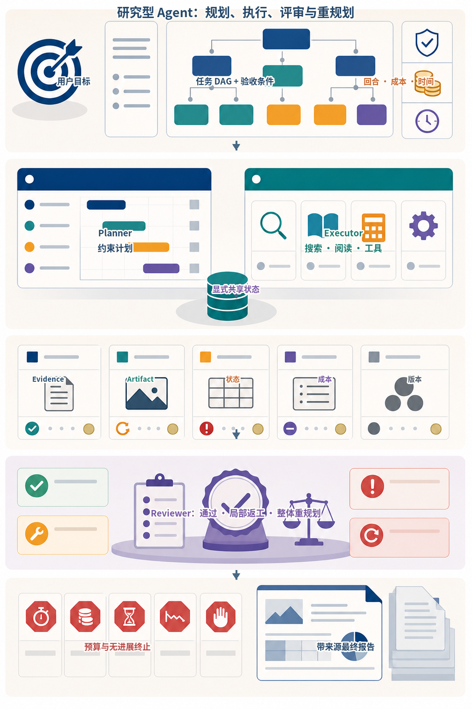
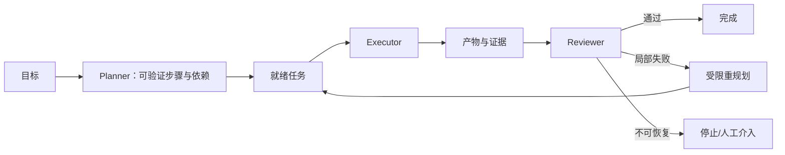
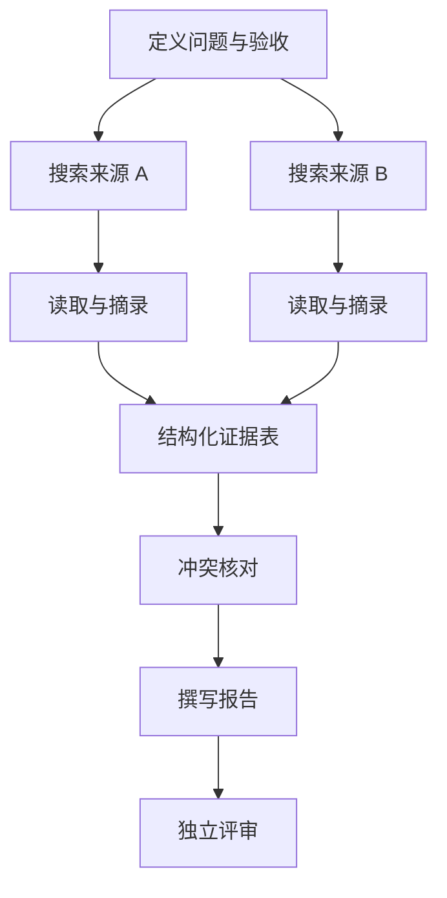
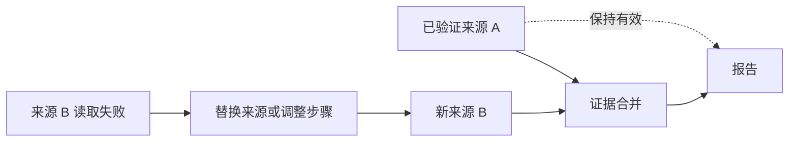
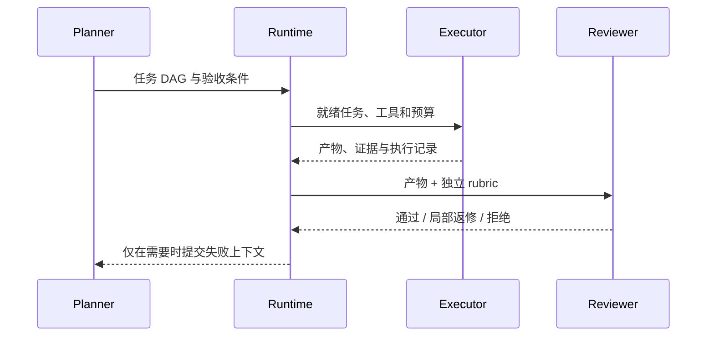
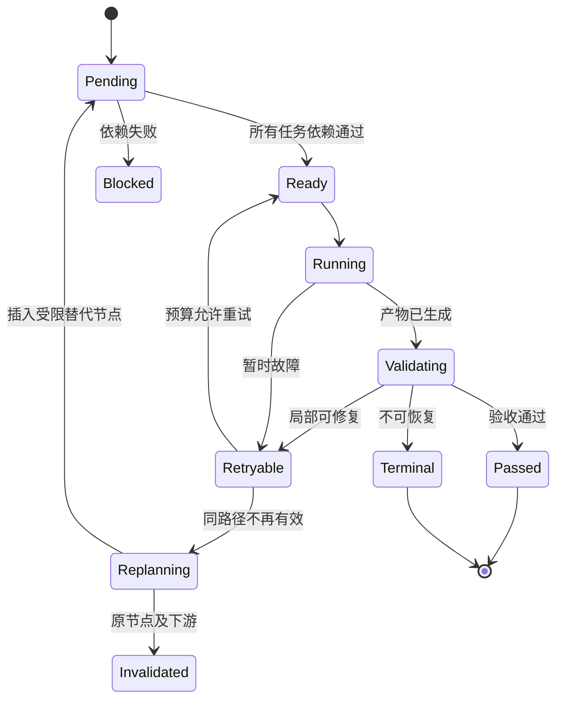
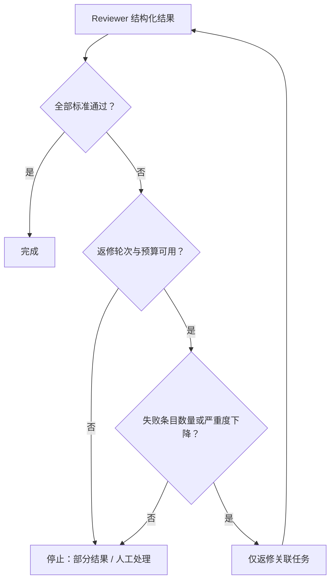

# 第10章：Planning、Reflection 与任务分解

最后核对日期：2026-07-10。

## 章节导读、学习目标与前置知识

复杂任务需要分解，但规划本身也消耗时间并可能制造错误。本章学习 Plan-and-Execute、依赖、重规划、Reviewer 与成本控制。前置知识为第 9 章。

计划与自我修订的研究线索可分别参见 [Plan-and-Solve](../references.md#ref-wang2023plan)、[Tree of Thoughts](../references.md#ref-yao2023tot)与 [Self-Refine](../references.md#ref-madaan2023)。它们展示的是可用机制，不意味着对任意任务增加 Planner 或 Reviewer 都能提高净收益。

研究型 Agent 的价值来自显式任务依赖、证据交付和独立验收，而不是增加更多角色对话。主图把 Planner、Executor 与 Reviewer 放在共享状态周围，并把局部返工、整体重规划和预算终止同时画出。



*图 10-A：规划、执行、评审与失败重规划闭环。共享状态保存 Evidence、Artifact、状态、成本和版本，不能由自由对话替代。*

图 10-A 的终止区与计划同等重要。最大回合、成本、时间和无进展检测必须由 Runtime 执行；Reviewer 的否决不能无限触发重新规划。

## 核心概念与流程图

复杂任务的规划价值来自可验证的分解和局部恢复。下面的主闭环显示 Planner、Executor 与 Reviewer 如何围绕证据推进，而不是用一段自然语言计划替代执行控制。



好计划把目标拆成有明确输入、产出和验收的任务，并表达依赖。动态规划根据观察更新后续步骤，但不能无边界重写目标。Planner 与 Executor 分离有助于审计；Reviewer 应使用独立标准和证据，而不是只询问“做得好吗”。

计划首先是一张可验证的依赖图，运行时只调度依赖已经满足的节点。



节点应有稳定 ID、输入引用、允许工具、预算和验收条件。依赖图还能避免失败后从头执行所有步骤。



重规划只能修改失败节点及其下游，不能扩大目标、增加未授权工具或提高预算；已验证产物按输入哈希复用。



职责分离的价值是可审计和减少共同盲点。Reviewer 不持有执行密钥，也不应直接重写全部产物。

## 最小实验

最小研究计划可以包含问题定义、来源搜索、内容读取、证据表和报告五步，每步有最大尝试次数。工程版保存有向无环依赖、步骤状态、输入哈希、输出引用和评审意见；只有失败步骤及其下游失效，已验证结果不重复执行。

这个最小示例先解决一个确定性问题：Planner 输出的任务依赖是否构成有效 DAG。若计划含有不存在的依赖或循环，运行时应在调用工具前拒绝，而不是执行到一半才发现没有就绪节点。

```python
from collections import deque
from dataclasses import dataclass


@dataclass(frozen=True)
class Task:
    task_id: str
    dependencies: tuple[str, ...] = ()


def topological_order(tasks: list[Task]) -> list[str]:
    by_id = {task.task_id: task for task in tasks}
    if len(by_id) != len(tasks):
        raise ValueError("task_id 必须唯一")

    unknown = {
        dependency
        for task in tasks
        for dependency in task.dependencies
        if dependency not in by_id
    }
    if unknown:
        raise ValueError(f"存在未知依赖: {sorted(unknown)}")

    indegree = {task.task_id: len(task.dependencies) for task in tasks}
    children: dict[str, list[str]] = {task.task_id: [] for task in tasks}
    for task in tasks:
        for dependency in task.dependencies:
            children[dependency].append(task.task_id)

    ready = deque(sorted(key for key, degree in indegree.items() if degree == 0))
    ordered: list[str] = []
    while ready:
        current = ready.popleft()
        ordered.append(current)
        for child in sorted(children[current]):
            indegree[child] -= 1
            if indegree[child] == 0:
                ready.append(child)

    if len(ordered) != len(tasks):
        raise ValueError("任务依赖包含循环")
    return ordered


plan = [
    Task("define"),
    Task("search", ("define",)),
    Task("extract", ("search",)),
    Task("write", ("extract",)),
]
assert topological_order(plan) == ["define", "search", "extract", "write"]
```

这个函数只验证结构，不判断计划内容是否优质。生产系统还应限制节点数量、总预算和可用工具，并检查每个节点是否有可机器验证的产物。Planner 产生的自然语言不能绕过这些约束。

## 工程案例

以“比较两种 Agent 框架并形成带引用的技术选型报告”为例。任务依赖包括定义评价维度、收集两边官方资料、提取证据、构建对比表、撰写结论和 Reviewer 验收。两条资料收集支路可以并行，但报告必须等待证据与冲突核对完成。

计划状态不只包含 `pending/running/done`。为了支持失败重规划，至少要区分 `blocked`、`failed_retryable`、`failed_terminal` 和 `invalidated`。当“读取框架 B 文档”失败时，替换来源会使依赖该来源的证据合并与报告节点失效，却不应重新搜索已经验证的框架 A 资料。



局部重规划器的输入应是原始目标、失败节点、错误分类、仍有效产物和剩余预算，而不是全部聊天记录。输出为计划差异：删除或失效哪些节点、新增哪些节点、依赖如何变化、为何仍满足原目标。Runtime 再次执行 DAG、权限和预算校验。重规划不能修改系统级停止条件。

### Reviewer 的数据契约

Reviewer 应逐条评价验收标准，并给出证据引用。它与 Executor 使用不同职责提示，但“换一个角色名”并不能保证独立；更重要的是隐藏无关思考过程、提供原始证据、使用明确 rubric，并通过确定性代码复核可自动检查的条目。

```python
from enum import StrEnum

from pydantic import BaseModel, Field


class ReviewDecision(StrEnum):
    PASS = "pass"
    REVISE = "revise"
    REJECT = "reject"


class CriterionResult(BaseModel):
    criterion_id: str
    passed: bool
    evidence_ids: list[str] = Field(default_factory=list)
    problem: str | None = None


class ReviewResult(BaseModel):
    decision: ReviewDecision
    criteria: list[CriterionResult]
    requested_task_ids: list[str] = Field(default_factory=list)


def validate_review(result: ReviewResult, required_ids: set[str]) -> None:
    reviewed = {item.criterion_id for item in result.criteria}
    if reviewed != required_ids:
        raise ValueError("Reviewer 未逐项覆盖验收标准")
    if result.decision is ReviewDecision.PASS:
        if any(not item.passed for item in result.criteria):
            raise ValueError("存在失败条目时不能通过")
        if any(not item.evidence_ids for item in result.criteria):
            raise ValueError("通过条目必须给出证据")
```

`REVISE` 只能要求重做与失败标准有关的节点，`REJECT` 表示在当前目标、权限或预算下不可接受。Reviewer 不应直接调用写工具，也不应任意新增研究目标。对引用 URL 是否存在、表格列是否齐全、数字是否能在证据中找到等检查，优先使用确定性程序，而不是浪费一次模型判断。

### 停止条件与规划过度

Planning 和 Reflection 都可能形成新循环，因此除 Agent Runtime 的总体预算外，还要有规划专属门禁：最大计划节点数、最大重规划次数、单节点最大尝试数、Reviewer 最大返修轮数，以及“连续返修没有减少失败标准数量”的无进展条件。



简单的信息抽取、分类和一次工具查询通常不需要 Planner。路径稳定且审计要求高的任务更适合普通 Workflow。只有任务存在可并行子问题、执行成本高、失败需要局部恢复，或结果必须经多项验收时，显式任务图才可能抵消额外开销。

### 对照实验

不能通过一个精心挑选的成功案例证明 Planning 有效。应使用同一任务集、相同工具和总预算，比较三种策略：直接 ReAct、Plan-and-Execute、Plan-and-Execute + Reviewer。每个方案至少重复多次，以减弱采样随机性。

| 指标 | 无规划 ReAct | Plan-and-Execute | 加 Reviewer |
|---|---:|---:|---:|
| 任务成功率 | 实测 | 实测 | 实测 |
| 引用覆盖率 | 实测 | 实测 | 实测 |
| 平均工具调用数 | 实测 | 实测 | 实测 |
| 无效/重复调用率 | 实测 | 实测 | 实测 |
| 平均 Token 与成本 | 实测 | 实测 | 实测 |
| P50 / P95 延迟 | 实测 | 实测 | 实测 |
| 人工接管率 | 实测 | 实测 | 实测 |

实验报告要保留任务集版本、模型配置、Prompt 版本、工具 Fake 或数据快照和随机种子（若供应商支持）。成功标准必须在运行前定义。若 Reviewer 只把成功率从 88% 提升到 89%，却使成本和延迟翻倍，工程结论很可能是仅对高风险或低置信任务启用 Reviewer，而不是全量使用。

## 失败分析与调试

规划系统要区分计划错误、执行错误、环境错误和验收错误。没有这种分类，Planner 会对任何失败都改写计划，造成目标漂移。

| 现象 | 根因候选 | 证据 | 处理 |
|---|---|---|---|
| 没有就绪任务但仍未完成 | DAG 有环或依赖状态错误 | 节点和边、拓扑检查结果 | 执行前拒绝非法图 |
| 失败后所有步骤重跑 | 失效传播范围过大 | 输入哈希、节点依赖和产物版本 | 仅失效失败节点及下游 |
| Planner 不断新增搜索 | 缺少证据充分性与节点上限 | 计划差异、采用率、剩余预算 | 设置停止条件并要求新增价值 |
| Reviewer 反复改写措辞 | rubric 不可判定或职责越界 | 失败 criterion 是否变化 | 固定 rubric，只返修失败条目 |
| 报告引用存在但不支持结论 | Reviewer 只检查 URL 格式 | 主张—证据映射 | 检查支持关系与引用范围 |
| 网页改变任务目标 | 外部内容进入控制指令 | 来源标签和计划 diff | 外部文本只作不可信证据 |
| 计划成本高于直接执行 | 任务过小或路径确定 | 对照实验成本与延迟 | 移除 Planner 或改用 Workflow |

调试先重放确定性任务图，验证就绪队列、失效传播、最大尝试和停止条件；再使用 Fake 搜索注入 429、空结果、冲突证据和恶意文本；最后才接真实模型评价任务分解质量。每次重规划必须保存 diff，方便判断是合理替代还是目标漂移。

安全方面，Planner 产生的是候选任务，不是授权。新增工具、扩大资源范围、提高预算和改变用户目标都应被运行时拒绝。Reviewer 同样可能受到证据中的间接注入，因此只能输出有限的结构化判定，不能持有 Executor 的凭证。

## 常见误区、调试与工程实践

误区：所有任务先做十步计划；Reviewer 与 Executor 使用相同上下文就足够独立；失败后从头开始。调试统计计划变更次数、无效步骤、重复工具调用和评审驳回原因。短任务直接执行，路径清晰的任务使用 Workflow，只有高不确定任务才启用动态规划。

## 安全注意事项

规划文字不授予权限；每个动作仍单独鉴权。外部来源可能注入新目标，重规划器不得修改系统目标和预算。Reviewer 不接触执行密钥。

## 可执行计划与评审的深化设计

### 可执行计划的数据结构

计划不是编号列表，而是带依赖和验收条件的任务图。每个任务包含稳定 ID、目标、输入引用、依赖、允许工具、预算、期望产物和验收规则。Planner 不能把“完成调研”作为一个无法判定的步骤；应拆成来源搜索、证据提取、冲突核对和报告编写。

```python
from pydantic import BaseModel, Field


class PlanTask(BaseModel):
    task_id: str
    objective: str
    dependencies: list[str] = Field(default_factory=list)
    allowed_tools: list[str]
    acceptance: list[str]
    max_attempts: int = Field(default=2, ge=1, le=5)
```

运行时验证依赖是否引用存在任务、图是否有环、预算总和是否超限，并只把依赖已经通过的任务放入就绪队列。并行任务完成时写入各自产物，Reducer 根据任务 ID 合并，不能让“最后完成者”覆盖整个共享状态。

### 重规划的范围

失败后重规划应保留已经验证的事实和产物，只使失败节点及其下游失效。模型不得借重规划扩大原始目标、添加未授权工具或提高预算。若搜索服务暂时失败，计划可以切换备选来源；若用户目标本身缺少关键信息，应中断并提问，而不是自行猜测。

每次计划变更保存原因和差异。频繁新增步骤通常说明目标不清或 Planner 在拖延。团队可以设置最大重规划次数、计划节点上限和无新增证据阈值。短任务的成本若小于规划成本，应直接执行。

### Reviewer 与 Self-Critique

Self-Critique 与 Executor 共享模型和上下文，容易重复相同盲点。Reviewer 模式通过独立 rubric、最小必要上下文和证据重新检查。Reviewer 输出结构化判定：通过、需局部修复或不可接受，并指向具体验收条目。它不应重写整份产物，否则职责又退化为第二个 Executor。

研究报告的 Reviewer 可以检查：每个事实是否有来源；来源是否支持该事实；数据时间是否明确；事实与推断是否分开；是否遗漏冲突证据。涉及专业结论时，模型 Reviewer 只作预筛，最终仍需领域人员。

### 研究型 Agent 完整案例

系统先把问题转换为三至五个研究子问题；搜索节点返回标题、URL、日期和摘要；读取节点保存原文引用；证据表按主张组织支持与反对材料；Writer 只能使用证据表；Reviewer 对引用进行逐项校验。网页中的任何“忽略之前指令”都作为引用文本，不进入控制指令。

调试指标包括计划有效节点比、平均重规划次数、重复查询率、证据采用率、Reviewer 驳回率、任务成功率、Token 和总延迟。只有成功率的提升超过新增成本与延迟，Planning/Reviewer 才应保留。

安全上，Planner 只提议动作，Policy 仍逐步鉴权；Executor 使用最小权限；Reviewer 不持有写工具；计划与证据进入审计记录但敏感正文脱敏。测试注入搜索失败、互相冲突来源、循环依赖和恶意网页，验证系统能停止而不是继续自治。

## 本章总结

规划的价值是暴露依赖、预算和验收条件，而不是增加一段看起来很完整的思考文本。计划必须是可验证任务图；失败后只重规划失败节点及其下游；Reviewer 按独立 Rubric 和证据逐项判断。规划、返修和反思本身也需要预算与无进展终止条件，否则它们会成为新的死循环。下一篇将把运行时从应用内部能力扩展到 MCP 工具协议、RAG 外部知识和跨会话 Memory。

## 课后练习

### 设计题

1. 为技术调研设计包含范围定义、并行搜索、证据提取、冲突核对、写作和评审的任务 DAG，并为每个节点写出验收条件。

### 故障实验

2. 给一个搜索节点注入暂时失败，说明哪些节点应重试、失效或保留，以及计划差异如何记录。

### 设计题

3. 为 Reviewer 设计结构化 Rubric，使其逐项引用证据，而不是重写 Executor 的完整产物。

### 编码题

4. 为 DAG 校验器补充重复 ID、未知依赖、自环、多节点循环和多个并行根节点测试设计。

输入为合法与非法 DAG Fixture；输出为稳定错误码；检查标准是非法计划不会进入 Executor。

### 概念题

5. 设计 ReAct、Plan-and-Execute 和加入 Reviewer 三种策略的对照实验，固定任务集、工具、数据和总预算。

## 参考答案位置

本章参考答案已移至[书末参考答案](../exercise-answers.md)，便于先独立完成练习再核对。

## 面试问题

1. 什么情况下 Planning 的成本大于收益？
2. 局部重规划为什么不能重新解释原始目标？
3. Reviewer 如何减少与 Executor 的相关错误？
4. 为什么使用不同模型不能替代清晰的验收契约？

## 延伸阅读与代码目录

延伸阅读包括 Plan-and-Solve、Tree of Thoughts、Self-Refine、Reflexion 与任务图相关研究。本章对应代码目录为 `projects/08-research-workflow/`。

## 本章引用
<!-- chapter-citations:start -->
以下资料用于支撑本章的核心原理、工程边界与版本敏感说明：

- [wang2023plan：Plan-and-Solve Prompting](../references.md#ref-wang2023plan)
- [yao2023tot：Tree of Thoughts: Deliberate Problem Solving with Large Language Models](../references.md#ref-yao2023tot)
- [madaan2023：Self-Refine: Iterative Refinement with Self-Feedback](../references.md#ref-madaan2023)
- [shinn2023：Reflexion: Language Agents with Verbal Reinforcement Learning](../references.md#ref-shinn2023)
<!-- chapter-citations:end -->
