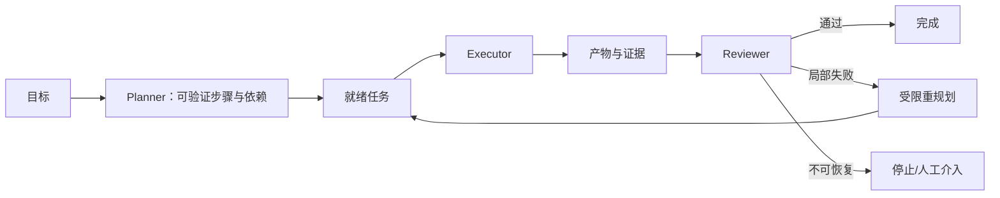
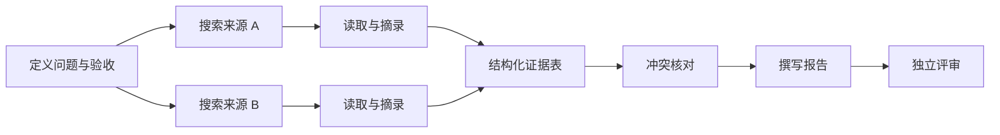
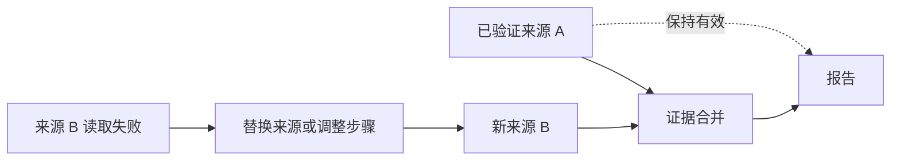
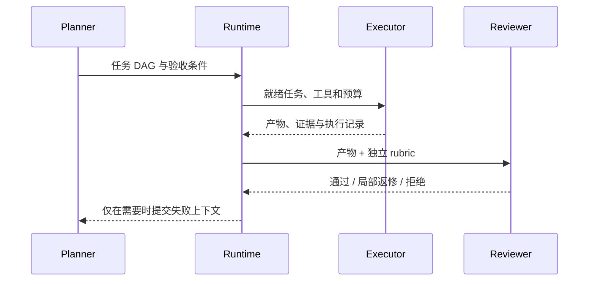

# 第10章：Planning、Reflection 与任务分解

最后核对日期：2026-07-10。

## 章节导读、学习目标与前置知识

复杂任务需要分解，但规划本身也消耗时间并可能制造错误。本章学习 Plan-and-Execute、依赖、重规划、Reviewer 与成本控制。前置知识为第 9 章。

## 核心概念与流程图

复杂任务的规划价值来自可验证的分解和局部恢复。下面的主闭环显示 Planner、Executor 与 Reviewer 如何围绕证据推进，而不是用一段自然语言计划替代执行控制。



好计划把目标拆成有明确输入、产出和验收的任务，并表达依赖。动态规划根据观察更新后续步骤，但不能无边界重写目标。Planner 与 Executor 分离有助于审计；Reviewer 应使用独立标准和证据，而不是只询问“做得好吗”。

计划首先是一张可验证的依赖图，运行时只调度依赖已经满足的节点。



节点应有稳定 ID、输入引用、允许工具、预算和验收条件。依赖图还能避免失败后从头执行所有步骤。



重规划只能修改失败节点及其下游，不能扩大目标、增加未授权工具或提高预算；已验证产物按输入哈希复用。



职责分离的价值是可审计和减少共同盲点。Reviewer 不持有执行密钥，也不应直接重写全部产物。

## 最小示例与完整工程示例

最小研究计划可以包含问题定义、来源搜索、内容读取、证据表和报告五步，每步有最大尝试次数。工程版保存有向无环依赖、步骤状态、输入哈希、输出引用和评审意见；只有失败步骤及其下游失效，已验证结果不重复执行。

## 常见误区、调试与工程实践

误区：所有任务先做十步计划；Reviewer 与 Executor 使用相同上下文就足够独立；失败后从头开始。调试统计计划变更次数、无效步骤、重复工具调用和评审驳回原因。短任务直接执行，路径清晰的任务使用 Workflow，只有高不确定任务才启用动态规划。

## 安全注意事项

规划文字不授予权限；每个动作仍单独鉴权。外部来源可能注入新目标，重规划器不得修改系统目标和预算。Reviewer 不接触执行密钥。

## 总结、练习、面试与延伸阅读

### 可执行计划的数据结构

计划不是编号列表，而是带依赖和验收条件的任务图。每个任务包含稳定 ID、目标、输入引用、依赖、允许工具、预算、期望产物和验收规则。Planner 不能把“完成调研”作为一个无法判定的步骤；应拆成来源搜索、证据提取、冲突核对和报告编写。

```python
from pydantic import BaseModel, Field


class PlanTask(BaseModel):
    task_id: str
    objective: str
    dependencies: list[str] = Field(default_factory=list)
    allowed_tools: list[str]
    acceptance: list[str]
    max_attempts: int = Field(default=2, ge=1, le=5)
```

运行时验证依赖是否引用存在任务、图是否有环、预算总和是否超限，并只把依赖已经通过的任务放入就绪队列。并行任务完成时写入各自产物，Reducer 根据任务 ID 合并，不能让“最后完成者”覆盖整个共享状态。

### 重规划的范围

失败后重规划应保留已经验证的事实和产物，只使失败节点及其下游失效。模型不得借重规划扩大原始目标、添加未授权工具或提高预算。若搜索服务暂时失败，计划可以切换备选来源；若用户目标本身缺少关键信息，应中断并提问，而不是自行猜测。

每次计划变更保存原因和差异。频繁新增步骤通常说明目标不清或 Planner 在拖延。团队可以设置最大重规划次数、计划节点上限和无新增证据阈值。短任务的成本若小于规划成本，应直接执行。

### Reviewer 与 Self-Critique

Self-Critique 与 Executor 共享模型和上下文，容易重复相同盲点。Reviewer 模式通过独立 rubric、最小必要上下文和证据重新检查。Reviewer 输出结构化判定：通过、需局部修复或不可接受，并指向具体验收条目。它不应重写整份产物，否则职责又退化为第二个 Executor。

研究报告的 Reviewer 可以检查：每个事实是否有来源；来源是否支持该事实；数据时间是否明确；事实与推断是否分开；是否遗漏冲突证据。涉及专业结论时，模型 Reviewer 只作预筛，最终仍需领域人员。

### 研究型 Agent 完整案例

系统先把问题转换为三至五个研究子问题；搜索节点返回标题、URL、日期和摘要；读取节点保存原文引用；证据表按主张组织支持与反对材料；Writer 只能使用证据表；Reviewer 对引用进行逐项校验。网页中的任何“忽略之前指令”都作为引用文本，不进入控制指令。

调试指标包括计划有效节点比、平均重规划次数、重复查询率、证据采用率、Reviewer 驳回率、任务成功率、Token 和总延迟。只有成功率的提升超过新增成本与延迟，Planning/Reviewer 才应保留。

安全上，Planner 只提议动作，Policy 仍逐步鉴权；Executor 使用最小权限；Reviewer 不持有写工具；计划与证据进入审计记录但敏感正文脱敏。测试注入搜索失败、互相冲突来源、循环依赖和恶意网页，验证系统能停止而不是继续自治。

规划的价值是暴露依赖和验收，不是增加思考文本。练习：为技术调研设计带引用验收的计划并注入一次搜索失败；面试问题：何时规划过度？Reviewer 如何避免只复述 Executor？延伸阅读：Plan-and-Execute、Reflexion 与任务图相关论文。

本章对应代码目录：`projects/08-langgraph-research-agent/`。
