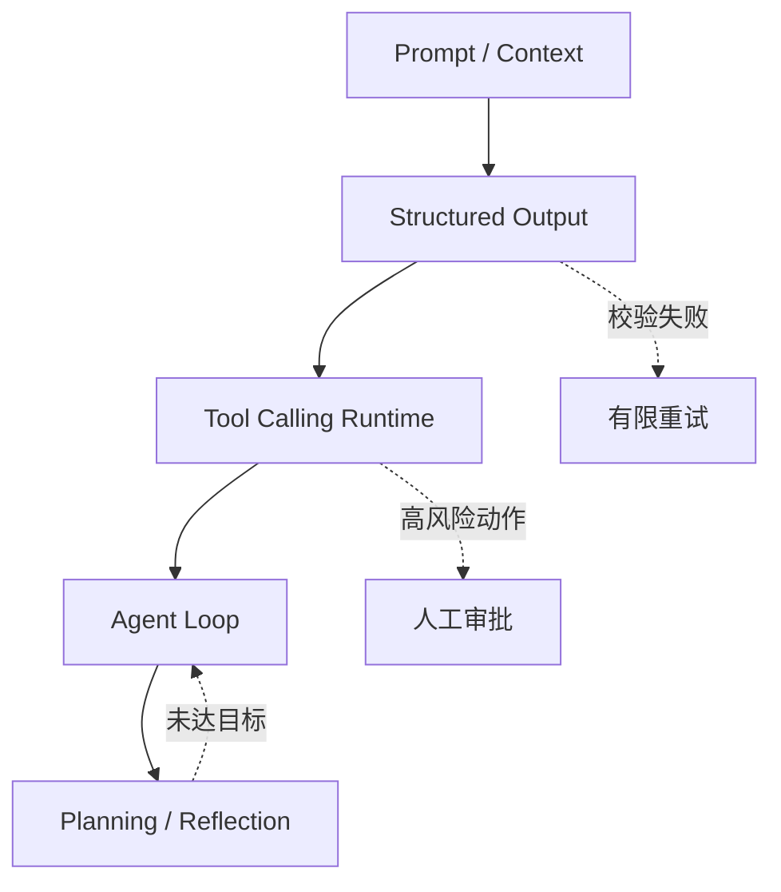

# 第二篇：Prompt、工具与 Agent 核心机制

本篇承接第一篇的模型生成与语义表示，从“自然语言输出不可靠”这一问题出发，逐层建立 Agent 的控制边界。进入本篇前，读者应理解上下文窗口、采样和模型输出的不确定性；完成后应能实现一个带结构化结果、受控工具、显式状态和有限规划的最小 Agent Runtime。

下图说明控制边界如何逐步增强：Prompt 约束意图，Schema 约束数据，Tool Runtime 约束动作，Agent Loop 和规划器约束长任务。

主链表示能力逐层组合，虚线表示生产系统必须显式处理的失败与审批路径；模型输出不能绕过这些软件边界直接产生副作用。

## 贯穿案例：设备研发企业知识助手

第二至第五篇统一使用同一个案例：设备研发企业的员工查询产品手册、质量制度和已知故障，知识管理员发布新版本，平台管理员维护运行策略，审计员只读查看受保护动作。核心对象不随框架变化：

| 对象或角色 | 固定契约 |
|---|---|
| 员工 `reader` | 只能检索自己项目和密级可见的文档；不能发布或删除 |
| 知识管理员 `publisher` | 可提交候选文档版本；激活、撤回和删除需要审批与审计 |
| 平台管理员 `operator` | 管理模型、工具和预算策略；默认不能读取文档正文 |
| 审计员 `auditor` | 读取不可变 Audit Event；不能重放业务动作 |
| `Document` | `document_id`、`version`、`classification`、`project_acl`、`source_hash` |
| `Citation` | `document_id`、`version`、`page_or_anchor`、`chunk_id` |
| 高风险动作 | 发布文档、创建工单、导出内容；必须做对象授权、内容绑定审批和幂等提交 |

本篇从用户问题开始，把回答要求变成结构化决策与受控 Tool Loop；第三篇为同一对象增加协议、检索和记忆，第四篇比较不同框架如何实现相同契约，第五篇把它部署成多租户服务。章节中的其他短例子只用于解释局部机制，不改变这个主案例的角色、数据模型和权限边界。

| 章 | 主题 | 核心产出 |
|---:|---|---|
| 6 | [Prompt Engineering](ch06-prompt-engineering.md) | 可版本化、可评估的上下文模板 |
| 7 | [Structured Output](ch07-structured-output.md) | Pydantic 校验的信息抽取器 |
| 8 | [Function/Tool Calling](ch08-tool-calling.md) | 带超时、幂等与审批的 Tool Loop |
| 9 | [Agent 基本结构](ch09-agent-runtime.md) | 状态、动作、观察与终止运行时 |
| 10 | [Planning 与 Reflection](ch10-planning-reflection.md) | Planner/Executor/Reviewer 研究流程 |

篇章主线是把模型的非确定性限制在可验证接口内。Prompt 注入、参数校验、权限、失败恢复和预算控制将贯穿所有章节。第三篇将在这个 Runtime 之下接入 MCP 能力、RAG 证据、Memory 和向量索引。
