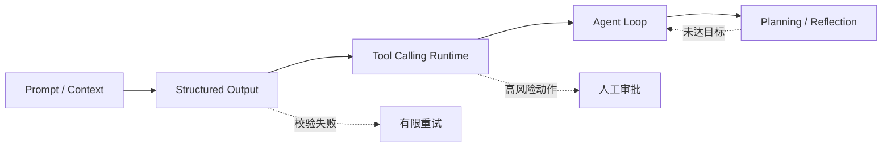

# 第二篇：Prompt、工具与 Agent 核心机制

本篇从“自然语言输出不可靠”这一问题出发，逐层建立 Agent 的控制边界。

下图说明控制边界如何逐步增强：Prompt 约束意图，Schema 约束数据，Tool Runtime 约束动作，Agent Loop 和规划器约束长任务。

主链表示能力逐层组合，虚线表示生产系统必须显式处理的失败与审批路径；模型输出不能绕过这些软件边界直接产生副作用。

| 章 | 主题 | 核心产出 | 状态 |
|---:|---|---|---|
| 6 | [Prompt Engineering](ch06-prompt-engineering.md) | 可版本化、可评估的上下文模板 | 初稿完成 |
| 7 | [Structured Output](ch07-structured-output.md) | Pydantic 校验的信息抽取器 | 初稿完成 |
| 8 | [Function/Tool Calling](ch08-tool-calling.md) | 带超时、幂等与审批的 Tool Loop | 初稿完成 |
| 9 | [Agent 基本结构](ch09-agent-runtime.md) | 状态、动作、观察与终止运行时 | 初稿完成 |
| 10 | [Planning 与 Reflection](ch10-planning-reflection.md) | Planner/Executor/Reviewer 研究流程 | 初稿完成 |

篇章主线是把模型的非确定性限制在可验证接口内。Prompt 注入、参数校验、权限、失败恢复和预算控制将贯穿所有章节。
