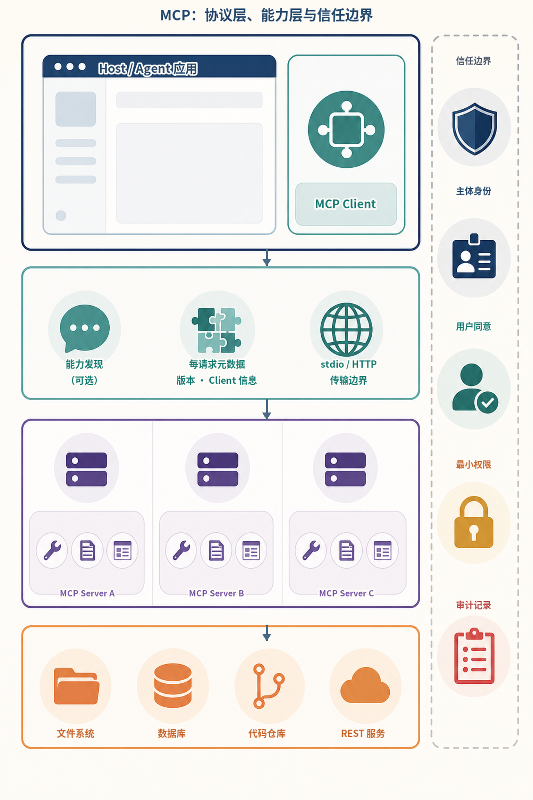
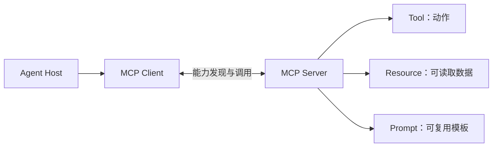
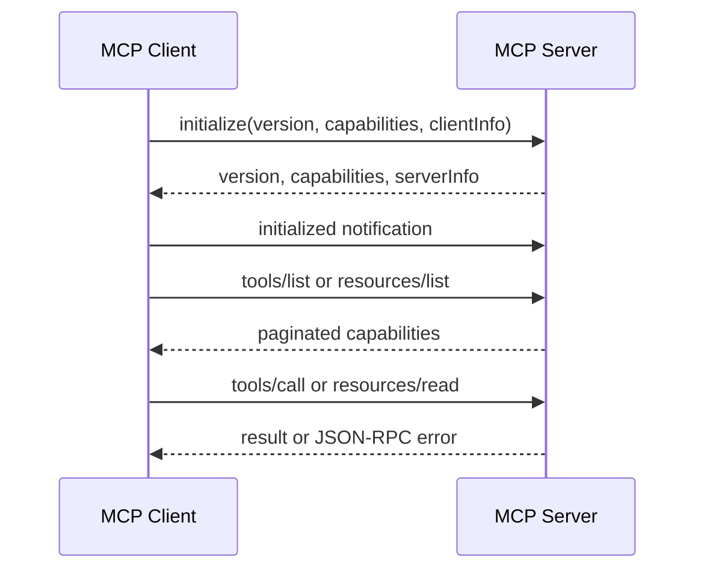
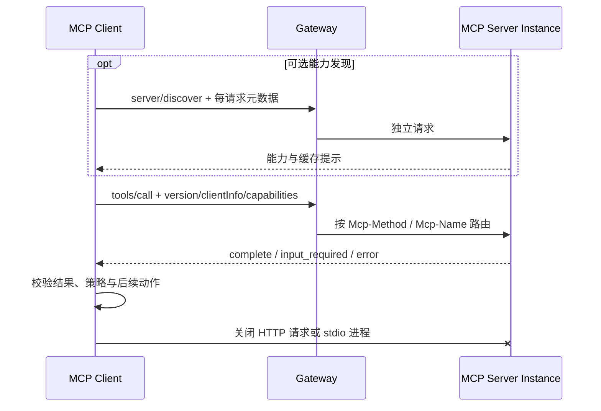
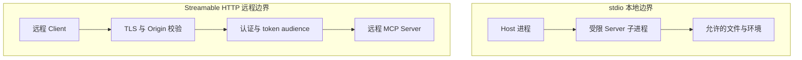
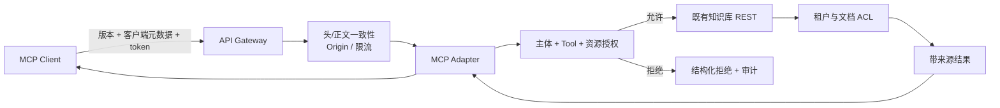
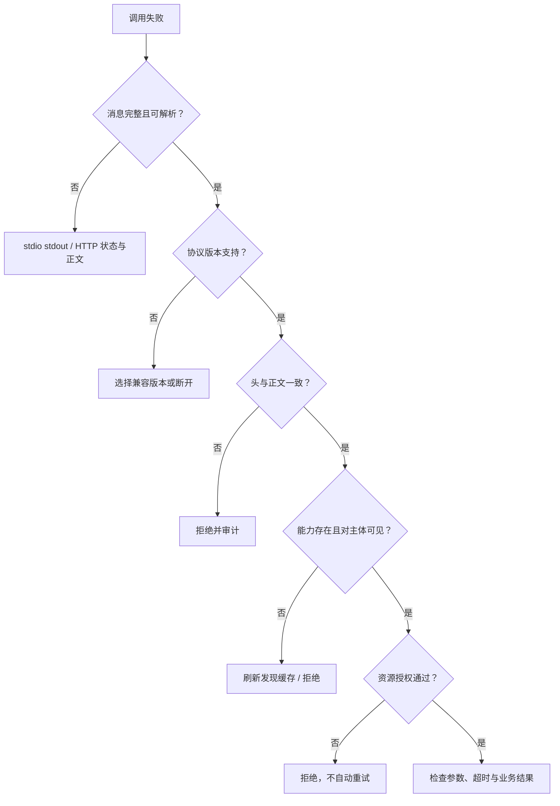

# 第11章：MCP 基础

最后核对日期：2026-08-07；本章按 MCP 2026-07-28 与官方 Python SDK `mcp==2.0.0` 核对，并单独说明 2025-11-25 客户端的迁移差异。

## 章节导读、学习目标与前置知识
MCP 用统一协议连接模型应用与上下文能力。本章目标是区分 Client、Server、Tool、Resource、Prompt、Transport 和生命周期。前置知识为第8章。

## 核心概念、原理与架构图

MCP 把宿主、协议客户端与能力服务器分层。下图先界定组件职责，随后再展开生命周期、传输和安全边界。

下面的信息图先把协议分层与信任边界放进同一视野。Host 内部的 MCP Client 负责把应用意图转换为协议请求；中间层负责可选能力发现、每请求元数据和传输；Server 暴露 Tool、Resource 与 Prompt，再访问文件、数据库、代码仓库或既有 REST 服务。右侧安全轨道贯穿所有层，强调能力可见不等于主体已经获得业务授权。



*图 11-A：MCP 的协议层、能力层与信任边界。纵向主路径表示调用跨越的层次；右侧轨道表示每次调用都必须经过的主体身份、用户同意、最小权限和审计约束，而不是一次握手后永久生效的授权。*

图中的三个 Server 用于说明一个 Host 可以连接不同能力提供方，不表示生产系统必须拆成三个进程。Tool、Resource 与 Prompt 是协议原语，不是安全等级：即使 Resource 只读，也可能泄露敏感数据；即使 Prompt 只是模板，也不能自动提升为更高优先级指令。


Client 管理协议请求与传输，Server 声明能力。stdio 适合本地子进程，远程传输涉及认证、路由和网络边界；当前协议核心不再把连接当作会话。MCP 不替代 REST：REST 面向通用服务接口，MCP 重点是让模型宿主发现并使用上下文能力；Tool Calling 是模型提出调用的机制，MCP 是能力暴露与传输协议。

## 最小示例、完整工程、误区与调试
最小 Server 暴露只读 `get_note(id)` 和资源列表；工程版还需 Schema、超时、版本信息、能力发现、结构化错误和授权。误区是“接入 MCP 即自动安全”和“所有 API 都应包装成工具”。调试按传输、版本、能力、参数、执行和序列化分层，记录请求 ID 而非敏感正文。

下面是旧版 2025-11-25 的初始化请求，仅用于识别和迁移已有实现。它不是 2026-07-28 新实现应发送的消息。真实 stdio Server 的协议输出走 stdout，普通日志只能写 stderr。

```json
{
  "jsonrpc": "2.0",
  "id": 1,
  "method": "initialize",
  "params": {
    "protocolVersion": "2025-11-25",
    "capabilities": {},
    "clientInfo": {"name": "book-client", "version": "1.0.0"}
  }
}
```

本书项目 3 保留手写 JSON-RPC 循环作为旧生命周期教学子集，同时在 `projects/03-mcp-local-agent/official_sdk/` 提供官方 SDK 2.0.0 实现。后者用官方高层 Client 验证 Tool、Resource、Prompt，并分别通过真实 stdio 子进程和 loopback Streamable HTTP 调用；两条路径不得混成一个“兼容所有版本”的示例。

官方 SDK 实测还说明一个重要边界：2026-07-28 的 HTTP 路径可以无状态扩展，但文件访问仍要逐次执行 `safe_join`、文件类型、大小和编码检查。协议消除连接会话，不会自动提供主体认证、对象授权或审计。

## 数据层、传输层与生命周期

MCP 数据层使用 JSON-RPC 表达请求、响应和通知，传输层负责消息如何跨进程或网络流动。2026-07-28 核心改为无状态：每个请求都携带处理它所需的协议版本、客户端身份和能力元数据，不再依赖连接先前发生过的初始化握手。需要预先了解 Server 能力时，Client 可以调用 `server/discover`，但发现不是每次调用的必需前置步骤。关闭仍由底层传输或子进程生命周期承担；业务状态使用显式句柄，不绑定连接身份。

2026-07-28 保留 Tool、Resource 与 Prompt 等 Server 原语，并引入正式扩展框架；Tasks 移到扩展，Roots、Sampling 与 Logging 被标记为弃用，新实现不应无条件采用。能力发现只描述协议支持，不表示调用获得业务授权。Client 应按当前用户与任务过滤能力集合，Server 对每次读取和动作重新鉴权。



这张图只描述 2025-11-25 及更早实现。初始化当时只完成协议版本与能力协商，不授予业务访问权；2026-07-28 已移除 `initialize`、`notifications/initialized` 和协议级会话。兼容客户端必须按双方明确支持的版本选择协议路径，不能把两个版本的消息随意混用。

当前规范的正常路径更短：能力发现是可选调用，每个业务请求自描述，网络负载均衡器无需保持会话粘性。



无状态指协议核心不从连接推断会话，不表示业务不能有长期任务。跨请求状态必须用 Server 生成的显式句柄，由 Client 在后续参数中携带。这样任何请求可以落到任意实例，但句柄指向的数据仍需租户隔离、过期和授权。

本地与远程传输的信任边界不同，不能只把 stdio 换成 HTTP 地址而沿用同一安全假设。



stdio 依赖子进程继承权限和 stdout 协议纯净性；远程传输增加网络暴露、身份验证、令牌目标和连接限流等控制。


Function Calling 是模型输出机制，MCP 是上下文能力协议，REST 是通用服务接口。组合使用时，既有业务鉴权和审计不应被 Adapter 绕过。

## Tool、Resource 与 Prompt 的控制模型

规范把 Tool 描述为通常由模型选择的动作，把 Resource 描述为由应用选择并加入上下文的数据，把 Prompt 描述为通常由用户显式选择的模板。这是交互模型，不是安全许可。只读数据库查询可设计为 Tool，因为模型需要根据问题动态调用；一份已知手册可设计为 Resource，由客户端决定何时附加；“生成发布说明”模板可设计为 Prompt，供用户从界面选择。

Tool 定义包含名称、描述与输入 JSON Schema，可选输出 Schema。返回内容可以是文本、图像、音频、资源链接或嵌入资源。Client 必须把内容视为不可信数据。Resource 通过 URI 标识，适合列出、读取和订阅；URI 不应直接暴露本机任意路径。Prompt 参数也需要校验，不能因为它是模板就自动获得更高指令级别。

## stdio 与 Streamable HTTP

stdio 中 Client 启动 Server 子进程，协议消息走 stdin/stdout。Server 的 stdout 只能写合法 MCP 消息，普通日志写 stderr，否则一行调试输出就可能破坏消息流。凭证通常通过受控环境注入，stdio 不采用 HTTP 授权流程。子进程继承的环境变量和文件权限必须最小化。

当前 Streamable HTTP 将每条消息作为 POST 发送到单一 MCP 端点，响应可以是 JSON 对象或仅属于该请求的 SSE 流。Server 必须验证 Origin 以防 DNS rebinding，本地服务应绑定 loopback 而不是默认暴露 `0.0.0.0`，并为连接实施认证。HTTP 授权规范建立在 OAuth 体系和受保护资源元数据上，访问令牌应绑定目标 MCP Server，防止 token 被转用于其他资源。

## MCP 与 REST、Function Calling 的关系

已有 REST API 不必全部重写。常见做法是在边界建立 MCP Adapter：它把适合模型使用的少量操作映射为 Tool，把文档映射为 Resource，同时复用 REST 服务已有的认证、审计和业务规则。MCP Server 不应绕过服务层直接连接生产数据库，否则会形成第二套权限模型。

Function Calling 描述模型怎样产生工具名和参数，MCP 描述 Host 如何发现与调用外部上下文能力。一个应用可以使用原生 Function Calling 调用本地函数，也可以把 MCP Tools 转换为模型可见工具。二者组合时，Host 仍负责模型选择、Policy、审批和 Tool 结果回传。

不用 MCP 的情况包括只有一个固定内部函数、没有能力发现需求、调用方不是模型宿主，或已有稳定 SDK 足够。采用 MCP 的主要价值是多 Client/Server 互操作和统一上下文原语，而不是消除每个业务工具的实现工作。

## 工程实践、常见误区、调试与安全

Server 默认最小权限，文件根目录、数据库查询和网络域名使用 allowlist；远程连接校验主体、令牌目标和 Origin；高风险动作进入人工审批。误区包括把 MCP 当作自动安全沙箱、把所有 API 都暴露为 Tool、把能力协商当授权、以及让 Resource 内容覆盖系统指令。

协议调试按版本识别、可选能力发现、请求关联、分页、取消、错误与关闭分层；兼容旧版时再单独检查初始化握手。测试覆盖版本不兼容、未声明能力被调用、未知请求 ID、超时、结果过大、Server 退出和恶意参数。网络传输还要覆盖无 token、错误 audience、跨租户 task ID、非法 Origin 与连接限流。

安全测试应证明界面展示即将调用的工具，用户可以拒绝，Server 会独立执行授权。Prompt Injection 不能通过工具描述、Resource 内容或 Tool 结果改变 Policy。日志记录主体、Server、能力、参数摘要、结果状态与 Trace ID，但不记录访问令牌和敏感正文。

## 最小实验

最小实验不绑定某个 SDK 方法名，而是检查当前协议的 JSON-RPC 信封与 HTTP 路由信息。下面的消息表示一次自描述的工具调用；字段的完整 Schema 必须以 2026-07-28 官方 Schema 为准。

```json
{
  "jsonrpc": "2.0",
  "id": 7,
  "method": "tools/call",
  "params": {
    "name": "search_notes",
    "arguments": {"query": "MCP 生命周期"},
    "_meta": {
      "io.modelcontextprotocol/clientInfo": {
        "name": "book-client",
        "version": "1.1.0"
      }
    }
  }
}
```

Streamable HTTP 请求还要携带与当前规范一致的 `MCP-Protocol-Version: 2026-07-28`、`Mcp-Method: tools/call` 和 `Mcp-Name: search_notes`。Gateway 可以用这些头进行路由、限流和粗粒度策略判断，但 Server 仍必须解析并校验正文；若头与正文不一致，应返回规范定义的错误，而不是任选其一。

离线测试至少构造四类消息：合法调用、缺少必需字段、头与正文工具名不一致、未知协议版本。测试目标是验证 Adapter 的解析和拒绝路径，不需要真实模型。对于 stdio，再启动子进程并确认 stdout 每行都是合法协议消息、日志只出现在 stderr。

```python
import json
from typing import Any


def validate_tool_envelope(
    body: str,
    *,
    protocol_version: str,
    method_header: str,
    name_header: str,
) -> dict[str, Any]:
    if protocol_version != "2026-07-28":
        raise ValueError("unsupported protocol version")
    message = json.loads(body)
    if message.get("jsonrpc") != "2.0" or message.get("method") != "tools/call":
        raise ValueError("invalid JSON-RPC tool request")
    params = message.get("params")
    if not isinstance(params, dict) or not isinstance(params.get("arguments"), dict):
        raise ValueError("invalid tool params")
    if method_header != message["method"] or name_header != params.get("name"):
        raise ValueError("header/body mismatch")
    return message
```

这是教学层的预校验器，不是 MCP 官方 SDK 的替代品。生产系统应复用官方 Schema、错误码和 SDK 兼容层，避免手写实现逐渐偏离协议。它仍揭示一个重要工程点：Gateway 可读的头部和 Server 执行的正文必须指向同一动作。

## 工程案例

企业将已有知识库 REST 服务包装为 MCP Server。Client 可发现 `search_documents` Tool、`kb://documents/{id}` Resource 和“比较两个制度版本”Prompt。Adapter 不直接连接数据库，而是使用调用主体的受限凭证访问原 REST 服务，保留原有行级权限和审计。



部署时要分别处理两种传输。stdio Adapter 由 Host 启动，使用最小环境变量和受限文件权限；进程关闭时取消未完成任务、关闭 HTTP 客户端并刷新审计缓冲区。Streamable HTTP Adapter 放在 TLS 与 Gateway 后，验证授权令牌的 issuer、audience、scope 和过期时间，并验证 Origin。当前协议移除了会话 ID，因此不能用连接或旧 `Mcp-Session-Id` 作为租户依据。

Tool、Resource 与 Prompt 的选型遵循控制权和语义，而非“读操作都必须是 Resource”。搜索是模型根据问题动态触发的动作，适合作为 Tool；一个已知 URI 的制度正文适合作为 Resource；需要用户显式选择的报告模板适合作为 Prompt。无论原语类型，返回内容都只是数据，不能升级为系统指令。

能力列表可能带缓存提示且应保持确定顺序。Client 只缓存允许当前主体看到的目录，缓存键必须包含 Server、协议版本、主体或权限范围和能力版本。权限变化应使相关缓存失效；不能把管理员发现到的工具目录复用给普通用户。

### 版本迁移策略

旧客户端与新 Server 的迁移需要显式兼容矩阵：

| 项目 | 2025-11-25 | 2026-07-28 | 迁移动作 |
|---|---|---|---|
| 生命周期 | `initialize` / `initialized` | 每请求自描述，无握手 | 删除会话前置假设 |
| 能力发现 | 初始化协商 + list | 可选 `server/discover` + list | 为发现结果增加版本化缓存 |
| HTTP 会话 | 可使用协议会话头 | 无协议级 session | 业务状态改为显式句柄 |
| 路由 | 主要解析 JSON-RPC | `Mcp-Method` / `Mcp-Name` 头 | 校验头与正文一致 |
| 交互请求 | 持续双向流中的 Server 请求 | MRTR `input_required` | Client 支持输入后重试原调用 |
| Tasks | 实验性核心能力 | 正式扩展 | 显式协商扩展支持 |

兼容层不得根据“连接看起来像旧版”猜测。版本选择应来自规范字段，自动化契约测试分别重放两套黄金消息。迁移完成后保留旧路径多长时间，要依据客户端清单、遥测和官方弃用策略，而不是永久维护隐式兼容。

## 失败分析与调试

协议错误与工具业务错误要分开。JSON 解析失败、未知方法、头正文不一致和不支持版本属于协议层；参数结构合法但订单不存在、权限不足或上游超时属于能力执行层。把所有错误都包装成一段文本会让 Client 无法决定重试、重新授权还是停止。



stdio 最常见的故障是普通 `print` 污染 stdout。保留子进程的原始 stdout/stderr 分离记录，可以立即区分协议消息和日志。HTTP 常见故障则包括错误 audience、Origin 拒绝、Gateway 头改写、缓存了错误主体的能力列表，以及仍依赖旧会话头。每个请求记录版本、方法、能力名、请求 ID、主体摘要、策略版本与结果分类，不记录 token 或敏感正文。

关闭测试需要证明资源释放：Client 取消或超时后，Server 不再继续无限计算；stdio 子进程收到关闭信号后停止接收新请求并在截止时间内退出；HTTP 客户端连接池、数据库连接和后台任务都有明确清理。无协议级 shutdown 消息不代表可以忽略应用生命周期。

安全测试还应覆盖恶意工具描述、Resource 中的间接注入、超大结果、URI 路径穿越、跨租户显式句柄、MRTR 审批参数被替换，以及旧版兼容路径绕过当前授权。能力发现和调用必须分别鉴权，因为目录可见不等于执行获准。

## 总结、练习、面试与延伸阅读

MCP 统一连接，不决定业务权限。练习：为文件 Server 写威胁模型，并分别画出旧版初始化和当前无状态关闭时序；为同一知识查询分别设计 REST 与 MCP 接口。面试：Resource 与 Tool 如何选择？stdio 与 Streamable HTTP 的信任边界有何不同？能力发现为什么不等于授权？延伸阅读：[MCP 2026-07-28 基础协议](https://modelcontextprotocol.io/specification/2026-07-28/basic/index)、[当前传输规范](https://modelcontextprotocol.io/specification/2026-07-28/basic/transports)、[Server 原语](https://modelcontextprotocol.io/specification/2026-07-28/server/index)与[官方 Python SDK](https://github.com/modelcontextprotocol/python-sdk)。代码目录：`projects/03-mcp-local-agent/`，当前 SDK 切片位于 `projects/03-mcp-local-agent/official_sdk/`。

## 练习参考答案

1. 文件 Server 的信任边界包括 Host 与子进程、允许根目录、符号链接解析、环境变量、协议 stdout、日志 stderr 和用户身份。威胁模型至少覆盖路径越界、软链接逃逸、日志泄密、结果注入、跨租户句柄和超大文件。Server 应在规范化路径后再次检查其位于允许根目录内。
2. 旧版时序从 `initialize`、响应和 `notifications/initialized` 开始，再列能力与调用；当前时序可选 `server/discover`，随后每个请求携带版本、客户端身份和能力元数据，结束时关闭 HTTP 请求或 stdio 进程。二者都没有“初始化后自动获得业务权限”的含义。
3. REST 接口面向固定服务调用者，例如 `GET /documents/{id}`；MCP Adapter 可以把搜索暴露为 Tool、已知文档暴露为 Resource，并提供模型可理解的 Schema。Adapter 继续调用 REST 的鉴权服务，不复制一套数据库直连权限。
4. Resource 适合应用选择并装配的可寻址上下文，Tool 适合模型根据任务提出的动作，Prompt 适合用户显式选择的模板。这个控制模型是默认交互语义，不是绝对安全等级。
5. Streamable HTTP 比 stdio 多出网络身份、Origin、TLS、Gateway、令牌 audience、跨实例路由和限流边界；stdio 则更依赖子进程继承权限、命令配置和 stdout 纯净性。两者都必须在 Server 内重新做资源授权。

## 本章引用
<!-- chapter-citations:start -->
以下资料用于支撑本章的核心原理、工程边界与版本敏感说明：

- [mcp-architecture：Architecture Overview](../references.md#ref-mcp-architecture)
- [mcp-spec-2025-11-25：Specification 2025-11-25](../references.md#ref-mcp-spec-2025-11-25)
- [mcp-auth：Authorization](../references.md#ref-mcp-auth)
- [jsonrpc20：JSON-RPC 2.0 Specification](../references.md#ref-jsonrpc20)
<!-- chapter-citations:end -->
