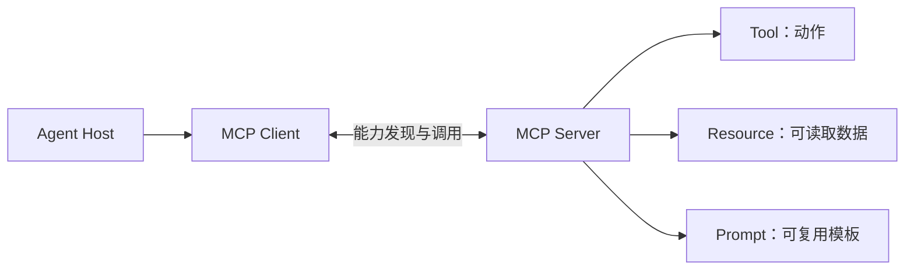
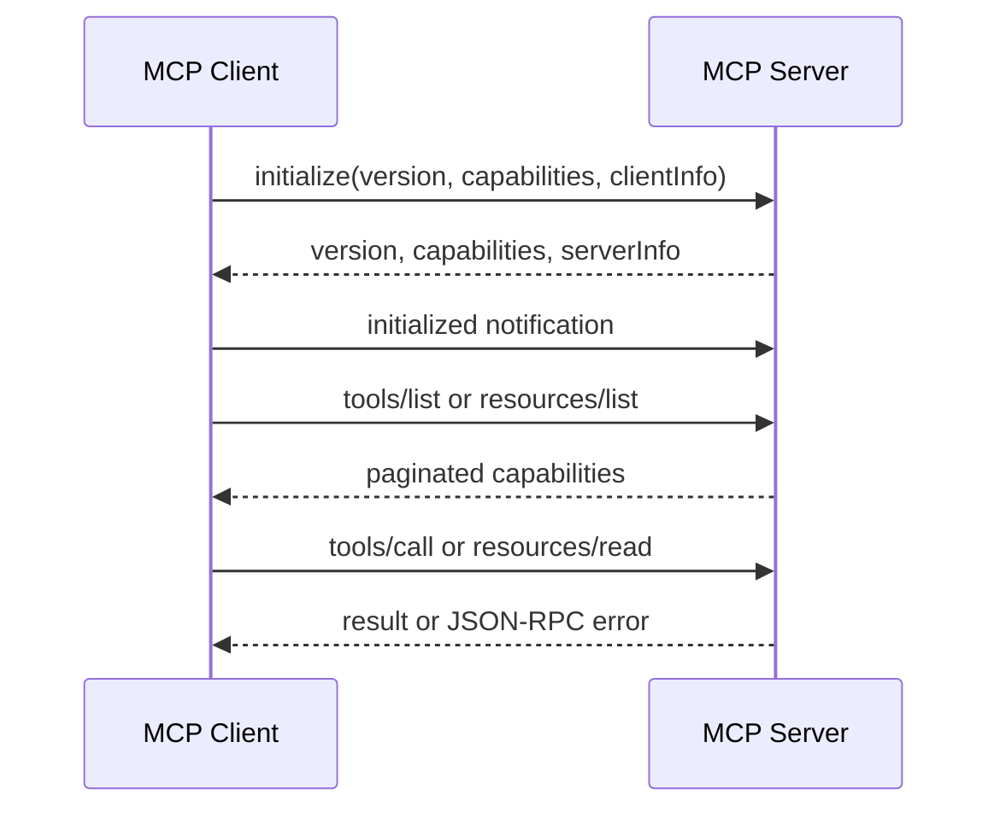

# 第11章：MCP 基础

最后核对日期：2026-07-11；本章按 MCP 规范修订版 2025-11-25 核对。

## 章节导读、学习目标与前置知识
MCP 用统一协议连接模型应用与上下文能力。本章目标是区分 Client、Server、Tool、Resource、Prompt、Transport 和生命周期。前置知识为第8章。

## 核心概念、原理与架构图

Client 管理协议连接，Server 声明能力。stdio 适合本地子进程，远程传输涉及认证、会话和网络边界。MCP 不替代 REST：REST 面向通用服务接口，MCP 重点是让模型宿主发现并使用上下文能力；Tool Calling 是模型提出调用的机制，MCP 是能力暴露与传输协议。

## 最小示例、完整工程、误区与调试
最小 Server 暴露只读 `get_note(id)` 和资源列表；工程版还需初始化握手、Schema、取消、超时、日志、版本协商和授权。误区是“接入 MCP 即自动安全”和“所有 API 都应包装成工具”。调试按握手、能力发现、参数、执行和序列化分层，记录请求 ID 而非敏感正文。

下面是初始化请求的最小 JSON-RPC 消息。真实 stdio Server 应逐行读写 JSON，普通日志只能写 stderr。

```json
{
  "jsonrpc": "2.0",
  "id": 1,
  "method": "initialize",
  "params": {
    "protocolVersion": "2025-11-25",
    "capabilities": {},
    "clientInfo": {"name": "book-client", "version": "1.0.0"}
  }
}
```

本书项目 3 没有用伪函数代替协议：`--server` 会启动 JSON-RPC stdio 循环，Client 再通过 `tools/list`、`tools/call`、`resources/list` 和 `resources/read` 使用能力。

## 数据层、传输层与生命周期

MCP 数据层使用 JSON-RPC 表达请求、响应和通知，传输层负责消息如何跨进程或网络流动。初始化必须是 Client 与 Server 的第一次交互：双方协商协议版本、能力与实现信息；只有已经协商的能力才能在运行阶段使用。关闭阶段没有统一的 MCP shutdown 消息，而是通过底层传输结束连接。所有请求都应设置超时，避免连接悬挂和资源耗尽。

2025-11-25 规范中的 Server 能力包括 prompts、resources、tools、logging、completions 和实验性的 tasks 等；Client 能力可包括 roots、sampling、elicitation 与 tasks。能力发现只描述协议支持，不表示调用获得业务授权。Client 应按当前用户与任务过滤能力集合，Server 对每次读取和动作重新鉴权。



## Tool、Resource 与 Prompt 的控制模型

规范把 Tool 描述为通常由模型选择的动作，把 Resource 描述为由应用选择并加入上下文的数据，把 Prompt 描述为通常由用户显式选择的模板。这是交互模型，不是安全许可。只读数据库查询可设计为 Tool，因为模型需要根据问题动态调用；一份已知手册可设计为 Resource，由客户端决定何时附加；“生成发布说明”模板可设计为 Prompt，供用户从界面选择。

Tool 定义包含名称、描述与输入 JSON Schema，可选输出 Schema。返回内容可以是文本、图像、音频、资源链接或嵌入资源。Client 必须把内容视为不可信数据。Resource 通过 URI 标识，适合列出、读取和订阅；URI 不应直接暴露本机任意路径。Prompt 参数也需要校验，不能因为它是模板就自动获得更高指令级别。

## stdio 与 Streamable HTTP

stdio 中 Client 启动 Server 子进程，协议消息走 stdin/stdout。Server 的 stdout 只能写合法 MCP 消息，普通日志写 stderr，否则一行调试输出就可能破坏消息流。凭证通常通过受控环境注入，stdio 不采用 HTTP 授权流程。子进程继承的环境变量和文件权限必须最小化。

Streamable HTTP 使用一个同时支持 POST 和 GET 的 MCP 端点，可按需使用 SSE 传递多条消息。Server 必须验证 Origin 以防 DNS rebinding，本地服务应绑定 loopback 而不是默认暴露 `0.0.0.0`，并为连接实施认证。HTTP 授权规范建立在 OAuth 体系和受保护资源元数据上，访问令牌应绑定目标 MCP Server，防止 token 被转用于其他资源。

## MCP 与 REST、Function Calling 的关系

已有 REST API 不必全部重写。常见做法是在边界建立 MCP Adapter：它把适合模型使用的少量操作映射为 Tool，把文档映射为 Resource，同时复用 REST 服务已有的认证、审计和业务规则。MCP Server 不应绕过服务层直接连接生产数据库，否则会形成第二套权限模型。

Function Calling 描述模型怎样产生工具名和参数，MCP 描述 Host 如何发现与调用外部上下文能力。一个应用可以使用原生 Function Calling 调用本地函数，也可以把 MCP Tools 转换为模型可见工具。二者组合时，Host 仍负责模型选择、Policy、审批和 Tool 结果回传。

不用 MCP 的情况包括只有一个固定内部函数、没有能力发现需求、调用方不是模型宿主，或已有稳定 SDK 足够。采用 MCP 的主要价值是多 Client/Server 互操作和统一上下文原语，而不是消除每个业务工具的实现工作。

## 工程实践、常见误区、调试与安全

Server 默认最小权限，文件根目录、数据库查询和网络域名使用 allowlist；远程连接校验主体、令牌目标和 Origin；高风险动作进入人工审批。误区包括把 MCP 当作自动安全沙箱、把所有 API 都暴露为 Tool、把能力协商当授权、以及让 Resource 内容覆盖系统指令。

协议调试按初始化、能力发现、请求关联、分页、取消、错误与关闭分层。测试覆盖版本不兼容、未声明能力被调用、未知请求 ID、超时、结果过大、Server 退出和恶意参数。网络传输还要覆盖无 token、错误 audience、跨租户 task ID、非法 Origin 与连接限流。

安全测试应证明界面展示即将调用的工具，用户可以拒绝，Server 会独立执行授权。Prompt Injection 不能通过工具描述、Resource 内容或 Tool 结果改变 Policy。日志记录主体、Server、能力、参数摘要、结果状态与 Trace ID，但不记录访问令牌和敏感正文。

## 总结、练习、面试与延伸阅读

MCP 统一连接，不决定业务权限。练习：为文件 Server 写威胁模型，并画出初始化与关闭时序；为同一知识查询分别设计 REST 与 MCP 接口。面试：Resource 与 Tool 如何选择？stdio 与 Streamable HTTP 的信任边界有何不同？能力协商为什么不等于授权？延伸阅读：[MCP 生命周期](https://modelcontextprotocol.io/specification/2025-11-25/basic/lifecycle)、[Server 原语](https://modelcontextprotocol.io/specification/2025-11-25/server/index)、[授权](https://modelcontextprotocol.io/specification/2025-11-25/basic/authorization)与[传输](https://modelcontextprotocol.io/specification/2025-11-25/basic/transports)。代码目录：`projects/03-mcp-local-agent/`。
