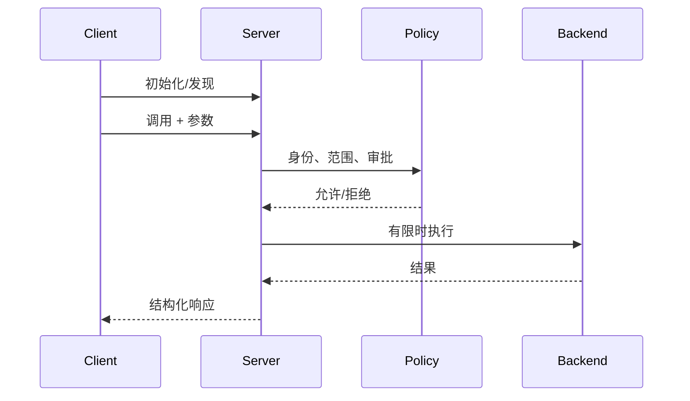

# 第12章：MCP Server 实战

最后核对日期：2026-07-11；协议按 MCP 2025-11-25 核对，SDK 接口仍须以安装版本复核。

## 导读、目标与前置知识
本章把 MCP 概念落到可测试 Server，覆盖 Tool、Resource、验证、日志、文件、数据库、外部数据、部署与权限。前置知识为第11、23章。

学习目标是能够实现并测试一个最小示例，再把它扩展为具备策略、可观测和部署边界的完整工程。

## 核心原理与流程


## 最小与完整工程
最小实现只读固定目录并拒绝 `..` 越界。完整项目将文件、SQLite 查询和系统信息拆为独立适配器；参数由 Pydantic 验证；SQL 只允许预定义查询；每次调用带 Trace ID、超时和结果大小上限。GitHub、股票等外部工具使用接口和 Mock，测试无需账号。

## 误区、调试、实践与安全
不要把 Server 日志写入 stdout 破坏 stdio 协议；不要把客户端传来的路径直接交给系统；不要把任意 SQL 当“数据库工具”。协议测试之外还要测权限、软链接逃逸、超时、取消与并发。部署时固定依赖、非 root 运行、只读文件系统并提供健康检查。

## Server 边界与目录结构

可维护 Server 将协议适配、领域服务和基础设施分开。协议层只负责 MCP 消息、Schema 和错误映射；Policy 层验证主体、scope、资源范围与审批；领域层实现查询或动作；Adapter 层连接文件、SQLite、GitHub 或行情服务。SDK 接口变化时，领域测试不必全部重写。

```text
mcp_server/
├── server.py          # 初始化与能力注册
├── policy.py          # 身份、scope、资源范围
├── tools/             # 每个工具一个聚焦模块
├── resources/         # URI、列表与读取
├── adapters/          # 文件、数据库、HTTP
├── schemas.py         # 输入、输出和错误
└── tests/             # 协议、领域、安全测试
```

## 文件系统 Tool 与 Resource

Server 接收逻辑资源 ID，不直接接受任意绝对路径。根目录在启动配置中固定，解析路径后调用 `resolve()`，再确认最终路径仍位于根目录内；还要考虑软链接逃逸、大小、文件类型和编码。目录列举分页并过滤隐藏文件。只读内容更适合作为 Resource，修改文件才是 Tool，并需要更高权限与审批。

```python
from pathlib import Path


def resolve_under(root: Path, relative: str) -> Path:
    base = root.resolve(strict=True)
    candidate = (base / relative).resolve(strict=True)
    if not candidate.is_relative_to(base):
        raise PermissionError("路径超出授权根目录")
    if not candidate.is_file():
        raise ValueError("只允许读取普通文件")
    return candidate
```

实际读取还应限制字节数，并把二进制类型作为 Resource Blob 或拒绝，而不是随意解码。错误响应不暴露完整本地路径。写入采用临时文件和原子替换，需要并发版本检查。

## 数据库与外部服务工具

数据库 Tool 不接受任意 SQL。Server 暴露预定义操作，例如 `get_order(order_id)` 或 `search_incidents(filters)`，在服务端使用参数化查询和只读账号。返回字段采用 allowlist，防止模型通过“查询全部列”取得 PII。查询设置 statement timeout、行数上限和租户条件。

GitHub、股票和天气 Tool 封装外部客户端，设置连接/读取超时、重试边界、缓存和速率限制。外部响应先转换为领域 Schema，再返回 Client；不要把供应商异常、请求头或密钥交给模型。测试使用 httpx MockTransport 或 Fake Adapter，不访问真实付费服务。

## 参数、结果与错误设计

工具输入使用严格 JSON Schema：拒绝额外字段，字符串有长度，数组有限量，枚举代替自由动作名。输出 Schema 描述可机器处理的结果，但还应考虑内容块与 Resource Links。大结果存为 Resource 并返回链接，比把几兆字节文本塞回模型更可控。

错误分为协议错误、参数错误、策略拒绝、业务错误、上游暂时故障与内部错误。Client 根据稳定 code 判断是否重试；人类可读 message 不作为程序分支。stdio 日志只写 stderr。每次调用记录 request ID、主体、工具、参数哈希、耗时、结果大小和状态。

## 可观测、测试与部署

Server 指标包括活动连接、初始化失败、工具调用、各错误类型、P95 延迟、限流和结果截断。Trace 将 Client run ID 与 Server span 关联。敏感内容采用字段 allowlist，而不是先全量记录再用正则猜测脱敏。

单元测试覆盖领域服务和 Policy；协议测试启动 Server 并完成 initialize、list、call/read；安全测试覆盖路径穿越、越权、结果过大、SQL 注入、SSRF 和错误 token；负载测试覆盖并发、取消与进程重启。任何写工具都要测试幂等与超时后状态核实。

容器以非 root 运行，根文件系统只读，只挂载明确目录。stdio Server 通常由 Host 管理进程；远程 Server 提供 TLS、认证、Origin 校验、健康检查与优雅关闭。部署版本与协议/SDK 版本一起记录，灰度时保留兼容 Client。

## 常见误区、调试方法与安全注意事项

常见误区是把任意文件、任意 SQL 和任意 URL 包成“通用工具”。这扩大了攻击面，也让审计无法理解真实动作。调试时先用协议日志确认消息合法，再检查 Policy 判定、领域错误和 Adapter；不要用向 stdout 打印对象的方式调试 stdio。

Server 不信任 Client 已完成授权，Client 也不信任 Server 返回内容。凭证使用最小 scope，远程调用验证资源 audience，长任务 ID 绑定授权上下文并设置 TTL。高风险动作在 Server 与 Host 两侧都可阻断，形成纵深防御。

## 总结、练习、面试与延伸阅读

练习：实现只读文件 Resource、软链接越界测试和结果大小上限；为数据库工具设计五条 allowlist 查询；为远程 Server 设计 token audience 与 Origin 测试。面试：MCP Server 为什么仍需业务鉴权？stdio 日志写哪里？工具超时后为何不能直接重试写动作？延伸阅读：[MCP Tools](https://modelcontextprotocol.io/specification/2025-11-25/server/tools)、Resources 与官方 SDK 文档。代码目录：`projects/03-mcp-local-agent/`。
