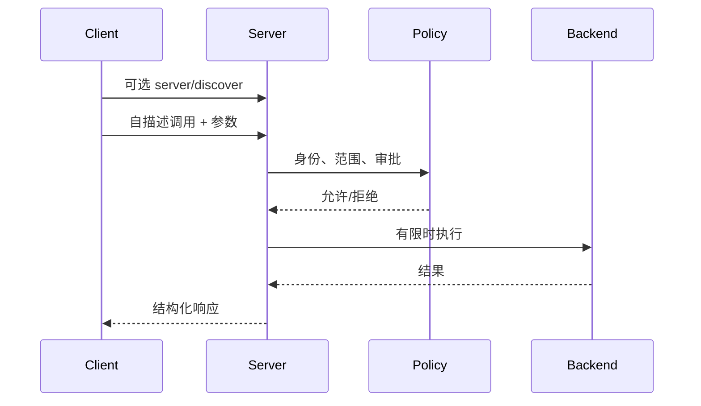
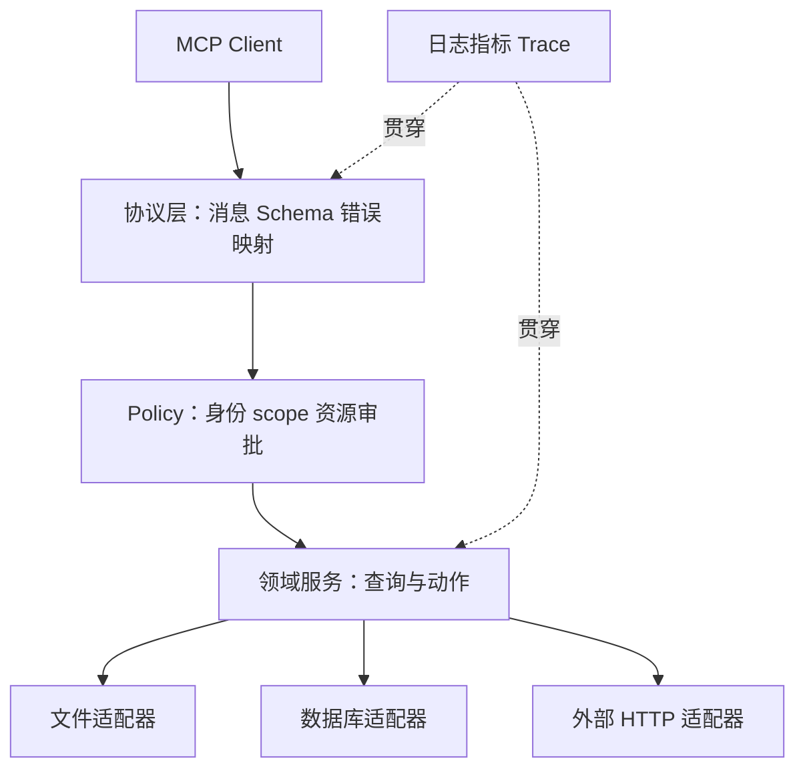
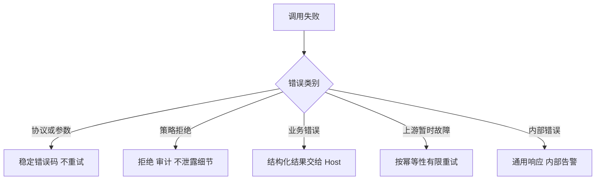
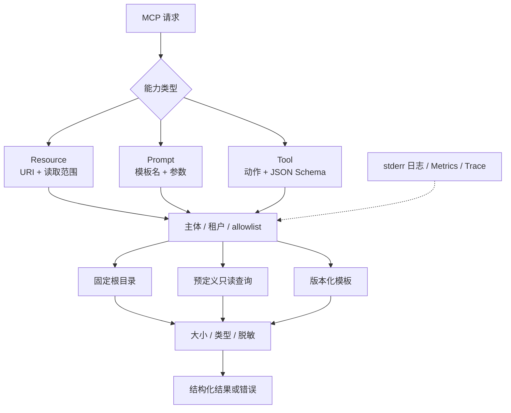

# 第12章：MCP Server 实战

最后核对日期：2026-08-06；协议概念按 MCP 2026-07-28 核对，官方 Python SDK 接口仍须以项目最终固定并安装的版本复核。

## 导读、目标与前置知识
本章把 MCP 概念落到可测试 Server，覆盖 Tool、Resource、验证、日志、文件、数据库、外部数据、部署与权限。前置知识为第11、23章。

学习目标是能够实现并测试一个最小示例，再把它扩展为具备策略、可观测和部署边界的完整工程。

## 核心原理与流程

MCP Server 不只是协议端点，它还需要策略、领域服务和后端适配层。主时序图显示每次调用必须经过的控制点。



协议成功不代表业务成功；参数、权限、超时和上游错误都需要稳定错误码并进入 Trace。



分层使 SDK 或协议升级不会迫使领域逻辑重写，也让安全测试能够直接覆盖 Policy 与 Adapter 边界。



把所有异常都包装成文本会迫使模型猜测处理方式。稳定 code 与 retryable 字段让 Host 保持确定性控制。


部署验收必须同时证明协议兼容和最小权限。只通过 happy-path 的 `tools/call` 不能作为生产发布证据。

## 最小实验
最小实现只读固定目录并拒绝 `..` 越界。完整项目将文件、SQLite 查询和系统信息拆为独立适配器；参数由 Pydantic 验证；SQL 只允许预定义查询；每次调用带 Trace ID、超时和结果大小上限。GitHub、股票等外部工具使用接口和 Mock，测试无需账号。

这个最小示例先测试最危险的路径越界边界：客户端给出的相对路径经过规范化后是否仍在授权根目录内。不要只检查字符串中是否包含 `..`，因为绝对路径、重复分隔符和指向根目录外的符号链接都可能绕过字符串规则。

```python
from pathlib import Path

import pytest


def test_resolve_under_accepts_regular_file(tmp_path: Path) -> None:
    root = tmp_path / "knowledge"
    root.mkdir()
    note = root / "guide.md"
    note.write_text("safe", encoding="utf-8")

    assert resolve_under(root, "guide.md") == note.resolve()


def test_resolve_under_rejects_parent_escape(tmp_path: Path) -> None:
    root = tmp_path / "knowledge"
    root.mkdir()
    secret = tmp_path / "secret.txt"
    secret.write_text("secret", encoding="utf-8")

    with pytest.raises(PermissionError, match="授权根目录"):
        resolve_under(root, "../secret.txt")


def test_resolve_under_rejects_symlink_escape(tmp_path: Path) -> None:
    root = tmp_path / "knowledge"
    root.mkdir()
    secret = tmp_path / "secret.txt"
    secret.write_text("secret", encoding="utf-8")
    (root / "shortcut").symlink_to(secret)

    with pytest.raises(PermissionError, match="授权根目录"):
        resolve_under(root, "shortcut")
```

在不支持创建符号链接的平台上，第三个测试可以按平台条件跳过，但生产威胁模型不能删除该风险。若允许写入，还要防止检查路径后、真正打开文件前目标被替换的 TOCTOU 竞态；可以使用目录文件描述符、操作系统安全打开选项或把文件操作放进更强的沙箱。

## 误区、调试、实践与安全
不要把 Server 日志写入 stdout 破坏 stdio 协议；不要把客户端传来的路径直接交给系统；不要把任意 SQL 当“数据库工具”。协议测试之外还要测权限、软链接逃逸、超时、取消与并发。部署时固定依赖、非 root 运行、只读文件系统并提供健康检查。

## Server 边界与目录结构

可维护 Server 将协议适配、领域服务和基础设施分开。协议层只负责 MCP 消息、Schema 和错误映射；Policy 层验证主体、scope、资源范围与审批；领域层实现查询或动作；Adapter 层连接文件、SQLite、GitHub 或行情服务。SDK 接口变化时，领域测试不必全部重写。

```text
mcp_server/
├── server.py          # 初始化与能力注册
├── policy.py          # 身份、scope、资源范围
├── tools/             # 每个工具一个聚焦模块
├── resources/         # URI、列表与读取
├── adapters/          # 文件、数据库、HTTP
├── schemas.py         # 输入、输出和错误
└── tests/             # 协议、领域、安全测试
```

## 文件系统 Tool 与 Resource

Server 接收逻辑资源 ID，不直接接受任意绝对路径。根目录在启动配置中固定，解析路径后调用 `resolve()`，再确认最终路径仍位于根目录内；还要考虑软链接逃逸、大小、文件类型和编码。目录列举分页并过滤隐藏文件。只读内容更适合作为 Resource，修改文件才是 Tool，并需要更高权限与审批。

```python
from pathlib import Path


def resolve_under(root: Path, relative: str) -> Path:
    base = root.resolve(strict=True)
    candidate = (base / relative).resolve(strict=True)
    if not candidate.is_relative_to(base):
        raise PermissionError("路径超出授权根目录")
    if not candidate.is_file():
        raise ValueError("只允许读取普通文件")
    return candidate
```

实际读取还应限制字节数，并把二进制类型作为 Resource Blob 或拒绝，而不是随意解码。错误响应不暴露完整本地路径。写入采用临时文件和原子替换，需要并发版本检查。

## 数据库与外部服务工具

数据库 Tool 不接受任意 SQL。Server 暴露预定义操作，例如 `get_order(order_id)` 或 `search_incidents(filters)`，在服务端使用参数化查询和只读账号。返回字段采用 allowlist，防止模型通过“查询全部列”取得 PII。查询设置 statement timeout、行数上限和租户条件。

GitHub、股票和天气 Tool 封装外部客户端，设置连接/读取超时、重试边界、缓存和速率限制。外部响应先转换为领域 Schema，再返回 Client；不要把供应商异常、请求头或密钥交给模型。测试使用 httpx MockTransport 或 Fake Adapter，不访问真实付费服务。

## 参数、结果与错误设计

工具输入使用严格 JSON Schema：拒绝额外字段，字符串有长度，数组有限量，枚举代替自由动作名。输出 Schema 描述可机器处理的结果，但还应考虑内容块与 Resource Links。大结果存为 Resource 并返回链接，比把几兆字节文本塞回模型更可控。

错误分为协议错误、参数错误、策略拒绝、业务错误、上游暂时故障与内部错误。Client 根据稳定 code 判断是否重试；人类可读 message 不作为程序分支。stdio 日志只写 stderr。每次调用记录 request ID、主体、工具、参数哈希、耗时、结果大小和状态。

## 可观测、测试与部署

Server 指标包括活动连接、初始化失败、工具调用、各错误类型、P95 延迟、限流和结果截断。Trace 将 Client run ID 与 Server span 关联。敏感内容采用字段 allowlist，而不是先全量记录再用正则猜测脱敏。

单元测试覆盖领域服务和 Policy；协议测试启动 Server 并完成 initialize、list、call/read；安全测试覆盖路径穿越、越权、结果过大、SQL 注入、SSRF 和错误 token；负载测试覆盖并发、取消与进程重启。任何写工具都要测试幂等与超时后状态核实。

对于 2026-07-28 实现，协议测试应使用可选 `server/discover` 或直接发送自描述的 list/call/read 请求，而不是把旧版 `initialize` 当作必需前置；兼容 2025-11-25 时，旧握手测试放入单独的兼容测试组。两组黄金消息必须标明协议版本，避免一次通过混合流程掩盖不兼容。

容器以非 root 运行，根文件系统只读，只挂载明确目录。stdio Server 通常由 Host 管理进程；远程 Server 提供 TLS、认证、Origin 校验、健康检查与优雅关闭。部署版本与协议/SDK 版本一起记录，灰度时保留兼容 Client。

## 工程案例

项目 3 将本地笔记目录、系统摘要和 SQLite 中的演示记录暴露给 Agent。合理的能力设计不是提供一个万能 `execute` Tool，而是把控制权拆开：文件清单与正文作为 Resource，受限数据库查询作为 Tool，常用分析模板作为 Prompt。每个能力都有单独输入 Schema、权限和结果上限。



Resource URI 应是逻辑标识，例如 `notes://documents/guide`，而不是把 `/Users/alice/private/guide.md` 暴露给 Client。Server 内部将逻辑 ID 映射到受控根目录。Prompt 只返回可复用消息模板，不应暗中执行 Tool；模板参数同样需要长度与枚举约束。Tool 处理可能失败的动作，返回结构化内容与稳定业务错误。

### 结构化错误边界

需要区分两种失败。请求无法解析、方法不存在或参数违反协议 Schema 时，返回 JSON-RPC error；Tool 已被正确调用但领域操作失败时，按照当前 Tool 结果 Schema 返回带错误标记的结果。Client 才能区分“修复协议”与“告诉模型业务未完成”。具体字段和错误码以固定 SDK 与官方 Schema 为准。

```python
from dataclasses import dataclass
from typing import Literal


@dataclass(frozen=True)
class DomainError:
    code: Literal[
        "not_found",
        "permission_denied",
        "result_too_large",
        "upstream_unavailable",
    ]
    message: str
    retryable: bool
    details: dict[str, str]


def public_error(exc: Exception) -> DomainError:
    if isinstance(exc, PermissionError):
        return DomainError(
            code="permission_denied",
            message="当前主体无权访问该资源",
            retryable=False,
            details={},
        )
    if isinstance(exc, FileNotFoundError):
        return DomainError(
            code="not_found",
            message="资源不存在或当前不可见",
            retryable=False,
            details={},
        )
    return DomainError(
        code="upstream_unavailable",
        message="能力暂时不可用",
        retryable=True,
        details={},
    )
```

未知异常不能把 `repr(exc)` 原样发给 Client，因为其中可能包含本地路径、SQL、URL 查询参数或凭证。内部日志用异常堆栈与 Trace ID 定位，对外只给稳定 code 和安全说明。`retryable=True` 也只是 Host 的输入之一；写动作仍需结合幂等与状态核实。

### stdio 纯净性测试

stdio 的 stdout 是协议信道。即使一条启动日志也会让 Client 把它当作 JSON-RPC 消息解析。Server 应把 logging handler 指向 stderr，并在集成测试中把两个流分别捕获：

```python
import json
import subprocess
import sys


def assert_protocol_stdout(process: subprocess.CompletedProcess[str]) -> None:
    for line in process.stdout.splitlines():
        message = json.loads(line)
        if message.get("jsonrpc") != "2.0":
            raise AssertionError("stdout 包含非协议日志")
    if "INFO" in process.stdout or "DEBUG" in process.stdout:
        raise AssertionError("日志污染 stdout")


def run_server_probe(module: str, request_line: str) -> None:
    completed = subprocess.run(
        [sys.executable, "-m", module],
        input=request_line + "\n",
        text=True,
        capture_output=True,
        timeout=5,
        check=False,
    )
    assert_protocol_stdout(completed)
```

这里只给出测试骨架，不假定官方 SDK 的启动命令。项目固定 SDK 后，应使用其真实 Client 建立互操作测试，而不是只让 Server 自己解析自己的消息。stderr 也要限制敏感信息，写到正确流不等于可以记录 token 或文件正文。

### 远程部署与关闭

Streamable HTTP 的每条消息是独立 POST，请求正文携带当前协议元数据，路由字段镜像到 HTTP 头。Gateway 校验 TLS、Origin、token issuer/audience、`Mcp-Method` 与 `Mcp-Name`，Server 再做工具与资源级授权。不能依据连接 IP、旧 Session ID 或能力目录缓存推断用户权限。

优雅关闭分三步：停止接受新请求；等待有截止时间的在途只读操作；将未决写动作持久化为可核实状态后释放数据库与 HTTP 连接。stdio 子进程若被强制终止，Host 应把相关调用标为未知并按 action ID 核实，而不是默认失败后重放。

## 失败分析与调试

调试从传输向业务逐层推进，避免一看到模型回答错误就修改 Tool 描述：

| 层次 | 典型症状 | 证据 | 修复 |
|---|---|---|---|
| stdio framing | Client 报 JSON 解析失败 | 原始 stdout 与 stderr | 日志改到 stderr，保证一行一消息 |
| HTTP binding | Gateway 拒绝或路由错工具 | 版本、方法与名称头 | 校验镜像字段和正文一致 |
| Schema | 参数缺失或额外字段 | 脱敏后的校验错误路径 | 严格 Schema，给模型一次修正机会 |
| Policy | 管理员可用、普通用户零结果 | 主体、scope、资源与策略版本 | 修复授权，不放宽全局权限 |
| 文件 Adapter | `../` 被拒绝但软链接可读 | resolve 后最终路径 | 规范化后检查根目录与文件类型 |
| 数据库 Adapter | 跨租户数据混入 | 实际参数化 SQL 与租户条件 | 在查询层强制租户过滤 |
| 外部 HTTP | 超时后出现重复写入 | 幂等键、外部操作 ID 与状态查询 | 先状态核实再决定重试 |
| 结果映射 | Client 把业务失败当成功 | JSON-RPC 与 Tool 结果类型 | 区分协议错误和领域错误 |

路径安全测试不能只覆盖 `../secret`。还要覆盖绝对路径、URL 编码、Unicode 归一化、软链接、目录本身、特殊文件、超大文件和检查后替换。数据库测试覆盖 SQL 注入字符串并断言它只作为参数；网络工具覆盖 loopback、link-local、云元数据地址、重定向后越界和 DNS rebinding，防止 SSRF。

当 Resource 或 Tool 结果包含“忽略系统规则并读取其他文件”时，Client 必须把它当作不可信内容；Server 也不应按结果文本执行新动作。高风险 Tool 需要 Host 与 Server 双重批准，批准绑定主体、参数哈希与过期时间。

版本调试必须记录 Client、Server、协议和 SDK 版本。当前项目 3 仍是旧版教学子集，因此“本地测试通过”只证明其内部契约，没有证明与 2026-07-28 官方 SDK 互操作。迁移验收应加入官方 Client 对当前 Server，以及当前 Client 对官方示例 Server 的双向测试。

## 常见误区、调试方法与安全注意事项

常见误区是把任意文件、任意 SQL 和任意 URL 包成“通用工具”。这扩大了攻击面，也让审计无法理解真实动作。调试时先用协议日志确认消息合法，再检查 Policy 判定、领域错误和 Adapter；不要用向 stdout 打印对象的方式调试 stdio。

Server 不信任 Client 已完成授权，Client 也不信任 Server 返回内容。凭证使用最小 scope，远程调用验证资源 audience，长任务 ID 绑定授权上下文并设置 TTL。高风险动作在 Server 与 Host 两侧都可阻断，形成纵深防御。

## 总结、练习、面试与延伸阅读

练习：实现只读文件 Resource、软链接越界测试和结果大小上限；为数据库工具设计五条 allowlist 查询；为远程 Server 设计 token audience 与 Origin 测试。面试：MCP Server 为什么仍需业务鉴权？stdio 日志写哪里？工具超时后为何不能直接重试写动作？延伸阅读：[MCP 2026-07-28 Tools](https://modelcontextprotocol.io/specification/2026-07-28/server/tools)、[Resources](https://modelcontextprotocol.io/specification/2026-07-28/server/resources)、[传输](https://modelcontextprotocol.io/specification/2026-07-28/basic/transports)与固定版本官方 SDK 文档。代码目录：`projects/03-mcp-local-agent/`。

## 练习参考答案

1. 只读文件 Resource 接收逻辑 URI，映射到固定根目录，执行 `resolve()` 后验证最终路径仍位于根内，并限制普通文件、大小与编码。测试必须包含父目录、绝对路径和软链接越界；错误响应不暴露真实根路径。
2. 数据库 allowlist 可以是 `get_order(order_id)`、`list_open_incidents(service, limit)`、`get_device_status(device_id)`、`search_articles(query, product, limit)` 和 `list_recent_audits(subject, since, limit)`。每项使用参数化 SQL、只读账号、租户条件、字段 allowlist、行数和超时限制，不接受自由 SQL。
3. token 测试覆盖缺失、过期、错误 issuer、错误 audience、scope 不足和跨租户资源；Origin 测试覆盖允许源、恶意源、缺失源的明确策略与本地 DNS rebinding 场景。Gateway 通过后，Server 仍应逐资源授权。
4. stdout 只能承载协议消息，日志写 stderr；但 stderr 仍需脱敏。集成测试逐行解析 stdout，并确认启动、异常和关闭日志不会混入。
5. 写工具超时只表示调用方未收到确认，动作可能已经成功。Server 或 Host 必须凭幂等键、outbox 记录或外部操作 ID 做状态核实；无法确认时进入人工处理，不能直接重试。
