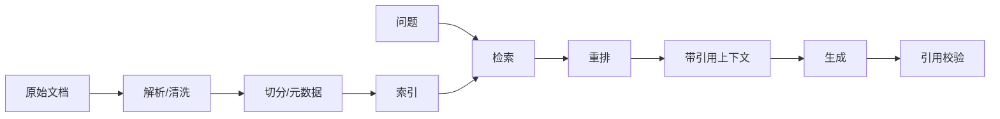
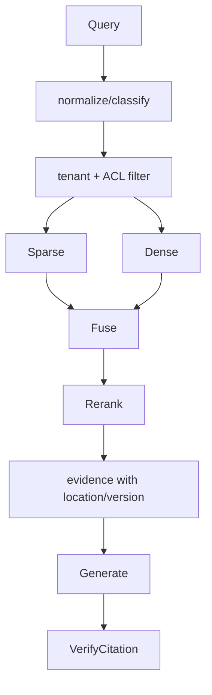
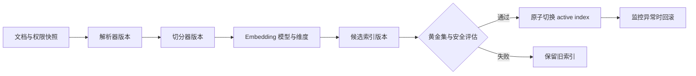
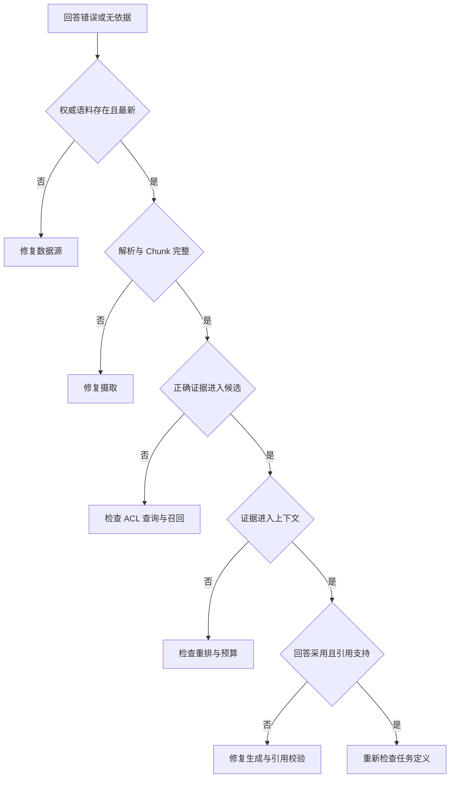

# 第13章：RAG 基础

最后核对日期：2026-07-11。

## 导读、目标与前置知识
RAG 在生成前检索外部资料，适合知识频繁变化且需要引用的任务。本章覆盖加载、解析、切分、Embedding、索引、检索、重排、增强和引用。前置知识为第5章。

学习目标是掌握完整链路的核心边界，并能从常见误区和失败 Trace 定位质量问题。

## 原理与架构图

RAG 包含离线摄取与在线查询两条相交链路。下图先展示端到端主路径，后续图再拆解权限、索引版本与故障定位。


RAG 与微调不同：RAG 在调用时提供证据，便于更新和引用；微调主要改变参数行为。二者可以组合。

## 最小与完整工程
最小系统处理 Markdown，返回 top-k 片段及文档 ID。工程版记录解析器、切分器、Embedding 和索引版本，支持增量更新、删除、权限过滤、引用定位和评估。生成 Prompt 要求只依据证据、缺证时拒答，并把事实句关联来源。

检索接口必须把租户过滤和引用元数据放进类型契约，而不是只返回一组字符串：

```python
from pydantic import BaseModel


class RetrievedChunk(BaseModel):
    tenant_id: str
    document_id: str
    chunk_id: str
    page: int
    text: str
    score: float


def retrieve(query: str, *, tenant_id: str, top_k: int = 5) -> list[RetrievedChunk]:
    """先执行 tenant/ACL 过滤，再进行检索与重排。"""
    ...
```

省略 `tenant_id` 并在生成后删除敏感句子，不是可靠的权限控制；未授权内容一旦进入上下文就已经形成数据泄露风险。

## 失败、调试、实践与安全
失败包括坏文档、OCR 错误、切分断裂、查询不匹配、召回不足、重排错误和模型忽略证据。调试必须保存每阶段候选。RAG 不适合强事务查询、简单结构化数据库问题或无可靠语料场景。文档可能包含间接注入，权限过滤必须在检索层执行。

## 数据摄取与文档质量

RAG 的上限首先由语料决定。摄取阶段保存原始文件哈希、来源 URI、版本、权限、解析器版本和时间。PDF 可能是文本层、扫描图像或两者混合；Word、PPT 和 Markdown 的标题、表格、备注与链接结构也不同。解析器不能只返回一串无位置文本，否则引用无法回到页码或幻灯片。

清洗去除重复页眉页脚、导航和乱码，但不应删除否定词、单位和表格表头。OCR 结果保存置信度与坐标，低置信页面进入人工检查。文档更新采用新版本并使旧 Chunk 失效，删除请求同时清理原文、向量、缓存和派生摘要。

## Chunk、索引与检索

Chunk 需要自包含但不过度宽泛。技术手册常按标题层级与段落切分，表格把表头复制到每个相关块，代码按函数或类边界切分。Overlap 只在边界确有上下文损失时使用。每块 Metadata 包含文档、章节、页码、版本、时间、语言、租户和权限。

检索前先做权限过滤和查询分类。稀疏检索对故障码、产品号和专有词敏感，稠密检索处理语义改写，混合检索可通过 Reciprocal Rank Fusion 等方法融合。初检取得较多候选，Reranker 对少量候选做更精细的 query-document 相关性判断。



索引不是一次性产物。Embedding 模型、维度、距离、切分器和预处理任何一项变化，都需要新索引版本。后台构建完成并通过评估后，再原子切换 active index；不要把不同 Embedding 空间的向量混在同一索引。



索引版本是文档、权限、解析、切分和向量空间的组合产物。任何一个组成部分变化都需要可比较的新版本，而不是混写旧集合。



这棵树避免把所有 RAG 问题归咎于 Prompt。只有证据已经正确进入上下文而模型仍误用时，生成层才是首要修复位置。

## Prompt Augmentation 与 Citation

进入 Prompt 的片段带稳定引用 ID、标题、位置和时间，并明确声明它们只是数据。模型被要求每个事实主张引用一个或多个证据，缺少证据时拒答。生成后 Citation Validator 确认引用 ID 存在、用户仍有权限，并可选检查引用片段是否支持主张。

Grounding 指利用可追溯外部数据约束回答的事实基础，它不等同于“答案末尾带有链接”。Citation 解决来源定位，Faithfulness 检查主张是否得到所引证据支持，而 Grounding 还要求证据来自适当权限范围、版本和时间点。一个回答可能引用了真实文档，却误读文档或把过期版本当成当前事实；这时 Citation 存在，但 Grounding 仍然失败。工程上应分别记录检索命中、证据采用、主张—证据支持关系和无依据拒答，不能用单一“引用率”代替这些检查。

回答末尾随意列几个来源不是可靠 Citation。引用应靠近对应主张，区分直接证据和模型推断。若两个来源冲突，回答说明冲突与各自时间，不把较新或较长来源默认当真。引用页面还应允许用户查看被使用的原文范围。

## 完整工程示例与数据流

摄取 Worker 与在线查询服务分离。文档进入对象存储，解析和切分产生版本化 Chunk，Embedding Worker 写新索引，完成后切换索引。查询服务读取当前索引，执行 ACL、检索、重排、上下文预算和生成。评估服务定期运行黄金集，发现回归时阻止索引或模型升级。

最小领域接口不应直接返回数据库行，而返回 `RetrievedChunk(document_id, version, location, text, score)`。Generator 只接收已授权 Chunk。最终 `Answer` 包含文本、引用、无法确认事项和索引版本，便于审计与重放。

Trace 记录 query、过滤器、候选 ID、稀疏/稠密/重排分数、进入上下文的片段、生成引用与耗时。正文和 query 按隐私策略脱敏或不落盘。指标分解为解析失败、索引新鲜度、Recall@k、无结果率、引用率、Faithfulness、P95 延迟与单查询成本。

## 常见失败、调试方法与工程实践

回答错误时按链路定位：权威文档是否存在；解析是否完整；Chunk 是否保留关键表头；过滤是否误排；正确 Chunk 是否进入 top-k；Reranker 是否降权；上下文是否被截断；模型是否采用证据；引用是否支持主张。只有最后两步失败时，调整生成 Prompt 才是主要手段。

RAG 不适合回答余额、库存、订单状态等强一致结构化事实，应调用业务 API；也不适合语料缺乏权威性或用户真正需要开放创作的场景。把所有业务统一到向量检索会损失精确性和事务语义。

## 安全注意事项与评估

权限过滤在检索查询中执行，不能检索后再让模型“不要透露”。文档可能含间接 Prompt Injection、恶意链接和个人数据；摄取时扫描，Prompt 中隔离，工具不因文档指令改变。多租户索引即使共库也必须强制 tenant 条件，缓存键同样包含租户与权限版本。

测试包含解析黄金文件、Chunk 边界、删除传播、ACL、检索指标、引用验证、注入文档和无答案拒答。评估集按真实问题分层，避免只用与文档标题高度相似的人工查询。检索层的 Recall@k 与最终回答正确率分别报告，不能用一个总分掩盖错误位置。

## 总结、练习、面试与延伸阅读

练习：为维修手册设计切分与引用；构造无法回答问题并验证拒答；用十个真实查询比较稀疏、稠密和混合检索。面试：RAG 为什么仍会幻觉？何时直接 SQL 优于 RAG？如何定位正确文档未进入最终回答的原因？延伸阅读：Lewis et al., *Retrieval-Augmented Generation for Knowledge-Intensive NLP Tasks*；目标解析器、Embedding 与向量库官方文档。代码目录：`projects/04-knowledge-agent/`。
