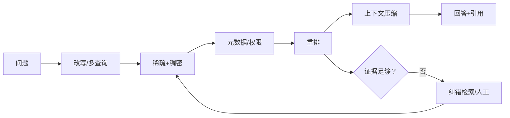
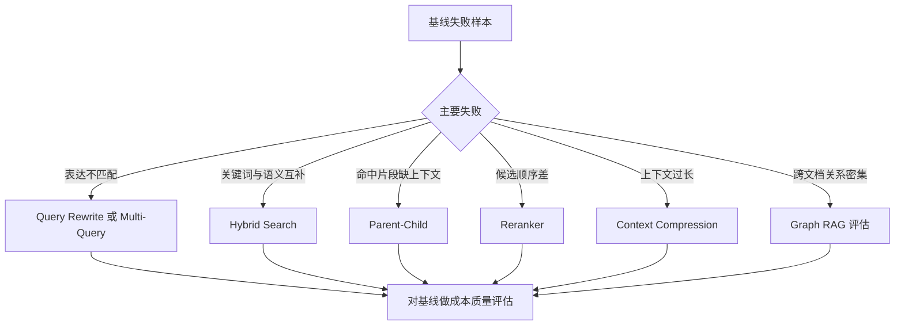
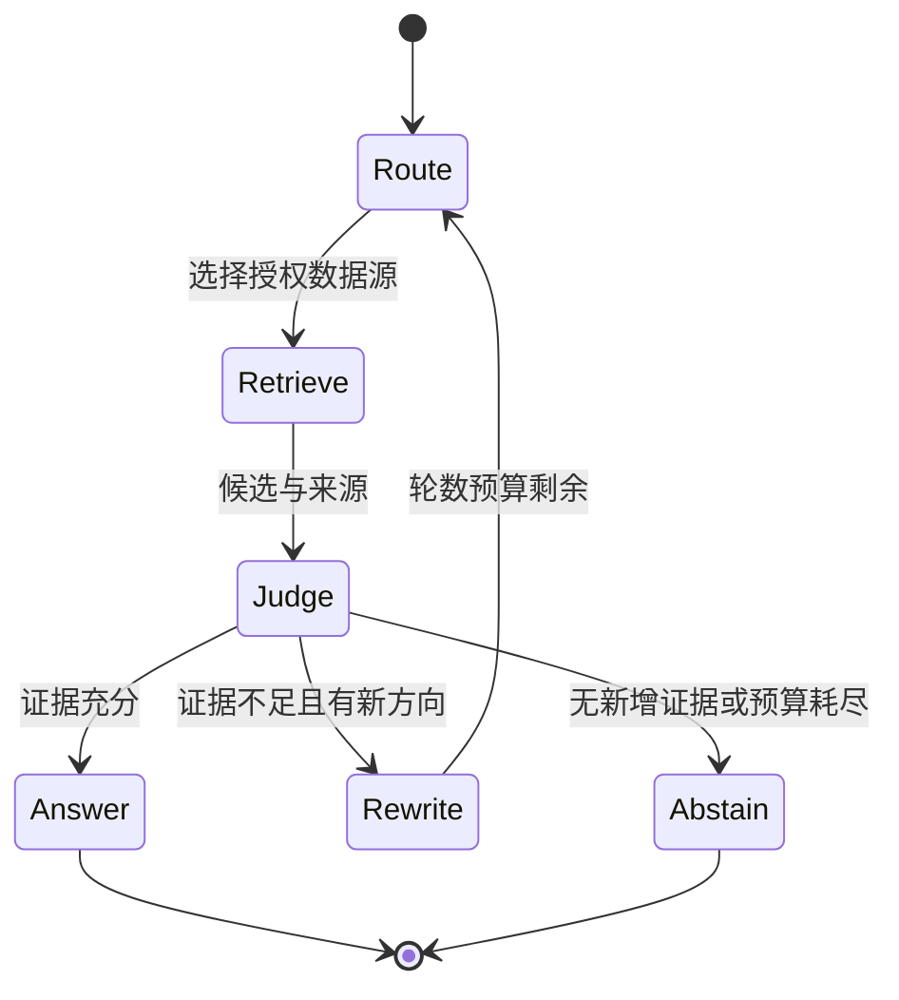
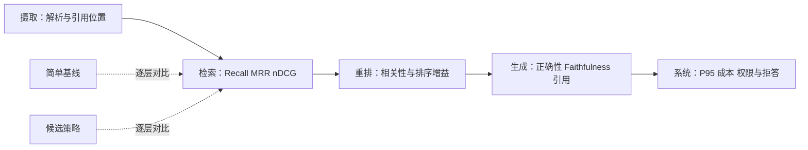

# 第14章：RAG 高级技术

最后核对日期：2026-07-11。

## 导读、目标与前置知识
高级 RAG 的目标不是堆技术名词，而是针对可测失败改进召回与证据质量。本章覆盖 Parent-Child、语义切分、过滤、改写、多查询、混合检索、重排、压缩、Corrective/Self/Graph/Agentic 和多模态 RAG。

学习目标是理解每项技术的核心机制、替代方案和评估成本，并能拒绝没有基线证据的复杂化。前置知识为第13章。

## 原理与流程图

高级 RAG 应从可测失败出发选择增强节点。主图展示查询增强、混合召回、重排压缩和纠错检索之间的关系。



Parent-Child 用小块定位、大块回答；Query Rewriting 处理表达差异，但可能漂移意图；Multi-Query 提高召回却增加成本；Reranker 用更贵模型精排少量候选。Graph RAG 适合关系密集语料，并非普通文档默认方案。



每种技术对应特定失败模式。没有真实基线和分层指标时，增加节点只会增加延迟、费用和新的不可观测错误。



循环必须限制检索轮数、来源域和新增证据阈值。拒答是控制路径的一部分，不应通过重复搜索掩盖语料缺失。



发布判断同时看质量、成本、延迟和安全。最终回答分数提高但跨租户过滤或尾延迟退化，仍不能发布。

## 最小与完整工程、调试与评估
完整工程先建立基线，再逐项开启策略。检索评估用 Recall@k、MRR/nDCG，回答评估看正确性、Faithfulness 和引用。每项优化必须在真实查询集证明收益，并记录延迟和费用。Agentic RAG 允许动态选择检索器，但需限制轮数和来源域。

## 误区、安全、总结与练习

### Parent-Child 与语义切分

Parent-Child 将“检索单位”和“回答单位”分开。小 Child Chunk 容易与精确查询匹配，命中后返回包含上下文的 Parent，适合章节较长、局部术语密集的手册。Parent 太大会重新引入噪声；Child 与 Parent 的版本和权限必须一致，不能让一个可见 Child 带回不可见 Parent。

语义切分根据相邻句子表示变化寻找边界，可能比固定长度更符合主题，但需要额外模型和阈值，并容易在列表、表格和代码上产生奇怪边界。选择前先用固定/结构切分建立基线，用真实问题比较 Recall 和引用完整性，而不是只看 Chunk 外观。

### Query Rewriting 与 Multi-Query

Query Rewriting 可以补充缩写、规范实体和把多轮指代还原为独立问题。改写器输出原始意图、改写文本和变更理由；实体、时间、否定和数值约束不可静默改变。对“不要包含已关闭事件”的查询，如果改写丢掉“不要”，召回越强反而越危险。

Multi-Query 生成多个角度并合并候选，适合用户表达与文档语言差异较大时。应去重、限制数量并保留每个候选由哪个查询命中。查询扩展带来的 Token 与检索成本必须计入单任务预算。

### Hybrid、Reranking 与 Context Compression

混合检索先把稀疏和稠密排名归一化或用 RRF 融合，权重在评估集上选择。Metadata Filtering 应尽量在索引检索时生效；先取全库 top-k 再过滤可能导致某租户没有足够结果，也可能让敏感候选进入日志。

Reranker 接收 query 与候选全文，计算更准确的相关性，通常只处理几十个候选。它不会验证事实真伪。Context Compression 从候选中提取相关句或删除冗余，但必须保留来源位置、否定、限定词和表格表头；压缩前后应测试 Faithfulness。

```python
def reciprocal_rank_fusion(rankings: list[list[str]], k: int = 60) -> list[str]:
    scores: dict[str, float] = {}
    for ranking in rankings:
        for rank, document_id in enumerate(ranking, 1):
            scores[document_id] = scores.get(document_id, 0.0) + 1 / (k + rank)
    return sorted(scores, key=scores.get, reverse=True)
```

该最小示例只融合文档 ID；工程实现还要携带租户、版本和 Chunk，并明确处理同一文档多个块。

### Corrective RAG、Self-RAG 与 Agentic RAG

Corrective RAG 在证据不足时改写查询、换检索器或转人工。证据判定器本身可能误判，因此需要“无证据拒答”基线。Self-RAG 类方法让模型在生成过程中评价检索与回答，增加控制点也增加模型调用。工程上应拆成可观测步骤，而不是把所有反思藏在一次长 Prompt 中。

Agentic RAG 让运行时根据问题选择 SQL、关键词、向量、图或网络搜索。它适合查询类型多且路径难以预先枚举的场景；若所有问题都来自同一知识库，确定性 Router 更便宜可靠。Agent 设置最大检索轮数、来源 allowlist 和新增证据判定，避免重复搜索。

### Graph RAG 与多模态 RAG

Graph RAG 将实体、关系、社区或事件图与文本证据结合，适合供应链、组织关系和跨文档事件链。图的关系必须能回溯原文，图数据库本身不是 Graph RAG。构图错误会在多跳查询中放大，需要实体消歧、关系置信和版本治理。

多模态 RAG 同时索引文字、页面图像、表格和音视频片段。检索结果携带页码坐标或时间码，生成引用可回到原媒体。OCR/ASR 错误、图像权限和媒体成本必须单独评估。

### 调试、评估与安全

高级链路每增加一步，都要提供可关闭开关与独立指标。离线实验固定语料与查询，按策略比较 Recall@k、nDCG、回答正确、Faithfulness、引用、P95 延迟和费用。显著性不足时保留简单基线。线上监控改写漂移、无结果、重复检索和压缩比例。

外部网页、图谱描述和压缩摘要都是不可信数据。查询改写不能扩大用户权限，Multi-Query 每个查询都使用同一 ACL，Graph 遍历不能跨租户边，Agentic Router 不能选择未授权数据源。
常见误区：高级链路必然优于基线；LLM-as-Judge 可替代人工；图数据库自动等于 Graph RAG。总结：高级 RAG 必须由具体失败和评估证据驱动。练习：对比基线、混合和重排三组实验，并为一次查询漂移写回归测试。面试：查询改写如何导致漂移？何时不使用 Graph RAG？Reranker 与生成 Judge 的职责有何差异？延伸阅读：RRF、Corrective RAG、Self-RAG、Graph RAG 论文及所用检索器官方文档。代码目录：`projects/04-knowledge-agent/`。
