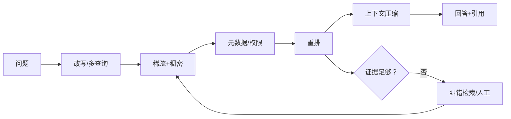
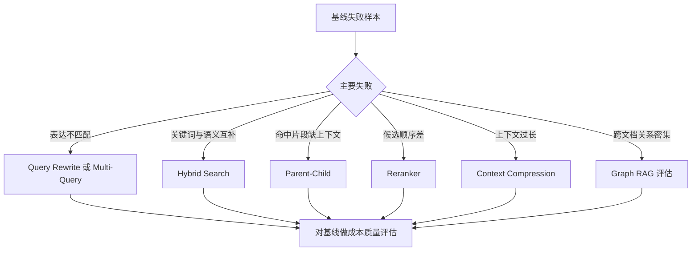
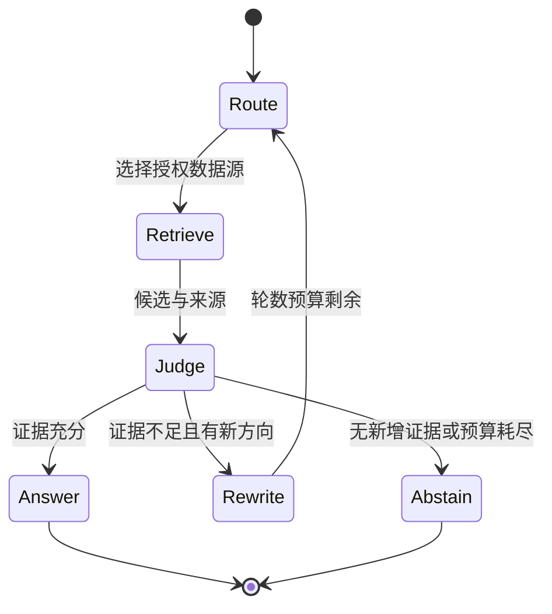
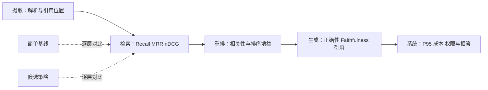
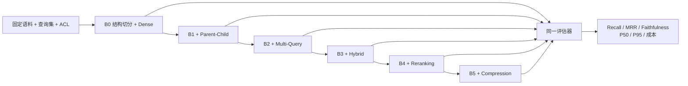

# 第14章：RAG 高级技术

最后核对日期：2026-07-11。

## 导读、目标与前置知识
高级 RAG 的目标不是堆技术名词，而是针对可测失败改进召回与证据质量。本章覆盖 Parent-Child、语义切分、过滤、改写、多查询、混合检索、重排、压缩、Corrective/Self/Graph/Agentic 和多模态 RAG。

学习目标是理解每项技术的核心机制、替代方案和评估成本，并能拒绝没有基线证据的复杂化。前置知识为第13章。

## 原理与流程图

高级 RAG 应从可测失败出发选择增强节点。主图展示查询增强、混合召回、重排压缩和纠错检索之间的关系。



Parent-Child 用小块定位、大块回答；Query Rewriting 处理表达差异，但可能漂移意图；Multi-Query 提高召回却增加成本；Reranker 用更贵模型精排少量候选。Graph RAG 适合关系密集语料，并非普通文档默认方案。



每种技术对应特定失败模式。没有真实基线和分层指标时，增加节点只会增加延迟、费用和新的不可观测错误。



循环必须限制检索轮数、来源域和新增证据阈值。拒答是控制路径的一部分，不应通过重复搜索掩盖语料缺失。



发布判断同时看质量、成本、延迟和安全。最终回答分数提高但跨租户过滤或尾延迟退化，仍不能发布。

## 最小实验
完整工程先建立基线，再逐项开启策略。检索评估用 Recall@k、MRR/nDCG，回答评估看正确性、Faithfulness 和引用。每项优化必须在真实查询集证明收益，并记录延迟和费用。Agentic RAG 允许动态选择检索器，但需限制轮数和来源域。

最小示例使用同一份查询结果表做消融，而不是为每个高级技术选择最有利案例。先定义基线，再一次只增加一个变量：`dense`、`dense + Hybrid`、`dense + Hybrid + Reranking`。如果同时改变 Chunking、Embedding、top-k 和 Prompt，就无法知道收益来自哪里。

```python
from dataclasses import dataclass


@dataclass(frozen=True)
class RetrievalRun:
    strategy: str
    ranked_ids: tuple[str, ...]
    latency_ms: float
    cost_units: float


def recall_at_k(
    run: RetrievalRun, relevant_ids: set[str], *, k: int
) -> float:
    if not relevant_ids or k <= 0:
        raise ValueError("相关集合与 k 必须有效")
    return len(set(run.ranked_ids[:k]) & relevant_ids) / len(relevant_ids)


def reciprocal_rank(run: RetrievalRun, relevant_ids: set[str]) -> float:
    return next(
        (
            1.0 / rank
            for rank, document_id in enumerate(run.ranked_ids, start=1)
            if document_id in relevant_ids
        ),
        0.0,
    )
```

实验数据应按查询而不是按成功截图保存。每条样本包含问题、相关 Chunk 或父文档、租户、查询类型和难度标签；每次运行记录策略配置、索引版本、延迟和成本。小规模教学集可以手工标注，但不能把人工构造的关键词同文档标题完全复制，否则会高估稀疏检索。

## 工程案例

继续使用企业制度问答基线。评估集包含四类查询：精确制度编号、自然语言改写、需要完整上下文的条款、跨文档冲突。第一轮仅使用结构切分和稠密召回；随后逐项加入 Parent-Child、Multi-Query、Hybrid、Reranking 与压缩。



阶梯图不表示所有技术都应该保留。若 B2 的 Multi-Query 仅改善极少数查询，却显著提高 P95 延迟和费用，可以回退到 B1，并只对“原查询零结果”条件触发多查询。若 B5 压缩降低引用完整性，即使 Token 下降也不能直接发布。

### 消融结果表

下面是实验报告模板，`实测` 必须由同一套脚本填充，不能在教材中编造漂亮数字：

| 版本 | 唯一变化 | Recall@5 | MRR | Faithfulness | P50/P95 ms | 成本/查询 | 结论 |
|---|---|---:|---:|---:|---:|---:|---|
| B0 | Dense 基线 | 实测 | 实测 | 实测 | 实测 | 实测 | 比较基准 |
| B1 | + Parent-Child | 实测 | 实测 | 实测 | 实测 | 实测 | 上下文是否更完整 |
| B2 | + Multi-Query | 实测 | 实测 | 实测 | 实测 | 实测 | 召回增益是否抵消扩写成本 |
| B3 | + Hybrid | 实测 | 实测 | 实测 | 实测 | 实测 | 编号类查询是否改善 |
| B4 | + Reranking | 实测 | 实测 | 实测 | 实测 | 实测 | 前列排序增益 |
| B5 | + Compression | 实测 | 实测 | 实测 | 实测 | 实测 | Token 降低是否损害证据 |

平均延迟会掩盖 Multi-Query 和 Reranker 的尾部影响，因此至少报告 P50 与 P95。成本包括查询改写模型、Embedding、检索、重排、压缩和生成的全部调用。若系统有缓存，应分别报告冷缓存与热缓存，不能把热缓存结果冒充所有请求性能。

### 按失败模式启用策略

完整工程通常不是固定串联所有节点，而是由确定性信号选择最小策略。故障码或制度编号查询优先稀疏加稠密；自然语言改写在基线低置信时才启用 Multi-Query；Child 命中但信息不完整时回取 Parent；候选很多且分数接近时再使用 Reranker；上下文超预算时才压缩。

```python
from dataclasses import dataclass


@dataclass(frozen=True)
class RetrievalPolicy:
    use_parent: bool
    use_multi_query: bool
    use_hybrid: bool
    use_reranker: bool
    use_compression: bool


def choose_policy(
    *,
    has_exact_identifier: bool,
    baseline_has_results: bool,
    candidate_count: int,
    context_over_budget: bool,
) -> RetrievalPolicy:
    return RetrievalPolicy(
        use_parent=True,
        use_multi_query=not baseline_has_results,
        use_hybrid=has_exact_identifier,
        use_reranker=candidate_count > 10,
        use_compression=context_over_budget,
    )
```

这个规则只是可解释起点，阈值仍需评估。它的价值是每个高级节点都有触发原因、指标和关闭开关。若改成模型 Router，也必须让输出落在同一个受控策略 Schema 内，且不能改变 ACL 或数据源 allowlist。

### Parent-Child 与权限一致性

Parent-Child 最危险的实现错误是只过滤 Child 权限，然后返回权限更宽或不同版本的 Parent。索引应记录 `parent_id`、两者版本和相同授权域；回取 Parent 时再次按当前主体过滤。删除 Child 所属文档时，Parent、所有 Child、向量与缓存一起失效。

Multi-Query 也不能用一条扩写查询越过原问题的租户、时间或否定约束。系统可以把关键实体与约束抽成不可变字段，改写器只修改搜索表达。融合 Trace 保存每个候选由哪条查询命中，便于发现某个扩写造成主题漂移。

## 失败分析与调试

高级链路故障更难定位，因为多个节点可能相互抵消。调试必须支持逐节点旁路和重放：

| 现象 | 可能原因 | 对照方式 | 处理 |
|---|---|---|---|
| Recall 提高但答案变差 | Parent 太大或候选噪声增加 | B0 与 B1 上下文差异 | 缩小 Parent 或提高选择门禁 |
| Multi-Query 召回越界主题 | 实体、时间或否定约束漂移 | 原查询与每条改写 diff | 冻结约束并拒绝危险改写 |
| Hybrid 不如 Dense | 精确词支路引入模板噪声 | 分查询类型看排名 | 调整融合或只条件启用 |
| Reranker 降低权威来源 | 只学相关性，忽略权威元数据 | 重排前后 authority 分布 | 排序中加入确定性权威门禁 |
| 压缩后数字或否定词丢失 | 生成式压缩有损 | 压缩前后事实 diff | 保留原句和引用，规则保护关键字段 |
| P95 急剧上升 | 多查询扇出或慢 Reranker | 节点级 Trace 与并发数 | 截止时间、并发上限和条件启用 |
| Corrective RAG 无限循环 | 没有新增证据停止条件 | 查询/候选集合哈希 | 限轮次，无新增证据即拒答 |

Agentic RAG 的失败恢复不能无限换数据源。Router 只能选择当前主体获准的数据源，且每轮必须带来新的可验证证据；连续候选集合相同、查询只做同义改写或预算耗尽时，停止并拒答。Graph RAG 若实体消歧错误，应回到构图与原文证据层，而不是让 Writer 自行修复关系。

安全回归包括：所有 Multi-Query 使用相同 ACL；Parent 回取不越权；Reranker 与压缩器看不到不必要的 PII；外部网页指令不改变 Router；图遍历始终带租户条件；缓存键包含策略、索引和权限版本。

## 误区、安全、总结与练习

### Parent-Child 与语义切分

Parent-Child 将“检索单位”和“回答单位”分开。小 Child Chunk 容易与精确查询匹配，命中后返回包含上下文的 Parent，适合章节较长、局部术语密集的手册。Parent 太大会重新引入噪声；Child 与 Parent 的版本和权限必须一致，不能让一个可见 Child 带回不可见 Parent。

语义切分根据相邻句子表示变化寻找边界，可能比固定长度更符合主题，但需要额外模型和阈值，并容易在列表、表格和代码上产生奇怪边界。选择前先用固定/结构切分建立基线，用真实问题比较 Recall 和引用完整性，而不是只看 Chunk 外观。

### Query Rewriting 与 Multi-Query

Query Rewriting 可以补充缩写、规范实体和把多轮指代还原为独立问题。改写器输出原始意图、改写文本和变更理由；实体、时间、否定和数值约束不可静默改变。对“不要包含已关闭事件”的查询，如果改写丢掉“不要”，召回越强反而越危险。

Multi-Query 生成多个角度并合并候选，适合用户表达与文档语言差异较大时。应去重、限制数量并保留每个候选由哪个查询命中。查询扩展带来的 Token 与检索成本必须计入单任务预算。

### Hybrid、Reranking 与 Context Compression

混合检索先把稀疏和稠密排名归一化或用 RRF 融合，权重在评估集上选择。Metadata Filtering 应尽量在索引检索时生效；先取全库 top-k 再过滤可能导致某租户没有足够结果，也可能让敏感候选进入日志。

Reranker 接收 query 与候选全文，计算更准确的相关性，通常只处理几十个候选。它不会验证事实真伪。Context Compression 从候选中提取相关句或删除冗余，但必须保留来源位置、否定、限定词和表格表头；压缩前后应测试 Faithfulness。

```python
def reciprocal_rank_fusion(rankings: list[list[str]], k: int = 60) -> list[str]:
    scores: dict[str, float] = {}
    for ranking in rankings:
        for rank, document_id in enumerate(ranking, 1):
            scores[document_id] = scores.get(document_id, 0.0) + 1 / (k + rank)
    return sorted(scores, key=scores.get, reverse=True)
```

该最小示例只融合文档 ID；工程实现还要携带租户、版本和 Chunk，并明确处理同一文档多个块。

### Corrective RAG、Self-RAG 与 Agentic RAG

Corrective RAG 在证据不足时改写查询、换检索器或转人工。证据判定器本身可能误判，因此需要“无证据拒答”基线。Self-RAG 类方法让模型在生成过程中评价检索与回答，增加控制点也增加模型调用。工程上应拆成可观测步骤，而不是把所有反思藏在一次长 Prompt 中。

Agentic RAG 让运行时根据问题选择 SQL、关键词、向量、图或网络搜索。它适合查询类型多且路径难以预先枚举的场景；若所有问题都来自同一知识库，确定性 Router 更便宜可靠。Agent 设置最大检索轮数、来源 allowlist 和新增证据判定，避免重复搜索。

### Graph RAG 与多模态 RAG

Graph RAG 将实体、关系、社区或事件图与文本证据结合，适合供应链、组织关系和跨文档事件链。图的关系必须能回溯原文，图数据库本身不是 Graph RAG。构图错误会在多跳查询中放大，需要实体消歧、关系置信和版本治理。

多模态 RAG 同时索引文字、页面图像、表格和音视频片段。检索结果携带页码坐标或时间码，生成引用可回到原媒体。OCR/ASR 错误、图像权限和媒体成本必须单独评估。

### 调试、评估与安全

高级链路每增加一步，都要提供可关闭开关与独立指标。离线实验固定语料与查询，按策略比较 Recall@k、nDCG、回答正确、Faithfulness、引用、P95 延迟和费用。显著性不足时保留简单基线。线上监控改写漂移、无结果、重复检索和压缩比例。

外部网页、图谱描述和压缩摘要都是不可信数据。查询改写不能扩大用户权限，Multi-Query 每个查询都使用同一 ACL，Graph 遍历不能跨租户边，Agentic Router 不能选择未授权数据源。
常见误区：高级链路必然优于基线；LLM-as-Judge 可替代人工；图数据库自动等于 Graph RAG。总结：高级 RAG 必须由具体失败和评估证据驱动。练习：对比基线、混合和重排三组实验，并为一次查询漂移写回归测试。面试：查询改写如何导致漂移？何时不使用 Graph RAG？Reranker 与生成 Judge 的职责有何差异？延伸阅读：RRF、Corrective RAG、Self-RAG、Graph RAG 论文及所用检索器官方文档。代码目录：`projects/04-knowledge-agent/`。

## 练习参考答案

1. 基线、Hybrid 和 Rerank 实验必须固定语料、查询、ACL、Chunk、Embedding、top-k 与生成配置；每次只改变指定策略，报告 Recall/MRR、Faithfulness、P95 和总成本。若 Hybrid 提升编号查询但损害其他查询，可以按查询类型条件启用。
2. 查询漂移回归样本可用“查找 2025 年制度，但不要包含已废止版本”。断言每条改写都保留时间与否定约束，检索候选版本合法；仅比较改写文本相似度不足以证明没有漂移。
3. Graph RAG 不适合关系简单、主要按段落检索、缺乏可靠实体消歧或更新频繁但无图治理能力的语料。向量或混合检索若已满足指标，引入图只会增加构建、版本和调试成本。
4. Reranker 判断 query-document 相关性并改善候选顺序；生成 Judge 评价最终主张是否正确或忠于证据。二者输入、失败位置和评价目标不同，不能用 Judge 掩盖初检漏召回。
5. 发布高级策略需要预先定义净收益阈值，例如 Recall 或任务成功提升，同时 P95、成本、安全和拒答准确率不越界。统计不稳定或只改善单个演示查询时，保留基线并继续收集样本。

## 本章引用
<!-- chapter-citations:start -->
以下资料用于支撑本章的核心原理、工程边界与版本敏感说明：

- [gao2022hyde：Precise Zero-Shot Dense Retrieval without Relevance Labels](../references.md#ref-gao2022hyde)
- [asai2023selfrag：Self-RAG: Learning to Retrieve, Generate, and Critique](../references.md#ref-asai2023selfrag)
- [yan2024crag：Corrective Retrieval Augmented Generation](../references.md#ref-yan2024crag)
- [edge2024graphrag：From Local to Global: A Graph RAG Approach](../references.md#ref-edge2024graphrag)
- [sarthi2024raptor：RAPTOR: Recursive Abstractive Processing for Tree-Organized Retrieval](../references.md#ref-sarthi2024raptor)
<!-- chapter-citations:end -->
