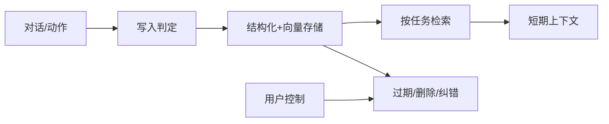
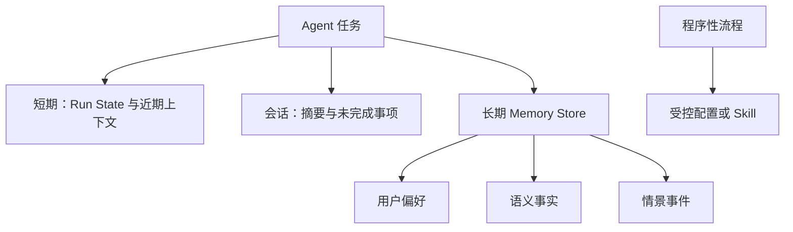
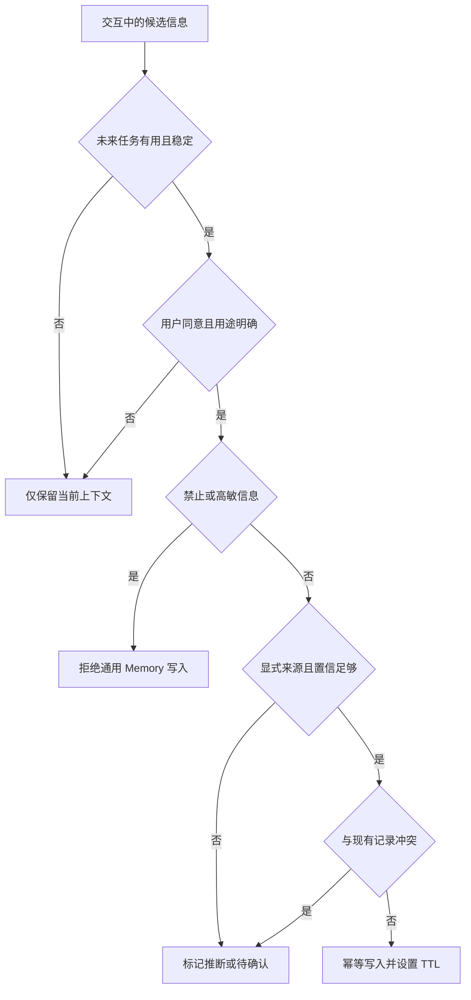
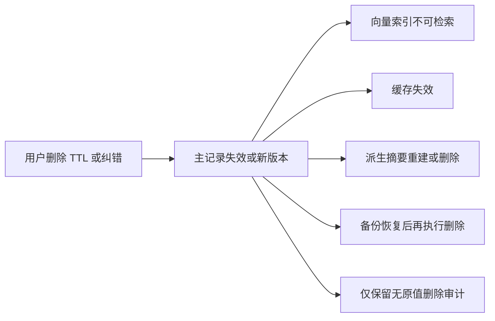

# 第15章：Memory

最后核对日期：2026-07-11。

## 导读、目标与前置知识
Memory 让 Agent 跨步骤或会话保存有用状态。本章区分短期、长期、会话、语义、情景和用户偏好记忆，并设计写入、检索、遗忘与隐私策略。

学习目标是实现一个可运行的长期偏好示例，并能说明哪些数据不应写入。前置知识为第2、9、13章。

## 核心原理与架构图

Memory 是带治理的数据生命周期。主图展示事件如何通过写入门禁进入存储、按任务检索，并最终被纠错或删除。



短期记忆通常是当前状态与近期消息；长期记忆在外部存储。语义记忆保存事实，情景记忆保存事件。Memory 与 RAG 都检索外部内容，但 Memory 强调由交互产生、随时间治理的状态。



高风险业务事实应进入权威状态库而不是依靠语义召回。程序性知识也应版本化维护，不能让模型把偶然经验自动固化为规则。



写入门禁宁可少记，也不应把模型推断升级为用户事实。来源、用途、敏感级别、TTL 和删除路径必须在写入时确定。



删除不是单表操作。只有所有派生副本都不可再被检索，并且恢复流程会重新执行删除，治理承诺才成立。

## 最小与完整工程
最小实现保存明确用户偏好并按用户 ID取回。工程版写入前做类型、置信度、敏感性和重复检查；每条记忆有来源、时间、版本、TTL 和删除接口；检索同时考虑相关性、时效和权限。生成摘要不能覆盖原始审计记录。

## 误区、调试、实践与安全
不要记住所有对话，不要把模型推断当用户事实，不要跨租户共享。调试错误记忆的来源和写入决策，并支持纠错。PII 最小化、加密、访问审计、用户可查看和删除；高敏信息默认不写入。

## 总结、练习、面试与阅读

### 记忆类型与数据模型

短期记忆是当前 run 的工作状态和近期上下文，通常随任务结束释放或压缩。会话记忆连接同一对话的多轮；长期记忆跨会话保存。语义记忆表示相对稳定事实，例如用户选择的语言；情景记忆表示发生过的事件，例如某次故障排查；程序性记忆表示可复用流程，但更适合受控配置或 Skill，而不是让模型随意改写。

```python
from datetime import datetime
from typing import Literal
from pydantic import BaseModel


class MemoryRecord(BaseModel):
    memory_id: str
    tenant_id: str
    subject_id: str
    kind: Literal["preference", "semantic", "episode"]
    value: dict[str, object]
    source_event_id: str
    created_at: datetime
    expires_at: datetime | None
    confidence: float
    sensitivity: Literal["normal", "sensitive", "forbidden"]
    version: int
```

结构化事实优先放字段，原始对话只作来源引用。每条记忆有主体、来源、时间和版本，支持纠错和删除。将“用户可能喜欢红色”写成“用户喜欢红色”会把模型推断升级为事实，写入策略必须区分显式陈述与推断。

### 写入策略

不是每轮对话都写长期记忆。Gate 先判断信息是否对未来任务有用、是否足够稳定、用户是否同意、是否敏感、是否与现有记录冲突。密码、支付数据、医疗隐私等默认禁止写入通用 Memory。短期任务细节设置短 TTL，明确偏好可长期保存但允许用户撤销。

写入采用幂等事件 ID，重复对话不会生成多条相同记忆。新记录与旧记录冲突时不直接覆盖，可保留新旧来源并把状态设为待确认。摘要记忆标记 `derived` 并保存所依据事件，不能替代原始审计事实。

### 检索与上下文注入

检索评分可组合语义相关性、时间衰减、置信度和类型权重。当前租户、用户和任务权限先过滤，再排序。检索结果进入上下文时标记“历史记忆，可能过期”，并只选完成任务必需的少量记录。用户当前明确陈述通常高于旧偏好。

会话摘要适合压缩早期对话，但数字、审批、ID 和未完成义务应进入结构化 State。检索式记忆适合按当前问题召回过去事件，却可能漏召回；高风险流程不能依靠向量检索记住是否已经付款。

### 遗忘、纠错与用户控制

遗忘包括 TTL 过期、低价值清理、用户删除、账户删除和法规保留期。删除需要传播到主存储、向量索引、缓存、备份策略与派生摘要，并记录不含原值的删除审计。若备份不能立即物理删除，应明确恢复后再次执行删除。

用户界面应允许查看“系统记住了什么”、修改错误偏好、禁止某类写入和删除记录。纠错创建新版本并使旧版本失效，避免静默改写审计历史。Memory 不能用于暗中推断敏感属性或跨产品画像。

### 完整工程、调试与评估

工程由 Event Collector、Write Gate、Memory Store、Retriever、Context Adapter 和 Governance Worker 组成。Write Gate 运行确定性敏感字段规则和可选模型分类；Store 同时支持结构化查询与语义索引；Governance Worker 处理 TTL 和删除。

调试错误记忆时从当前输出回到检索记录、原始 Memory、写入决策与来源事件。指标包括写入接受率、重复率、冲突率、检索命中、过期记忆采用率、用户纠错和删除延迟。评估集包含长期偏好、临时偏好、冲突陈述、敏感信息和跨租户攻击。

### 常见误区与安全注意事项

常见误区包括记住全部对话、把长上下文称为长期记忆、让模型自己决定所有删除、把 Memory 与审计日志合并。Memory Store 是高价值隐私资产，需要加密、对象级授权、租户隔离、访问审计、最小保留和导出/删除机制。模型只获得任务所需记忆，不能浏览用户全部历史。
总结：Memory 是受治理的数据生命周期，不是不断增长的聊天记录。练习：设计偏好记忆 Schema、冲突更新和遗忘策略；构造跨租户检索测试。面试：Memory 和上下文窗口有何不同？何时不应自动写入？摘要与结构化事实如何分工？延伸阅读：长期对话记忆研究、隐私法规与数据生命周期治理资料。代码目录：`examples/long_term_memory/`。
