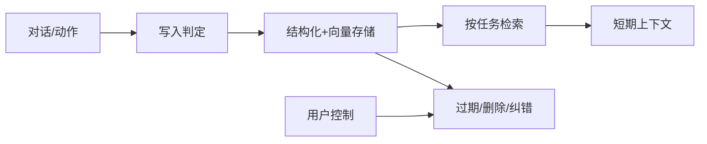
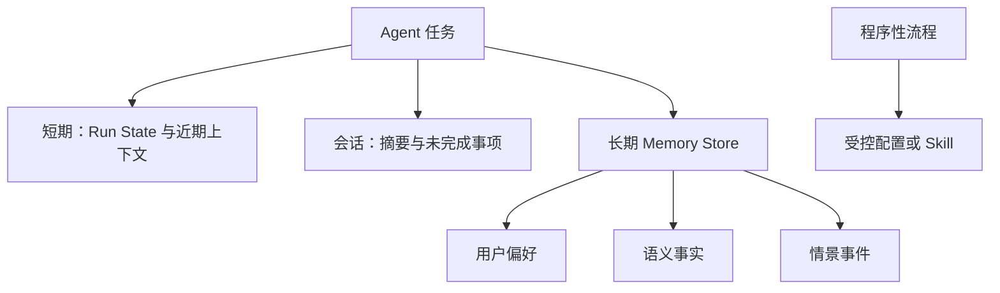
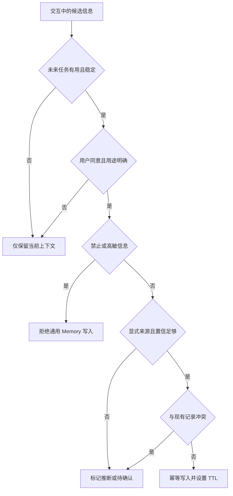
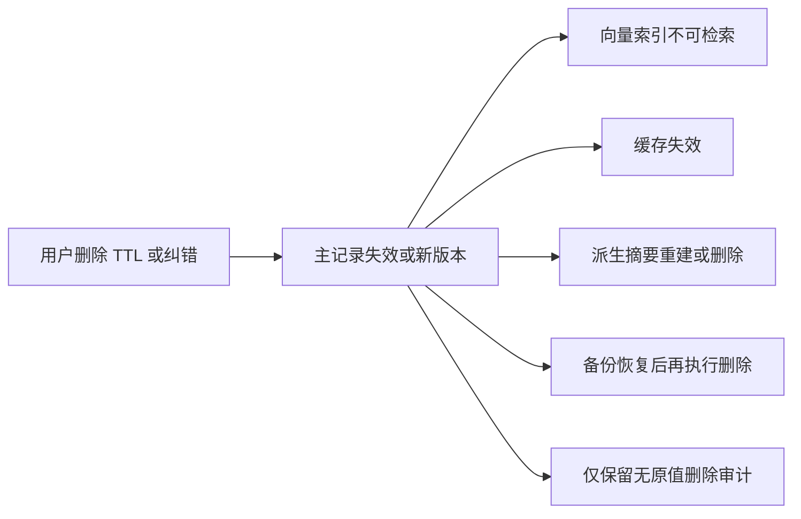
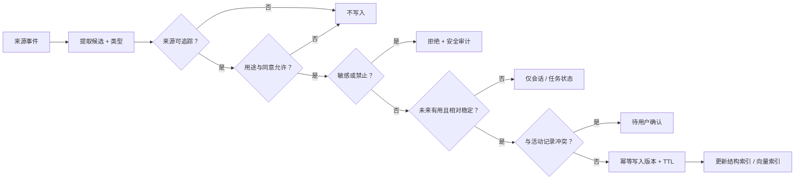
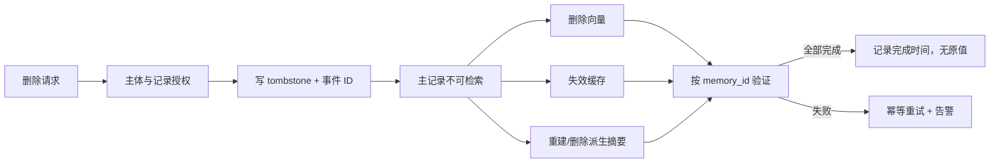

# 第15章：Memory

最后核对日期：2026-07-11。

## 导读、目标与前置知识
Memory 让 Agent 跨步骤或会话保存有用状态。本章区分短期、长期、会话、语义、情景和用户偏好记忆，并设计写入、检索、遗忘与隐私策略。

学习目标是实现一个可运行的长期偏好示例，并能说明哪些数据不应写入。前置知识为第2、9、13章。

## 核心原理与架构图

Memory 是带治理的数据生命周期。主图展示事件如何通过写入门禁进入存储、按任务检索，并最终被纠错或删除。



短期记忆通常是当前状态与近期消息；长期记忆在外部存储。语义记忆保存事实，情景记忆保存事件。Memory 与 RAG 都检索外部内容，但 Memory 强调由交互产生、随时间治理的状态。



高风险业务事实应进入权威状态库而不是依靠语义召回。程序性知识也应版本化维护，不能让模型把偶然经验自动固化为规则。



写入门禁宁可少记，也不应把模型推断升级为用户事实。来源、用途、敏感级别、TTL 和删除路径必须在写入时确定。



删除不是单表操作。只有所有派生副本都不可再被检索，并且恢复流程会重新执行删除，治理承诺才成立。

## 最小实验
最小实现保存明确用户偏好并按用户 ID取回。工程版写入前做类型、置信度、敏感性和重复检查；每条记忆有来源、时间、版本、TTL 和删除接口；检索同时考虑相关性、时效和权限。生成摘要不能覆盖原始审计记录。

最小示例使用内存 Store 验证租户边界和 TTL。它不调用 Embedding，因为权限与过期判断必须是确定性过滤，不能依靠向量相似度。

```python
from dataclasses import dataclass
from datetime import UTC, datetime


@dataclass(frozen=True)
class Preference:
    memory_id: str
    tenant_id: str
    subject_id: str
    key: str
    value: str
    source_event_id: str
    expires_at: datetime | None = None


class MemoryStore:
    def __init__(self) -> None:
        self._records: dict[str, Preference] = {}

    def put(self, record: Preference) -> None:
        existing = self._records.get(record.memory_id)
        if existing is not None and existing != record:
            raise ValueError("同一 memory_id 的内容冲突")
        self._records[record.memory_id] = record

    def list_active(
        self, *, tenant_id: str, subject_id: str, now: datetime
    ) -> list[Preference]:
        return [
            record
            for record in self._records.values()
            if record.tenant_id == tenant_id
            and record.subject_id == subject_id
            and (record.expires_at is None or record.expires_at > now)
        ]

    def delete(self, *, tenant_id: str, memory_id: str) -> None:
        record = self._records.get(memory_id)
        if record is None:
            return
        if record.tenant_id != tenant_id:
            raise PermissionError("禁止跨租户删除记忆")
        del self._records[memory_id]
```

测试要证明租户 A 即使知道租户 B 的 `memory_id` 也无法读取或删除。生产 API 不应仅靠查询后过滤；数据库查询、缓存键和向量索引都必须带租户与主体范围。

```python
from datetime import timedelta

import pytest


def test_expiry_and_cross_tenant_delete() -> None:
    now = datetime.now(UTC)
    store = MemoryStore()
    store.put(
        Preference(
            "m1", "tenant-a", "user-1", "language", "zh-CN", "event-7",
            expires_at=now + timedelta(days=30),
        )
    )

    assert len(store.list_active(tenant_id="tenant-a", subject_id="user-1", now=now)) == 1
    assert store.list_active(tenant_id="tenant-b", subject_id="user-1", now=now) == []
    with pytest.raises(PermissionError):
        store.delete(tenant_id="tenant-b", memory_id="m1")
```

这个实现只是控制边界实验，没有持久化、向量检索和删除传播，因此不能直接作为生产 Memory Store。它展示的关键顺序是“先权限与 TTL，后相关性排序”。

## 误区、调试、实践与安全
不要记住所有对话，不要把模型推断当用户事实，不要跨租户共享。调试错误记忆的来源和写入决策，并支持纠错。PII 最小化、加密、访问审计、用户可查看和删除；高敏信息默认不写入。

## 总结、练习、面试与阅读

### 记忆类型与数据模型

短期记忆是当前 run 的工作状态和近期上下文，通常随任务结束释放或压缩。会话记忆连接同一对话的多轮；长期记忆跨会话保存。语义记忆表示相对稳定事实，例如用户选择的语言；情景记忆表示发生过的事件，例如某次故障排查；程序性记忆表示可复用流程，但更适合受控配置或 Skill，而不是让模型随意改写。

```python
from datetime import datetime
from typing import Literal
from pydantic import BaseModel


class MemoryRecord(BaseModel):
    memory_id: str
    tenant_id: str
    subject_id: str
    kind: Literal["preference", "semantic", "episode"]
    value: dict[str, object]
    source_event_id: str
    created_at: datetime
    expires_at: datetime | None
    confidence: float
    sensitivity: Literal["normal", "sensitive", "forbidden"]
    version: int
```

结构化事实优先放字段，原始对话只作来源引用。每条记忆有主体、来源、时间和版本，支持纠错和删除。将“用户可能喜欢红色”写成“用户喜欢红色”会把模型推断升级为事实，写入策略必须区分显式陈述与推断。

### 写入策略

不是每轮对话都写长期记忆。Gate 先判断信息是否对未来任务有用、是否足够稳定、用户是否同意、是否敏感、是否与现有记录冲突。密码、支付数据、医疗隐私等默认禁止写入通用 Memory。短期任务细节设置短 TTL，明确偏好可长期保存但允许用户撤销。

写入采用幂等事件 ID，重复对话不会生成多条相同记忆。新记录与旧记录冲突时不直接覆盖，可保留新旧来源并把状态设为待确认。摘要记忆标记 `derived` 并保存所依据事件，不能替代原始审计事实。

## 工程案例

考虑一个跨会话技术学习助手。用户明确说“代码示例优先使用 Python 3.12”时，可以在获得约定同意后写入偏好；用户在一次任务中说“这次先不要 Docker”只应保留为任务状态；模型根据用户阅读速度推断“可能不喜欢长文”不能自动升级为长期事实。



写入门禁输出的不只是布尔值，还应记录原因、策略版本和来源。候选的 `source_event_id` 指向受控原始事件；检索给模型时只暴露必要摘要和来源类型，不一定暴露完整历史对话。

### 四种外部状态不能混为一谈

| 类型 | 主要用途 | 权威性 | 典型保留期 | 用户控制 | 不应承担 |
|---|---|---|---|---|---|
| Conversation History | 当前对话连贯性 | 混合，含提议和闲聊 | 会话级 | 可清除 | 长期精确事实 |
| RAG Corpus | 组织或产品知识 | 由文档治理决定 | 文档生命周期 | 按文档权限 | 个体偏好自动画像 |
| Long-term Memory | 跨会话偏好与事件 | 必须有来源和置信 | TTL/用途决定 | 查看、纠错、删除 | 交易状态与审计证据 |
| Audit Log | 证明谁在何时做了什么 | 不可变事件记录 | 合规策略决定 | 通常受法规约束 | 直接作为模型自由检索记忆 |

审计日志不是 Memory。为了支持用户删除偏好，可以删除 Memory 的值，但审计可能依法保留“删除动作发生过”的最小记录；二者应使用不同访问权限。RAG 文档也可能来自用户上传，但其版本、共享范围和删除路径与个性化 Memory 不同。

### 冲突与纠错

偏好 `language=zh-CN` 后又出现 `language=en-US`，不能按最后一句无条件覆盖。系统先判断来源：是否为同一用户明确陈述、是否只针对当前任务、是否存在生效范围。若新陈述是全局更改，创建新版本并让旧版本 `superseded`；若范围不明，进入待确认。模型推断永远不能静默覆盖用户显式值。

```python
from enum import StrEnum


class ConflictDecision(StrEnum):
    KEEP_EXISTING = "keep_existing"
    REPLACE = "replace"
    REQUIRE_CONFIRMATION = "require_confirmation"


def resolve_preference_conflict(
    *,
    existing_source: str,
    candidate_source: str,
    same_scope: bool,
) -> ConflictDecision:
    if candidate_source == "model_inference":
        return ConflictDecision.KEEP_EXISTING
    if existing_source == "user_explicit" and candidate_source == "user_explicit":
        return (
            ConflictDecision.REPLACE
            if same_scope
            else ConflictDecision.REQUIRE_CONFIRMATION
        )
    return ConflictDecision.REQUIRE_CONFIRMATION
```

真实策略还需时间、主体、渠道可信度和业务类型。这个例子刻意保持保守：不确定时询问，不把“最近出现”自动解释为“全局替换”。

### 检索评分与注入

Memory Retriever 先执行租户、主体、用途、敏感级别、状态和 TTL 过滤，再组合语义相关性、时间衰减、置信度与类型权重。分数只用于排序已授权记录。当前用户明确声明应高于旧记忆；发生冲突时 Context Adapter 同时说明旧值可能过期，而不是偷偷用旧偏好覆盖当前输入。

注入上下文的记忆包含 `memory_id`、类型、值摘要、来源类型、记录时间和是否可能过期。它被标为历史数据，不能包含能修改系统策略的指令。一次任务只取必要记录，并设置总 Token 预算。

### TTL、删除与证明

TTL 到达时先让记录不可被在线检索，再异步清理向量、缓存与派生摘要。用户主动删除也走同一传播管线，并生成不含原值的 tombstone。备份恢复流程必须重放 tombstone，否则已经删除的偏好会“复活”。删除 SLA 应从请求到所有在线副本不可检索，并另行说明备份物理清理周期。



删除 Worker 以事件 ID 幂等执行。任何一步失败不应恢复主记录可见性；它应继续保持逻辑删除，直到派生副本清理完成。对于法规要求的特殊保留，需要在收集时明确用途和法律基础，不能事后以“模型可能需要”为理由无限保存。

## 失败分析与调试

Memory 错误往往跨越较长时间，必须能从回答反查检索记录、Memory 版本、写入门禁和来源事件：

| 现象 | 根因 | 证据 | 修复 |
|---|---|---|---|
| 用户否认某偏好 | 模型推断被写成事实 | source_event 与 gate reason | 降级推断，要求显式确认 |
| 当前要求被旧偏好覆盖 | 上下文优先级错误 | 当前消息与检索记忆顺序 | 当前明确指令优先，标旧值过期 |
| 删除后仍被召回 | 向量或缓存未传播 | tombstone 与各副本状态 | 幂等删除 Saga 与验证 |
| 过期事件影响推荐 | TTL 只在后台物理删除 | 查询过滤与 expires_at | 在线检索先过滤 TTL |
| 同一偏好多条冲突 | 缺乏版本与范围 | active 记录、scope、来源 | 单活动版本或待确认状态 |
| 租户 A 看到租户 B 记忆 | 查询或缓存键缺租户 | SQL/filter、缓存键、Trace | 存储层强制租户隔离 |
| 摘要无法纠错 | 派生文本没有来源列表 | summary provenance | 保存输入事件 ID 并可重建 |

调试先使用确定性 Fake 时钟重放 TTL，再注入重复事件、并发写入、冲突陈述、用户纠错和删除失败。跨租户测试要同时覆盖读取、语义检索、按 ID 获取、更新、删除、导出和缓存，不是只检查列表接口。

安全评估包含敏感字段候选、间接 Prompt Injection、主体枚举、Embedding 侧信道、备份恢复后删除重放和管理员越权。Memory Store 是高价值画像资产，服务账号默认不能全库搜索；运营分析使用聚合或去标识数据。

### 检索与上下文注入

检索评分可组合语义相关性、时间衰减、置信度和类型权重。当前租户、用户和任务权限先过滤，再排序。检索结果进入上下文时标记“历史记忆，可能过期”，并只选完成任务必需的少量记录。用户当前明确陈述通常高于旧偏好。

会话摘要适合压缩早期对话，但数字、审批、ID 和未完成义务应进入结构化 State。检索式记忆适合按当前问题召回过去事件，却可能漏召回；高风险流程不能依靠向量检索记住是否已经付款。

### 遗忘、纠错与用户控制

遗忘包括 TTL 过期、低价值清理、用户删除、账户删除和法规保留期。删除需要传播到主存储、向量索引、缓存、备份策略与派生摘要，并记录不含原值的删除审计。若备份不能立即物理删除，应明确恢复后再次执行删除。

用户界面应允许查看“系统记住了什么”、修改错误偏好、禁止某类写入和删除记录。纠错创建新版本并使旧版本失效，避免静默改写审计历史。Memory 不能用于暗中推断敏感属性或跨产品画像。

### 完整工程、调试与评估

工程由 Event Collector、Write Gate、Memory Store、Retriever、Context Adapter 和 Governance Worker 组成。Write Gate 运行确定性敏感字段规则和可选模型分类；Store 同时支持结构化查询与语义索引；Governance Worker 处理 TTL 和删除。

调试错误记忆时从当前输出回到检索记录、原始 Memory、写入决策与来源事件。指标包括写入接受率、重复率、冲突率、检索命中、过期记忆采用率、用户纠错和删除延迟。评估集包含长期偏好、临时偏好、冲突陈述、敏感信息和跨租户攻击。

### 常见误区与安全注意事项

常见误区包括记住全部对话、把长上下文称为长期记忆、让模型自己决定所有删除、把 Memory 与审计日志合并。Memory Store 是高价值隐私资产，需要加密、对象级授权、租户隔离、访问审计、最小保留和导出/删除机制。模型只获得任务所需记忆，不能浏览用户全部历史。
总结：Memory 是受治理的数据生命周期，不是不断增长的聊天记录。练习：设计偏好记忆 Schema、冲突更新和遗忘策略；构造跨租户检索测试。面试：Memory 和上下文窗口有何不同？何时不应自动写入？摘要与结构化事实如何分工？延伸阅读：长期对话记忆研究、隐私法规与数据生命周期治理资料。本章代码目录为 [`examples/long_term_memory/`](https://github.com/wujinjun/ai-agent-book/tree/main/examples/long_term_memory)，提供 SQLite、Fake Clock、写入门禁、来源、TTL、更正、导出、删除传播和跨租户测试。

## 练习参考答案

1. 偏好 Schema 至少包含租户、主体、键、值、范围、来源事件、来源类型、置信度、敏感级别、状态、版本、创建时间与 TTL。使用稳定 `memory_id` 和事件幂等键，禁止只存一段无来源自然语言。
2. 冲突更新先比较主体、范围和来源。用户明确全局更改可以创建新版本并使旧值失效；任务级陈述不覆盖全局偏好；模型推断只作候选。范围不明时请求确认。
3. 遗忘策略让在线查询立即过滤过期或 tombstone 记录，再异步清理向量、缓存、摘要和备份恢复路径。审计只保留删除事件的最小元数据，不保留被删原值。
4. 跨租户测试使用相同 `subject_id` 和已知 `memory_id` 攻击所有接口，断言租户 B 无法读取、搜索、更新、删除或导出租户 A 记录，且错误响应不泄漏记录是否存在。
5. 摘要适合压缩叙事与主题，结构化字段保存订单号、审批状态、金额等精确事实。摘要必须列出来源事件并可重建；审计日志保存动作证据，不能由摘要覆盖。
