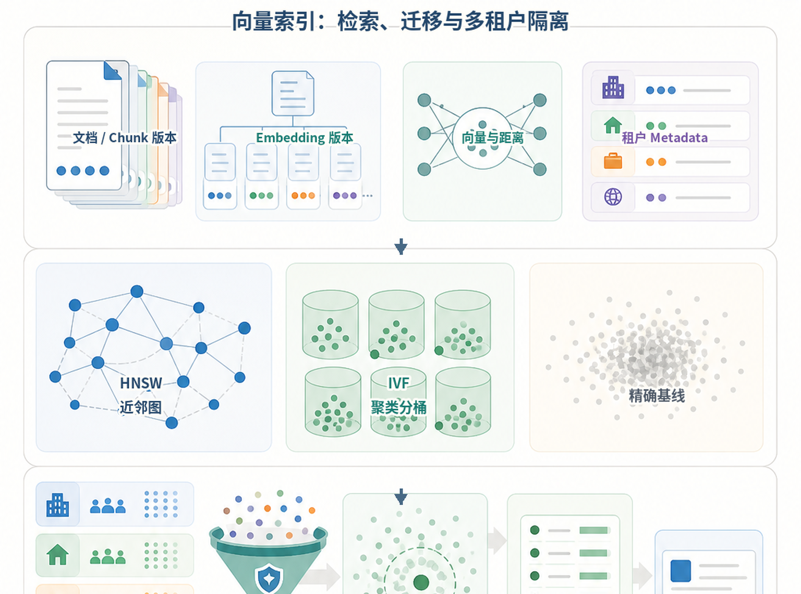
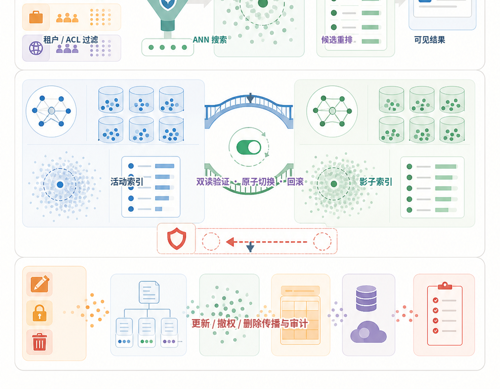
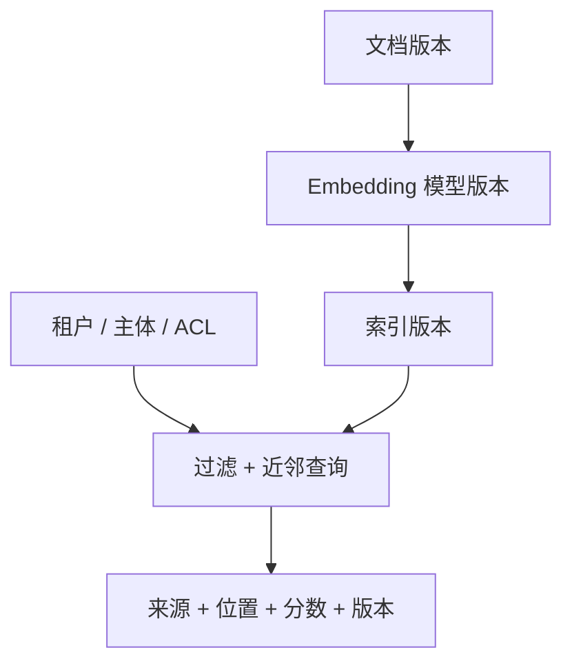
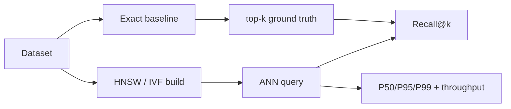
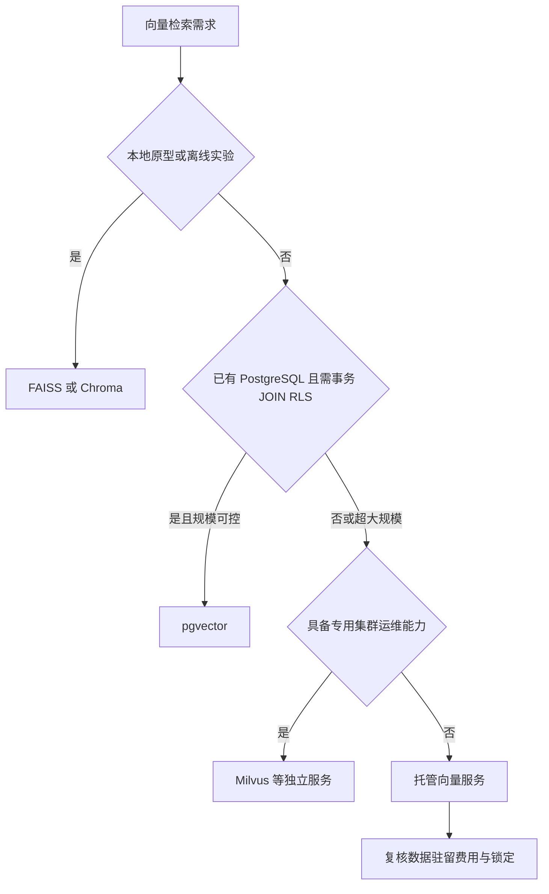
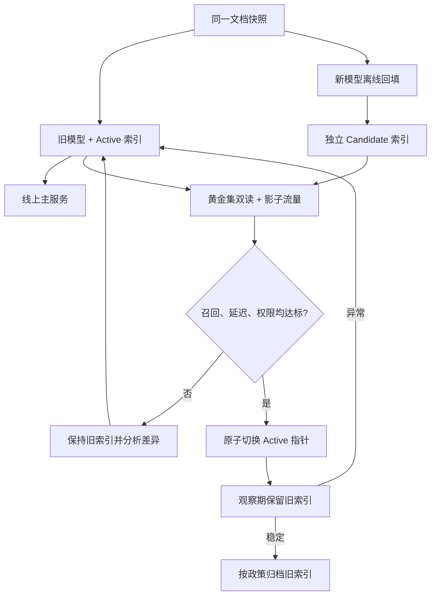

# 第16章：向量数据库

最后核对日期：2026-07-11；产品能力与版本需在选型当天复核。

## 导读、目标与前置知识
向量数据库为大规模近邻检索、过滤和生命周期管理服务。本章比较 FAISS、Chroma、pgvector、Milvus 与托管方案，理解 HNSW、IVF、距离、更新、多租户和性能测试。

学习目标是完成一个可重复的性能示例和选型报告。前置知识为第5、13章。

近似近邻算法与具体产品应分层核对：HNSW 的算法依据见 [原始论文](../references.md#ref-malkov2018)，本地索引、关系向量扩展与分布式服务的能力分别参考 [FAISS](../references.md#ref-faiss-wiki)、[pgvector](../references.md#ref-pgvector)和 [Milvus](../references.md#ref-milvus-docs)当前文档。

向量数据库的生产难点不只在 HNSW 或 IVF 参数，还包括租户过滤、模型版本、索引切换与删除传播。下图把在线检索和离线迁移放进同一生命周期。



*图 16-A：向量记录与索引结构。模型版本、文档版本、租户元数据和距离度量共同决定索引语义。*



*图 16-B：查询、迁移与删除生命周期。索引迁移不是原地覆盖，权限删除也不能只删除原文。*

图 16-B 的蓝绿索引表示活动索引和影子索引。新索引只有通过召回、权限、引用与延迟验证后才能原子切换；删除和撤权还要传播到 Chunk、向量、缓存和备份策略。

## 核心原理与选型
HNSW 构建多层邻接图，以内存换低延迟和高召回；IVF 先把向量分桶，再只搜索部分桶。近似检索参数影响召回、延迟、内存和构建时间。FAISS 适合本地算法与批处理；pgvector 适合已有 PostgreSQL 且需要事务/过滤；Milvus 等适合独立大规模服务；托管服务降低运维但增加成本与锁定。

## 最小与完整工程
最小基准固定数据集和查询，测 Recall@k、P50/P95 延迟、吞吐、索引大小和构建时间。工程版还测 Metadata 过滤、并发、增量更新、删除可见性、备份恢复和租户隔离。索引记录 Embedding 模型与维度，模型升级使用新集合灰度切换。

下面的 pgvector 查询把租户条件置于数据库语句中，并返回可定位引用。维度和距离操作符必须与实际 Embedding 模型一致：

```sql
SELECT chunk_id, document_id, page, content,
       1 - (embedding <=> :query_vector) AS cosine_similarity
FROM knowledge_chunks
WHERE tenant_id = :tenant_id
  AND document_version = :active_version
ORDER BY embedding <=> :query_vector
LIMIT :top_k;
```

参数必须绑定而不是拼接。生产环境还要结合 Row Level Security 或受控数据访问层，避免调用者漏写租户过滤。

## 误区、调试、安全与图

向量索引的每次写入和查询都必须携带文档、模型与权限版本。下面的生命周期图展示这些版本如何共同决定可用结果。


误区：向量库解决全部 RAG；更高维度一定更好；删除原文就等于删除向量。安全要求网络隔离、租户过滤、备份加密和可验证删除。

## 近似索引、选型与迁移的深化设计

### 精确与近似最近邻

精确搜索计算查询与所有向量的距离，结果确定但成本随数据量增长。近似最近邻用索引减少候选，接受少量召回损失换取延迟和吞吐。基准中的“真值”通常由精确搜索得到，再计算 ANN 的 Recall@k。只测 ANN 自身返回结果无法知道它漏掉了什么。

余弦相似度适合方向语义，点积会受向量模长影响，欧氏距离衡量空间距离。Embedding 模型训练时预期的度量优先；如果模型要求归一化而索引没有归一化，排名会变化。数据库中的 distance 与 similarity 方向可能相反，阈值比较前先确认语义。

### HNSW 与 IVF

HNSW 把向量组织为多层小世界图。构建参数影响连接数量和索引成本，查询参数影响探索范围；增加探索通常提高召回但增加延迟。HNSW 适合低延迟在线检索，内存占用和删除维护需要评估。

IVF 先训练聚类中心，把向量分配到倒排桶，查询只探测部分桶。桶数、探测数和训练样本影响效果。IVF 适合大规模数据和批处理，也可配合量化压缩。数据分布明显变化时，旧聚类可能退化，需要重训和重建索引。



基准必须用精确结果作为真值，否则只能测到速度，无法知道近似索引漏掉了哪些邻居。



选型结论必须由真实规模、过滤选择性、更新率、并发和 SLA 的 spike 支撑，不能只按功能列表决定。



不同模型和维度的向量不能混在同一空间。独立构建、双读比较和可回滚切换是安全迁移的基本边界。

### 产品选型边界

FAISS 是向量检索库，适合本地实验、离线构建和自定义服务，不自带完整多租户数据库语义。Chroma 适合本地原型和轻量应用，生产能力按当前版本评估。pgvector 让向量与 PostgreSQL 事务、JOIN 和 Row Level Security 结合，适合已有 PostgreSQL 且规模可控的团队。Milvus 等独立向量数据库面向更大规模和专门运维；托管服务减少基础设施工作，但要考虑网络、费用、数据驻留和供应商锁定。

选型不是功能打勾。用真实数据量、过滤选择性、更新率、查询并发、向量维度和 SLA 做 spike。已有 PostgreSQL 的百万级知识库未必需要新集群；超大规模低延迟场景也不应只因团队熟悉 SQL 就强行使用关系库。

### Metadata、更新、删除与版本

Metadata Filtering 与 ANN 的执行顺序影响召回。先过滤后 ANN 候选更干净，但过滤后数据太少可能需要不同索引；ANN 后过滤可能返回不足 k 条。测试要覆盖高/低选择性和租户条件。字段建立适当普通索引，避免向量快而过滤慢。

更新文档通常生成新 Chunk 与向量，使用文档版本批量切换。删除是逻辑标记、索引不可见和物理回收的过程，三者延迟不同。每条向量带 embedding_model、dimension、preprocess_version 和 source_version。模型迁移构建新集合，双读评估后切换，不能混写。

### 多租户、安全与运维

共享集合用强制 tenant_id 过滤并在数据库策略层执行；独立集合隔离更强但运维成本高。选择取决于租户数量、合规和噪声。缓存键包含租户和权限版本，备份与导出同样检查租户范围。

向量可能泄露语义，不应视为匿名数据。网络隔离、TLS、静态加密、最小账号、审计、备份恢复和删除证明都要覆盖向量与 Metadata。不要让模型生成任意过滤表达式直接交给数据库。

### 完整性能测试与调试

基准固定硬件、数据、查询集和并发，预热后测 Recall@k、P50/P95/P99、QPS、索引大小、构建时间、更新延迟和删除可见时间。分别测试无过滤、高选择性过滤、混合读写和故障恢复。报告均值之外的尾延迟。

调试召回下降时检查模型/归一化/距离是否一致、索引是否完成、过滤是否误排、参数是否改变和数据分布是否漂移。延迟上升则分解网络、过滤、ANN、反序列化和连接池，而不是只调 HNSW 参数。

#### 用公式固定验收口径

设第 `i` 个查询的精确 Top-k 集合为 `G_i`，近似检索结果为 `A_i`，则：

```text
Recall@k = (1 / |Q|) * sum_i(|intersection(G_i, A_i)| / k)
Filter leakage rate = 越权结果数 / 返回结果总数
Freshness lag = 新版本提交时间到查询可见时间
Deletion lag = 删除确认时间到所有读取路径不可见时间
```

其中 `sum_i` 表示对查询集合中的每个查询求和，`intersection(G_i, A_i)` 表示精确结果与近似结果的集合交集。这里使用 ASCII 记法，是为了让公式在网页、PDF、EPUB 和终端中都能稳定呈现。

Recall 计算必须在权限过滤后的合法候选空间中生成真值。若精确基线包含租户 B 的文档、ANN 查询却
过滤到租户 A，算出的“低召回”没有诊断意义。反过来，Recall 很高也不能掩盖一次权限泄漏：
`Filter leakage rate` 的验收目标通常是严格为零，而不是一个可以用平均值折中的质量指标。

基准输入应保存数据快照、查询集、黄金结果、Embedding 模型与预处理版本、距离度量、索引参数、
硬件、并发模型和预热方式。报告只给“P95 为 20 ms”无法复现；至少还要给过滤选择性分桶：

| 场景 | 合法候选占比 | 主要风险 | 必测结果 |
|---|---:|---|---|
| 无过滤公共语料 | 100% | ANN 参数召回损失 | Recall@k、P95/P99 |
| 普通租户 | 1%—10% | 过滤与 ANN 顺序 | 返回条数、泄漏率、尾延迟 |
| 极小租户 | <0.1% | 候选不足 | Recall、Fallback 次数 |
| 混合读写 | 动态 | 索引可见性与膨胀 | Freshness、删除延迟、QPS |

百分比只是实验分桶示例，不是所有系统的固定阈值。生产报告使用本系统分布的 P50、P90 和极端租户，
否则平均租户会掩盖长尾。

#### 过滤是在索引前还是索引后

预过滤先限定合法候选，再做 ANN，天然避免越权候选进入后续链路，但低选择性过滤可能使通用索引
失效。后过滤先取近邻再丢弃不符合条件的记录，容易不足 k 条；简单把 ANN 候选倍增又会增加延迟，
并且不能作为权限边界。实际数据库可能采用迭代扫描、分区索引或混合策略，具体能力应按当前版本
官方文档和 Explain Plan 复核。

无论执行器如何优化，应用层契约都应要求 `tenant_id` 与 `permission_version`，数据库访问层再用
RLS、受控 Repository 或独立集合形成不可绕过的边界。不要让 LLM 自己决定是否附加租户条件。

```python
@dataclass(frozen=True)
class VectorQuery:
    tenant_id: str
    permission_version: str
    embedding_model: str
    index_version: str
    vector: tuple[float, ...]
    top_k: int

    def __post_init__(self) -> None:
        if not self.tenant_id or not self.permission_version:
            raise ValueError("tenant and permission version are mandatory")
        if self.top_k < 1 or self.top_k > 100:
            raise ValueError("top_k outside service budget")
```

类型只能防止调用者遗漏字段；真正的强制隔离仍应在 Repository 与数据库策略中完成。缓存键也必须
包含这些版本，否则撤权之后可能从旧缓存返回原本合法、现在越权的结果。

### 索引迁移是一项可回滚发布

Embedding 模型更换会同时改变维度、向量空间、分数分布和最佳阈值。即使维度恰好相同，新旧向量
也不能混用。安全迁移把每个索引当不可变发布物，并维护独立的别名或 Active Version 指针：

1. 冻结同一份规范化文档快照与 ACL 快照，记录内容哈希；
2. 用新模型写入候选索引，不覆盖活动索引；
3. 对黄金查询运行精确真值、ANN、过滤泄漏与引用一致性测试；
4. 对影子流量双读，只记录差异，不让候选结果影响用户；
5. 达到 Recall、P99、成本、Freshness 和零泄漏门禁后，在一个受控事务中切换别名；
6. 保留旧索引到观察期结束，失败时只切回指针；之后按删除策略清理。

活动指针与索引内容的提交不能靠“先写配置、再祈祷所有实例刷新”。单数据库场景可把版本状态和
别名切换放在事务中；分布式服务使用带 Revision 的配置、Compare-and-Swap 与就绪确认。查询 Trace
必须记录最终命中的索引版本，这样回答质量回归才能定位到具体发布物。

```sql
BEGIN;

SELECT version
FROM vector_index_release
WHERE alias = 'knowledge-active'
FOR UPDATE;

UPDATE vector_index_release
SET version = :candidate_version,
    switched_at = CURRENT_TIMESTAMP
WHERE alias = 'knowledge-active'
  AND version = :expected_old_version;

-- 应用必须检查恰好更新一行；否则说明并发发布或状态已变化。
COMMIT;
```

这段 SQL 只示范活动指针的并发边界，不代表任意向量产品都使用相同表结构。候选索引若尚未完整、
ACL 快照不一致或门禁证据过期，发布器必须拒绝切换。

### 与项目 4 的代码对应

本章工程代码位于 [`projects/04-knowledge-agent/`](https://github.com/wujinjun/ai-agent-book/tree/main/projects/04-knowledge-agent)。离线
`KnowledgeBase` 用确定性 Hash 向量验证摄取、混合检索、租户预过滤、引用、Recall@K 与 MRR；它
不具备真实语义泛化能力。`schema.sql` 和 `PgVectorKnowledgeRepository` 提供 128 维 pgvector
适配边界，`VersionedKnowledgePipeline` 把候选构建、黄金集门禁、失败恢复和活动版本切换组成
持久任务。两条路径分别回答“控制逻辑能否离线复现”和“真实存储边界是否成立”，不能互相冒充。

运行真实 pgvector 验收前应核对镜像、扩展与操作符版本，再执行：

```bash
docker compose up -d postgres
.venv/bin/python scripts/verify_pgvector.py
```

若本机没有容器，离线测试仍可验证算法与权限契约，但 PROJECT_STATUS 不应据此声称完成真实数据库
性能验证。

### 常见误区、工程实践与安全

常见误区是向量库自动完成 RAG、更高维度必然更准、索引参数可照抄、删除原文就等于删除向量。工程实践从精确基线和真实评估集开始，参数变更版本化，升级前后并行测试，并准备回滚。

## 本章总结

向量数据库提供相似性检索基础设施，不负责文档质量、权限语义和回答正确性。工程验收必须同时证明精确基线下的 Recall、尾延迟、零权限泄漏、更新与删除可见性，以及 Embedding 模型和索引的可回滚迁移。HNSW、IVF、FAISS、pgvector、Milvus 和托管服务没有脱离数据规模、过滤选择性、写入模式与运维能力的统一最佳答案。下一章将回到应用层，从原生 API 开始构建一个不依赖框架的轻量 Agent Runtime。

## 课后练习

### 编码题

1. 固定数据快照与查询集，用精确过滤后的 Top-k 生成真值，绘制 HNSW 的 Recall@k、P95 和内存曲线。

输入为版本化向量与过滤条件；输出为参数—指标曲线；检查标准是近似结果与 Exact Truth 使用相同 ACL。

### 故障实验

2. 构造 100%、5% 和 0.1% 合法候选三种过滤选择性，报告零租户泄漏、返回数量、Recall 和尾延迟。

### 设计题

3. 为 Embedding 模型升级设计候选索引回填、黄金集、影子双读、原子切换和回滚演练。
4. 使用真实规模、更新率、过滤和 SLA，为 FAISS、pgvector 与专用向量服务写一份选型 ADR。

### 概念题

解释 HNSW、IVF 与精确检索分别牺牲或保留了什么，以及 Metadata 过滤为何会改变近似索引的有效候选空间。

## 参考答案位置

本章参考答案已移至[书末参考答案](../exercise-answers.md)，便于先独立完成练习再核对。

## 面试问题

1. HNSW 与 IVF 分别用什么资源换取查询性能？
2. Metadata 过滤为什么会改变 ANN 的召回和执行路径？
3. 相同维度的新旧 Embedding 为什么也不能混用？
4. 共享索引和独立租户索引各有什么隔离与运维代价？

## 延伸阅读与代码目录

延伸阅读包括 FAISS、pgvector、Milvus、HNSW 与所选托管服务的官方文档；产品版本与参数应在选型当天复核。代码目录为 [`projects/04-knowledge-agent/`](https://github.com/wujinjun/ai-agent-book/tree/main/projects/04-knowledge-agent)。

## 本章引用
<!-- chapter-citations:start -->
以下资料用于支撑本章的核心原理、工程边界与版本敏感说明：

- [johnson2017：Billion-scale Similarity Search with GPUs](../references.md#ref-johnson2017)
- [malkov2018：Efficient and Robust Approximate Nearest Neighbor Search Using HNSW](../references.md#ref-malkov2018)
- [faiss-wiki：Faiss Documentation](../references.md#ref-faiss-wiki)
- [pgvector：pgvector](../references.md#ref-pgvector)
- [milvus-docs：Milvus Documentation](../references.md#ref-milvus-docs)
<!-- chapter-citations:end -->
