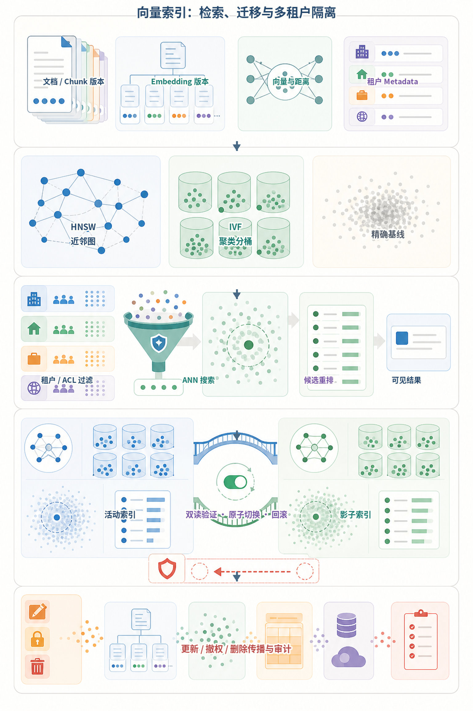
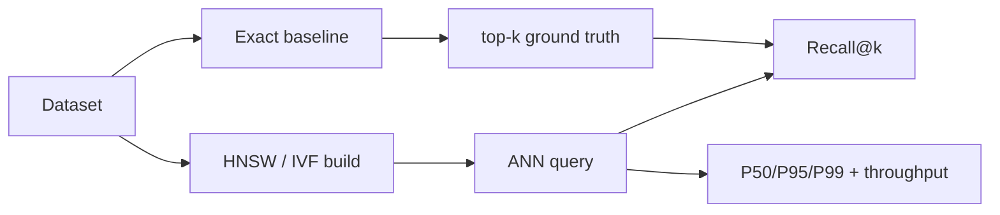
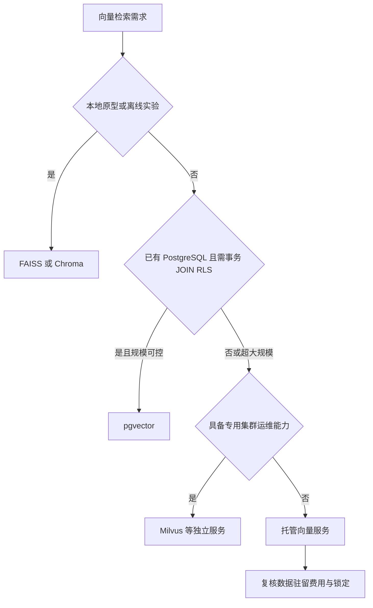
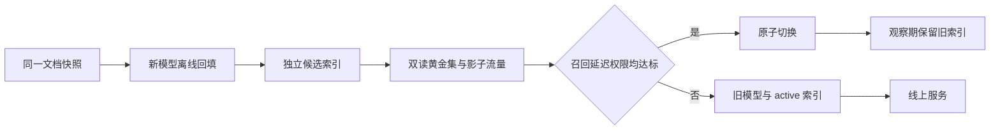

# 第16章：向量数据库

最后核对日期：2026-07-11；产品能力与版本需在选型当天复核。

## 导读、目标与前置知识
向量数据库为大规模近邻检索、过滤和生命周期管理服务。本章比较 FAISS、Chroma、pgvector、Milvus 与托管方案，理解 HNSW、IVF、距离、更新、多租户和性能测试。

学习目标是完成一个可重复的性能示例和选型报告。前置知识为第5、13章。

向量数据库的生产难点不只在 HNSW 或 IVF 参数，还包括租户过滤、模型版本、索引切换与删除传播。下图把在线检索和离线迁移放进同一生命周期。



*图 16-A：向量索引、版本迁移与多租户隔离。索引结构影响召回和延迟，但不能替代数据库层面的权限过滤。*

图 16-A 的蓝绿索引表示活动索引和影子索引。新索引只有通过召回、权限、引用与延迟验证后才能原子切换；删除和撤权还要传播到 Chunk、向量、缓存和备份策略。

## 核心原理与选型
HNSW 构建多层邻接图，以内存换低延迟和高召回；IVF 先把向量分桶，再只搜索部分桶。近似检索参数影响召回、延迟、内存和构建时间。FAISS 适合本地算法与批处理；pgvector 适合已有 PostgreSQL 且需要事务/过滤；Milvus 等适合独立大规模服务；托管服务降低运维但增加成本与锁定。

## 最小与完整工程
最小基准固定数据集和查询，测 Recall@k、P50/P95 延迟、吞吐、索引大小和构建时间。工程版还测 Metadata 过滤、并发、增量更新、删除可见性、备份恢复和租户隔离。索引记录 Embedding 模型与维度，模型升级使用新集合灰度切换。

下面的 pgvector 查询把租户条件置于数据库语句中，并返回可定位引用。维度和距离操作符必须与实际 Embedding 模型一致：

```sql
SELECT chunk_id, document_id, page, content,
       1 - (embedding <=> :query_vector) AS cosine_similarity
FROM knowledge_chunks
WHERE tenant_id = :tenant_id
  AND document_version = :active_version
ORDER BY embedding <=> :query_vector
LIMIT :top_k;
```

参数必须绑定而不是拼接。生产环境还要结合 Row Level Security 或受控数据访问层，避免调用者漏写租户过滤。

## 误区、调试、安全与图

向量索引的每次写入和查询都必须携带文档、模型与权限版本。下面的生命周期图展示这些版本如何共同决定可用结果。


误区：向量库解决全部 RAG；更高维度一定更好；删除原文就等于删除向量。安全要求网络隔离、租户过滤、备份加密和可验证删除。

## 总结、练习、面试与阅读

### 精确与近似最近邻

精确搜索计算查询与所有向量的距离，结果确定但成本随数据量增长。近似最近邻用索引减少候选，接受少量召回损失换取延迟和吞吐。基准中的“真值”通常由精确搜索得到，再计算 ANN 的 Recall@k。只测 ANN 自身返回结果无法知道它漏掉了什么。

余弦相似度适合方向语义，点积会受向量模长影响，欧氏距离衡量空间距离。Embedding 模型训练时预期的度量优先；如果模型要求归一化而索引没有归一化，排名会变化。数据库中的 distance 与 similarity 方向可能相反，阈值比较前先确认语义。

### HNSW 与 IVF

HNSW 把向量组织为多层小世界图。构建参数影响连接数量和索引成本，查询参数影响探索范围；增加探索通常提高召回但增加延迟。HNSW 适合低延迟在线检索，内存占用和删除维护需要评估。

IVF 先训练聚类中心，把向量分配到倒排桶，查询只探测部分桶。桶数、探测数和训练样本影响效果。IVF 适合大规模数据和批处理，也可配合量化压缩。数据分布明显变化时，旧聚类可能退化，需要重训和重建索引。



基准必须用精确结果作为真值，否则只能测到速度，无法知道近似索引漏掉了哪些邻居。



选型结论必须由真实规模、过滤选择性、更新率、并发和 SLA 的 spike 支撑，不能只按功能列表决定。



不同模型和维度的向量不能混在同一空间。独立构建、双读比较和可回滚切换是安全迁移的基本边界。

### 产品选型边界

FAISS 是向量检索库，适合本地实验、离线构建和自定义服务，不自带完整多租户数据库语义。Chroma 适合本地原型和轻量应用，生产能力按当前版本评估。pgvector 让向量与 PostgreSQL 事务、JOIN 和 Row Level Security 结合，适合已有 PostgreSQL 且规模可控的团队。Milvus 等独立向量数据库面向更大规模和专门运维；托管服务减少基础设施工作，但要考虑网络、费用、数据驻留和供应商锁定。

选型不是功能打勾。用真实数据量、过滤选择性、更新率、查询并发、向量维度和 SLA 做 spike。已有 PostgreSQL 的百万级知识库未必需要新集群；超大规模低延迟场景也不应只因团队熟悉 SQL 就强行使用关系库。

### Metadata、更新、删除与版本

Metadata Filtering 与 ANN 的执行顺序影响召回。先过滤后 ANN 候选更干净，但过滤后数据太少可能需要不同索引；ANN 后过滤可能返回不足 k 条。测试要覆盖高/低选择性和租户条件。字段建立适当普通索引，避免向量快而过滤慢。

更新文档通常生成新 Chunk 与向量，使用文档版本批量切换。删除是逻辑标记、索引不可见和物理回收的过程，三者延迟不同。每条向量带 embedding_model、dimension、preprocess_version 和 source_version。模型迁移构建新集合，双读评估后切换，不能混写。

### 多租户、安全与运维

共享集合用强制 tenant_id 过滤并在数据库策略层执行；独立集合隔离更强但运维成本高。选择取决于租户数量、合规和噪声。缓存键包含租户和权限版本，备份与导出同样检查租户范围。

向量可能泄露语义，不应视为匿名数据。网络隔离、TLS、静态加密、最小账号、审计、备份恢复和删除证明都要覆盖向量与 Metadata。不要让模型生成任意过滤表达式直接交给数据库。

### 完整性能测试与调试

基准固定硬件、数据、查询集和并发，预热后测 Recall@k、P50/P95/P99、QPS、索引大小、构建时间、更新延迟和删除可见时间。分别测试无过滤、高选择性过滤、混合读写和故障恢复。报告均值之外的尾延迟。

调试召回下降时检查模型/归一化/距离是否一致、索引是否完成、过滤是否误排、参数是否改变和数据分布是否漂移。延迟上升则分解网络、过滤、ANN、反序列化和连接池，而不是只调 HNSW 参数。

### 常见误区、工程实践与安全

常见误区是向量库自动完成 RAG、更高维度必然更准、索引参数可照抄、删除原文就等于删除向量。工程实践从精确基线和真实评估集开始，参数变更版本化，升级前后并行测试，并准备回滚。
总结：向量数据库提供相似性基础设施，不负责文档质量、权限语义和回答正确性。练习：用同一数据比较精确搜索与 HNSW；测试两种过滤选择性；设计一次 Embedding 模型迁移。面试：HNSW 参数如何权衡？为什么 Metadata 过滤会影响性能？共享与独立租户索引如何选择？延伸阅读：FAISS、pgvector、Milvus、HNSW 与所选托管服务的官方文档。代码目录：`projects/04-knowledge-agent/`。

## 本章引用
<!-- chapter-citations:start -->
以下资料用于支撑本章的核心原理、工程边界与版本敏感说明：

- [johnson2017：Billion-scale Similarity Search with GPUs](../references.md#ref-johnson2017)
- [malkov2018：Efficient and Robust Approximate Nearest Neighbor Search Using HNSW](../references.md#ref-malkov2018)
- [faiss-wiki：Faiss Documentation](../references.md#ref-faiss-wiki)
- [pgvector：pgvector](../references.md#ref-pgvector)
- [milvus-docs：Milvus Documentation](../references.md#ref-milvus-docs)
<!-- chapter-citations:end -->
