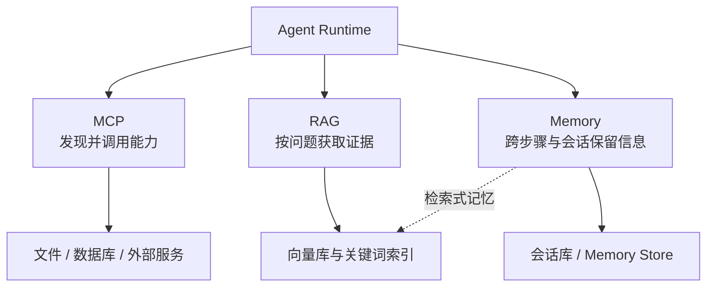

# 第三篇：MCP、RAG 与 Memory

MCP、RAG 与 Memory 都向 Agent 提供外部上下文，但解决的问题和生命周期不同。下图按连接、检索、记忆与存储边界组织这些能力。

从 Agent Runtime 向下阅读：MCP 管连接协议，RAG 管查询时证据，Memory 管跨时间状态；向量数据库只是可被后两者使用的存储与索引实现。

| 章 | 主题 | 核心问题 | 状态 |
|---:|---|---|---|
| 11 | [MCP 基础](ch11-mcp.md) | 协议怎样统一暴露能力？ | 核心扩写完成/2026-07-28 规范已核对 |
| 12 | [MCP Server](ch12-mcp-server.md) | 如何测试、授权和部署？ | 核心扩写完成/官方 SDK 待实测 |
| 13 | [RAG 基础](ch13-rag.md) | 如何建立可引用链路？ | 初稿完成 |
| 14 | [高级 RAG](ch14-advanced-rag.md) | 高级策略何时有效？ | 初稿完成 |
| 15 | [Memory](ch15-memory.md) | 写入、遗忘与隐私？ | 初稿完成 |
| 16 | [向量数据库](ch16-vector-databases.md) | 如何选型与压测？ | 初稿完成/需核查 |

MCP 解决连接协议问题，RAG 解决按查询获取知识的问题，Memory 解决跨时间保留有用状态的问题。三者可以组合，但不能互相替代。
