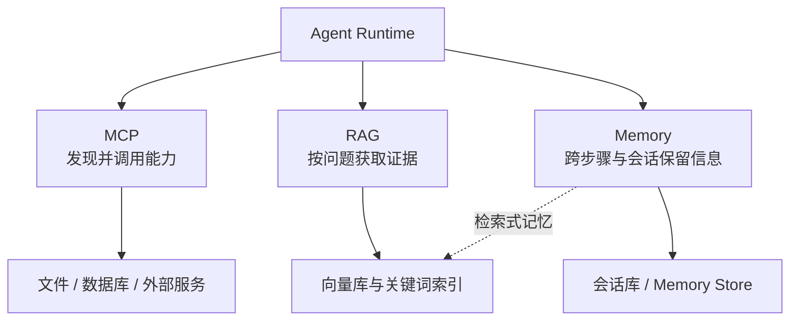
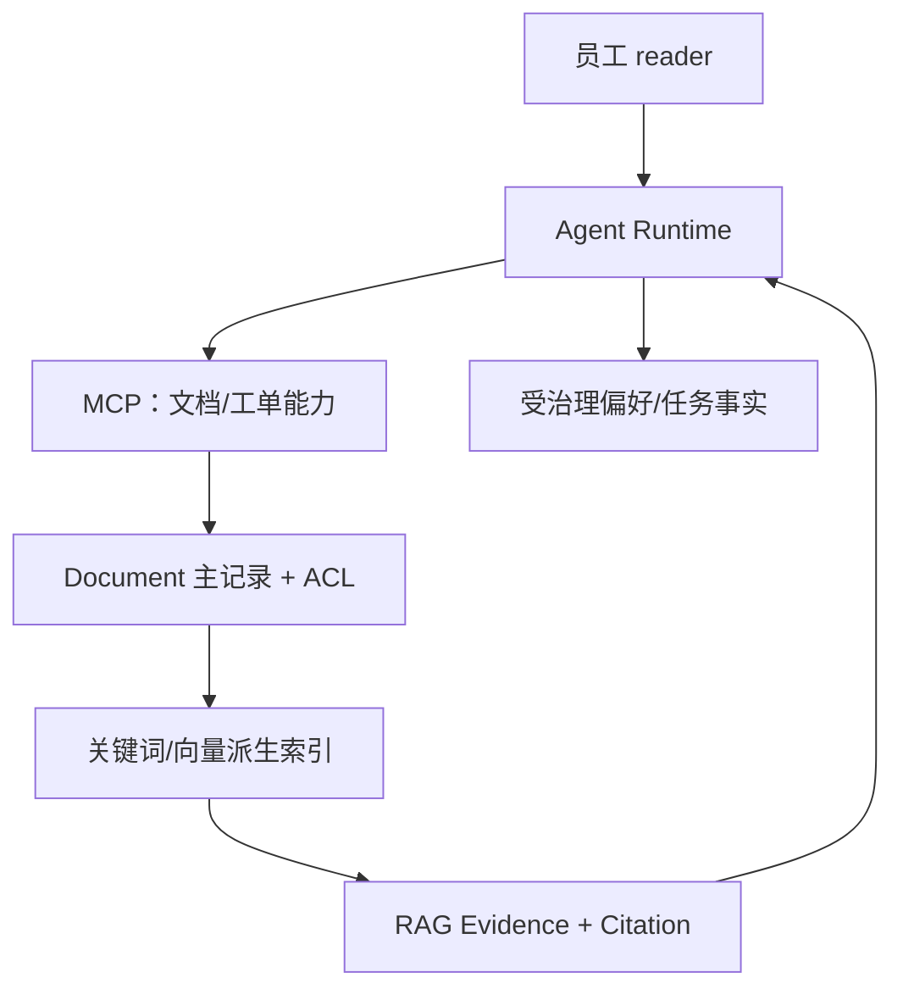

# 第三篇：MCP、RAG 与 Memory

本篇承接第二篇的 Agent Runtime。MCP、RAG 与 Memory 都向 Agent 提供外部上下文，但解决的问题和生命周期不同：MCP 连接能力，RAG 在查询时取得证据，Memory 保存受治理的跨时间状态。完成本篇后，读者应能为知识助手建立协议、检索、记忆与索引边界。

从 Agent Runtime 向下阅读：MCP 管连接协议，RAG 管查询时证据，Memory 管跨时间状态；向量数据库只是可被后两者使用的存储与索引实现。

## 主案例在本篇的演进

本篇继续使用第二篇定义的“设备研发企业知识助手”，不更换角色和领域对象。MCP Server 只暴露租户限定的文档目录、受控读取和工单能力；RAG 返回带 `Document.version` 与 `Citation` 的证据；Memory 只能保存经治理的用户偏好和任务事实，不能把文档正文或权限决定写成个人记忆；向量索引始终是 `Document` 主记录的可重建派生物。

图中主记录拥有版本和权限，索引、摘要与 Memory 都不能反向成为文档真值。后续章节若使用维修手册或制度文档，均视为该案例中的不同 `Document` 类型。

| 章 | 主题 | 核心问题 |
|---:|---|---|
| 11 | [MCP 基础](ch11-mcp.md) | 协议怎样统一暴露能力？ |
| 12 | [MCP Server](ch12-mcp-server.md) | 如何测试、授权和部署？ |
| 13 | [RAG 基础](ch13-rag.md) | 如何建立可引用链路？ |
| 14 | [高级 RAG](ch14-advanced-rag.md) | 高级策略何时有效？ |
| 15 | [Memory](ch15-memory.md) | 写入、遗忘与隐私？ |
| 16 | [向量数据库](ch16-vector-databases.md) | 如何选型与压测？ |

MCP 解决连接协议问题，RAG 解决按查询获取知识的问题，Memory 解决跨时间保留有用状态的问题。三者可以组合，但不能互相替代。第四篇会在同一问题上比较原生实现与不同框架，读者应带着本篇的数据和状态边界判断框架抽象是否健康。
