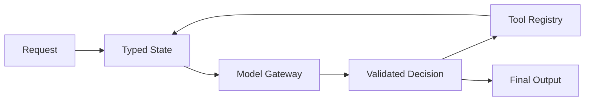
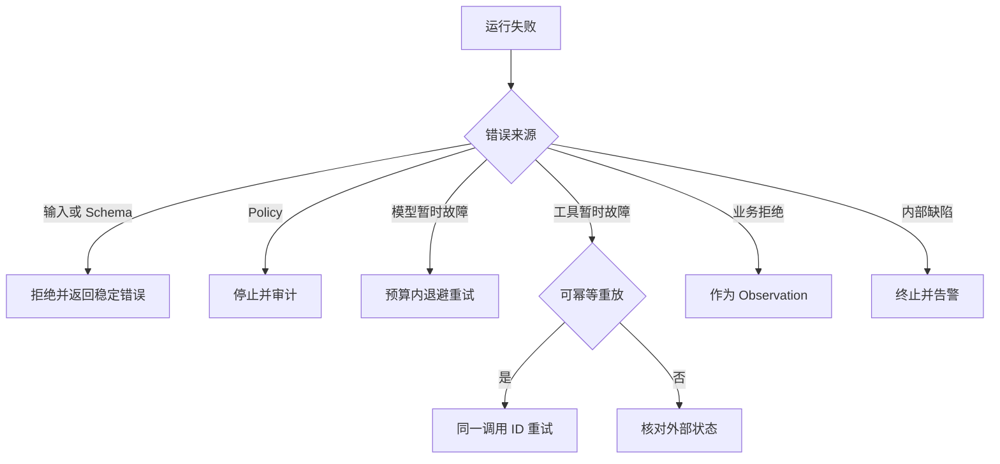
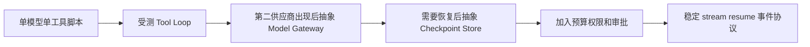
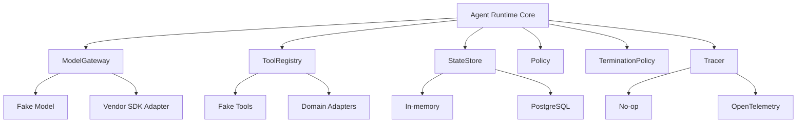
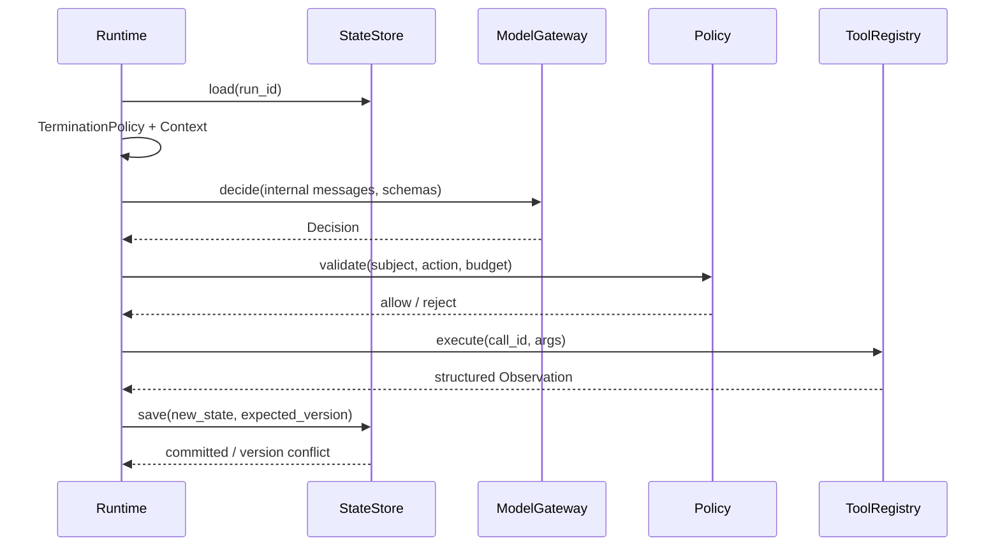
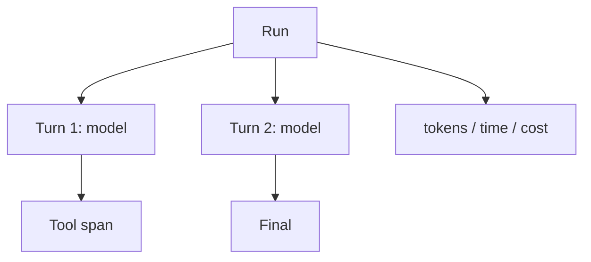

# 第17章：原生 API 构建 Agent

最后核对日期：2026-07-11。

## 导读、目标与前置知识
先不用框架，可以看清消息、工具、状态、重试和终止分别由谁负责。本章目标是从最小 Tool Loop 抽象轻量 Runtime。前置知识为第7—10、23章。

学习目标是掌握核心控制流，并通过最小示例解释每一层为何存在。

## 原理与架构

原生 Runtime 的价值是把模型协议、状态、工具与策略边界显式化。下图给出最小控制面。



Model Gateway 隔离供应商协议，Tool Registry 隔离执行，State Store 保存 checkpoint，Policy 处理预算和权限，Tracer 记录调用。抽象只在出现第二个实现时引入，避免提前复制框架复杂度。



错误分类是轻量框架的核心契约。重试只适用于可判定的暂时故障，且必须纳入统一时间、次数和费用预算。



抽象由已经出现的变化驱动，而不是预先模仿大型框架。这样每个接口都能对应真实测试和替代实现。

## 最小实验
`src/ai_agent_book/tool_runtime.py` 是最小实现。工程版增加统一错误类型、指数退避且有限的重试、取消、Usage、日志脱敏、幂等键和持久化。测试用 Fake Model 返回预设决策，验证循环而不调用付费 API。

最小示例的目标是证明 Runtime 可以只依赖内部类型，而不让任何供应商 SDK 响应对象进入工具和领域层。Fake Model 按脚本返回决策，测试可精确断言状态与调用次数。

```python
from collections import deque
from dataclasses import dataclass
from typing import Literal, Protocol


@dataclass(frozen=True)
class Decision:
    kind: Literal["tool", "final"]
    tool_name: str | None = None
    arguments: dict[str, object] | None = None
    text: str | None = None


class ModelGateway(Protocol):
    async def decide(
        self, messages: list[dict[str, object]], tool_schemas: list[dict[str, object]]
    ) -> Decision: ...


class FakeModelGateway:
    def __init__(self, decisions: list[Decision]) -> None:
        self._decisions = deque(decisions)

    async def decide(
        self, messages: list[dict[str, object]], tool_schemas: list[dict[str, object]]
    ) -> Decision:
        if not self._decisions:
            raise RuntimeError("Fake 决策已经耗尽")
        return self._decisions.popleft()
```

`FakeModelGateway` 不模拟语言能力，只驱动控制流。测试可让它依次返回未知工具、合法工具、最终答案或永久工具循环，从而验证 Registry、状态和 `TerminationPolicy`，且不消耗 API 费用。

## 工程案例

轻量 Runtime 用六个端口隔离变化：`ModelGateway` 映射模型协议，`ToolRegistry` 管 Schema 与执行，`StateStore` 保存版本状态，`Policy` 做授权与预算，`Tracer` 记录事件，`TerminationPolicy` 决定停止。领域任务只依赖这些端口，不依赖某个 SDK 的 Agent 类。



端口不是为了追求“抽象层越多越好”。只有当测试需要 Fake 或出现第二个适配器时，接口才有明确价值。对只有一个稳定存储的十行脚本，先写简单函数即可；对需要恢复、审计和多模型路由的服务，端口能避免供应商类型扩散。

### 类型化 Runtime 契约

下面的协议刻意只暴露业务所需能力：

```python
from dataclasses import dataclass
from typing import Any, Protocol


@dataclass(frozen=True)
class RunState:
    run_id: str
    version: int
    status: str
    turn: int
    remaining_tokens: int
    messages: tuple[dict[str, Any], ...]
    completed_action_ids: tuple[str, ...] = ()


class StateStore(Protocol):
    async def load(self, run_id: str) -> RunState | None: ...

    async def save(self, state: RunState, *, expected_version: int) -> None: ...


class ToolRegistryPort(Protocol):
    def schemas(self) -> list[dict[str, object]]: ...

    async def execute(
        self, name: str, arguments: dict[str, object], *, call_id: str
    ) -> dict[str, object]: ...


class Tracer(Protocol):
    def event(self, name: str, attributes: dict[str, object]) -> None: ...
```

`StateStore.save` 带期望版本，防止并发 Worker 静默覆盖。`ToolRegistryPort.execute` 强制调用 ID，为幂等和 Observation 关联提供主键。`Tracer` 接收经过 allowlist 的属性，不能让调用方随意把 Prompt 全文塞进 Trace。

### Runtime 主循环的职责顺序

可靠循环不是简单 `while True`。每一轮先加载并验证状态，再检查取消和预算；构建上下文后调用模型；将响应映射为内部 `Decision`；校验结构和策略；执行工具；保存 Observation 与 Checkpoint；最后再次判断终止。只有状态成功提交后才推进下一轮。



模型直接回答时也要经过输出 Schema 与业务验收，再把 `completed` 状态原子保存。若保存发生版本冲突，不得继续用旧状态发送下一次模型请求；重新加载后根据事件 ID 判断本轮是否已经生效。

### 重试归属

多层系统最容易出现“每层都重试三次”。SDK、ModelGateway、Runtime、任务队列和 API Gateway 若各自重试，会把一次故障放大为数十次调用。团队必须指定唯一拥有者和统一预算：

| 失败 | 首选重试拥有者 | 前提 | 非拥有层行为 |
|---|---|---|---|
| 模型连接建立失败/429/503 | ModelGateway 或 Runtime 二选一 | 有截止时间与退避 | 透传分类，不再次重试 |
| 模型输出 Schema 非法 | Runtime | 最多有限修正，计 Token | Gateway 不隐藏重试 |
| 只读 Tool 暂时失败 | Tool Executor | 明确幂等 | Runtime 记录所有尝试 |
| 写 Tool 超时 | 无自动盲重试 | 先状态核实/幂等键 | Queue 不重复投递副作用 |
| StateStore 版本冲突 | Runtime | 重新加载并重算 | 数据库驱动不循环重试业务 |
| 整个 Job Worker 崩溃 | 任务队列 | 从 Checkpoint 恢复 | 恢复协议核实副作用 |

每次尝试共享一个 `RetryBudget`，包括最大次数、截止时间、累计费用和父尝试 ID。日志中能看到原始失败和所有重试；若 SDK 内部自动重试，应在配置和 Trace 中明确，并从外层预算扣除。

```python
from dataclasses import dataclass


@dataclass
class RetryBudget:
    remaining_attempts: int

    def consume(self) -> None:
        if self.remaining_attempts <= 0:
            raise RuntimeError("重试预算耗尽")
        self.remaining_attempts -= 1
```

权限拒绝、参数非法、业务余额不足和安全策略拒绝都不是暂时故障，不应消耗重试去重复同一动作。对写操作，网络超时进入 `unknown`，通过外部操作 ID 或幂等键状态核实后再决定结果。

## 失败分析与调试

原生 Runtime 的优势是所有转换可见，但如果缺少内部协议，日志仍会变成供应商对象堆积。建议用稳定事件名记录 `run.started`、`model.requested`、`decision.validated`、`tool.started`、`tool.completed`、`state.committed` 和 `run.terminated`。

| 症状 | 可能根因 | 检查 | 修复 |
|---|---|---|---|
| 更换模型后工具结果错配 | Vendor call ID 泄漏且映射不一致 | Gateway 输入/输出契约 | 在边界转换为内部 call_id |
| 同一 503 产生大量请求 | 多层重试叠加 | span 父子关系与 attempt | 指定唯一重试归属 |
| Worker 重启后重复副作用 | Checkpoint 与工具确认顺序错误 | action_id、状态版本、外部回执 | 恢复先核实，再重放 |
| Agent 无限循环 | `TerminationPolicy` 只看模型 done | 连续动作、状态哈希、预算 | 增加无进展和硬预算 |
| 并发请求覆盖 Observation | StateStore 没有乐观锁 | version 与提交日志 | expected_version compare-and-swap |
| Trace 泄漏密钥 | 记录供应商原始对象 | 属性 allowlist | 边界脱敏，只存引用 |

调试先用 Fake Model 和 Fake Tool 重放固定序列，确认 Runtime 在成功、参数错误、未知工具、超时、预算耗尽和恢复时进入预期状态。再用 Mock HTTP 验证 SDK 映射，最后才做少量在线冒烟测试。若离线控制测试不稳定，换框架或换模型都不会解决根因。

安全上，ModelGateway 只持有模型凭证，不持有业务工具密钥；Tool Adapter 只得到当前动作所需凭证；Policy 规则与 TerminationPolicy 是模型不可修改的数据。模型响应、工具结果和恢复 Checkpoint 在进入下游前都需要 Schema 与租户验证。

## 误区、调试、实践与安全
不要把供应商响应对象泄漏到所有业务层，不要重试权限错误，不要把对话历史当数据库。Trace 按 run/turn/tool 分层。模型密钥只在 Gateway；高风险动作在 Policy 层阻断。

## 总结、练习、面试与阅读

### 为什么先不用框架

原生实现迫使开发者回答关键问题：消息由谁保存，工具名如何映射函数，参数在哪里校验，哪些异常能重试，何时终止，如何统计费用，失败后从哪里恢复。框架可以提供默认答案，却不能替团队决定业务语义。先完成一个受测的最小循环，之后才能判断框架减少了哪些代码，又引入了哪些约束。

不使用框架并不等于把所有逻辑写进一个函数。可靠的最小实现仍有 Model Client、Decision Parser、Tool Registry、State、Policy 与 Trace。区别是这些边界由团队直接控制，没有图运行时或 Agent 对象隐藏调用顺序。

### 最小工具调用循环

```python
async def run_agent(model, registry, messages, max_turns: int = 8):
    for turn in range(max_turns):
        response = await model.respond(messages, tools=registry.schemas())
        if response.final_text is not None:
            return response.final_text
        for call in response.tool_calls:
            result = await registry.execute(call.name, call.arguments)
            messages.append(result.as_tool_message(call.call_id))
    raise RuntimeError(f"超过最大回合数: {max_turns}")
```

这段代码只展示控制流。完整实现还需保证模型响应只能二选一或按协议组合，未知工具被拒绝，结果与 call ID 正确关联，消息不可无限增长，取消能传到模型和工具。`max_turns` 是不可由模型修改的运行时参数。

### 状态、错误与重试

State 区分输入消息、结构化事实、工具副作用、预算和最终状态。对话 API 返回的供应商对象先转换成内部协议，避免 SDK 类型扩散到业务层。Checkpoint 保存可序列化数据与版本，客户端连接在恢复时重建。

错误分类为输入/Schema、Policy 拒绝、模型暂时故障、工具暂时故障、业务拒绝和内部缺陷。网络 503 可以有限退避；无权限、余额不足和非法参数不能盲目重试。每次重试消耗统一预算，并记录原尝试 ID。写工具超时后先查询状态或依靠幂等键，不能直接重复执行。

### Logging、Tracing 与 Usage

结构化日志记录 run、turn、model、tool、状态、耗时和错误 code；Prompt 与工具正文按字段策略脱敏。Trace 形成 Run → Model Span → Tool Span 层级，检索或 handoff 可继续嵌套。Usage 保存供应商返回的输入、输出、缓存或其他计量，并关联价格表版本。字符估算只用于调用前预算。



Trace 用于复现决策链，预算器用于强制终止，两者都应引用同一 run、turn 和 tool call 标识。

### 测试与轻量框架抽象

Fake Model 接收消息并按脚本返回工具调用或最终输出。测试覆盖直接回答、单工具、多工具、未知工具、参数错误、超时、取消、重试上限、循环上限和预算耗尽。集成测试使用 Mock HTTP 验证供应商协议映射，少量在线测试只验证账号环境与模型兼容。

当第二个模型供应商出现时抽象 `ModelGateway`；当第二类状态存储出现时抽象 `CheckpointStore`。不要为想象中的十个框架预先设计万能接口。内部 Runtime 可以定义 `run()`、`stream()`、`resume()`，但领域层只依赖任务结果与事件，不依赖供应商消息对象。

### 常见误区、调试与安全

常见误区是把原生 API 等同于无架构脚本、把所有异常统一重试、把消息列表当状态数据库。调试从完整事件顺序、结束原因与实际请求开始。安全上 Model Client 不拥有工具凭证，Policy 位于工具执行前，输出进入下游前验证，Trace 不存 secret。
总结：原生 API 提供最高控制力，也要求团队承担运行时工程。练习：为轻量 Runtime 增加 checkpoint、取消和流事件；面试：何时应从原生 API 迁移框架？抽象 Model Gateway 的代价是什么？如何证明一次重试不会重复副作用？延伸阅读：目标模型的 Tool Calling、Streaming 与 Usage 官方文档。代码目录：`src/ai_agent_book/`。

## 练习参考答案

1. Checkpoint 保存内部 `RunState`、版本、下一节点、已完成 action ID 和预算；取消信号在模型与工具调用前检查并传播；流事件使用稳定内部类型，不直接暴露供应商流块。测试重启后已确认写动作不重放。
2. 当团队需要框架已经稳定提供的持久图、人工中断、事件流或大量集成，且维护自建 Runtime 成本更高时可以迁移。先做一个垂直切片和回滚 ADR，不因示例代码更短就全量改写。
3. `ModelGateway` 的代价是需要维护共同能力子集、错误映射、Usage 与流式事件转换；某些供应商特性可能需要扩展接口。收益是业务层与 SDK 解耦、可使用 Fake，并能集中控制重试与密钥。
4. 证明重试不重复副作用需要业务幂等键、唯一约束、外部操作 ID 或 outbox，以及并发与超时注入测试。仅说 HTTP PUT“通常幂等”不够，必须验证目标服务的实际语义。
5. 重试归属表应明确每类失败的唯一拥有层、最大尝试、截止时间和预算。关闭其他层的隐式重试，并在 Trace 中用父 attempt ID 验证一次用户请求产生的实际调用数。
