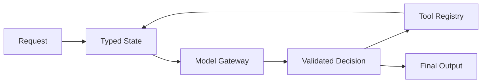
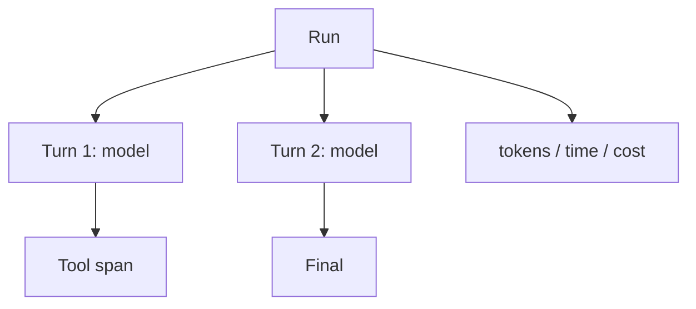

# 第17章：原生 API 构建 Agent

最后核对日期：2026-07-11。

## 导读、目标与前置知识
先不用框架，可以看清消息、工具、状态、重试和终止分别由谁负责。本章目标是从最小 Tool Loop 抽象轻量 Runtime。前置知识为第7—10、23章。

学习目标是掌握核心控制流，并通过最小示例解释每一层为何存在。

## 原理与架构

Model Gateway 隔离供应商协议，Tool Registry 隔离执行，State Store 保存 checkpoint，Policy 处理预算和权限，Tracer 记录调用。抽象只在出现第二个实现时引入，避免提前复制框架复杂度。

## 最小与完整工程
`src/ai_agent_book/tool_runtime.py` 是最小实现。工程版增加统一错误类型、指数退避且有限的重试、取消、Usage、日志脱敏、幂等键和持久化。测试用 Fake Model 返回预设决策，验证循环而不调用付费 API。

## 误区、调试、实践与安全
不要把供应商响应对象泄漏到所有业务层，不要重试权限错误，不要把对话历史当数据库。Trace 按 run/turn/tool 分层。模型密钥只在 Gateway；高风险动作在 Policy 层阻断。

## 总结、练习、面试与阅读

### 为什么先不用框架

原生实现迫使开发者回答关键问题：消息由谁保存，工具名如何映射函数，参数在哪里校验，哪些异常能重试，何时终止，如何统计费用，失败后从哪里恢复。框架可以提供默认答案，却不能替团队决定业务语义。先完成一个受测的最小循环，之后才能判断框架减少了哪些代码，又引入了哪些约束。

不使用框架并不等于把所有逻辑写进一个函数。可靠的最小实现仍有 Model Client、Decision Parser、Tool Registry、State、Policy 与 Trace。区别是这些边界由团队直接控制，没有图运行时或 Agent 对象隐藏调用顺序。

### 最小工具调用循环

```python
async def run_agent(model, registry, messages, max_turns: int = 8):
    for turn in range(max_turns):
        response = await model.respond(messages, tools=registry.schemas())
        if response.final_text is not None:
            return response.final_text
        for call in response.tool_calls:
            result = await registry.execute(call.name, call.arguments)
            messages.append(result.as_tool_message(call.call_id))
    raise RuntimeError(f"超过最大回合数: {max_turns}")
```

这段代码只展示控制流。完整实现还需保证模型响应只能二选一或按协议组合，未知工具被拒绝，结果与 call ID 正确关联，消息不可无限增长，取消能传到模型和工具。`max_turns` 是不可由模型修改的运行时参数。

### 状态、错误与重试

State 区分输入消息、结构化事实、工具副作用、预算和最终状态。对话 API 返回的供应商对象先转换成内部协议，避免 SDK 类型扩散到业务层。Checkpoint 保存可序列化数据与版本，客户端连接在恢复时重建。

错误分类为输入/Schema、Policy 拒绝、模型暂时故障、工具暂时故障、业务拒绝和内部缺陷。网络 503 可以有限退避；无权限、余额不足和非法参数不能盲目重试。每次重试消耗统一预算，并记录原尝试 ID。写工具超时后先查询状态或依靠幂等键，不能直接重复执行。

### Logging、Tracing 与 Usage

结构化日志记录 run、turn、model、tool、状态、耗时和错误 code；Prompt 与工具正文按字段策略脱敏。Trace 形成 Run → Model Span → Tool Span 层级，检索或 handoff 可继续嵌套。Usage 保存供应商返回的输入、输出、缓存或其他计量，并关联价格表版本。字符估算只用于调用前预算。



### 测试与轻量框架抽象

Fake Model 接收消息并按脚本返回工具调用或最终输出。测试覆盖直接回答、单工具、多工具、未知工具、参数错误、超时、取消、重试上限、循环上限和预算耗尽。集成测试使用 Mock HTTP 验证供应商协议映射，少量在线测试只验证账号环境与模型兼容。

当第二个模型供应商出现时抽象 `ModelGateway`；当第二类状态存储出现时抽象 `CheckpointStore`。不要为想象中的十个框架预先设计万能接口。内部 Runtime 可以定义 `run()`、`stream()`、`resume()`，但领域层只依赖任务结果与事件，不依赖供应商消息对象。

### 常见误区、调试与安全

常见误区是把原生 API 等同于无架构脚本、把所有异常统一重试、把消息列表当状态数据库。调试从完整事件顺序、结束原因与实际请求开始。安全上 Model Client 不拥有工具凭证，Policy 位于工具执行前，输出进入下游前验证，Trace 不存 secret。
总结：原生 API 提供最高控制力，也要求团队承担运行时工程。练习：为轻量 Runtime 增加 checkpoint、取消和流事件；面试：何时应从原生 API 迁移框架？抽象 Model Gateway 的代价是什么？如何证明一次重试不会重复副作用？延伸阅读：目标模型的 Tool Calling、Streaming 与 Usage 官方文档。代码目录：`src/ai_agent_book/`。
