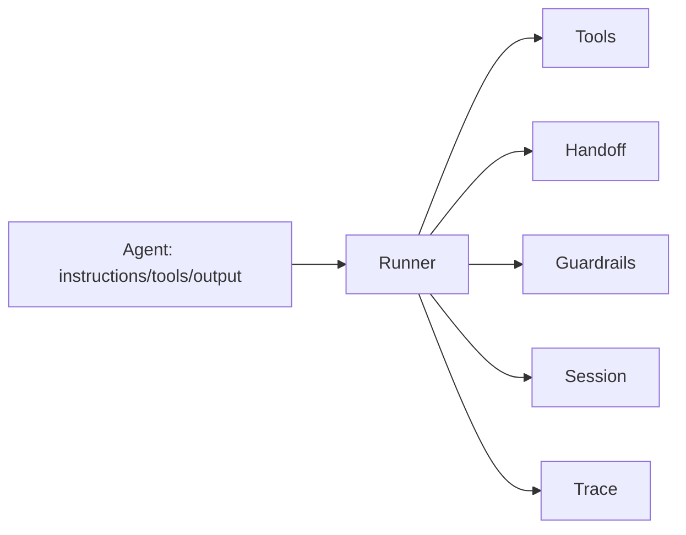
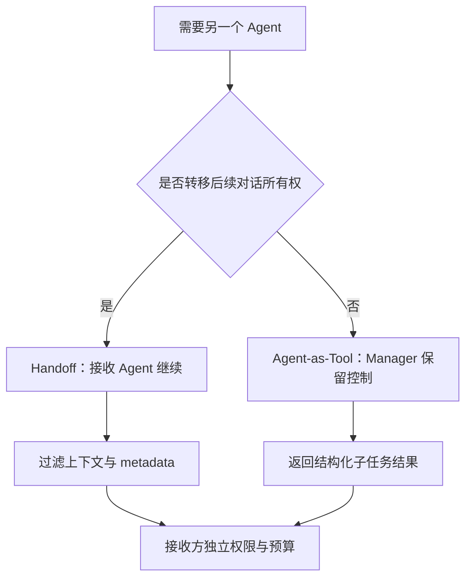
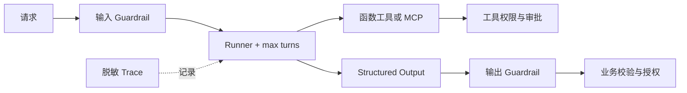
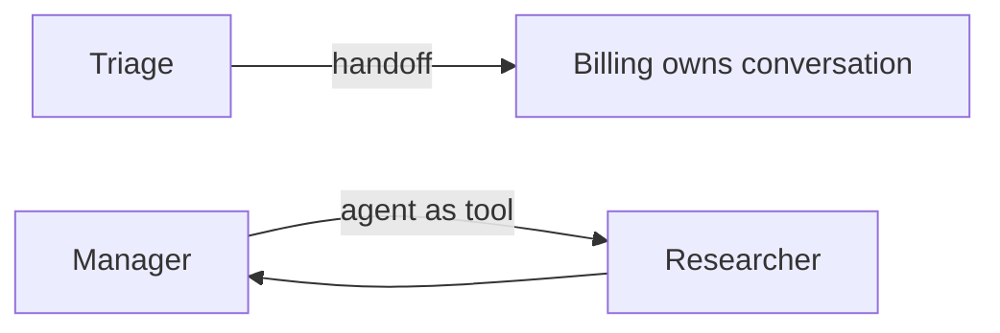

# 第18章：OpenAI Agents SDK

最后核对日期：2026-07-11；依据 OpenAI Agents SDK 官方文档，代码编写时仍须以安装版本为准。

## 导读、目标与前置知识
SDK 用少量原语管理 Agent、工具、handoff、guardrail、session 与 tracing。本章目标是理解它替开发者承担的运行时职责及适用边界。前置知识为第17章。

学习目标是能够实现、测试和审查一个受限的 SDK Agent，而不是只运行 Quickstart。

## 核心原理与架构

OpenAI Agents SDK 将 Agent 配置与 Runner 控制循环分开。下图标出工具、转交、护栏、会话与追踪围绕 Runner 的关系。



官方文档说明 SDK 默认在 OpenAI 模型上使用 Responses API；`Agent` 配置指令、工具、handoff、guardrail 和结构化输出，`Runner` 管理回合与工具循环。Session 保存跨 run 的历史；Tracing 记录模型、工具、handoff 和 guardrail 事件。MCP Server 可作为 Agent 工具来源。



拆分的依据是控制权、权限和上下文边界，而不是角色名称。无论选择哪种模式，外部 Policy 都不能随转交消失。



Guardrail 负责模型交互前后的检查，工具和数据库边界仍执行确定性授权。Trace 与审计日志分别服务调试和合规记录。

## 最小与完整工程
最小流程是定义 Agent 并用 Runner 执行。由于接口变化快，本书的可运行项目在安装 `openai-agents` 后读取该版本示例，不在未安装时伪造签名。工程版应固定版本、设置 `max_turns`、配置敏感 Trace、处理 guardrail tripwire、工具失败和 session 并发，并用 Fake/测试模型隔离在线调用。

## 误区、调试、实践与安全
Handoff 不自动意味着更优多 Agent；guardrail 不是数据库权限；Tracing 默认行为需要检查敏感数据设置。调试查看 Runner 回合、工具参数、handoff 目标和最终 output type。只在需要托管循环、handoff、session 或 Trace 时引入 SDK；短流程可直接用 Responses API。

## 总结、练习、面试与官方阅读

### Agent、Tool 与 Runner

`Agent` 是配置对象，组合名称、instructions、model、tools、handoffs、guardrails 和 output type 等。函数工具根据 Python 签名生成 Schema，但业务权限仍由函数内部或其依赖服务执行。`Runner` 驱动模型回合、工具执行和 handoff，直到得到最终输出或超过回合限制。

官方当前最小形态如下；具体依赖版本必须固定并由测试验证：

```python
from agents import Agent, Runner

agent = Agent(
    name="Study assistant",
    instructions="Answer with concise, verifiable explanations.",
)

result = Runner.run_sync(agent, "Explain why tool calls need validation.")
print(result.final_output)
```

异步服务使用异步 Runner 方法，流式方法返回事件而不是只返回文本。运行时设置 `max_turns`，捕获回合超限、guardrail tripwire 与工具异常。不要依赖默认无限增长的上下文或默认模型名称，生产配置显式固定。

### Handoff 与 Agent-as-Tool

Handoff 把当前对话控制转给另一个 Agent，适合客服分流等“新 Agent 负责后续”的场景。Agent-as-Tool 让 Manager 调用专业 Agent 并继续持有控制，适合研究、翻译等子任务。两者都增加模型调用和上下文传递，只有职责、权限或专业提示确实不同才拆分。

handoff 输入要过滤并使用类型化 metadata。接收 Agent 不应获得无关历史或上一个 Agent 的秘密依赖。官方文档提示 guardrail 的执行位置与 handoff 链有关，因此应用不能假设每次转交都会自动重复所有输入检查；关键 Policy 放在外部工具和服务边界。



两条路径最关键的差别是最终控制权归属；它决定历史、Guardrail、终止条件和最终输出由谁管理。

### Guardrail、Structured Output 与 Session

输入 Guardrail 可在运行前或并行检查请求，输出 Guardrail 检查最终结果，Tool Guardrail 约束工具调用。Guardrail 适合内容与业务预检查，但不替代数据库授权。Tripwire 触发后运行终止，调用方应返回稳定错误并记录审计。

Structured Output 使用类型/Schema 约束最终输出，应用侧仍进行 Pydantic 与业务验证。Session 保存多次 Runner 调用间的历史；官方提供 SQLiteSession 等实现，但生产要考虑并发、租户、保留和加密。Session 是会话历史机制，不是长期 Memory 或业务状态仓库。

### Tracing 与敏感数据

SDK 内置 Trace，覆盖整个 Runner、Agent、generation、function tool、guardrail 和 handoff span，并支持自定义 processor。生产至少设置 workflow name、group/run 标识和 metadata。默认跟踪行为与敏感数据选项必须按当前版本核对；受监管数据可以关闭内容采集或接入自管处理器。

Trace 用于调试与评估，Audit Log 用于不可抵赖的主体/动作记录，两者不可互换。工具参数如果包含 PII，先在应用层生成脱敏 span attributes，而不是指望后端统一清洗。

### MCP、多 Agent 与错误处理

SDK 可以把 MCP Server 能力提供给 Agent。连接初始化、工具缓存、超时与 cleanup 都要显式管理。远程 MCP 按协议授权，本地 stdio Server 使用最小环境。模型选择工具后仍经过 Host 与 Server 双重 Policy。

多 Agent 系统优先从 Manager 或单次 handoff 开始，不构造自由群聊。每个 Agent 设工具 allowlist，Runner 设回合和费用预算。工具错误转换为对模型安全的摘要，内部异常留在日志；网络失败有限重试，Policy 和业务拒绝不重试。

### 完整项目与测试策略

项目结构把 Agent 定义、工具、依赖、guardrails、session 与入口分开。单元测试直接测试工具和 guardrail；运行时测试使用可控模型或录制的协议响应；在线 smoke test 使用专门低权限账号。版本升级先运行工具选择、handoff、output type、session 和 Trace 回归。

常见误区包括把 SDK 当成托管业务平台、把 guardrail 当授权、为每个角色创建 Agent，以及默认 Trace 可以记录全部数据。选型时与第17章原生 Runtime 对照：若流程只有一次模型调用和一个工具，引入 SDK 未必带来净收益。
总结：SDK 用少量原语提供受测运行时，但业务状态、权限与评估仍由应用负责。练习：对照原生 Runtime 写迁移 ADR，并为 handoff 加上下文过滤测试。面试：Agent-as-tool 与 handoff 有何差异？为什么仍需外部权限？Session 与 Memory 如何区分？延伸阅读与官方资料：[Agents SDK](https://openai.github.io/openai-agents-python/)、[Running agents](https://openai.github.io/openai-agents-python/running_agents/)、[Tracing](https://openai.github.io/openai-agents-python/tracing/)、[MCP](https://openai.github.io/openai-agents-python/mcp/)。代码目录：`examples/openai_agents_sdk/`。
