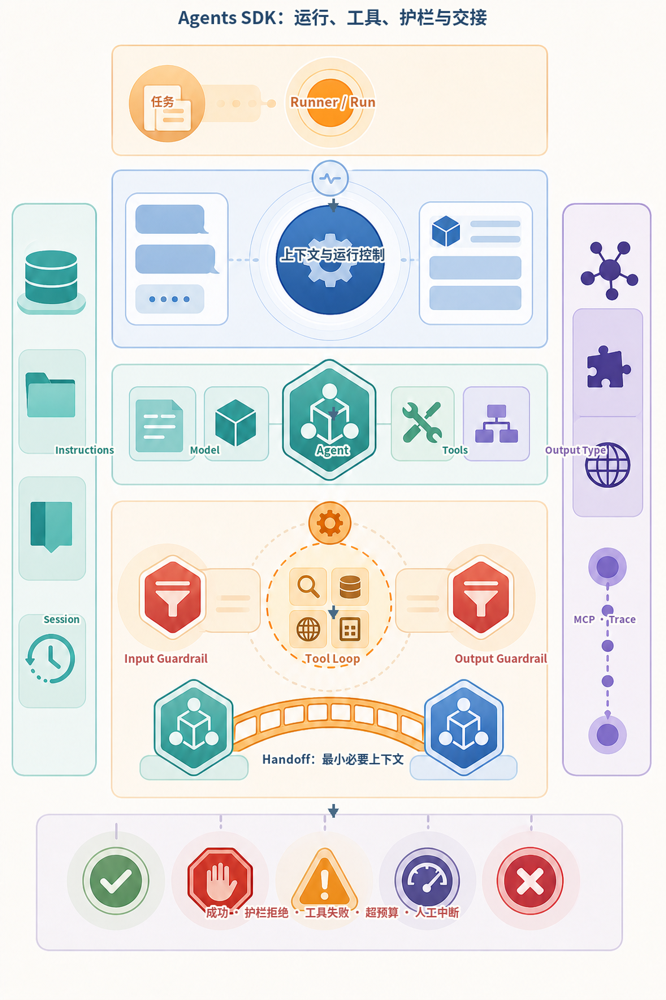
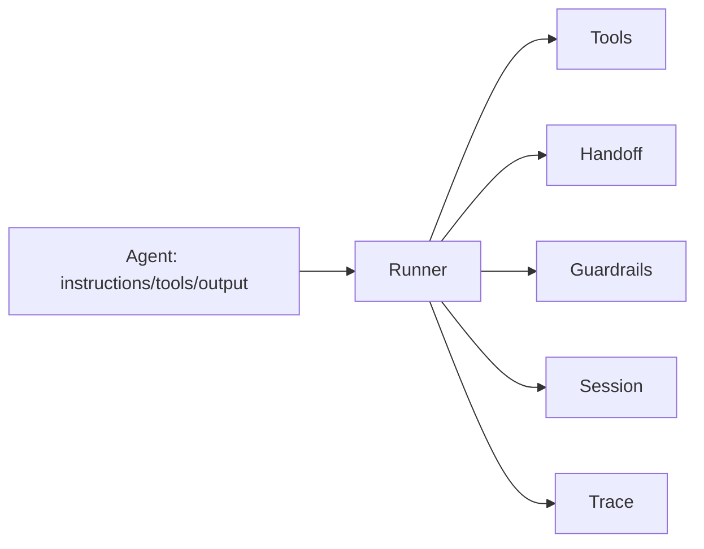
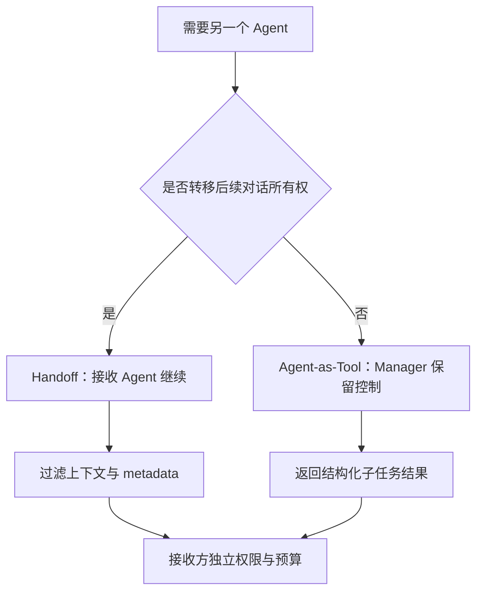
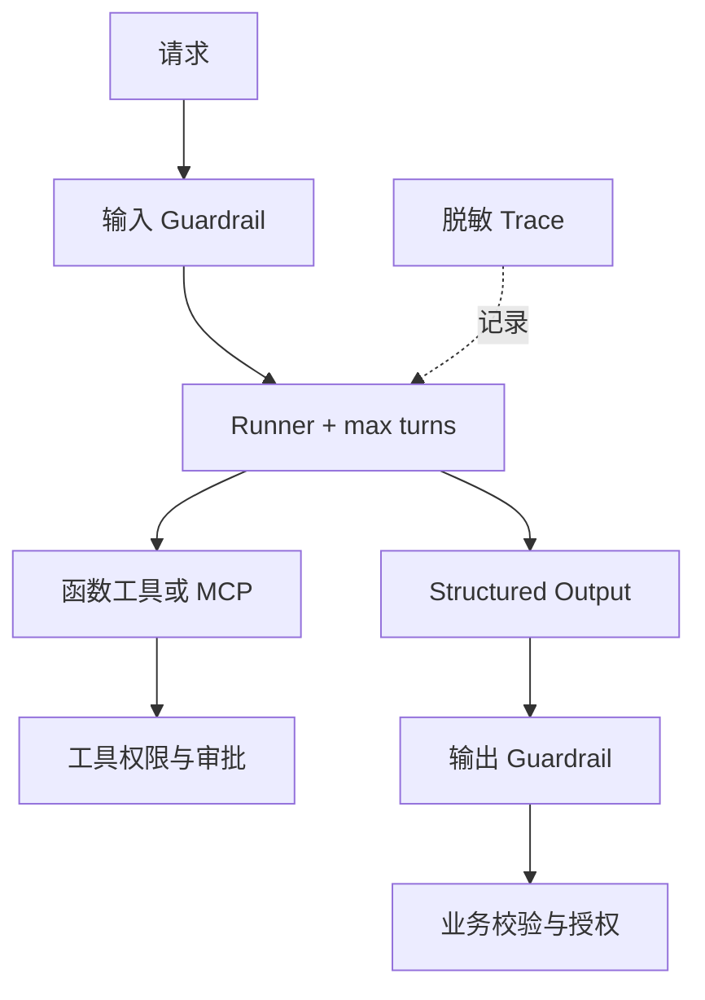
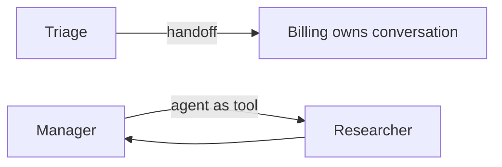
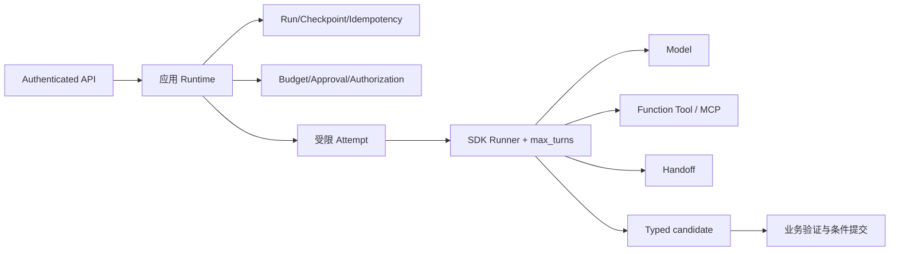

# 第18章：OpenAI Agents SDK

最后核对日期：2026-08-12。

!!! info "版本证据"
    本章核心代码固定 `openai-agents==0.18.3`，并在 Python 3.12 隔离环境完成离线复核。Responses API、工具契约、权限与停止边界按平台官方资料核对；`Runner`、Handoff、Session 与 Tracing 接口以锁定包和 SDK 官方专站为准，不能从模型指南外推。

## 导读、目标与前置知识
SDK 用少量原语管理 Agent、工具、handoff、guardrail、session 与 tracing。本章目标是理解它替开发者承担的运行时职责及适用边界。前置知识为第17章。

学习目标是能够实现、测试和审查一个受限的 SDK Agent，而不是只运行 Quickstart。

本章关于 Agent、Runner、Tool、Handoff 与 Guardrail 的版本敏感说明以 [OpenAI Agents 官方指南](../references.md#ref-openai-agents-guide)为主要依据；数据处理边界另参见 [平台数据控制说明](../references.md#ref-openai-data-controls)。锁定依赖和正文核对日期共同限定了代码结论的适用范围。

本章只用稳定概念关系建立 SDK 心智模型，具体接口仍以锁定版本和官方文档为准。Runner 驱动一次 Run，Agent 组合指令、模型、工具和输出契约，Guardrail、Handoff、Session、MCP 与 Tracing 分别承担不同职责。



*图 18-A：Agents SDK 的运行、工具、护栏与交接关系。本图表达职责边界，不承诺任何具体函数签名或版本敏感参数。*

图 18-A 中 Handoff 是受控的责任移交，不是鼓励多个 Agent 无限互聊。交接载荷、允许工具、预算和终止状态都应显式定义，并通过 Trace 关联到同一次任务。

## 核心原理与架构

OpenAI Agents SDK 将 Agent 配置与 Runner 控制循环分开。下图标出工具、转交、护栏、会话与追踪围绕 Runner 的关系。



官方文档说明 SDK 默认在 OpenAI 模型上使用 Responses API；`Agent` 配置指令、工具、handoff、guardrail 和结构化输出，`Runner` 管理回合与工具循环。Session 保存跨 run 的历史；Tracing 记录模型、工具、handoff 和 guardrail 事件。MCP Server 可作为 Agent 工具来源。



拆分的依据是控制权、权限和上下文边界，而不是角色名称。无论选择哪种模式，外部 Policy 都不能随转交消失。



Guardrail 负责模型交互前后的检查，工具和数据库边界仍执行确定性授权。Trace 与审计日志分别服务调试和合规记录。

## 最小示例与完整工程
最小流程是定义 Agent 并用 Runner 执行。本书在独立 Python 3.12 环境固定 `openai-agents==0.18.3`，以实现 SDK `Model` 接口的 `ScriptedModel` 离线验证 Responses 输出项，不模拟模型推理，也不访问网络。工程版应固定版本、设置 `max_turns`、配置敏感 Trace、处理 guardrail tripwire、工具失败和 session 并发，并用 Fake/测试模型隔离在线调用。

## 误区、调试、实践与安全
Handoff 不自动意味着更优多 Agent；guardrail 不是数据库权限；Tracing 默认行为需要检查敏感数据设置。调试查看 Runner 回合、工具参数、handoff 目标和最终 output type。只在需要托管循环、handoff、session 或 Trace 时引入 SDK；短流程可直接用 Responses API。

## SDK 原语与应用 Runtime 的边界

### Agent、Tool 与 Runner

`Agent` 是配置对象，组合名称、instructions、model、tools、handoffs、guardrails 和 output type 等。函数工具根据 Python 签名生成 Schema，但业务权限仍由函数内部或其依赖服务执行。`Runner` 驱动模型回合、工具执行和 handoff，直到得到最终输出或超过回合限制。

官方当前最小形态如下；具体依赖版本必须固定并由测试验证：

```python
from agents import Agent, Runner

agent = Agent(
    name="Study assistant",
    instructions="Answer with concise, verifiable explanations.",
)

result = Runner.run_sync(agent, "Explain why tool calls need validation.")
print(result.final_output)
```

异步服务使用异步 Runner 方法，流式方法返回事件而不是只返回文本。运行时设置 `max_turns`，捕获回合超限、guardrail tripwire 与工具异常。不要依赖默认无限增长的上下文或默认模型名称，生产配置显式固定。

### Handoff 与 Agent-as-Tool

Handoff 把当前对话控制转给另一个 Agent，适合客服分流等“新 Agent 负责后续”的场景。Agent-as-Tool 让 Manager 调用专业 Agent 并继续持有控制，适合研究、翻译等子任务。两者都增加模型调用和上下文传递，只有职责、权限或专业提示确实不同才拆分。

handoff 输入要过滤并使用类型化 metadata。接收 Agent 不应获得无关历史或上一个 Agent 的秘密依赖。官方文档提示 guardrail 的执行位置与 handoff 链有关，因此应用不能假设每次转交都会自动重复所有输入检查；关键 Policy 放在外部工具和服务边界。



两条路径最关键的差别是最终控制权归属；它决定历史、Guardrail、终止条件和最终输出由谁管理。

### Guardrail、Structured Output 与 Session

输入 Guardrail 可在运行前或并行检查请求，输出 Guardrail 检查最终结果，Tool Guardrail 约束工具调用。Guardrail 适合内容与业务预检查，但不替代数据库授权。Tripwire 触发后运行终止，调用方应返回稳定错误并记录审计。

Structured Output 使用类型/Schema 约束最终输出，应用侧仍进行 Pydantic 与业务验证。Session 保存多次 Runner 调用间的历史；官方提供 SQLiteSession 等实现，但生产要考虑并发、租户、保留和加密。Session 是会话历史机制，不是长期 Memory 或业务状态仓库。

### Tracing 与敏感数据

SDK 内置 Trace，覆盖整个 Runner、Agent、generation、function tool、guardrail 和 handoff span，并支持自定义 processor。生产至少设置 workflow name、group/run 标识和 metadata。默认跟踪行为与敏感数据选项必须按当前版本核对；受监管数据可以关闭内容采集或接入自管处理器。

Trace 用于调试与评估，Audit Log 用于不可抵赖的主体/动作记录，两者不可互换。工具参数如果包含 PII，先在应用层生成脱敏 span attributes，而不是指望后端统一清洗。

### MCP、多 Agent 与错误处理

SDK 可以把 MCP Server 能力提供给 Agent。连接初始化、工具缓存、超时与 cleanup 都要显式管理。远程 MCP 按协议授权，本地 stdio Server 使用最小环境。模型选择工具后仍经过 Host 与 Server 双重 Policy。

多 Agent 系统优先从 Manager 或单次 handoff 开始，不构造自由群聊。每个 Agent 设工具 allowlist，Runner 设回合和费用预算。工具错误转换为对模型安全的摘要，内部异常留在日志；网络失败有限重试，Policy 和业务拒绝不重试。

### 完整项目与测试策略

项目结构把 Agent 定义、工具、依赖、guardrails、session 与入口分开。单元测试直接测试工具和 guardrail；运行时测试使用可控模型或录制的协议响应；在线 smoke test 使用专门低权限账号。版本升级先运行工具选择、handoff、output type、session 和 Trace 回归。

常见误区包括把 SDK 当成托管业务平台、把 guardrail 当授权、为每个角色创建 Agent，以及默认 Trace 可以记录全部数据。选型时与第17章原生 Runtime 对照：若流程只有一次模型调用和一个工具，引入 SDK 未必带来净收益。

### 固定版本实测的最小证据链

本章接口证据由三层组成：`pyproject.toml` 固定 `openai-agents==0.18.3`；全新 Python 3.12 环境安装真实
包；`ScriptedModel` 实现该版本 `Model` 接口并向真实 `Runner` 返回 Responses 输出项。它没有 Mock
掉 Runner，也不伪造在线模型推理。六项测试分别覆盖：

| 能力 | 直接断言 | 没有证明什么 |
|---|---|---|
| Function Tool | Runner 消费 Tool Call 并回送结果 | 真实模型一定会正确选工具 |
| Structured Output | `final_output_as(SupportReport)` 类型化 | 字段事实正确 |
| Handoff | 控制转移到 Specialist | 拆分比单 Agent 更好 |
| Agent-as-tool | Manager 收回专家结果 | 多角色值得额外成本 |
| Guardrail | 阻塞模式在模型前 Tripwire | 所有并行模式都无计费窗口 |
| SQLiteSession/Trace 配置 | 历史持久、离线禁用导出 | 生产并发与合规完成 |

这套证据足以支撑教材中的具体示例，却不能外推在线 Provider、远程 MCP、Trace Backend 或下一版本 API。
升级流程重新安装候选版本、运行相同测试并审查签名差异，再修改正文；不能先改文档后补证据。

### Runner 之外仍需应用 Runtime

SDK Runner 管理模型—工具回合，但企业应用仍需拥有 Run ID、租户、幂等键、Deadline、预算、审批、
Checkpoint 和最终业务状态。把 HTTP 请求直接 `await Runner.run()` 可以做 Demo，却难以处理断线、长任务
恢复和外部写对账。推荐在应用 Service 中包装 Runner：



图中 Runner 的最终输出仍是 Candidate。应用验证引用、权限和状态 Version 后才提交。`max_turns` 限制
SDK 回合，但工具内部重试、MCP 调用和外层 Job Attempt 还需共享总预算。

### Function Tool 的事务与权限

装饰器可从 Python 签名生成 Schema，但 Schema 只验证形状。工具函数从受控 Dependency Context 获取
Principal、Tenant、Deadline 和最小权限 Client；模型不能通过参数提供或覆盖这些字段。外部写使用业务
幂等键并在执行前进行内容绑定审批。

对模型返回安全摘要，对日志保留脱敏错误码。参数错误可让模型有限修复，Policy Denied 不应通过换个
参数无限重试；超时后的外部写先对账。SDK 自动工具循环不能替代这些业务语义。

### Handoff、Guardrail 与并发窗口

Handoff 的接收 Agent 有自己的 Instructions、Tool Scope 和输出契约。传递完整对话可能泄露不必要的
PII 或把上游不可信内容带入新权限域，因此使用过滤器和类型化 Metadata，只传已验证事实、未决任务、
预算与引用。Handoff 后谁产生最终输出、哪些 Guardrail 运行，需要按锁定版本行为测试。

Guardrail 是否并行执行会影响成本与副作用窗口。本示例显式测试 `run_in_parallel=False` 的阻塞输入
Guardrail 在 Model 前触发；这不等于所有 Guardrail 默认都阻塞，也不等于 Guardrail 可以承担数据库
授权。需要“未通过检查绝不调用模型/工具”的规则应采用阻塞模式并以直接测试证明。

### Session 的并发、保留与 Memory 区分

Session 为多个 Runner 调用提供历史。生产中同一 Session 的并发请求必须序列化、分支或用版本冲突
明确拒绝，否则消息顺序不确定。历史长度需要截断/摘要，摘要携带版本并可追溯；租户与用户访问在
Session Store 外层强制执行。

Session 不是长期 Memory：前者服务当前会话连续性，后者需要写入门禁、来源、TTL、更正、删除与跨会话
检索。也不是业务 Checkpoint：外部副作用、审批和 Job 状态应存在应用数据库，不能靠消息历史恢复。

### Trace、MCP 与生产数据边界

示例同时调用全局禁用和 `RunConfig(tracing_disabled=True, trace_include_sensitive_data=False)`，确保离线
测试不上传 Trace。生产若启用，需核对当前版本的默认内容采集、Processor、数据地域、保留和失败行为。
SDK Trace 用于调试，不替代不可采样的 Audit。

MCP Server 提供工具发现和调用，但 Host 仍决定连接哪些 Server、暴露哪些工具和传递什么凭证。远程
Transport、OAuth、Origin、超时和生命周期属于 MCP/基础设施边界；SDK 集成不能让 Server 自动继承
用户全部权限。版本敏感构造方式以 SDK 官方专站和隔离测试为准，本章不凭概念关系猜测代码。

### 迁移 ADR 与选型检查

从原生 Runtime 迁移前记录 ADR：需要 SDK 的具体能力、替代方案、锁定版本、状态所有权、回退路径和
评估结果。保留领域 Port，使框架 Adapter 可替换；不要让 SDK Result 类型渗透数据库 Schema 和所有
业务服务。

选型检查需要回答：是否确实需要 Runner 的工具循环、Handoff、Session、Guardrail 或 Trace 原语；应用是否仍拥有业务 Run State；框架升级失败时能否回到原生 Adapter；SDK 类型是否被限制在边界层。单模型单工具且无需这些原语时，原生 API Loop 通常更透明。

## 本章总结

OpenAI Agents SDK 用少量原语提供模型—工具运行时，但业务状态、权限、幂等、预算、审批、Checkpoint 和最终评估仍由应用负责。Handoff 是权限域和任务所有权的转移，不是完整对话复制；Guardrail 的执行时机必须按锁定版本测试；Session、长期 Memory 与业务 Run State 具有不同生命周期。下一章将比较一种更强调 Python 类型、依赖注入和验证重试的框架设计。

## 课后练习

### 设计题

1. 在上游历史放入 PII 与无关 Tool Result，设计 Handoff 过滤，只传工单 ID、验证摘要、未决任务和剩余预算。

### 编码题

2. 使用计数模型验证阻塞 Guardrail 触发时模型调用次数为零，并为并行 Guardrail 单独设计测试。

输入为允许与拒绝 Fixture；输出为 Guardrail 状态和模型调用计数；检查标准是阻塞式拒绝不会产生模型费用。

### 概念题

3. 为 Session、长期 Memory 和 Run State 分别定义存储内容、权限、保留与删除策略。

### 设计题

4. 为从原生 Runtime 迁移 SDK 编写 ADR，保留领域 Port 和回退路径。

### 故障实验

让 Handoff 目标 Agent 请求上游未授权 PII，验证过滤后的上下文和目标工具权限都无法恢复该数据。

## 参考答案位置

本章参考答案已移至[书末参考答案](../exercise-answers.md)，便于先独立完成练习再核对。

## 面试问题

1. Runner 管理哪些循环，应用 Runtime 还必须管理什么？
2. Handoff 与 Agent-as-Tool 的区别是什么？
3. Guardrail 为什么不能替代数据库授权？
4. Session 为什么既不是长期 Memory，也不是业务 Checkpoint？

## 延伸阅读与代码目录

官方资料包括 [Agents SDK](https://openai.github.io/openai-agents-python/)、[Running agents](https://openai.github.io/openai-agents-python/running_agents/)、[Tracing](https://openai.github.io/openai-agents-python/tracing/) 和 [MCP](https://openai.github.io/openai-agents-python/mcp/)。本章对应代码目录为 [`examples/openai_agents_sdk/`](https://github.com/wujinjun/ai-agent-book/tree/main/examples/openai_agents_sdk)。

## 本章引用
<!-- chapter-citations:start -->
以下资料用于支撑本章的核心原理、工程边界与版本敏感说明：

- [openai-agents-guide：Build Agents with the OpenAI Platform](../references.md#ref-openai-agents-guide)
- [openai-quickstart：OpenAI API Developer Quickstart](../references.md#ref-openai-quickstart)
- [openai-evals：Evals API Reference](../references.md#ref-openai-evals)
- [openai-data-controls：Data Controls in the OpenAI Platform](../references.md#ref-openai-data-controls)
- [openai-compat：API Backward Compatibility](../references.md#ref-openai-compat)
<!-- chapter-citations:end -->
