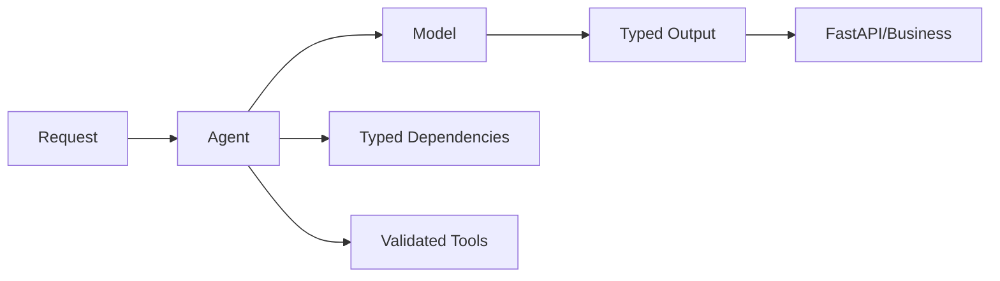
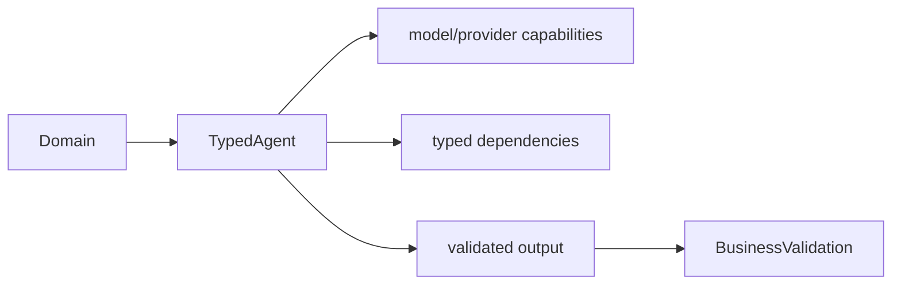

# 第19章：PydanticAI

最后核对日期：2026-07-11；依据 Pydantic AI 官方 Overview、Agents 与 Testing 文档核对。

## 导读、目标与前置知识
PydanticAI 强调类型安全、依赖注入、验证和模型抽象。本章目标是判断它在 Python 业务服务中的价值。前置知识为 Pydantic、async/await 与第17章。

学习目标是实现类型化工具与输出，并在无在线模型的测试中验证控制边界。

## 核心原理与架构
Agent 的依赖对象承载数据库、身份和服务客户端；Tool 通过类型注解生成 Schema；输出模型形成验证边界；失败可在有限范围内反馈模型重试。模型抽象便于测试和供应商替换，但不同模型能力仍不完全等价。



## 最小与完整工程
最小案例抽取工单为 Pydantic 模型。工程版把用户身份、数据库会话和只读服务注入依赖，测试使用框架提供的测试模型或 Fake，验证工具选择、输出与重试。具体构造器和结果属性不凭记忆书写。

## 误区、调试、实践与安全
类型安全不等于事实正确；依赖注入不应把管理员客户端交给所有工具；模型抽象不能抹平供应商差异。调试同时查看验证错误和原始模型事件。生产固定版本并建立回归集。

## 总结、练习、面试与阅读

### 类型安全与 Dependency Injection

PydanticAI 的核心是让 Agent 对依赖类型和输出类型参数化。Dependencies 承载当前 run 需要的数据库客户端、主体、配置与领域服务，通过 `RunContext` 提供给动态 instructions 和 tools。它避免全局变量并提高测试替换能力，但不会自动限制依赖权限；传入管理员数据库连接，工具仍可能越权。

```python
from dataclasses import dataclass
from pydantic import BaseModel, Field
from pydantic_ai import Agent, RunContext


@dataclass
class SupportDeps:
    customer_id: int
    repository: "CustomerRepository"


class SupportOutput(BaseModel):
    answer: str
    risk: int = Field(ge=0, le=10)


agent = Agent(
    "openai:gpt-5.2",
    deps_type=SupportDeps,
    output_type=SupportOutput,
    instructions="Use tools for account facts; do not guess.",
)


@agent.tool
async def account_status(ctx: RunContext[SupportDeps]) -> str:
    return await ctx.deps.repository.status(ctx.deps.customer_id)
```

示例形态按 2026-07-11 官方文档核对；模型名称与依赖版本在真实项目中通过配置固定。`CustomerRepository` 应只暴露当前客户可用操作，而不是通用 SQL。

### Tool、Output 与 Validation

函数参数成为工具 Schema，docstring 进入工具描述。工具遇到可由模型修正的输入可抛出框架支持的 retry 信号；权限拒绝和业务拒绝不应伪装成 retry。输出通过 `output_type` 约束，验证失败会消耗有限重试预算。类型正确仍不保证事实正确，外部 ID 和业务不变量继续校验。

动态 instructions 可以根据依赖加入客户名或租户上下文，但不能把完整敏感对象转成 Prompt。模型只能看到函数显式返回的数据，依赖对象本身保留在运行时。

### Model Abstraction 与供应商差异

框架统一模型接口，有利于测试和切换，但 Tool Calling、Structured Output、Thinking、原生工具、Usage 和流式事件并不完全等价。应用定义能力需求并运行 provider contract tests，而不是假设换一个 model string 行为不变。Fallback 也要考虑数据驻留和成本策略。



### Retry 与错误边界

工具重试与输出重试有各自预算。输入可修复错误给模型简洁反馈；HTTP 暂时故障由客户端退避；Policy 拒绝立即终止。运行总预算同时限制模型回合、工具次数、Token 和时间，防止每层独立重试造成乘法放大。

异常映射到领域错误，例如 `invalid_output`、`dependency_unavailable`、`policy_denied` 和 `budget_exceeded`。FastAPI 层返回稳定响应，框架异常栈不暴露给用户。

### Testing 与 Evaluation

官方推荐用 `TestModel` 或 `FunctionModel` 替代真实模型，并可用 `Agent.override` 替换模型、依赖或 toolset。测试进程设置 `ALLOW_MODEL_REQUESTS=False`，防止单元测试意外产生在线费用。`TestModel` 根据 Schema 生成程序化数据，适合遍历工具与类型；需要精确工具参数时使用 `FunctionModel`。

```python
from pydantic_ai import models
from pydantic_ai.models.test import TestModel

models.ALLOW_MODEL_REQUESTS = False

async def test_support_agent(deps: SupportDeps) -> None:
    with agent.override(model=TestModel()):
        result = await agent.run("Check my account", deps=deps)
    assert isinstance(result.output, SupportOutput)
```

测试还要直接覆盖 Repository 权限、工具错误、输出业务规则和 FastAPI 协议。黄金评估集再使用真实模型测任务质量；单元测试通过不能替代模型评估。

### FastAPI 集成与完整工程

FastAPI dependency 构造当前主体与 Repository，路由调用异步 `agent.run`，结果转换为 API response。每个请求设置 timeout、run ID 和 Usage，流式响应传递结构化事件。长任务进入队列，不能占用 Web Worker 等待人工审批。

工程目录把 `agent.py`、`deps.py`、`tools.py`、`schemas.py`、`service.py` 和 `api.py` 分开。PydanticAI 对象留在应用适配层，领域模型不依赖框架。Observability 可使用 OpenTelemetry/Logfire 集成，但敏感属性仍由应用筛选。

### 常见误区、调试与安全

常见误区是把类型安全等同于事实安全、把依赖注入当权限系统、让所有验证错误无限反馈模型。调试查看模型消息、工具调用、validation error 与 Usage，并区分框架、供应商和领域错误。安全上依赖最小权限、工具验证主体、输出再鉴权、测试禁止真实模型请求。
总结：PydanticAI 擅长把类型、依赖、工具和输出放进 Python 工程边界，但复杂持久工作流仍需图或 durable engine。练习：为 FastAPI 工单服务设计依赖类型并用 TestModel 测试。面试：输出校验和业务校验如何分层？何时 PydanticAI 比图工作流更合适？TestModel 与 FunctionModel 如何选择？延伸阅读：[Pydantic AI Overview](https://pydantic.dev/docs/ai/overview/)、Agents 与 Testing 官方文档。代码目录：`examples/pydanticai_service/`。
