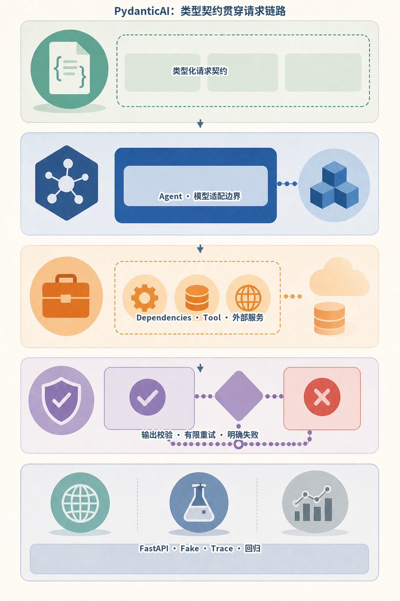
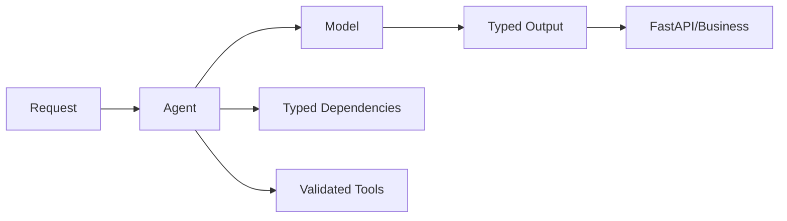
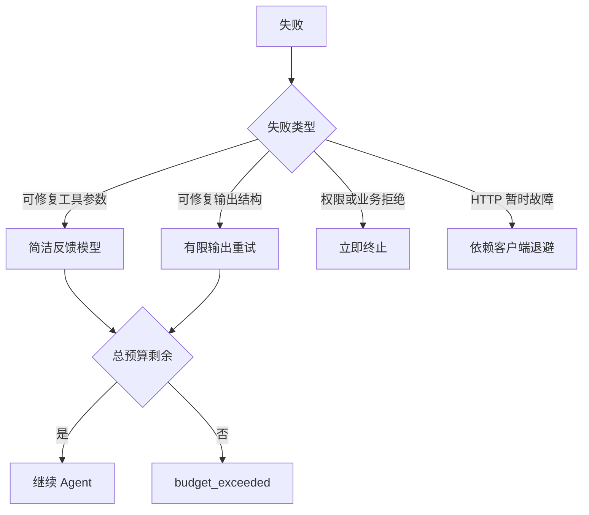
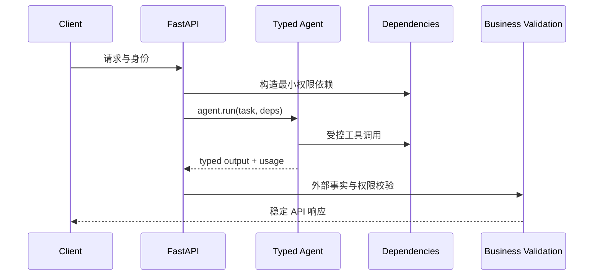
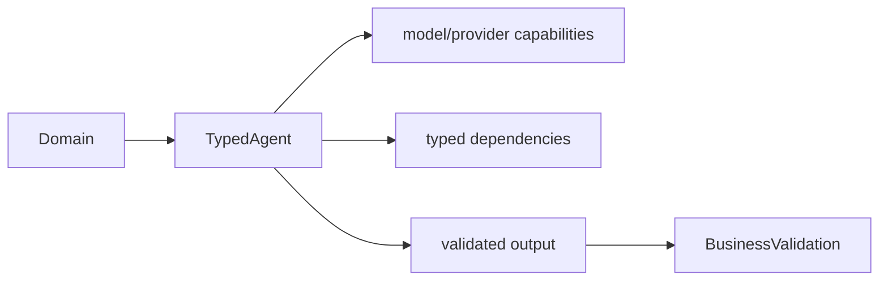
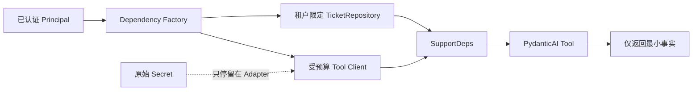

# 第19章：PydanticAI

最后核对日期：2026-08-07；本章核心代码已按官方 Dependencies、Tools、Output 与 Testing 文档和隔离安装的 `pydantic-ai-slim==2.25.0` 复验。



*图 19-A　PydanticAI 的类型契约、依赖与校验边界。*

图中五层分别对应请求契约、模型边界、外部依赖、结果校验和工程验证。类型系统能把错误提前暴露在应用边界，却不会自动证明外部事实正确，也不会替代主体授权；因此权限检查仍应位于领域服务或工具执行器中。

## 导读、目标与前置知识
PydanticAI 强调类型安全、依赖注入、验证和模型抽象。本章目标是判断它在 Python 业务服务中的价值。前置知识为 Pydantic、async/await 与第17章。

学习目标是实现类型化工具与输出，并在无在线模型的测试中验证控制边界。

## 核心原理与架构
Agent 的依赖对象承载数据库、身份和服务客户端；Tool 通过类型注解生成 Schema；输出模型形成验证边界；失败可在有限范围内反馈模型重试。模型抽象便于测试和供应商替换，但不同模型能力仍不完全等价。

下面的组件图把类型化依赖、工具参数和输出契约放在同一请求链路中，突出框架类型边界与业务授权边界并不相同。



类型将模型输出与 Python 业务代码连接起来，但依赖权限和外部事实仍由领域服务负责。



每一层独立重试会造成乘法放大，因此模型、工具和网络重试必须共享一次运行的总预算。



框架对象应停留在应用适配层，领域模型和 API 契约不直接依赖 PydanticAI 内部类型。

## 最小与完整工程
最小案例抽取工单为 Pydantic 模型。工程版把用户身份、数据库会话和只读服务注入依赖，测试使用框架提供的测试模型或 Fake，验证工具选择、输出与重试。具体构造器和结果属性不凭记忆书写。

## 误区、调试、实践与安全
类型安全不等于事实正确；依赖注入不应把管理员客户端交给所有工具；模型抽象不能抹平供应商差异。调试同时查看验证错误和原始模型事件。生产固定版本并建立回归集。

## 总结、练习、面试与阅读

### 类型安全与 Dependency Injection

PydanticAI 的核心是让 Agent 对依赖类型和输出类型参数化。Dependencies 承载当前 run 需要的数据库客户端、主体、配置与领域服务，通过 `RunContext` 提供给动态 instructions 和 tools。它避免全局变量并提高测试替换能力，但不会自动限制依赖权限；传入管理员数据库连接，工具仍可能越权。

```python
from dataclasses import dataclass
from pydantic import BaseModel, Field
from pydantic_ai import Agent, RunContext


@dataclass
class SupportDeps:
    customer_id: int
    repository: "CustomerRepository"


class SupportOutput(BaseModel):
    answer: str
    risk: int = Field(ge=0, le=10)


agent = Agent(
    "openai:gpt-5.2",
    deps_type=SupportDeps,
    output_type=SupportOutput,
    instructions="Use tools for account facts; do not guess.",
)


@agent.tool
async def account_status(ctx: RunContext[SupportDeps]) -> str:
    return await ctx.deps.repository.status(ctx.deps.customer_id)
```

示例形态按 2026-08-07 官方文档和隔离安装版本核对；模型名称与依赖版本在真实项目中通过配置固定。`CustomerRepository` 应只暴露当前客户可用操作，而不是通用 SQL。

### Tool、Output 与 Validation

函数参数成为工具 Schema，docstring 进入工具描述。工具遇到可由模型修正的输入可抛出框架支持的 retry 信号；权限拒绝和业务拒绝不应伪装成 retry。输出通过 `output_type` 约束，验证失败会消耗有限重试预算。类型正确仍不保证事实正确，外部 ID 和业务不变量继续校验。

动态 instructions 可以根据依赖加入客户名或租户上下文，但不能把完整敏感对象转成 Prompt。模型只能看到函数显式返回的数据，依赖对象本身保留在运行时。

### Model Abstraction 与供应商差异

框架统一模型接口，有利于测试和切换，但 Tool Calling、Structured Output、Thinking、原生工具、Usage 和流式事件并不完全等价。应用定义能力需求并运行 provider contract tests，而不是假设换一个 model string 行为不变。Fallback 也要考虑数据驻留和成本策略。



统一接口只减少接线代码，不能抹平 Tool Calling、Structured Output、Usage 和流式事件的供应商差异。

### Retry 与错误边界

工具重试与输出重试有各自预算。输入可修复错误给模型简洁反馈；HTTP 暂时故障由客户端退避；Policy 拒绝立即终止。运行总预算同时限制模型回合、工具次数、Token 和时间，防止每层独立重试造成乘法放大。

异常映射到领域错误，例如 `invalid_output`、`dependency_unavailable`、`policy_denied` 和 `budget_exceeded`。FastAPI 层返回稳定响应，框架异常栈不暴露给用户。

### Testing 与 Evaluation

官方推荐用 `TestModel` 或 `FunctionModel` 替代真实模型，并可用 `Agent.override` 替换模型、依赖或 toolset。测试进程设置 `ALLOW_MODEL_REQUESTS=False`，防止单元测试意外产生在线费用。`TestModel` 根据 Schema 生成程序化数据，适合遍历工具与类型；需要精确工具参数时使用 `FunctionModel`。

```python
from pydantic_ai import models
from pydantic_ai.models.test import TestModel

models.ALLOW_MODEL_REQUESTS = False

async def test_support_agent(deps: SupportDeps) -> None:
    with agent.override(model=TestModel()):
        result = await agent.run("Check my account", deps=deps)
    assert isinstance(result.output, SupportOutput)
```

测试还要直接覆盖 Repository 权限、工具错误、输出业务规则和 FastAPI 协议。黄金评估集再使用真实模型测任务质量；单元测试通过不能替代模型评估。

### FastAPI 集成与完整工程

FastAPI dependency 构造当前主体与 Repository，路由调用异步 `agent.run`，结果转换为 API response。每个请求设置 timeout、run ID 和 Usage，流式响应传递结构化事件。长任务进入队列，不能占用 Web Worker 等待人工审批。

工程目录把 `agent.py`、`deps.py`、`tools.py`、`schemas.py`、`service.py` 和 `api.py` 分开。PydanticAI 对象留在应用适配层，领域模型不依赖框架。Observability 可使用 OpenTelemetry/Logfire 集成，但敏感属性仍由应用筛选。

### 类型参数能证明什么

`Agent[Deps, Output]` 把依赖与输出连接到静态类型检查，Pydantic 再验证运行时数据。它能及早发现
缺字段、类型漂移和错误的依赖接线，但不能证明 Repository 返回的状态属于当前用户，也不能证明模型
引用了正确事实。生产链至少有四个不同门禁：

| 门禁 | 负责内容 | 失败示例 |
|---|---|---|
| Pydantic Schema | 字段、类型、范围 | `risk=99` |
| Repository/Tool Policy | 主体、租户、资源、动作 | 用户读取其他租户工单 |
| Output Validator | 本次请求与输出关系 | 返回错误的 `ticket_id` |
| 业务提交 | 状态版本、幂等、副作用 | 陈旧批准覆盖新工单状态 |

把所有逻辑塞进 Output Validator 会让验证器访问网络、难以测试并产生重复副作用。Validator 适合纯粹、
可重复的关系约束；授权和提交由领域服务完成。

### Dependencies 是 Capability 容器

依赖对象不应装入“万能数据库”和管理员 Token。按请求主体构造最小 Repository，例如只公开
`get_ticket(ticket_id)` 且内部固定 Tenant；工具看不到原始凭证。动态 Instructions 只读取必要的显示
信息，不序列化整个 Deps。



这张图说明 DI 提升可替换性，但权限来自 Factory 与 Repository。若把跨租户 Client 注入 Deps，类型
完全正确仍会越权。

### ModelRetry 的适用与放大风险

`ModelRetry` 适用于模型可以根据简洁反馈修正的工具参数或输出关系。示例中的 Output Validator 在
`ticket_id` 与请求不一致时要求重试；Fixture 还构造一次错误 Tool 参数后修复。Policy Denied、依赖
超时和数据库冲突不是提示模型“再试一次”就能解决。

一次 Run 同时存在 Agent Retry、Tool Retry、HTTP Retry 时，会产生乘法尝试。应用在外层维护总
Deadline、Token/调用预算和幂等键；错误映射保留 `retryable`，最终是否重试仍由共享预算决策。验证
错误反馈只包含字段与规则，不把敏感原始数据再次送入模型。

### FunctionModel、TestModel 与在线证据

`TestModel` 根据 Schema 程序化生成结果，适合确认类型接线和枚举 Tool；`FunctionModel` 允许测试精确
消息/工具轨迹，适合故障注入。仓库示例使用两者，并设置 `models.ALLOW_MODEL_REQUESTS=False`，从
机制上阻止测试误计费。

这两种测试都不会证明在线模型能理解任务。发布前另设低预算 Contract/Smoke Test，验证当前 Provider
的 Tool Calling、Structured Output、Usage 与错误映射；真实质量由黄金集评估。离线、在线契约和质量
评估是三类证据，状态报告不能互相替代。

### FastAPI 错误与超时边界

[`examples/pydanticai_service/`](https://github.com/wujinjun/ai-agent-book/tree/main/examples/pydanticai_service)
的 `SupportService` 在 `asyncio.timeout` 中运行 Agent，并把 Policy、Dependency、Invalid Result 和
Timeout 映射成稳定 API Code。测试断言错误响应不含内部异常。长任务仍应转队列；请求超时不自动
回滚已发生工具副作用。

框架对象只存在于 Adapter/Service 层。API Response 和数据库使用应用自己的 `SupportReport`，这样
升级 PydanticAI 时可以重写接线而不迁移业务历史。Provider Fallback 也必须经过 Capability、数据地域、
成本和契约门禁，不能只替换 Model String。

### 练习参考答案与面试要点

1. **依赖类型。** 包含 Principal 派生的 Tenant Repository、受预算 Client 和 Trace Context，不包含
   管理员连接；Fake Repository 构造两个租户验证越权拒绝。
2. **TestModel/FunctionModel。** 前者适合类型与工具可达性，后者适合精确参数、重试和错误轨迹；真实
   模型质量仍需在线黄金集。
3. **输出与业务校验。** Pydantic 检查形状，Output Validator 检查纯关系，Service 检查权限与当前
   状态，Repository 用事务提交。
4. **选型。** 类型化短服务、少量工具和 Python/FastAPI 团队适合；长时、持久、分支复杂且需人工恢复
   的流程还要 Workflow/Durable Runtime。

### 常见误区、调试与安全

常见误区是把类型安全等同于事实安全、把依赖注入当权限系统、让所有验证错误无限反馈模型。调试查看模型消息、工具调用、validation error 与 Usage，并区分框架、供应商和领域错误。安全上依赖最小权限、工具验证主体、输出再鉴权、测试禁止真实模型请求。
总结：PydanticAI 擅长把类型、依赖、工具和输出放进 Python 工程边界，但类型不替代事实、权限、事务
和持久工作流。延伸阅读：[Dependencies](https://pydantic.dev/docs/ai/core-concepts/dependencies/)、[Tools](https://pydantic.dev/docs/ai/tools-toolsets/tools/)、[Output](https://pydantic.dev/docs/ai/core-concepts/output/)与[Testing](https://pydantic.dev/docs/ai/guides/testing/)。本章代码目录为
[`examples/pydanticai_service/`](https://github.com/wujinjun/ai-agent-book/tree/main/examples/pydanticai_service)。

## 本章引用
<!-- chapter-citations:start -->
以下资料用于支撑本章的核心原理、工程边界与版本敏感说明：

- [pydanticai-docs：PydanticAI Documentation](../references.md#ref-pydanticai-docs)
- [pydanticai-tools：PydanticAI Function Tools](../references.md#ref-pydanticai-tools)
- [pydanticai-testing：PydanticAI Testing](../references.md#ref-pydanticai-testing)
- [pydantic-models：Pydantic Models](../references.md#ref-pydantic-models)
<!-- chapter-citations:end -->
