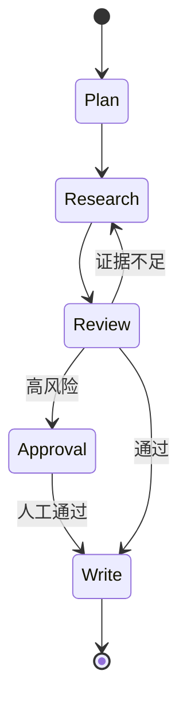
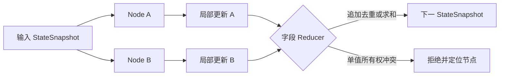
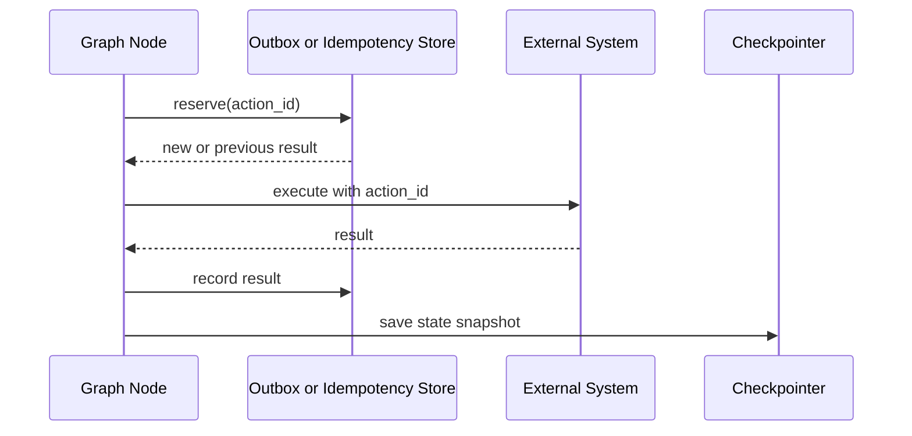
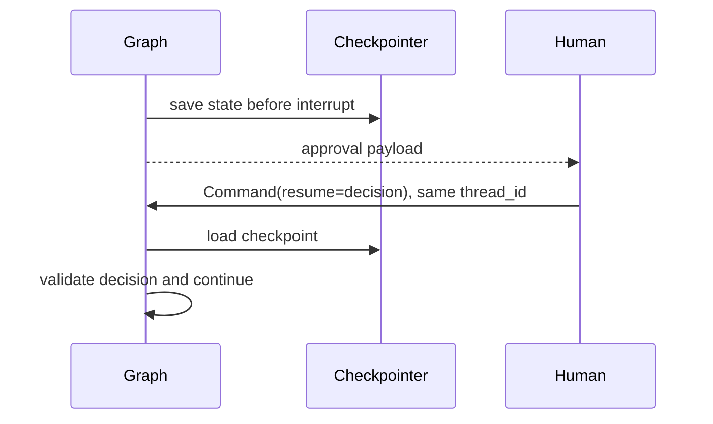

# 第20章：LangGraph

最后核对日期：2026-07-11；依据官方文档核对，并在 Python 3.12.13、`langgraph==1.2.9` 上运行项目 8 的 StateGraph、RetryPolicy、InMemorySaver、interrupt 与 Command 恢复测试。

## 导读、目标与前置知识
LangGraph 用 State、Node、Edge 和 Checkpoint 表达可恢复工作流。本章学习条件边、Reducer、Persistence、Interrupt、Human-in-the-Loop、Subgraph、Retry、Time Travel、Streaming 与 Multi-Agent。

学习目标是能设计、实现和测试一个带持久化与人工中断的图。前置知识为第9—10、17章。

## 原理与状态图

LangGraph 把工作流表达为显式 State、Node 和 Edge。主图展示研究任务中循环、审批和结束路径。



State 是显式 Schema；Node 接收状态并返回更新；Reducer 决定并行更新如何合并；Checkpoint 支持恢复。Interrupt 把控制交还人类，恢复时必须使用稳定 thread/run 标识。



Reducer 是数据一致性规则，不是便利函数。错误的合并语义会在并行、恢复和重放中产生重复或覆盖。



Checkpoint 只保存图状态，不能自动回滚已经发送的邮件或付款。副作用节点必须有独立的幂等与状态核对机制。

## 最小与完整工程
最小图包含分类、处理和结束。工程研究 Agent 见项目8，保存计划、证据、重试次数和评审状态；外部副作用节点使用幂等键。Streaming 是事件协议，不应把内部状态全部暴露给客户端。

## 误区、调试、实践与安全
图不保证确定性；Checkpoint 不自动解决外部副作用；Time Travel 不能安全重放付款。调试查看每个节点前后状态与路由条件。State 避免存不可序列化客户端和秘密。

## 总结、练习、面试与阅读

### State、Node、Edge 与 Reducer

State 是图的共享数据契约，可使用 TypedDict、dataclass 或 Pydantic；Node 是接收 State 并返回局部更新的同步/异步函数；Edge 定义控制流；Conditional Edge 根据结构化结果选择下一节点。Node 不应就地修改隐藏全局变量，返回值应只包含本节点负责的字段。

当多个节点并行更新同一字段时，Reducer 决定合并语义。例如证据列表应追加去重，计数器应求和，单值状态通常只能由明确所有者覆盖。没有 Reducer 的并行写入可能冲突；错误 Reducer 会让重放产生重复数据。

```python
import operator
from typing import Annotated
from typing_extensions import TypedDict


class ResearchState(TypedDict):
    question: str
    queries: list[str]
    evidence: Annotated[list[str], operator.add]
    review_status: str
```

### 最小图示例

以下代码展示当前官方 Graph API 的核心形态。本仓库固定 1.2.9 并执行直接测试；升级后必须重新验证 Checkpoint 与 Interrupt 恢复：

```python
from langgraph.graph import END, START, StateGraph


def plan(state: ResearchState) -> dict[str, object]:
    return {"queries": [state["question"]], "review_status": "pending"}


def route(state: ResearchState) -> str:
    return "finish" if state["review_status"] == "approved" else "research"


builder = StateGraph(ResearchState)
builder.add_node("plan", plan)
builder.add_node("research", research)
builder.add_node("review", review)
builder.add_edge(START, "plan")
builder.add_edge("plan", "research")
builder.add_edge("research", "review")
builder.add_conditional_edges("review", route, {"research": "research", "finish": END})
graph = builder.compile()
```

图应有明确终止条件。`review → research` 回路同时受 retry count、Token 与墙钟预算控制，不能只相信 Reviewer 最终会通过。

### Checkpoint、Persistence 与恢复

图编译时配置 checkpointer 后，每个 super-step 保存 StateSnapshot，并按 thread 组织。Persistence 支持跨交互 Memory、Human-in-the-Loop、故障恢复和 Time Travel。`thread_id` 是持久游标，不是任意 UI 会话名；必须绑定租户和主体，防止读取他人状态。

Checkpoint 只覆盖图状态。Node 已发送邮件但在写 checkpoint 前崩溃，恢复后可能再次发送，因此副作用 Node 使用幂等键或 outbox。官方文档说明同一 super-step 中其他成功节点的 pending writes 可保留，恢复策略仍要结合业务语义测试。

### Interrupt 与 Human-in-the-Loop

`interrupt()` 在 Node 或工具中暂停执行，保存 JSON 可序列化 payload；调用方用相同 thread 恢复并通过 Command 提供结果。审批 payload 包含动作、目标、参数摘要和风险。恢复值要再次验证，不能把 UI 返回文本直接当授权令牌。

官方规则要求避免随意重排同一 Node 中的 interrupt，interrupt 前的副作用必须幂等，也不要用宽泛 try/except 吞掉控制异常。等待人工期间任务状态是 paused，不占用 Web Worker；过期审批转为拒绝或重新生成候选。



审批等待期间图处于 paused 状态，不占用 Web Worker；恢复数据仍需 Schema、主体和有效期校验。

### Retry、Time Travel 与 Subgraph

Node Retry Policy 用于可重试异常，业务拒绝和无权限不进入 retry。Time Travel 基于 checkpoint replay 或 fork：旧节点结果可复用，checkpoint 之后的模型、API 和 interrupt 会重新执行，结果可能不同。它适合调试和人工探索，不是无副作用的“撤销”。

Subgraph 封装独立状态与流程。官方文档区分每次调用继承 checkpointer、跨 thread 持久和无 checkpoint 等模式。多数一次性专业子任务采用 per-invocation；需要持续对话的专家才保留 per-thread 状态。父子图的 state 映射显式定义，秘密和内部字段不自动传播。

### Streaming 与 Multi-Agent

Streaming 可以输出完整 State 快照、Node 增量、消息 Token、interrupt 或自定义事件。对外 API 定义自己的事件 Schema，不把框架内部对象直接传给前端。断线重连依据事件 ID 与 checkpoint，而不是重新运行整个图。

Multi-Agent 在图中通常表现为 Supervisor 路由 Node、Agent-as-Node 或 Subgraph。共享 State 包含任务和 Artifact 引用，不用群聊文本维护唯一事实。每个 Agent 的工具和上下文最小化，Supervisor 也受终止器控制。

### 调试、测试、安全与适用场景

调试查看 Node 前后 State、Edge 选择、checkpoint history、interrupt 和异常。测试将 Node 当普通函数单测，再用内存 checkpointer 验证路由、恢复、并行 Reducer 和副作用幂等。生产还测数据库 checkpointer、并发 thread 和迁移。

LangGraph 适合状态复杂、需恢复、HITL 或多分支的长流程；简单一次调用或两步固定 Chain 不必引入。State 不保存凭证，checkpoint 加密并按租户授权，Time Travel/状态编辑进入审计。
总结：LangGraph 把控制流和持久状态显式化，但不能自动解决副作用与业务权限。练习：构建带人工批准、checkpoint 和 retry 的三节点图。面试：Reducer 解决什么冲突？Checkpoint 与业务事务有何差异？Time Travel 为什么可能重复动作？延伸阅读：[Graph API](https://docs.langchain.com/oss/python/langgraph/graph-api)、[Persistence](https://docs.langchain.com/oss/python/langgraph/persistence)、[Interrupts](https://docs.langchain.com/oss/python/langgraph/interrupts)与 Subgraphs 官方文档。代码目录：`projects/08-research-workflow/`。
