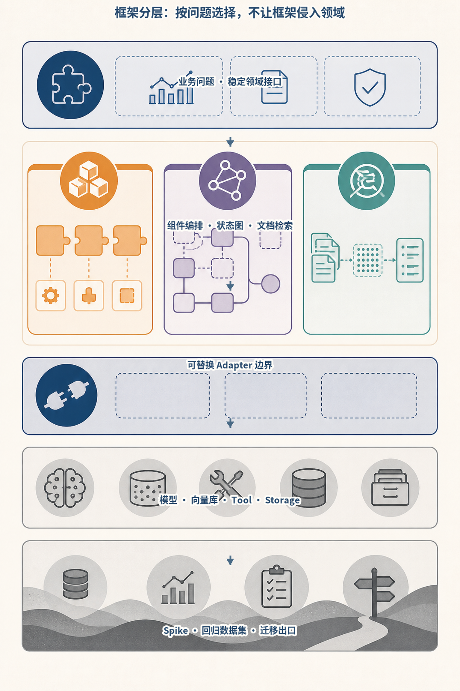
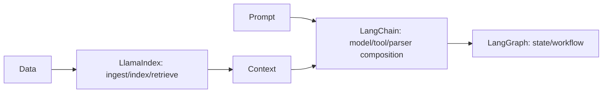
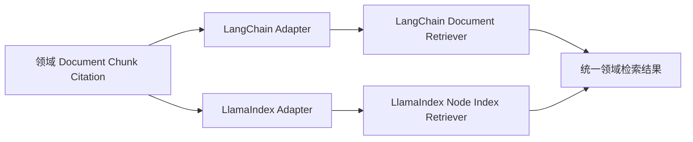
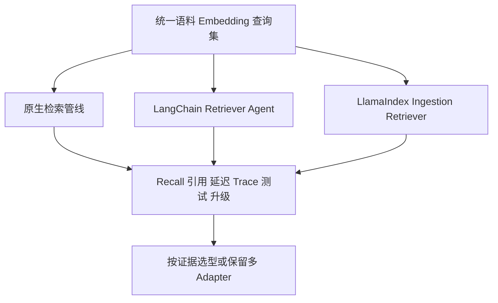
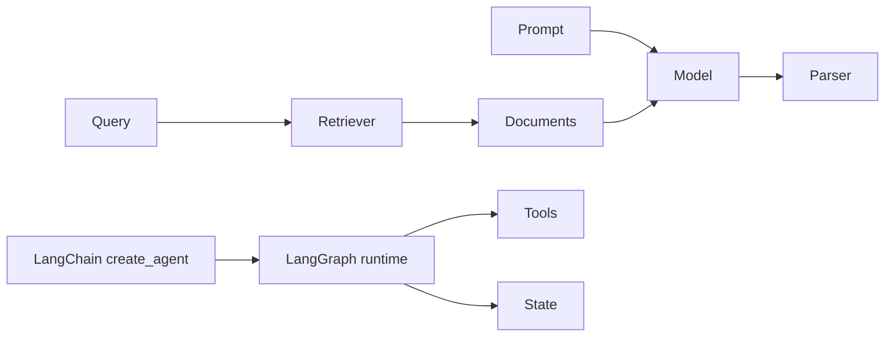
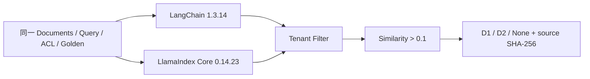
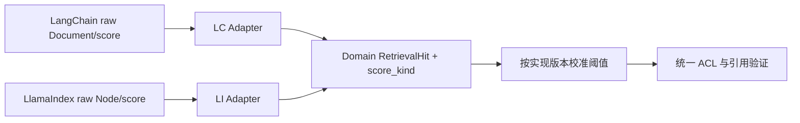

# 第21章：LangChain 与 LlamaIndex



*图 21-A　LangChain、LangGraph、LlamaIndex 与原生能力的分层边界。*

三类框架解决的问题并不相同：组件抽象、可恢复编排和数据检索可以组合，却不应互相冒充。领域接口保持稳定，框架对象停留在适配层，才可能用真实数据做替换实验并控制锁定风险。

最后核对日期：2026-08-07；LangChain 1.3.14（core 1.5.3）与 LlamaIndex Core 0.14.23 已在独立 Python 3.12 环境安装并完成同题检索实测。

## 导读、目标与前置知识
LangChain 提供模型、Prompt、Tool、Retriever 和 Parser 等组合抽象；LangGraph承载有状态编排。LlamaIndex 聚焦 Document、Node、Index、Retriever 与 Query Engine。本章比较其适用场景与锁定风险。

学习目标是以同一 RAG 示例比较原生、LangChain 与 LlamaIndex。前置知识为第13、17、20章。

## 核心原理与架构

LangChain、LlamaIndex 与 LangGraph 覆盖不同抽象层。下图给出一种常见组合，但各层都可以被原生实现替代。



这只是常见组合，不是强制分层。简单 RAG 可以只用一个库或原生代码。



业务 ID、版本、ACL 和来源位置属于领域契约。框架对象只存在于 Adapter 内部，才能比较实现或安全回退。



框架选型应来自同条件实验，不来自教程代码长度。尤其要记录安全过滤、可观测和版本升级成本。

## 最小与完整工程
同一 Markdown 检索任务分别用原生接口和框架实现，比较代码量、Trace、测试替身、持久化和升级成本。工程版把领域 Document 和框架 Node 隔离在适配器后，避免业务层依赖内部对象。

## 误区、调试、实践与安全
不要因教程方便就引入全套框架，不要混用多个过时链式 API。调试先看框架实际发送的请求、召回候选和回调事件。框架组件仍需权限过滤、超时和数据治理。

## 总结、练习、面试与阅读

### LangChain 的历史定位与当前边界

LangChain 早期以 Chain、Prompt、Model、Tool、Agent、Retriever 和 Output Parser 等抽象快速组合 LLM 应用。随着工具循环和持久状态变复杂，LangGraph 成为底层有状态运行时。当前官方 `create_agent` 构建在 LangGraph 上，支持 tools、middleware、structured output、state 与 streaming。旧教程中的若干 Chain/Agent API 不应自动当成 2026 推荐写法。

Chain 适合确定的数据变换，例如 Prompt → Model → Parser；Agent 允许模型动态选择工具。Retriever 只负责根据查询返回 Document，不负责生成；Output Parser 把文本转换为结构，但 provider-native structured output 或 Tool Strategy 可能更可靠。选型先看任务，不为统一风格把所有函数包装为 Chain。



Chain 适合确定性数据变换；Agent 适合动态工具选择。LangGraph 提供底层状态运行时，但并不要求所有 RAG 都变成 Agent。

### Tool、Structured Output 与 Middleware

当前 LangChain 工具可由普通 Python 函数/协程或 decorator 定义。描述、参数 Schema 和 runtime context 决定模型选择与执行。Structured Output 可选择 ProviderStrategy 或 ToolStrategy；最终结构位于 Agent State 的 structured response 字段。应用仍执行业务验证和权限。

Middleware 可实现模型路由、动态工具、上下文修改、guardrail 和观测。它是横切边界，顺序会影响行为。不要在多个 middleware 中静默改同一消息或状态；测试每个 middleware 的输入输出，并限制敏感内容进入 Trace。

### LlamaIndex 的核心抽象

Document 表示摄取源及 Metadata；Node 是经过解析/切分后用于索引的细粒度单元；Index 组织 Node 以支持查询；Retriever 返回相关 Node；Query Engine 组合检索、后处理与响应合成。RAG Pipeline 还包含 Reader、Transformation、Embedding、Vector Store 和 Evaluation。

这些对象是框架的数据模型，不应直接成为企业领域模型。业务层保存自己的 Document ID、版本、ACL 和来源位置，通过 Adapter 转成 LlamaIndex Node。否则升级框架或切换检索器时，数据库和 API 会被内部字段锁定。

```python
# 已按 llama-index-core==0.14.23 的接口核对；生产代码仍需显式传入
# embed_model、MetadataFilters、引用映射和拒答阈值。
documents = reader.load_data()
index = VectorStoreIndex.from_documents(documents)
retriever = index.as_retriever(similarity_top_k=8)
nodes = retriever.retrieve("checkpoint 如何支持恢复？")
```

示例适合学习数据流，不代表完整企业 RAG。生产还需自定义解析、ACL、版本、删除、引用和评估。

### Query Engine 与可组合 RAG

Query Engine 通常把 query transformation、retrieval、node postprocessor 和 response synthesizer 组合起来。Router 或 SubQuestion 能处理多索引/复杂问题，但增加模型调用和调试层。先用 Retriever 的 Recall@k 建立基线，再引入高级 Engine。

LlamaIndex 连接器很多，版本和依赖拆分也频繁。项目固定只需要的集成包，避免安装巨大 extras。外部 Reader 返回的 Metadata 不可信，转换阶段统一清洗与权限映射。

### 对照实验与完整工程

选择一个 Markdown 知识库，用三种实现对照：原生 Python/向量接口、LangChain Retriever + create_agent、LlamaIndex ingestion + retriever。统一语料、Embedding、top-k 和评估集，记录代码量、Recall、引用、延迟、Trace、测试便利与升级面。

工程在 `domain/` 定义 Chunk、Citation 和 Answer，在 `adapters/langchain.py`、`adapters/llamaindex.py` 做转换。这样可以同时跑两个候选或回退原生实现。不要在业务代码到处导入框架 Document/Node。

本章同题 Spike 固定三份文档：alpha 租户的 MCP 与 RAG 文档，以及 beta 租户的秘密事故文档。Q1、Q2 应分别命中 D1、D2；alpha 主体的 Q3 即使与 D3 高度相似也不得越权召回，并且不能用相似度为零的 D1/D2 拼出答案。

| 候选 | 固定版本 | Q1 | Q2 | Q3 跨租户与拒答 | 结果 |
|---|---|---:|---:|---:|---:|
| LangChain | 1.3.14 | D1 | D2 | `None` | 通过 |
| LlamaIndex Core | 0.14.23 | D1 | D2 | `None` | 通过 |

下图把表格背后的执行顺序显式展开：两个候选先在各自隔离环境加载同一规格，租户过滤发生在相似度选择之前，拒答阈值又发生在任何生成之前，最终证据绑定实现源码哈希。



这条证据链特意把 ACL 放在相似度结果之前，把拒答阈值放在生成之前。完整 Fixture、两个隔离工程和 `evidence.json` 位于 [`examples/framework_comparison/rag_spike/`](https://github.com/wujinjun/ai-agent-book/tree/main/examples/framework_comparison/rag_spike)。当前结果不包含真实 Embedding、生成、外部 Vector Store、P95 或成本比较，因此只支持“两个候选都能实现本地检索边界”，不支持宣称某框架总体更优。

### 常见误区、调试、安全与选型

常见误区：框架连接器多就等于 RAG 质量高；LangChain Agent 与 LangGraph 是竞争关系；LlamaIndex 只是一种向量数据库。调试展开实际 Prompt、工具、Retriever 候选与 callback/Trace，逐层确认。

权限过滤不能只放在 response synthesizer；Tool 与 Reader 使用最小凭证；Prompt Injection 文档标记为数据。小流程、稳定接口或强性能控制可用原生实现；多集成快速验证可用 LangChain；数据摄取和 RAG 组合复杂时 LlamaIndex 更方便；持久工作流使用 LangGraph。

### 摄取幂等与领域版本

框架 Reader/Loader 能读取文件，不代表摄取流程可恢复。领域摄取请求应绑定 Tenant、Document ID、
Source Version、Parser Version、Chunk Policy 和 Embedding Version，并计算稳定指纹。重复提交相同指纹
返回既有 Job；内容或策略变化产生候选索引版本，不原地覆盖活动数据。

LangChain `Document` 或 LlamaIndex `Node` 的 Metadata 只是载体。Adapter 从领域 ACL 生成框架过滤条件，
检索返回后再次校验 Tenant、Permission Version 和 Document Version。不要直接信任 Loader 从文件头、
网页或第三方连接器带回的 Metadata，它可能缺字段或被内容作者操纵。

```python
@dataclass(frozen=True)
class RetrievalHit:
    chunk_id: str
    document_id: str
    document_version: str
    tenant_id: str
    score: float
    text: str
    location: str


class RetrieverPort(Protocol):
    async def retrieve(
        self,
        query: str,
        *,
        tenant_id: str,
        permission_version: str,
        top_k: int,
    ) -> list[RetrievalHit]: ...
```

业务 Service 只依赖这个领域接口。LangChain Adapter 把框架 `Document` 转成 `RetrievalHit`，LlamaIndex
Adapter 从 Node/NodeWithScore 提取同样字段；缺失 ID、版本或位置时 Fail Closed，不能生成无法定位的
引用。

### 分数不是跨框架统一单位

不同 Retriever 可能返回相似度、距离、重排分或无分数对象，方向和范围也不同。Adapter 不应把任意
原始数值都命名为 `similarity` 后直接共用阈值。统一结果需要保存 `score_kind`、原始值、归一化版本和
排序阶段；拒答阈值分别在黄金集上校准。

同题 Spike 使用相同确定性八维向量和明确阈值，所以可以比较控制流，不代表真实外部 Vector Store 的
分数可互换。加入真实 Embedding 后应重新生成 Exact Baseline、Recall@k、MRR、引用完整率和过滤泄漏，
并分别报告无过滤、普通租户和极小租户。



这张图避免“抽象统一”掩盖语义差异。排序一致不等于分数可比，分数可比也不等于生成回答正确。

### Query Engine 与业务回答边界

LlamaIndex Query Engine 可以组合检索、后处理和生成，LangChain Agent/Chain 也能快速完成端到端问答。
原型阶段很方便，生产中仍建议把 Retrieval Hit、Context Assembly、Generation 和 Citation Validation
分别观测。否则一次“答案错误”无法判断是 ACL、召回、重排、上下文截断还是模型未采用证据。

当 Query Engine 内置合成不能满足引用、拒答或数据地域策略时，保留其 Retriever 能力并由应用自己的
Answer Service 收口。不要为了“全用一个框架”牺牲确定性业务边界。

### Callback、Trace 与敏感数据

框架 Callback/Middleware 能记录链路，但默认事件、Metadata 和 Prompt 可能包含正文。应用在 Adapter
前定义字段 Allowlist，只记录 Chunk ID、版本、分数种类、耗时和安全错误码；全文调试进入独立短期
存储。不同框架事件转换为统一领域 Trace，避免 Dashboard 被某个 Callback Schema 锁定。

Exporter 或 Callback 失败不应改变检索结果。测试关闭观测后端、注入异常并断言核心任务降级继续；
安全 Audit 则走独立持久通道。

### 升级、回归与退场策略

框架升级不只运行 Import Test。固定同一 Fixture，重建隔离环境，验证 Node/Document 转换、Metadata
Filter、排序、阈值、Callback、异步取消和依赖闭包。`evidence.json` 绑定实现源码哈希，代码变化后旧
证据自动失效。

退场演练让领域测试同时运行原生/框架 Adapter。若去掉 LangChain/LlamaIndex 后业务 Schema、数据库
和 API 无需迁移，说明边界健康；若历史记录存满框架 Pickle 或内部 ID，锁定已发生。ADR 应记录采用
理由、专有能力、替代实现、迁移成本和复审日期。

### 练习参考答案与面试要点

1. **扩展 Spike。** 在两个隔离环境接入同一真实 Embedding Fixture，生成过滤后的 Exact Truth；测
   Recall@k、MRR、P95、引用完整率和零泄漏，并记录硬件与源码哈希。
2. **LangChain/LangGraph。** 前者提供组件与高层 Agent 接口，后者负责显式状态与可恢复工作流；当前
   LangChain Agent 可构建于 LangGraph 之上，二者不是简单竞争关系。
3. **Node 不作领域模型。** 它是框架内部摄取/检索单元，字段与生命周期会变化；企业的 Document ID、
   ACL、版本和位置必须独立保存。
4. **Retriever/Query Engine。** Retriever 返回相关证据；Query Engine 还可能做改写、后处理与生成。
   生产排障常需要保留分层边界。

总结：框架提供组合与集成，不替代数据质量、权限、评分语义和评估。延伸阅读：
[LangChain Agents](https://docs.langchain.com/oss/python/langchain/agents)、Structured Output 与
[LlamaIndex Framework](https://developers.llamaindex.ai/python/framework/) 官方文档。本章代码目录为
[`examples/framework_comparison/rag_spike/`](https://github.com/wujinjun/ai-agent-book/tree/main/examples/framework_comparison/rag_spike)。

## 本章引用
<!-- chapter-citations:start -->
以下资料用于支撑本章的核心原理、工程边界与版本敏感说明：

- [langchain-docs：LangChain Python Documentation](../references.md#ref-langchain-docs)
- [llamaindex-docs：LlamaIndex Documentation](../references.md#ref-llamaindex-docs)
- [lewis2020：Retrieval-Augmented Generation for Knowledge-Intensive NLP Tasks](../references.md#ref-lewis2020)
- [es2023ragas：RAGAS: Automated Evaluation of Retrieval Augmented Generation](../references.md#ref-es2023ragas)
<!-- chapter-citations:end -->
