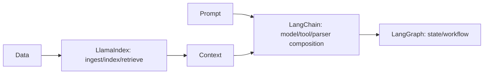
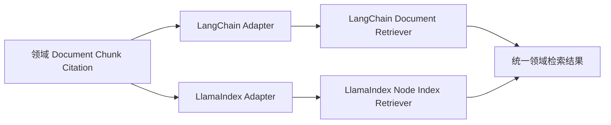
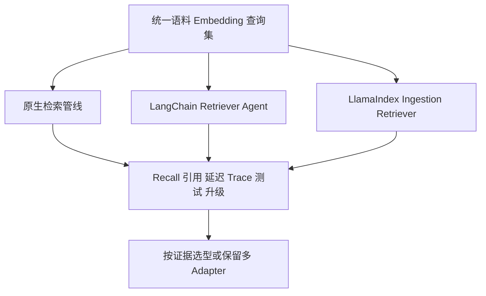
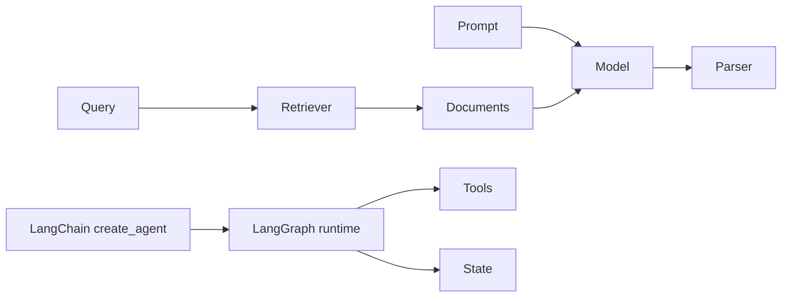

# 第21章：LangChain 与 LlamaIndex

最后核对日期：2026-07-11；依据 LangChain 1.x 与 LlamaIndex 官方文档核对，具体集成包仍须安装验证。

## 导读、目标与前置知识
LangChain 提供模型、Prompt、Tool、Retriever 和 Parser 等组合抽象；LangGraph承载有状态编排。LlamaIndex 聚焦 Document、Node、Index、Retriever 与 Query Engine。本章比较其适用场景与锁定风险。

学习目标是以同一 RAG 示例比较原生、LangChain 与 LlamaIndex。前置知识为第13、17、20章。

## 核心原理与架构

LangChain、LlamaIndex 与 LangGraph 覆盖不同抽象层。下图给出一种常见组合，但各层都可以被原生实现替代。



这只是常见组合，不是强制分层。简单 RAG 可以只用一个库或原生代码。



业务 ID、版本、ACL 和来源位置属于领域契约。框架对象只存在于 Adapter 内部，才能比较实现或安全回退。



框架选型应来自同条件实验，不来自教程代码长度。尤其要记录安全过滤、可观测和版本升级成本。

## 最小与完整工程
同一 Markdown 检索任务分别用原生接口和框架实现，比较代码量、Trace、测试替身、持久化和升级成本。工程版把领域 Document 和框架 Node 隔离在适配器后，避免业务层依赖内部对象。

## 误区、调试、实践与安全
不要因教程方便就引入全套框架，不要混用多个过时链式 API。调试先看框架实际发送的请求、召回候选和回调事件。框架组件仍需权限过滤、超时和数据治理。

## 总结、练习、面试与阅读

### LangChain 的历史定位与当前边界

LangChain 早期以 Chain、Prompt、Model、Tool、Agent、Retriever 和 Output Parser 等抽象快速组合 LLM 应用。随着工具循环和持久状态变复杂，LangGraph 成为底层有状态运行时。当前官方 `create_agent` 构建在 LangGraph 上，支持 tools、middleware、structured output、state 与 streaming。旧教程中的若干 Chain/Agent API 不应自动当成 2026 推荐写法。

Chain 适合确定的数据变换，例如 Prompt → Model → Parser；Agent 允许模型动态选择工具。Retriever 只负责根据查询返回 Document，不负责生成；Output Parser 把文本转换为结构，但 provider-native structured output 或 Tool Strategy 可能更可靠。选型先看任务，不为统一风格把所有函数包装为 Chain。



Chain 适合确定性数据变换；Agent 适合动态工具选择。LangGraph 提供底层状态运行时，但并不要求所有 RAG 都变成 Agent。

### Tool、Structured Output 与 Middleware

当前 LangChain 工具可由普通 Python 函数/协程或 decorator 定义。描述、参数 Schema 和 runtime context 决定模型选择与执行。Structured Output 可选择 ProviderStrategy 或 ToolStrategy；最终结构位于 Agent State 的 structured response 字段。应用仍执行业务验证和权限。

Middleware 可实现模型路由、动态工具、上下文修改、guardrail 和观测。它是横切边界，顺序会影响行为。不要在多个 middleware 中静默改同一消息或状态；测试每个 middleware 的输入输出，并限制敏感内容进入 Trace。

### LlamaIndex 的核心抽象

Document 表示摄取源及 Metadata；Node 是经过解析/切分后用于索引的细粒度单元；Index 组织 Node 以支持查询；Retriever 返回相关 Node；Query Engine 组合检索、后处理与响应合成。RAG Pipeline 还包含 Reader、Transformation、Embedding、Vector Store 和 Evaluation。

这些对象是框架的数据模型，不应直接成为企业领域模型。业务层保存自己的 Document ID、版本、ACL 和来源位置，通过 Adapter 转成 LlamaIndex Node。否则升级框架或切换检索器时，数据库和 API 会被内部字段锁定。

```python
# 结构示例；导入路径和构造器须以固定的 LlamaIndex 版本核对。
documents = reader.load_data()
index = VectorStoreIndex.from_documents(documents)
retriever = index.as_retriever(similarity_top_k=8)
nodes = retriever.retrieve("checkpoint 如何支持恢复？")
```

示例适合学习数据流，不代表完整企业 RAG。生产还需自定义解析、ACL、版本、删除、引用和评估。

### Query Engine 与可组合 RAG

Query Engine 通常把 query transformation、retrieval、node postprocessor 和 response synthesizer 组合起来。Router 或 SubQuestion 能处理多索引/复杂问题，但增加模型调用和调试层。先用 Retriever 的 Recall@k 建立基线，再引入高级 Engine。

LlamaIndex 连接器很多，版本和依赖拆分也频繁。项目固定只需要的集成包，避免安装巨大 extras。外部 Reader 返回的 Metadata 不可信，转换阶段统一清洗与权限映射。

### 对照实验与完整工程

选择一个 Markdown 知识库，用三种实现对照：原生 Python/向量接口、LangChain Retriever + create_agent、LlamaIndex ingestion + retriever。统一语料、Embedding、top-k 和评估集，记录代码量、Recall、引用、延迟、Trace、测试便利与升级面。

工程在 `domain/` 定义 Chunk、Citation 和 Answer，在 `adapters/langchain.py`、`adapters/llamaindex.py` 做转换。这样可以同时跑两个候选或回退原生实现。不要在业务代码到处导入框架 Document/Node。

### 常见误区、调试、安全与选型

常见误区：框架连接器多就等于 RAG 质量高；LangChain Agent 与 LangGraph 是竞争关系；LlamaIndex 只是一种向量数据库。调试展开实际 Prompt、工具、Retriever 候选与 callback/Trace，逐层确认。

权限过滤不能只放在 response synthesizer；Tool 与 Reader 使用最小凭证；Prompt Injection 文档标记为数据。小流程、稳定接口或强性能控制可用原生实现；多集成快速验证可用 LangChain；数据摄取和 RAG 组合复杂时 LlamaIndex 更方便；持久工作流使用 LangGraph。
总结：框架提供组合与集成，不替代数据质量、权限和评估。练习：实现同一检索基线的原生与框架版本并写 ADR。面试：LangChain 与 LangGraph 的职责差别？LlamaIndex 的 Node 为何不应成为领域模型？Query Engine 与 Retriever 有何区别？延伸阅读：[LangChain Agents](https://docs.langchain.com/oss/python/langchain/agents)、Structured Output 与 [LlamaIndex Framework](https://developers.llamaindex.ai/python/framework/) 官方文档。代码目录状态：三种实现的同题对照工程列入质量路线图 P2—P3，当前不标记为安装实测。
