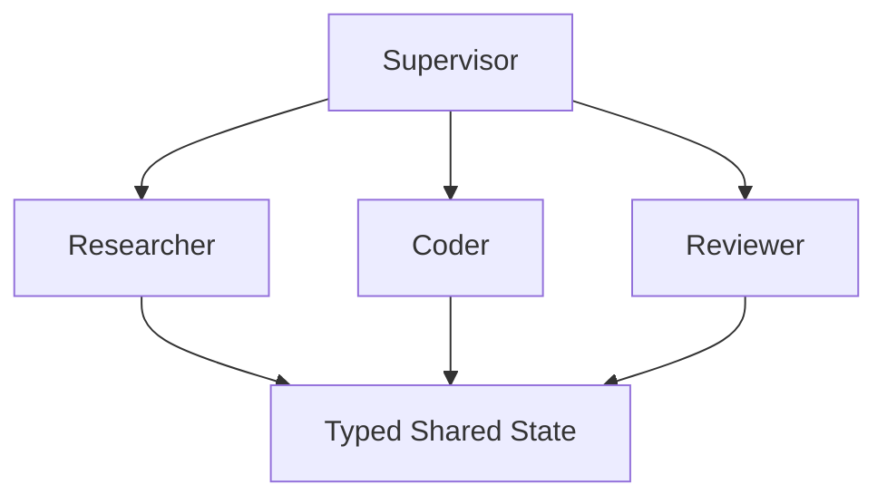
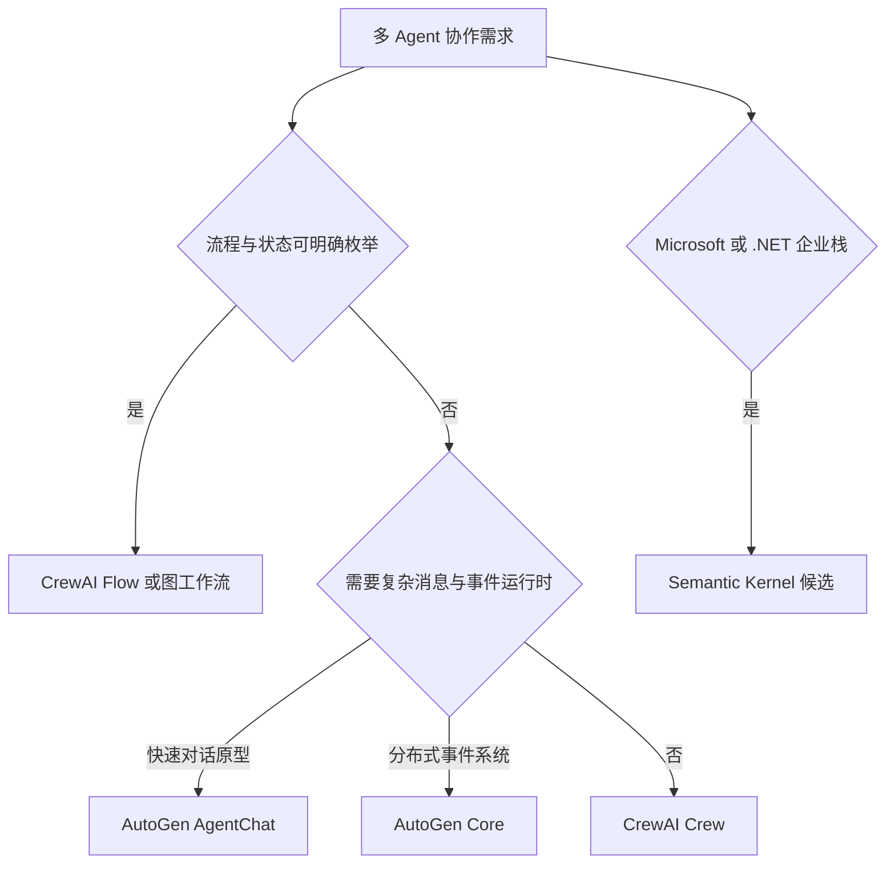
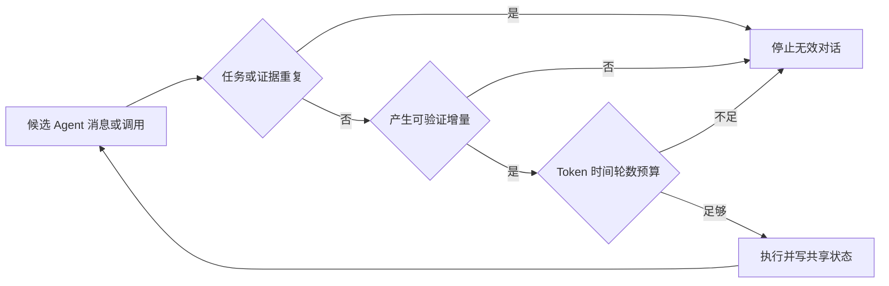
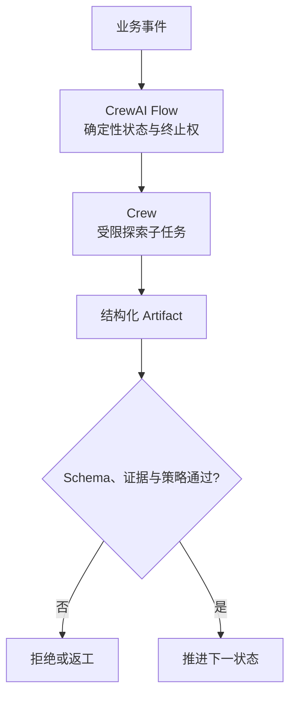
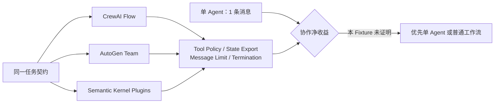
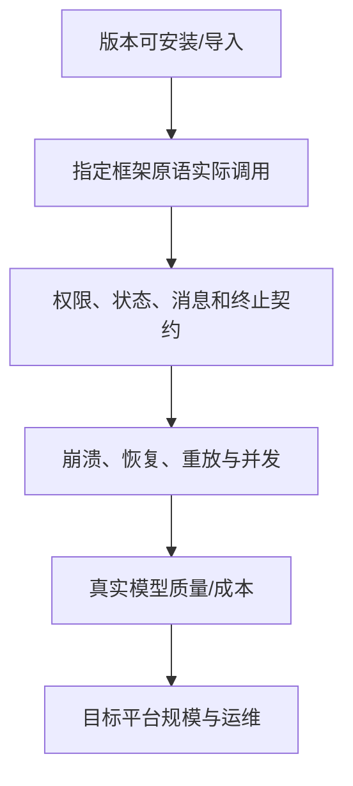

# 第22章：CrewAI、AutoGen 与其他 Multi-Agent 框架

最后核对日期：2026-08-07。

!!! info "版本证据"
    CrewAI 1.15.12、AutoGen AgentChat 0.7.5 与 Semantic Kernel 1.44.1 已在独立 Python 3.12 环境按统一协作契约复核。框架功能、许可证和支持状态仍须在选型当天重新确认。

## 导读、目标与前置知识
本章比较 CrewAI、AutoGen、Semantic Kernel 等角色协作与任务编排方案，重点是通信、成本、调试和“不使用 Multi-Agent”的判断。

学习目标是为真实任务选择或拒绝 Multi-Agent 框架。前置知识为第9、10、20章。

各框架能力以 [CrewAI](../references.md#ref-crewai-docs)、[AutoGen](../references.md#ref-autogen-docs)和 [Semantic Kernel](../references.md#ref-semantic-kernel-docs)官方文档为准；AutoGen 的研究背景另见 [AutoGen 论文](../references.md#ref-wu2023autogen)。角色数量、对话轮数与质量之间不存在可直接外推的单调关系。


*图 22-A　Multi-Agent 框架的必要性与模式选择。*

多 Agent 是一种分工与隔离方案，不是默认升级路径。只有任务成功率或独立审查质量相对单 Agent 基线有可测收益，且收益覆盖额外成本和协调风险时，角色协作才值得保留。

## 核心原理与架构

Multi-Agent 框架的关键不是角色数量，而是监督者、专业 Worker 与类型化共享状态之间的控制关系。



角色只有在能力、权限、上下文或验收职责确实不同才有价值。CrewAI 常用角色/任务组织，AutoGen 强调可对话 Agent，Semantic Kernel 提供企业应用编排与插件抽象；实际能力随版本变化。



框架定位随版本变化，最终选择还需用同一任务比较成功率、成本、终止和调试能力。



终止由 Runtime 根据完成、预算、重复与无新增证据判定，不能依赖角色在自然语言中自觉结束。

## 最小与完整工程
先以单 Agent + 两工具建立基线，再实现 Supervisor/Worker，比较成功率、Token、延迟和重复消息。共享状态使用 Schema，消息只携带任务所需内容，终止由运行时而非角色自觉决定。

## 误区、调试、实践与安全
更多角色不等于更聪明；“辩论”可能放大共同错误；自然语言聊天难以保证状态一致。调试通信图、重复调用和终止原因。不同 Agent 使用最小权限，Reviewer 不持有执行密钥。

## Multi-Agent 框架选型的深化设计

### Multi-Agent 框架解决的问题

框架主要提供 Agent/Role 定义、任务分配、消息协议、共享状态、终止、工具、模型客户端和可观测。它们不能证明角色之间存在独立知识，也不能自动避免死循环。多 Agent 只有在上下文隔离、权限隔离、并行专业任务或独立 Reviewer 带来可测收益时成立。

### CrewAI：Crews 与 Flows

官方把 Crews 定位为角色与任务协作，把 Flows 定位为更明确的事件驱动控制、State、条件与恢复。开放研究可用 Crew，审核/集成流程更适合 Flow，常见生产形态是 Flow 提供确定性骨架，在少数节点调用 Crew。

Agent 配置角色、目标和 tools，Task 定义目标与 expected output，Process 决定顺序/层级，Crew 组合它们。角色描述只是 Prompt，不是权限；Tool allowlist 仍由运行时。Flow State 应类型化，不依赖角色对话作为事实源。



生产形态通常由 Flow 持有状态和终止权，只把开放探索子任务交给 Crew，返回的 Artifact 仍需确定性校验。

### AutoGen：Core 与 AgentChat

当前官方文档区分 AgentChat 与 Core。AgentChat 提供 AssistantAgent、Teams、messages、state 与 termination，适合快速构建对话式单/多 Agent；Core 是事件驱动运行时，适合更可扩展的消息和分布式系统。Extensions 提供模型客户端、MCP Workbench 与 Docker code executor 等。

AgentChat 的 Agent 有状态，`run()` 会更新内部 history；调用方应传新任务而非每次重复完整历史。Team 必须配置 termination condition，保存/恢复 State 时绑定会话和租户。执行模型生成代码使用隔离容器、资源限制和无秘密环境。

```python
# 当前 AutoGen AgentChat 的结构示例；模型客户端配置按部署环境提供。
from autogen_agentchat.agents import AssistantAgent

agent = AssistantAgent(
    name="reviewer",
    model_client=model_client,
    tools=[read_diff],
    system_message="Review only the supplied diff and return typed findings.",
)
result = await agent.run(task="Review change set 42")
```

### Semantic Kernel：Plugin 与 Orchestration

Semantic Kernel 用 Plugin 封装 native code、OpenAPI 或 MCP 能力，和企业依赖注入较契合。Agent Framework 提供 Agent 抽象；官方 Agent Orchestration 文档列出 Concurrent、Sequential、Handoff、Group Chat 和 Magentic 等模式。2026-07-11 官方页面仍明确标注部分 Orchestration 能力为 experimental/prerelease，生产选型必须固定版本并接受变更风险。

Plugin 描述函数输入、输出与副作用，但授权仍在服务内部。Kernel/Runtime 管模型与消息，企业项目要把领域服务接口与框架 Plugin 分开。

### 框架比较

| 维度 | CrewAI | AutoGen | Semantic Kernel |
|---|---|---|---|
| 主要抽象 | Role/Task/Crew/Flow | AgentChat/Core/Team | Kernel/Plugin/Agent/Orchestration |
| 强项 | 角色任务与结构 Flow | 消息、事件与研究型协作 | .NET/企业 DI、Plugin 集成 |
| 状态风险 | Crew 对话替代 State | Stateful Agent/Team history | 实验 Orchestration 变化 |
| 适用 | 内容/研究 + Flow | 多 Agent 原型与事件系统 | Microsoft/.NET 企业应用 |

表格只描述当前总体定位，社区活跃、API 稳定和许可要在决策当天重查。不要根据 GitHub Star 或演示角色数量选型。

### 同题实测：通过接线不等于值得拆分

本书使用同一个受限补丁任务验证三个候选：Executor 只能修改 Fixture 中的 `app.py`，必须拒绝读取 Secret；Reviewer 决定批准或退回；运行时最多允许四条角色消息。CrewAI 版本使用类型化 `Flow`，AutoGen 使用原生 `RoundRobinGroupChat` 与组合终止条件，Semantic Kernel 使用 `Kernel` 与两个 `kernel_function` Plugin。全部离线测试均覆盖批准路径和强制不批准路径。



三个实现都用两条角色消息完成任务，单 Agent 基线只需一条。独立 Reviewer 提供职责隔离，但这个小型 Fixture 没有测出成功率收益，因此结论不是“三个框架都推荐”，而是“它们能表达该边界，但本任务应保留更简单方案”。完整代码、固定版本、源码哈希和直接测试见 `examples/framework_comparison/multi_agent_spike/`。Semantic Kernel 当前证据只覆盖 Kernel/Plugin 接线，不冒充原生 Agent Orchestration 实测。

### 成本、终止与调试

共享预算器限制总模型调用、Token、工具、时间和消息。终止条件包括任务验收、最大回合、无进展、重复消息、Policy 拒绝和人工停止。无进展可以比较 Artifact/State 哈希，而不是仅检测相同句子。

调试保存消息拓扑、sender/recipient、任务 ID、Artifact 版本、工具 Trace 和终止原因。每个角色的 Prompt 单独测试，团队测试再覆盖通信。Reviewer 使用独立 rubric，但若与 Coder 是同一模型和证据，应承认其相关性。

### 比较必须使用等价任务契约

框架 Benchmark 很容易失真：一个候选使用真实 LLM，另一个使用确定性函数；一个允许四轮，另一个
只有一轮；或不同实现拥有不同工具权限。公平 Spike 固定输入、Artifact Schema、Tool Policy、消息
上限、终止条件和输出验收，再分别记录使用了哪些“原生框架原语”。

本书的同题 Spike 有意不比较模型质量，因为三个候选全部使用确定性 Agent/Plugin。它证明的是状态、
权限和终止接线：CrewAI 使用类型化 Flow，AutoGen 使用原生 AgentChat Team，Semantic Kernel 只使用
Kernel/Plugin。后者不能据此宣称原生 Agent Orchestration 已验证。



当前证据停在不同层次必须逐项披露。把“包能导入”写成“生产可用”或把 Plugin 调用写成 Agent Team
验证，都会误导选型。

### 三个候选的状态与恢复边界

CrewAI Flow 适合让显式 State 和事件拥有控制权；Crew 适合受限探索子任务。生产要确认 State 序列化、
幂等恢复和外部副作用边界，而不是只看装饰器流程。AutoGen AgentChat 的 Agent/Team 有历史，保存
Team State 时绑定租户与版本；复杂分布式需求才考虑 Core，不应因“多 Agent”默认引入事件 Runtime。

Semantic Kernel 的 Kernel/Plugin 与企业 DI 集成自然，但当前 Spike 的 Runner 是教材自有编排器。
原生 Orchestration 若处于 Experimental/Prerelease，采用时需隔离 Adapter、固定版本和准备替换方案。
任何框架 Memory 都不能成为唯一业务状态；审批、幂等、副作用和 Job Checkpoint 归应用数据库。

### 角色通信与上下文经济性

每次角色通信都可能重复 System Prompt、工具描述、历史和 Artifact。自然语言转发大文件使 Token 成本
按角色数放大，也会损失来源。正确做法是消息携带任务 ID、Artifact 引用、证据 ID、版本与精简摘要；
接收方按权限读取所需内容。

Reviewer 不需要 Coder 的完整思维过程，只需要任务契约、Patch、测试证据和风险 Rubric。Supervisor
聚合结构化状态，避免让所有角色订阅所有消息。评估时计算“每个成功任务的物理模型调用数、重复
上下文 Token 和无产出消息”，而不只计算角色数。

### Framework Lock-in 与 Adapter

业务层定义 `TaskContract`、`Artifact`、`Review` 和 `TerminationReason`，框架 Adapter 负责转换 Agent、
Message、State 与 Tool。数据库不存框架私有对象的 Pickle；持久状态使用版本化应用 Schema。这样能在
框架升级或回退单 Agent 时保留历史和 API。

```python
class TeamRuntime(Protocol):
    async def run(
        self,
        contract: TaskContract,
        *,
        budget: RunBudget,
    ) -> TeamResult: ...
```

Port 不应做成所有框架特性的最大公约数。若某候选的核心能力无法映射，应在 ADR 中明确专有扩展与
退出成本，而不是伪装成完全可互换。

### 版本升级与生产门禁

候选升级在独立环境执行：重新安装固定版本、运行直接测试、生成源码哈希与证据，再比较 API/状态
迁移。不能把 CrewAI、AutoGen、Semantic Kernel 和其他框架强行装进同一虚拟环境；传递依赖冲突会
破坏可复现性。

生产门禁继续加入真实模型黄金集、故障恢复、多租户、Trace、预算与 Sandbox。原生 Code Executor
即使使用容器，也需网络、挂载、资源和 Secret 隔离；进程或容器边界不自动等于安全 Sandbox。

### 常见误区与安全

常见误区包括角色越多越好、群聊产生的共识等于事实、多个同模型 Agent 等于独立专家，以及框架 Memory 自动保持一致。外部动作仍需 Policy/审批，Agent 凭证最小化，消息不转发 secret，代码执行使用 Sandbox。若单 Agent + tools 达到相同成功率，应选择更简单方案。
## 本章总结

Multi-Agent 框架放大协作能力，也放大消息、状态、成本和安全复杂度。角色名称本身不创造能力；共享状态必须是版本化事实和 Artifact，消息历史只是通信记录；终止、预算、权限和恢复由 Runtime 强制。任何候选都应相对单 Agent + tools 基线证明净收益。下一篇将不再讨论框架接口，而是转向 Python、API、存储、部署、队列、观测、评估、安全与成本等生产工程。

## 课后练习

### 设计题

1. 固定任务、模型、工具、预算和 Rubric，比较两种团队方案与单 Agent 的成功率、权限违规、P95、单位成功成本和终止率。
2. 为 Multi-Agent 系统分别设计 Shared State 与消息历史 Schema，说明为什么 Last Message 不能成为权威状态。
3. 为一项实验性编排能力设计隔离 Adapter、固定版本、限制发布范围和替代路径。

### 编码题

4. 使用任务去重、Artifact 增量、状态指纹、消息上限和 Deadline 防止无效对话。

输入为重复任务与只改措辞的消息序列；输出为确定性停止原因；检查标准是终止不依赖模型自报完成。

### 概念题

说明角色式协作只有在权限、上下文、能力或并行隔离存在时才可能产生净收益。

### 故障实验

让两个 Agent 互相请求对方先完成，构造循环等待并验证 Supervisor 能检测、保存状态和终止。

## 参考答案位置

本章参考答案已移至[书末参考答案](../exercise-answers.md)，便于先独立完成练习再核对。

## 面试问题

1. 什么时候多个 Agent 比单 Agent 更有价值？
2. CrewAI、AutoGen 和 Semantic Kernel 的核心抽象有什么差异？
3. 为什么多个同模型 Agent 不等于多个独立专家？
4. 如何控制 Multi-Agent 的消息成本和终止？

## 延伸阅读与代码目录

延伸阅读包括 [CrewAI](https://docs.crewai.com/)、[AutoGen](https://microsoft.github.io/autogen/stable/) 和 [Semantic Kernel Agent Orchestration](https://learn.microsoft.com/en-us/semantic-kernel/frameworks/agent/agent-orchestration/)。代码目录为项目9与 `examples/framework_comparison/multi_agent_spike/`。

## 本章引用
<!-- chapter-citations:start -->
以下资料用于支撑本章的核心原理、工程边界与版本敏感说明：

- [crewai-docs：CrewAI Documentation](../references.md#ref-crewai-docs)
- [autogen-docs：AutoGen Documentation](../references.md#ref-autogen-docs)
- [autogen-teams：AutoGen AgentChat Teams](../references.md#ref-autogen-teams)
- [semantic-kernel-docs：Semantic Kernel Documentation](../references.md#ref-semantic-kernel-docs)
- [wu2023autogen：AutoGen: Enabling Next-Gen LLM Applications via Multi-Agent Conversation](../references.md#ref-wu2023autogen)
<!-- chapter-citations:end -->
