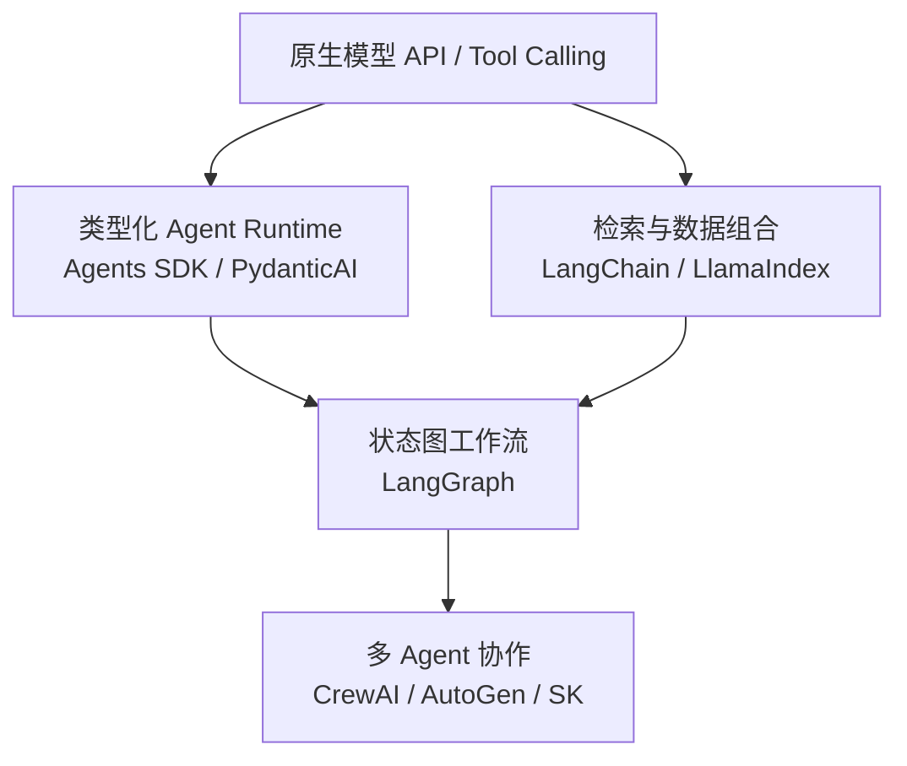

# 第四篇：Agent 框架

框架不是从低到高的固定排行榜，而是在不同层次替开发者管理复杂性。下图展示从原生 API 到多 Agent 编排时逐步增加的抽象。

向上意味着框架承担更多状态和编排责任，也带来更多约束与锁定风险；选型应从任务形态出发，而不是默认选择抽象层最高的方案。

| 章 | 主题 | 评价重点 | 状态 |
|---:|---|---|---|
| 17 | [原生 API](ch17-native-api.md) | 状态、重试、Trace 与测试 | 初稿完成 |
| 18 | [OpenAI Agents SDK](ch18-openai-agents-sdk.md) | Runner、handoff、guardrail、session、MCP | 初稿完成/已核查 |
| 19 | [PydanticAI](ch19-pydanticai.md) | 类型、依赖注入、验证与测试 | 初稿完成/需核查 |
| 20 | [LangGraph](ch20-langgraph.md) | 图状态、checkpoint、interrupt 与恢复 | 初稿完成/需核查 |
| 21 | [LangChain / LlamaIndex](ch21-langchain-llamaindex.md) | 组合与 RAG 抽象边界 | 初稿完成/需核查 |
| 22 | [Multi-Agent 框架](ch22-multi-agent-frameworks.md) | 协作收益与成本 | 初稿完成/需核查 |

本篇不会按装饰器数量比较框架，而是比较它们替你管理的状态、一致性、错误语义、测试接口和锁定成本。同一个小流程将尽量用原生实现与框架实现对照。
