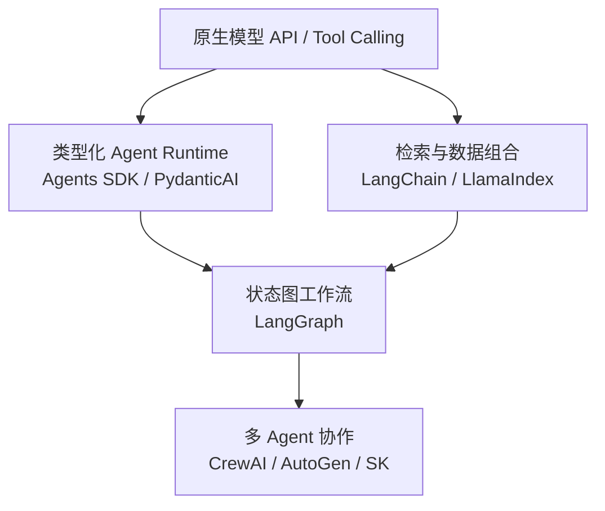

# 第四篇：Agent 框架

本篇承接前面已经明确的 Runtime、Tool、RAG 和 Memory 边界。框架不是从低到高的固定排行榜，而是在不同层次替开发者管理复杂性。读者将使用相同任务契约比较原生 API、类型化 Agent、状态图、检索组合和 Multi-Agent 编排。

向上意味着框架承担更多状态和编排责任，也带来更多约束与锁定风险；选型应从任务形态出发，而不是默认选择抽象层最高的方案。

## 同题比较契约

本篇所有框架比较都以同一个企业知识助手垂直切片为准：员工提出问题，系统按 ACL 检索两份候选文档，生成带 `Citation` 的结构化答案；证据不足时拒答；需要创建质量工单时进入内容绑定审批。各实现必须输出同一领域 `RunState`、`ToolCall`、`Citation`、错误分类和 Trace 事件，框架专有 Message、Node 或 Session 只能停留在 Adapter 内。

这样比较的是框架替应用管理了哪些状态、恢复和测试责任，而不是拿不同任务的 Demo 相互打分。若某框架无法导出领域状态或让对象授权只能写在 Prompt 中，即使示例代码更短，也不满足本书的候选门槛。

| 章 | 主题 | 评价重点 |
|---:|---|---|
| 17 | [原生 API](ch17-native-api.md) | 状态、重试、Trace 与测试 |
| 18 | [OpenAI Agents SDK](ch18-openai-agents-sdk.md) | Runner、Handoff、Guardrail、Session、MCP |
| 19 | [PydanticAI](ch19-pydanticai.md) | 类型、依赖注入、验证与测试 |
| 20 | [LangGraph](ch20-langgraph.md) | 图状态、Checkpoint、Interrupt 与恢复 |
| 21 | [LangChain / LlamaIndex](ch21-langchain-llamaindex.md) | 组合与 RAG 抽象边界 |
| 22 | [Multi-Agent 框架](ch22-multi-agent-frameworks.md) | 协作收益与成本 |

本篇不会按装饰器数量比较框架，而是比较它们替你管理的状态、一致性、错误语义、测试接口和锁定成本。同一个小流程将尽量用原生实现与框架实现对照。完成本篇的产出是一份带证据和退出路径的框架选型 ADR；第五篇随后把这些实现放入生产服务生命周期。
