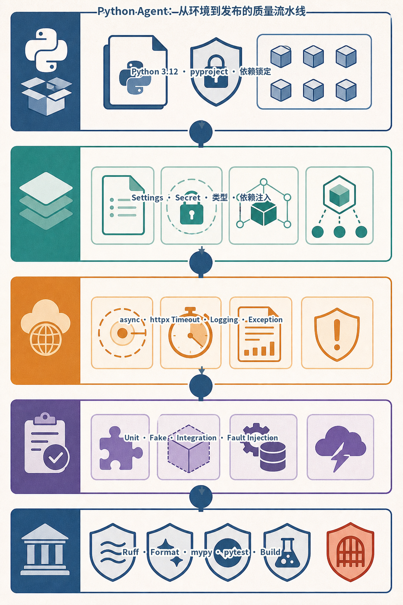
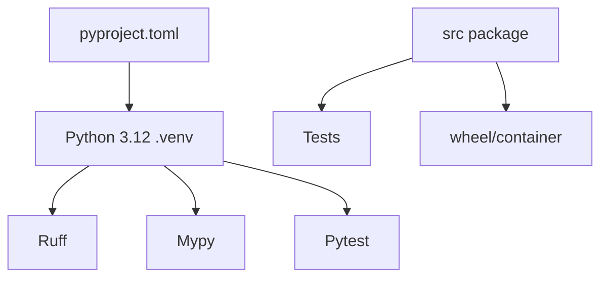
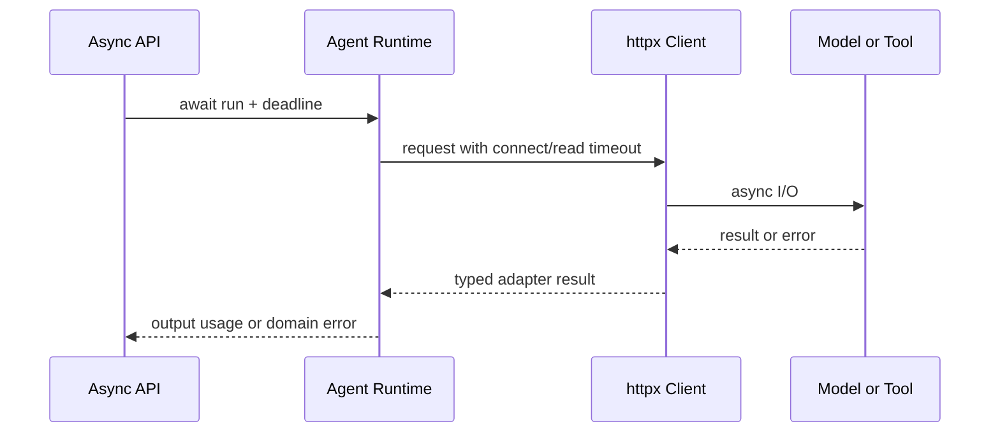
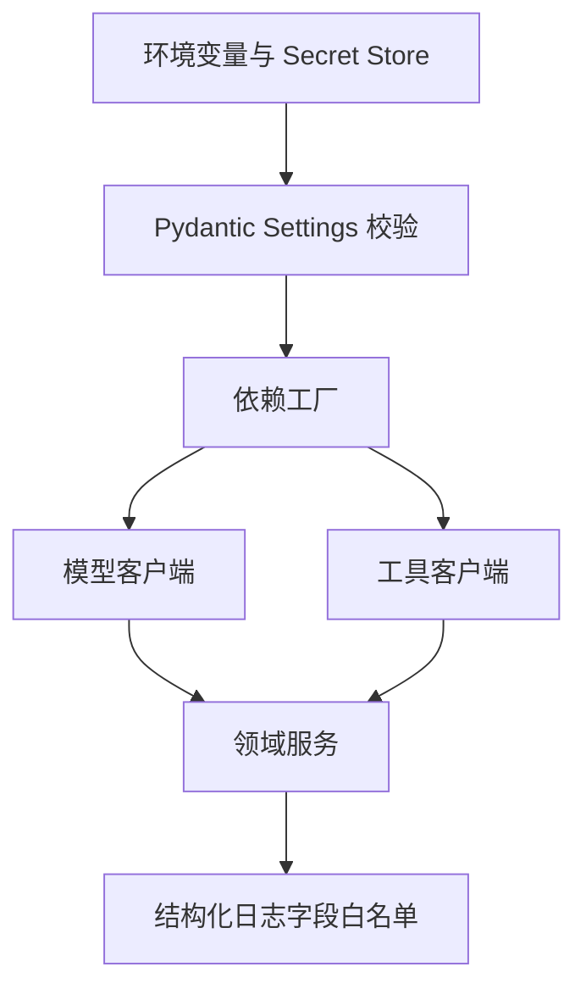
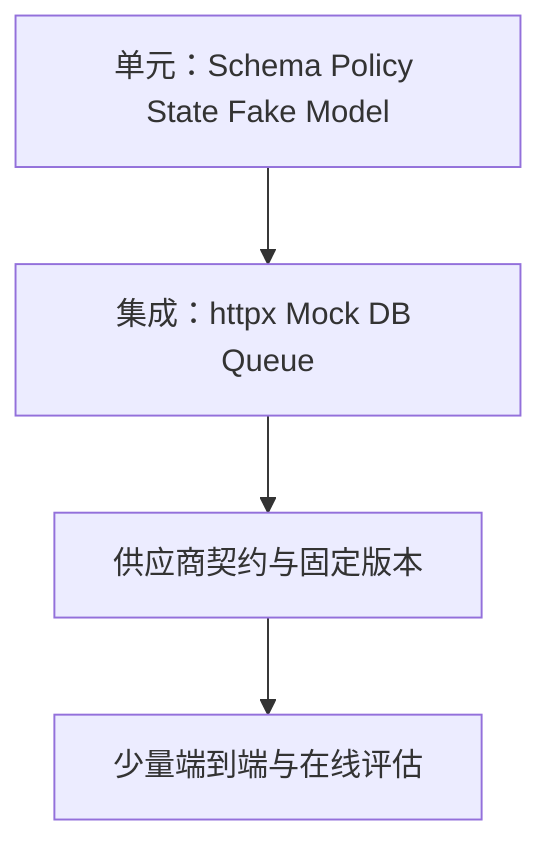
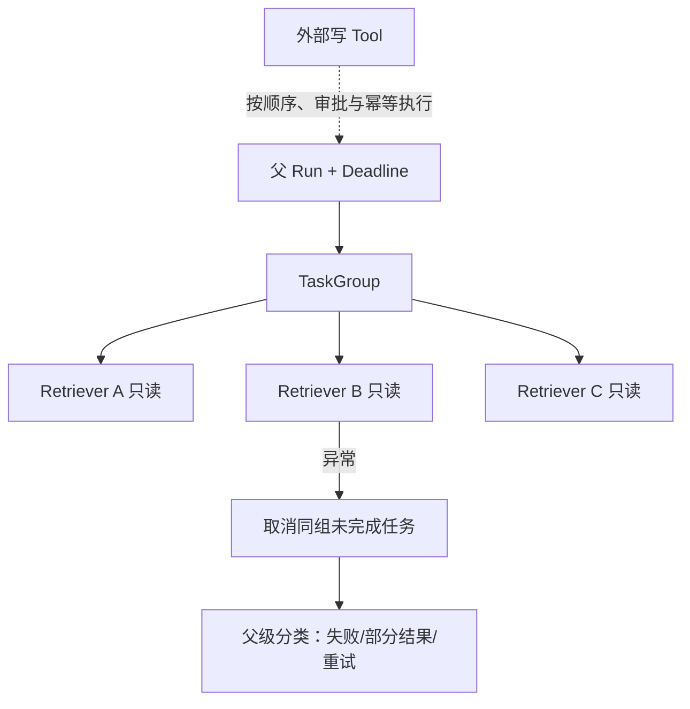

# 第23章：Python Agent 工程基础

最后核对日期：2026-07-11。

## 导读、目标与前置知识
本章建立 Python 3.12 项目、类型、Pydantic、异步、httpx、依赖注入、配置、日志、异常、pytest、Mock 与质量工具的共同底座。

学习目标是能从零搭建可复现、类型安全、异步且受测的 Agent 工程。前置知识为基础 Python。

项目元数据、异步语义和 HTTP 客户端边界分别参考 [PEP 621](../references.md#ref-pep621)、[Python 3.12 asyncio](../references.md#ref-python-asyncio)与 [HTTPX 官方文档](../references.md#ref-httpx-docs)。依赖版本仍以仓库锁定文件为准，文档只定义应保持稳定的工程契约。

**能力主线位置：** 已验证的 Agent/框架原型 → 本章建立 Python 3.12 工程契约 → 第24—31章逐步增加 API、状态、部署、队列、观测、评估、安全与成本治理。



*图 23-A　Python Agent 从环境到发布的工程质量流水线。*

图中每一层都形成独立失败边界：配置错误不应拖到首次模型调用才暴露，网络重试不应侵入领域逻辑，外部服务应可由 Fake 替换，发布门则必须在同一 Python 3.12 目标环境中重复执行。

## 核心原理与工程结构
```text
src/package/      领域代码
tests/            行为与契约测试
pyproject.toml    依赖、构建和工具配置
.env.example      变量名与安全默认值
```
类型注解帮助静态检查与接口设计，Pydantic 验证外部数据；二者不替代业务规则。async/await 适合大量等待型 I/O，不会让 CPU 计算自动并行。`httpx.AsyncClient` 应复用连接并设置显式超时。

## 最小与完整工程
最小包采用 `src` 布局。工程版配置由环境变量注入、依赖显式传入、异常分为可重试/不可重试/策略拒绝，日志携带 run ID 且脱敏。pytest 测真实领域逻辑，HTTP 边界使用 Mock Transport，不让单元测试访问网络。

## 误区、调试、实践与安全
误区：所有函数都 async；捕获 `Exception` 后继续；`.env` 提交仓库；Mock 实现细节而非行为。调试打开 asyncio debug、设置请求超时、检查未关闭客户端。Ruff、mypy 和 pytest 在 CI 同时运行。

## Python Agent 工程基线的深化设计

### Python 3.12 环境与项目结构

教材固定 Python 3.12，并用 `python3.12 -m venv .venv` 创建项目内环境。`python --version`、`pip --version` 和锁定依赖要进入 CI 证据。不要依赖系统 Python 或全局 site-packages；生产镜像和本地环境使用同一大版本。



`src/` 布局避免测试意外导入工作目录中的未安装包。领域代码按能力分组，例如 `runtime/`、`tools/`、`retrieval/`，而不是把所有 model、service、utils 堆在技术层目录。每个模块有清晰公开接口，文件过长时按职责拆分。



异步边界必须传递 deadline 与取消，阻塞 SDK 则放入受控线程池或独立 Worker。只把函数写成 `async def` 并不会自动获得非阻塞行为。



配置在进程启动时校验，依赖按请求主体构造最小权限能力。Secret 只停留在基础设施适配层，不进入 Prompt、State 或异常文本。



测试默认禁止真实模型请求，在线契约测试在独立发布门禁运行。这样 CI 既可重复，又能发现供应商接口漂移。

### pyproject.toml 与依赖管理

`pyproject.toml` 声明构建后端、项目元数据、Python 版本、运行依赖和开发 extras，也集中 Ruff、mypy 与 pytest 配置。直接依赖固定可复现版本，传递依赖由 lock/构建流程记录。框架升级单独提交，并运行评估而不只是单元测试。

```toml
[project]
name = "agent-service"
requires-python = ">=3.12,<3.13"
dependencies = ["pydantic==2.11.7", "httpx==0.28.1"]

[project.optional-dependencies]
dev = ["pytest", "pytest-asyncio", "ruff", "mypy"]
```

示例版本是本书快照，不代表永久最新。Secret 不是依赖配置，放在环境/秘密系统中。

### 类型注解与 Pydantic

类型注解约束内部接口，Pydantic 验证 JSON、环境变量、工具参数和数据库边界等外部数据。内部纯函数优先 dataclass/TypedDict 等轻量类型；外部输入进入系统时立即转换为领域类型。避免到处传 `dict[str, Any]`，否则错误会推迟到运行期。

```python
from typing import Literal
from pydantic import BaseModel, Field


class ToolRequest(BaseModel):
    tool: Literal["weather", "search"]
    query: str = Field(min_length=1, max_length=500)
    timeout_seconds: float = Field(default=10, gt=0, le=30)
```

Schema 正确不代表有权限；Pydantic validator 也不应发网络请求。外部事实和授权放服务层。

### async/await、httpx 与资源生命周期

异步适合模型、HTTP、数据库等等待型 I/O。CPU 密集解析要进线程/进程池或独立 Worker。不要在 async 路由中调用同步 `requests` 或重 CPU 函数阻塞事件循环。`asyncio.TaskGroup` 适合结构化并发；只有独立、只读调用才并行。

复用 `httpx.AsyncClient` 连接池，设置 connect/read/write/pool timeout、总并发与每主机限制。客户端由应用生命周期创建关闭，通过依赖传入，不在每个 Tool 内新建。

```python
import httpx

timeout = httpx.Timeout(connect=3, read=20, write=10, pool=3)
limits = httpx.Limits(max_connections=100, max_keepalive_connections=20)
client = httpx.AsyncClient(timeout=timeout, limits=limits)
```

### Dependency Injection 与配置

Python DI 可以是显式构造器，不必先引入容器。Service 接收 Protocol 接口，生产传真实 Adapter，测试传 Fake。配置用 Pydantic Settings 类思想从环境读取，在启动时一次验证；业务函数不随处调用 `os.getenv`。

配置区分非秘密默认值、环境差异和 Secret。`.env.example` 只列变量名，不含真实值；生产 Secret 由容器平台注入。启动日志只输出模型别名和数据库主机摘要，不打印 key/URL 密码。

### Logging 与异常设计

日志使用结构化字段：event、run_id、tenant_id、tool、status、duration_ms 和 error_code。正文、Token 和 PII 按字段 allowlist 记录。异常分为 `ValidationError`、`PolicyDenied`、`TransientDependencyError`、`BusinessRejected` 与内部缺陷；API 层统一映射稳定错误。

不要 `except Exception: pass`。边界捕获未知异常时记录 stack 与 Trace ID，再返回通用内部错误。取消异常应继续传播，不能被重试器吞掉。

### Unit Test、Mock 与质量工具

单元测试真实领域对象，只在 HTTP、模型、时钟、随机和文件边界使用 Fake/Mock。Fake Model 返回预设协议事件，能覆盖工具选择和错误。测试异步取消、timeout 和并发时避免真实 sleep，可注入时钟或使用极短受控事件。

Ruff 负责格式和静态规则，mypy strict 检查类型，pytest 执行行为。CI 先快速 lint/type/unit，再 integration/eval。覆盖率是线索，不是目标；权限拒绝和恢复路径比简单 getter 更重要。

### 共享 Deadline 与超时传播

为每一层重新设置 30 秒超时会让三层调用最坏运行 90 秒。入口应生成绝对 Deadline，子调用计算剩余
预算，并为清理和状态提交保留余量。连接、读取和总任务超时仍需分开：连接失败可快速重试，读取超时
后的外部写则可能处于未知状态。

```python
import asyncio
from dataclasses import dataclass


@dataclass(frozen=True)
class Deadline:
    expires_at: float

    def remaining(self) -> float:
        value = self.expires_at - asyncio.get_running_loop().time()
        if value <= 0:
            raise TimeoutError("run deadline exhausted")
        return value


async def call_tool(tool: ToolPort, request: ToolRequest, deadline: Deadline) -> ToolResult:
    async with asyncio.timeout(min(10.0, deadline.remaining())):
        return await tool.execute(request)
```

`asyncio.timeout()` 超时会通过取消当前任务实现，因此清理代码必须正确处理取消。业务层把 Provider
Timeout 映射成稳定领域错误，但不要吞掉调用方取消后继续执行。若 Adapter 对外部写收到取消，仍需
按幂等键核对远端状态。

### 结构化并发、取消与异常组

`TaskGroup` 让并发子任务具有共同生命周期：一个子任务失败时，其余任务被取消，退出上下文后抛出
异常组。只读且互相独立的检索可以使用这种 Fail-fast；若希望收集部分结果，需要显式捕获每个任务
的领域结果，而不是让异常不受控传播。具有顺序依赖或外部副作用的 Tool 不应为了降低延迟盲目并行。

```python
async def retrieve_all(
    query: str,
    retrievers: tuple[RetrieverPort, ...],
) -> list[Evidence]:
    tasks: list[asyncio.Task[list[Evidence]]] = []
    async with asyncio.TaskGroup() as group:
        for retriever in retrievers:
            tasks.append(group.create_task(retriever.search(query)))
    return [item for task in tasks for item in task.result()]
```

如果任何 Retriever 失败，这个版本整体失败。容忍部分失败时，Adapter 返回类型化 `Success | Failure`
并由策略决定最少证据数；不能用 `except Exception: return []` 把基础设施故障伪装成“没有资料”。



图中结构化并发保证父任务离开作用域时没有“孤儿协程”。用 `asyncio.create_task()` 后丢弃引用会造成
异常无人读取、请求结束后继续计费或应用关闭时资源泄漏。

### 资源生命周期与 Graceful Shutdown

数据库池、HTTP Client、Telemetry Exporter 和后台 Worker 都应由应用生命周期持有。启动阶段完成
配置验证和依赖探测；关闭阶段先停止接收新请求，再给运行任务有限 Drain 时间，保存 Checkpoint，
最后关闭连接池。每次 Tool 调用新建 `AsyncClient` 会失去连接复用并耗尽 Socket。

`async with` 适合局部资源，应用级资源使用 FastAPI Lifespan 或组合式容器。关闭不能无限等待供应商；
设置 Shutdown Deadline，并让未完成持久 Job 由租约恢复。单元测试断言 Fake Client 的 `aclose()`
被调用，集成测试在 SIGTERM/进程重建后验证任务状态。

### Protocol、Adapter 与错误代数

领域层依赖最小 Protocol，而不是具体 SDK 类型。Adapter 负责把供应商流事件、Usage、错误和 Finish
Reason 转成稳定领域模型；版本敏感代码集中在这一层。这样框架升级时，不必修改规划、权限和状态机。

```python
from typing import Protocol


class ModelPort(Protocol):
    async def generate(self, request: ModelRequest, deadline: Deadline) -> ModelResult: ...


class ModelError(Exception):
    retryable: bool = False


class ModelRateLimited(ModelError):
    retryable = True


class ModelPolicyRejected(ModelError):
    retryable = False
```

错误类型应表达调用者可以采取的动作，但“可重试”仍受幂等、Attempt 和总 Deadline 限制。不要把 SDK
原始异常穿过所有层，也不要依据错误字符串匹配业务分支。未知异常在 Adapter 边界保留 `raise ... from`
因果链，并向外返回脱敏稳定 Code。

### 配置、Secret 与启动门禁

配置解析一次并冻结。URL、超时、模型策略和 Feature Flag 可以进入 Settings；Secret 使用专门类型或
Secret Store 引用，`repr` 和日志必须隐藏。测试启动失败路径：缺少 Key、无效 URL、负超时和不兼容
Feature 组合应在服务接收流量前失败，而不是首次用户请求才暴露。

环境变量不是动态配置系统。需要运行时调整的预算或路由规则应有版本、审批、审计和原子发布；每个
Run 记录实际配置版本。直接在多实例 `.env` 中手工改 Prompt 会导致实例行为漂移。

### 测试替身的选择

Stub 返回固定值；Fake 实现简化但真实的状态语义；Mock 验证交互；Spy 记录调用。Agent Runtime 通常
更适合 Fake Model/Tool/Clock，因为测试关心多轮状态和失败恢复，而不是 SDK 内部方法调用次数。
HTTP Adapter 可用 `httpx.MockTransport` 做契约测试，断言请求 Header、Timeout、Schema 和错误映射。

在线 Provider Test 单独运行，设置预算和最小数据，只验证官方接口兼容；它不能替代离线确定性测试，
离线 Fake 也不能证明在线服务当前可用。两类证据在状态报告中分开记录。

## 常见误区、调试与安全

常见误区包括把所有函数都改成 async、用 Pydantic 替代领域建模、Mock 每个内部方法，以及在日志打印完整请求。调试应先复现环境与依赖版本，再检查未关闭客户端、Event Loop 阻塞和异常链。供应链使用固定源、依赖扫描和最小包，开发工具不进入运行镜像。

## 本章总结

Python Agent 工程的可靠性来自明确的项目边界、类型契约、异步资源生命周期、统一 Deadline、可分类错误和可替换依赖。虚拟环境与依赖锁保证可复现，Protocol 与 Adapter 隔离外部系统，结构化并发和优雅关闭保证取消能够传播。下一章将在这些 Python 工程边界上建立 FastAPI 服务接口。

## 课后练习

### 编码题

1. 把一个“每次请求新建同步 HTTP Client”的模型 Adapter 改为应用级 `httpx.AsyncClient`。输入为成功、超时和取消 Fixture；输出为类型化结果；检查标准是 Deadline 能传播且 Lifespan 结束后客户端已关闭。

### 概念题

2. 分别说明原生异步 I/O、不可替换的阻塞 I/O 和 CPU 密集计算应使用协程、受限线程池还是进程/Worker，并解释选择依据。

### 设计题

3. 标出配置、外部 JSON、Tool 参数、领域对象和数据库记录中应使用 Pydantic 的边界，说明 Validator 为什么不应执行网络 I/O 或授权。

### 故障实验

4. 将一个关键领域类型临时改为 `Any`，让字段漂移穿过 Adapter，在调用深处触发错误。输出故障链与修复后的类型契约；检查标准是错误回到系统边界即可被检测。

## 参考答案位置

本章参考答案已移至[书末参考答案](../exercise-answers.md)，便于先独立完成练习再核对。

## 面试问题

1. 为什么 Agent 服务需要统一 Deadline，而不是给每个下游独立设置完整超时？
2. Protocol、Adapter 与 Pydantic Model 分别解决什么问题？
3. 哪些异步任务必须由结构化并发或持久 Worker 管理？

## 延伸阅读与代码目录

延伸阅读包括 Python 3.12、Pydantic、httpx、pytest、Ruff 与 mypy 官方文档；代码目录为仓库根 `src/` 与 `tests/`。

## 本章引用
<!-- chapter-citations:start -->
以下资料用于支撑本章的核心原理、工程边界与版本敏感说明：

- [python312-docs：Python 3.12 Documentation](../references.md#ref-python312-docs)
- [pep621：PEP 621: Storing Project Metadata in pyproject.toml](../references.md#ref-pep621)
- [python-asyncio：asyncio — Asynchronous I/O](../references.md#ref-python-asyncio)
- [httpx-docs：HTTPX Documentation](../references.md#ref-httpx-docs)
- [pytest-docs：pytest Documentation](../references.md#ref-pytest-docs)
- [ruff-docs：Ruff Documentation](../references.md#ref-ruff-docs)
<!-- chapter-citations:end -->
