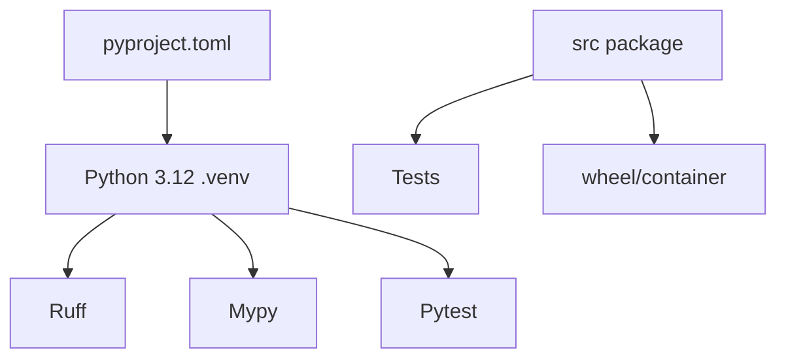

# 第23章：Python Agent 工程基础

最后核对日期：2026-07-11。

## 导读、目标与前置知识
本章建立 Python 3.12 项目、类型、Pydantic、异步、httpx、依赖注入、配置、日志、异常、pytest、Mock 与质量工具的共同底座。

学习目标是能从零搭建可复现、类型安全、异步且受测的 Agent 工程。前置知识为基础 Python。

## 核心原理与工程结构
```text
src/package/      领域代码
tests/            行为与契约测试
pyproject.toml    依赖、构建和工具配置
.env.example      变量名与安全默认值
```
类型注解帮助静态检查与接口设计，Pydantic 验证外部数据；二者不替代业务规则。async/await 适合大量等待型 I/O，不会让 CPU 计算自动并行。`httpx.AsyncClient` 应复用连接并设置显式超时。

## 最小与完整工程
最小包采用 `src` 布局。工程版配置由环境变量注入、依赖显式传入、异常分为可重试/不可重试/策略拒绝，日志携带 run ID 且脱敏。pytest 测真实领域逻辑，HTTP 边界使用 Mock Transport，不让单元测试访问网络。

## 误区、调试、实践与安全
误区：所有函数都 async；捕获 `Exception` 后继续；`.env` 提交仓库；Mock 实现细节而非行为。调试打开 asyncio debug、设置请求超时、检查未关闭客户端。Ruff、mypy 和 pytest 在 CI 同时运行。

## 总结、练习、面试与阅读

### Python 3.12 环境与项目结构

教材固定 Python 3.12，并用 `python3.12 -m venv .venv` 创建项目内环境。`python --version`、`pip --version` 和锁定依赖要进入 CI 证据。不要依赖系统 Python 或全局 site-packages；生产镜像和本地环境使用同一大版本。



`src/` 布局避免测试意外导入工作目录中的未安装包。领域代码按能力分组，例如 `runtime/`、`tools/`、`retrieval/`，而不是把所有 model、service、utils 堆在技术层目录。每个模块有清晰公开接口，文件过长时按职责拆分。

### pyproject.toml 与依赖管理

`pyproject.toml` 声明构建后端、项目元数据、Python 版本、运行依赖和开发 extras，也集中 Ruff、mypy 与 pytest 配置。直接依赖固定可复现版本，传递依赖由 lock/构建流程记录。框架升级单独提交，并运行评估而不只是单元测试。

```toml
[project]
name = "agent-service"
requires-python = ">=3.12,<3.13"
dependencies = ["pydantic==2.11.7", "httpx==0.28.1"]

[project.optional-dependencies]
dev = ["pytest", "pytest-asyncio", "ruff", "mypy"]
```

示例版本是本书快照，不代表永久最新。Secret 不是依赖配置，放在环境/秘密系统中。

### 类型注解与 Pydantic

类型注解约束内部接口，Pydantic 验证 JSON、环境变量、工具参数和数据库边界等外部数据。内部纯函数优先 dataclass/TypedDict 等轻量类型；外部输入进入系统时立即转换为领域类型。避免到处传 `dict[str, Any]`，否则错误会推迟到运行期。

```python
from typing import Literal
from pydantic import BaseModel, Field


class ToolRequest(BaseModel):
    tool: Literal["weather", "search"]
    query: str = Field(min_length=1, max_length=500)
    timeout_seconds: float = Field(default=10, gt=0, le=30)
```

Schema 正确不代表有权限；Pydantic validator 也不应发网络请求。外部事实和授权放服务层。

### async/await、httpx 与资源生命周期

异步适合模型、HTTP、数据库等等待型 I/O。CPU 密集解析要进线程/进程池或独立 Worker。不要在 async 路由中调用同步 `requests` 或重 CPU 函数阻塞事件循环。`asyncio.TaskGroup` 适合结构化并发；只有独立、只读调用才并行。

复用 `httpx.AsyncClient` 连接池，设置 connect/read/write/pool timeout、总并发与每主机限制。客户端由应用生命周期创建关闭，通过依赖传入，不在每个 Tool 内新建。

```python
import httpx

timeout = httpx.Timeout(connect=3, read=20, write=10, pool=3)
limits = httpx.Limits(max_connections=100, max_keepalive_connections=20)
client = httpx.AsyncClient(timeout=timeout, limits=limits)
```

### Dependency Injection 与配置

Python DI 可以是显式构造器，不必先引入容器。Service 接收 Protocol 接口，生产传真实 Adapter，测试传 Fake。配置用 Pydantic Settings 类思想从环境读取，在启动时一次验证；业务函数不随处调用 `os.getenv`。

配置区分非秘密默认值、环境差异和 Secret。`.env.example` 只列变量名，不含真实值；生产 Secret 由容器平台注入。启动日志只输出模型别名和数据库主机摘要，不打印 key/URL 密码。

### Logging 与异常设计

日志使用结构化字段：event、run_id、tenant_id、tool、status、duration_ms 和 error_code。正文、Token 和 PII 按字段 allowlist 记录。异常分为 `ValidationError`、`PolicyDenied`、`TransientDependencyError`、`BusinessRejected` 与内部缺陷；API 层统一映射稳定错误。

不要 `except Exception: pass`。边界捕获未知异常时记录 stack 与 Trace ID，再返回通用内部错误。取消异常应继续传播，不能被重试器吞掉。

### Unit Test、Mock 与质量工具

单元测试真实领域对象，只在 HTTP、模型、时钟、随机和文件边界使用 Fake/Mock。Fake Model 返回预设协议事件，能覆盖工具选择和错误。测试异步取消、timeout 和并发时避免真实 sleep，可注入时钟或使用极短受控事件。

Ruff 负责格式和静态规则，mypy strict 检查类型，pytest 执行行为。CI 先快速 lint/type/unit，再 integration/eval。覆盖率是线索，不是目标；权限拒绝和恢复路径比简单 getter 更重要。

### 常见误区、调试与安全

常见误区：所有函数都 async、用 Pydantic 替代领域建模、Mock 每个内部方法、在日志打印完整请求。调试先复现环境与依赖版本，检查未关闭客户端、event loop 阻塞和异常链。供应链使用固定源、依赖扫描和最小包，开发工具不进入运行镜像。
总结：Python 工程质量来自明确边界和可复现工具链。练习：把同步 API 客户端改为复用的异步依赖并写超时/取消测试。面试：协程与线程如何选择？Pydantic 校验在哪个边界？为什么 `dict[str, Any]` 会侵蚀 Agent 可测性？延伸阅读：Python 3.12、Pydantic、httpx、pytest、Ruff 与 mypy 官方文档。代码目录：仓库根 `src/` 与 `tests/`。
