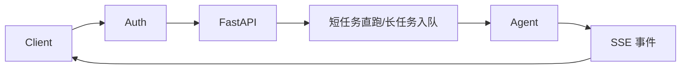
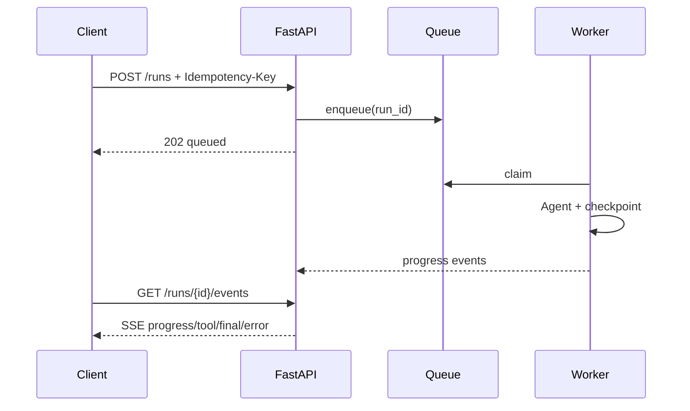

# 第24章：FastAPI 服务化

最后核对日期：2026-07-11。

## 导读、目标与前置知识
本章把 Agent 暴露为可认证、可取消、可观测的 API，覆盖 REST、模型、Streaming、SSE、WebSocket、依赖、鉴权、限流、上传、后台任务、OpenAPI 与测试。

学习目标是实现一个核心任务 API 示例，并解释每种实时协议的边界。前置知识为第23章。

## 架构与协议选择

普通请求适合短任务；SSE 适合服务端单向事件；WebSocket 适合低延迟双向控制。流事件应有 `event_id`、类型、时间和数据，客户端可区分 token、tool、progress、done、error。

## 最小与完整工程
最小端点用 Pydantic 请求/响应和依赖注入。工程版加入 OAuth/API Key 主体、租户、请求 ID、限流、上传大小与格式验证、断连取消、幂等创建任务、OpenAPI 错误模型和 ASGI 测试。长任务不使用进程内 BackgroundTasks 代替持久队列。

## 误区、调试、实践与安全
不要在 async 路由中调用阻塞 SDK；不要把内部异常栈返回客户；不要信任文件名和 MIME。调试记录断连、首事件延迟和队列时间。鉴权之后仍需对象级授权。

## 总结、练习、面试与阅读

### REST 资源与 Agent API

不要把模型的“聊天”直接当完整 API 设计。短任务可以 `POST /runs` 同步返回，长任务创建 `Run` 资源并返回 202；客户端通过 `GET /runs/{id}`、事件流和 `POST /runs/{id}/cancel` 管理生命周期。请求含 agent_id、input、幂等键和可选 session，响应含 run_id、status、output、usage、citations 与 error。



### 请求、响应与依赖注入

FastAPI 用 Pydantic 模型验证边界，路由保持薄：鉴权依赖产生 Principal，Service 执行业务，Repository 访问存储。路由不直接构造模型客户端或数据库连接。

```python
from typing import Annotated
from fastapi import Depends, FastAPI, status
from pydantic import BaseModel, Field

app = FastAPI()

class CreateRun(BaseModel):
    agent_id: str
    input: str = Field(min_length=1, max_length=20_000)

@app.post("/runs", status_code=status.HTTP_202_ACCEPTED)
async def create_run(
    request: CreateRun,
    principal: Annotated[Principal, Depends(current_principal)],
    service: Annotated[RunService, Depends(run_service)],
) -> RunResponse:
    return await service.create(principal, request)
```

示例中的 Principal/Service 是项目领域接口。对象级授权在 Service 中检查 agent、session 与租户，不因用户通过认证就允许访问所有 run。

### Streaming、SSE 与 WebSocket

普通 StreamingResponse 适合字节流；SSE 适合服务器到浏览器的单向事件并具备事件类型/ID；WebSocket 适合语音、实时协作等频繁双向控制。文本 Token 只是事件之一，API 还应发送 `run.started`、`tool.requested`、`approval.required`、`usage.updated`、`run.completed` 和 `run.failed`。

SSE 每条事件包含递增 ID，客户端断线带 Last-Event-ID 恢复。事件存储有保留期，慢客户端采用背压或断开。模型最终输出通过业务验证后才发送 completed，不能把最后一个 token 当成功信号。

### 鉴权、限流与权限

认证可用 OAuth/OIDC、服务 token 或 API Key，具体取决于产品。认证产生主体，授权再检查 tenant、role、resource 与 action。限流按主体、租户、IP 和高成本能力组合，返回 Retry-After。模型预算还限制 Token、并发 run 和工具费用。

上传接口校验 Content-Length、流式实际大小、扩展名、MIME、魔数和压缩炸弹；文件先存隔离区并扫描，再进入解析队列。文件名不用于路径，使用生成 ID。

### BackgroundTasks 与任务队列

FastAPI BackgroundTasks 在当前进程响应后运行，适合短小非关键动作，例如写辅助日志；进程重启会丢失，不能承载长 Agent。长任务写数据库状态并入持久队列，Worker checkpoint、retry 和取消。API 只是控制面。

### OpenAPI、错误与版本

请求/响应和错误模型进入 OpenAPI，客户端不解析自然语言错误。统一 Problem Details 类结构包含 code、message、trace_id、retryable 和字段错误。模型内部异常不暴露 stack。破坏性 Schema 变化采用新 API 版本，新增可选字段也要测试旧客户端。

### 测试与调试

ASGITransport/TestClient 测路由，无需启动端口；Fake Service 验证 HTTP 契约。集成测试连接临时数据库与队列；SSE 测事件顺序、断线恢复、取消和失败结束。负载测试关注首事件、总时长、连接数和 Worker 饱和。

调试拆分网关排队、API 处理、队列等待、模型与工具 span。请求 ID 贯穿代理、API、Worker 和 Trace。断连后确认上游是否取消，否则用户离开但费用继续产生。

### 常见误区与安全注意事项

常见误区：用 WebSocket 表示“高级”、把长任务放 BackgroundTasks、只做路由鉴权、信任 MIME、返回内部异常。安全上设置 CORS allowlist、HTTPS、安全 header、请求大小、超时、限流和审计；OpenAPI 文档不应暴露内部管理接口给未授权网络。
总结：Agent API 的核心是任务状态与事件协议，不只是一个聊天端点。练习：实现可取消、可断线恢复的 SSE 任务。面试：SSE 与 WebSocket 如何选？BackgroundTasks 何时不可靠？认证与对象授权如何分层？延伸阅读：FastAPI、Starlette、OAuth/OIDC 和 SSE 规范。代码目录：`projects/10-enterprise-platform/`。
